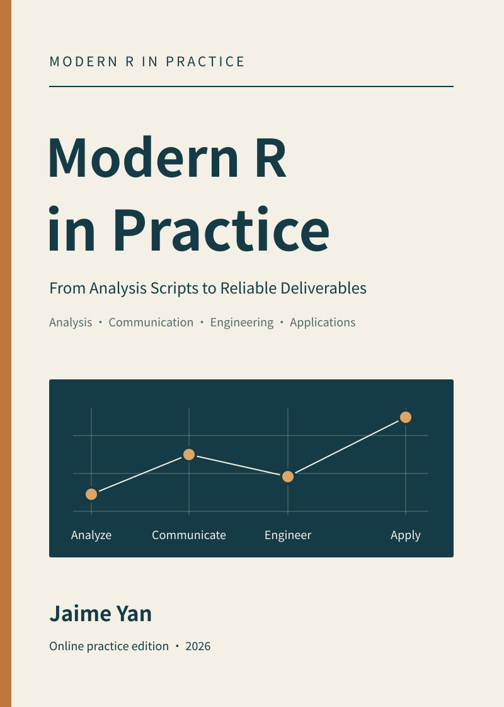
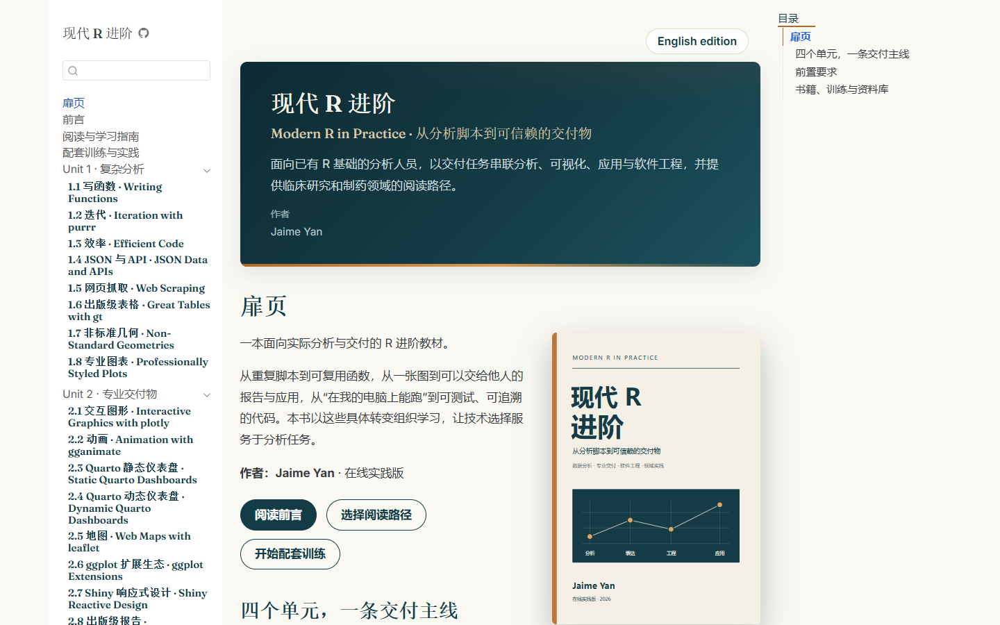
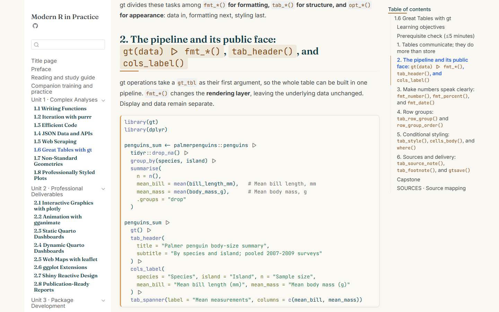

# Modern R in Practice · 现代 R 进阶



A bilingual (English / 中文) book for R users moving from analysis to delivery —
plus companion practice labs and a curated posit::conf (2024–2026) materials archive.

[](https://doi.org/10.5281/zenodo.22832959)
[](https://creativecommons.org/licenses/by-sa/4.0/) [](https://github.com/yanmingyu92/posit-conf-2026-bilingual/actions/workflows/quarto-gh-pages.yml) [](https://quarto.org/)

## Read the book

| Edition | Link |
|---|---|
| English edition | <https://yanmingyu92.github.io/posit-conf-2026-bilingual/book/en/> |
| 中文版 | <https://yanmingyu92.github.io/posit-conf-2026-bilingual/book/> |
| Author's site mirror | <https://jaimeyan.com/books/modern-r-in-practice/en/index.html> |

## About the book

*Modern R in Practice* / 《现代 R 进阶》 is an authored learning narrative, not a
materials archive: 28 chapters in 4 units, written as a single progressive path with
exercises, capstones, and source attribution in every chapter. It is for R users who
already work with data and want to level up from analysis to professional delivery —
including readers in clinical research and pharma, who get a dedicated unit and
reading paths.

- **Unit 1 · Complex Analyses (8 ch)** — functions, iteration, efficient code, JSON/APIs, web scraping, and modern table/plot tooling.
- **Unit 2 · Professional Deliverables (8 ch)** — interactive graphics, animation, static and dynamic dashboards, maps, ggplot extensions, Shiny reactivity, publication-ready reports.
- **Unit 3 · Package Development (4 ch)** — package structure, unit testing, debugging, and code performance.
- **Unit 4 · AI & Domain Applications (8 ch)** — LLM programming in R, structured output, agents, skills, RAG/MCP, LLM-powered Shiny, clinical reporting with pharmaverse, and regulated GxP environments.

Quality evidence: both editions contain the same 28 chapters; all 134 static R code
blocks were extracted and executed with **0 unexpected failures** (2 intentional
errors verified, API/IDE-dependent examples explicitly bounded). See
[book-en/QA-REPORT.md](book-en/QA-REPORT.md).

## Screenshots

| 中文版首页 | English chapter |
|---|---|
|  |  |
| Chinese edition home, with unit navigation. | An English edition chapter with exercises and callouts. |

## Also in this repo

- **`training/`** — companion practice labs: standalone tasks, simulated data, starter scripts, reference implementations, and automated acceptance checks.
- **`curriculum/`** — the underlying course matrix: 5-domain × 3-level competency map, learner personas, module blueprints (start with `curriculum/MATRIX.md`).
- **`content/en/` + [ARCHIVE-CATALOG.md](ARCHIVE-CATALOG.md)** — the posit::conf (2024–2026) workshop archive the book draws on: 2026 materials mirrored, prior years cataloged.
- **`translations/zh/`** — Chinese translation layer for the archive (learning plan, glossary, per-module translations; in progress).
- **`website/`** — the Quarto hub site tying these together, auto-deployed to GitHub Pages.

## Cite this book

> Yan, J. (2026). *Modern R in Practice / 现代 R 进阶*.
> <https://jaimeyan.com/books/modern-r-in-practice/en/index.html>

```bibtex
@book{yan2026modernr,
  author       = {Yan, Jaime},
  title        = {Modern R in Practice · 现代 R 进阶},
  year         = 2026,
  publisher    = {Zenodo},
  doi          = {10.5281/zenodo.22832959},
  url          = {https://doi.org/10.5281/zenodo.22832959}
}
```

## Author

**Jaime Yan** — personal site [jaimeyan.com](https://jaimeyan.com) — GitHub
[@yanmingyu92](https://github.com/yanmingyu92).

## Repository tour

- `book/` — Chinese edition 《现代 R 进阶》 (Quarto book source)
- `book-en/` — English edition *Modern R in Practice* (Quarto book source, QA report, cover assets)
- `training/` — companion practice labs (`en/` for the English lab guides)
- `curriculum/` — course design matrix and module blueprints
- `content/en/` — mirrored posit::conf(2026) workshop materials with provenance manifest
- `translations/zh/` — Chinese translation layer for the archive
- `website/` — Quarto hub site
- `scripts/` — build, sync, and book-QA tooling
- Root docs — `ARCHIVE-CATALOG.md` (archive topic map), `ATTRIBUTION.md` (credits & licenses), `CONTRIBUTING.md` (translation workflow)

### Build locally

```bash
python scripts/build_training_download.py   # companion-lab download ZIP
quarto render book                          # Chinese edition
quarto render book-en                       # English edition
quarto render website                       # hub site
```

Generated HTML stays outside version control; pushing to `main` triggers the GitHub
Actions rebuild and deploy. For code QA, `QA_BOOK_DIR` / `QA_EVIDENCE_DIR` select the
edition and evidence directory (defaults: Chinese edition; use `QA_BOOK_DIR=book-en`
for English). See [CONTRIBUTING.md](CONTRIBUTING.md) for the full QA pipeline.

## License & attribution

Adapted workshop materials are [CC-BY-SA 4.0](https://creativecommons.org/licenses/by-sa/4.0/),
© their original instructors (Hadley Wickham, Jenny Bryan, Mine Çetinkaya-Rundel,
Garrick Aden-Buie, Daniel D. Sjoberg, and others). The book text is original work by
Jaime Yan. Full credits, licenses, and snapshot SHAs: [ATTRIBUTION.md](ATTRIBUTION.md).
This repository is not affiliated with Posit, PBC.

---

## 中文读者指引

### 这是一本什么书？

《现代 R 进阶》(*Modern R in Practice*) 是一本原创编写的双语 R 进阶图书，
不是资料汇编：4 个单元、28 章，按一条循序渐进的学习路径组织，每章配有练习、
综合项目与来源署名。中文版与英文版章节完全对应，每页可切换语言。

### 适合谁？

已有 R 基础、希望从「会做分析」提升到「能专业交付」的读者；临床研究与制药
领域的读者有专门单元与阅读路径。四个单元：复杂分析（8 章）→ 专业交付
（8 章）→ R 包开发（4 章）→ AI 与领域应用（8 章）。

### 怎么开始？

从 [中文版入口](https://yanmingyu92.github.io/posit-conf-2026-bilingual/book/) 开始阅读；
配套动手实验见 `training/`，底层课程矩阵见 `curriculum/`。

### 质量说明

中英双版共 28 章，全部 134 个静态 R 代码块经实际执行验证，无意外失败
（2 处故意报错已确认，依赖 API/IDE 的示例有明确边界）。详见
[book-en/QA-REPORT.md](book-en/QA-REPORT.md)。

### 许可与署名

改编的工作坊材料采用 [CC-BY-SA 4.0](https://creativecommons.org/licenses/by-sa/4.0/)
协议，© 原讲师所有；书籍正文为 Jaime Yan 原创。完整署名见
[ATTRIBUTION.md](ATTRIBUTION.md)。本仓库与 Posit, PBC 无官方关联。

---

如果这个项目对你有帮助，欢迎 Star ⭐ / Watch 关注更新。 · If this project helps you, a star is appreciated.
