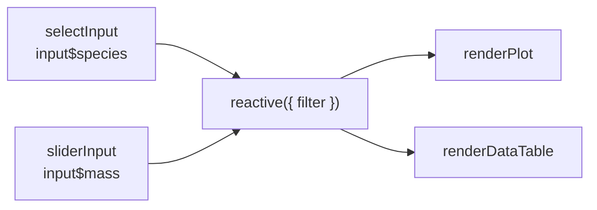

# 2.4 Dynamic Quarto Dashboards

## Learning objectives

By the end of this chapter, you can:

1. **locate** a requirement on the interaction spectrum: static → parameterized → OJS → Shiny.
2. **embed** Shiny in a Quarto dashboard using `server: shiny` / `server: shinylive`.
3. **wire** sidebar inputs, including `selectInput` and `sliderInput`, to reactive outputs.
4. **predict** which outputs are invalidated by an input change using a reactive graph.
5. **choose** among shinylive, shinyapps.io, and Connect according to data sensitivity and operational resources.

## Prerequisite check (≤5 minutes)

Complete these checks independently before continuing; otherwise revisit [Chapter 2.3](23-dashboards-static.qmd).

::: {.callout-important}
## Check In: Prerequisites

1. Rebuild the two-page Chapter 2.3 dashboard, including pages, rows, and value boxes, without referring to the text.
2. Confirm that `install.packages("shiny")` has succeeded. Have you heard that inputs must be read on the server side? If not, §3 introduces the rule.
:::

## 1. The interaction spectrum: From static to Shiny

::: {.callout-caution collapse="true"}
## Just Our Opinion
Interaction is a dashboard's **most expensive feature**: it costs effort to write, run, and host. Before adding it, ask whether rerendering your Chapter 2.3 dashboard on a weekly schedule would solve 90% of the problem. Often it would. Only the remaining needs justify moving further along this spectrum.
:::

| Level | Approach | What readers receive | Server requirements |
|---|---|---|---|
| Static | One `quarto render` | A fixed snapshot | Any static host |
| Parameterized | `params:` + `quarto render -P class:"suv"` | Prepared variants | Still compatible with static hosting |
| Browser interaction | OJS / htmlwidgets | Immediate browser-side filtering | No computation server needed |
| Shiny | `server: shiny` | Flexible filtering and server-side computation | A host that runs R |

The workshop distinguishes four **deployment modes**: static, scheduled, parameterized, and interactive. The first three principally concern when rendering happens; the fourth requires a runtime.

## 2. Embedding Shiny in Quarto: server: shiny

The entry point for Quarto dashboards with Shiny is one YAML line: `server: shiny`. Blocks then take two roles:

- **UI blocks** (default) place controls such as `selectInput()` on the page.
- **Server blocks** (`#| context: server`) read `input$xx`, compute results, and produce `render*()` outputs.

::: {.callout-warning}
## Common misconception: Assuming rendering finishes the job
The output of `server: shiny` is **not static HTML**. Double-clicking a file gives you only a shell. During development, use Render preview in Positron/RStudio, which starts a Shiny process. For delivery, use a host that runs R or choose shinylive; see §6.
:::

The `server: shinylive` variant uses WebAssembly to run R through webR in the **reader's browser**, allowing static hosting. Costs and limits are discussed in §6.

## 3. Sidebar inputs driving reactive outputs

A complete minimal dynamic dashboard, `penguins-live.qmd`:

::: {.callout-example}
````markdown
---
title: "Interactive penguins overview"
format: dashboard
server: shiny
---

```r
#| context: setup
library(shiny)
library(ggplot2)
library(dplyr)
penguins <- palmerpenguins::penguins
```

## Filters {.sidebar}

```r
selectInput("species", "Species",
  choices = c("Adelie", "Gentoo", "Chinstrap"), multiple = TRUE)

sliderInput("mass", "Body mass range (g)",
  min = 2500, max = 6300, value = c(2500, 6300))
```

## Charts

```r
#| context: server
selected <- reactive({
  penguins |>
    filter(species %in% input$species,
           between(body_mass_g, input$mass[1], input$mass[2]))
})
```

```r
#| context: server
#| title: Bill length × body mass
renderPlot({
  ggplot(selected(),
         aes(bill_length_mm, body_mass_g, color = species)) +
    geom_point()
})
```

```r
#| context: server
#| title: Details
renderDataTable(
  selected()[, c("species", "island",
                 "bill_length_mm", "body_mass_g")],
  options = list(pageLength = 8))
```
````

`.sidebar` turns a row into a left-hand filter panel. `context: setup` runs once. In server blocks, call `renderPlot()` / `renderDataTable()` **directly**: Quarto places an output card at the block's location. Name it with `#| title:` as usual.
:::

::: {.callout-warning}
## Common error: Reading input$ inside a UI block
`input$species` is available only in `context: server` blocks. Referencing it in an ordinary block causes an “object 'input' not found” error. **Blocks that place controls do not read values; blocks that read values do not place controls.**
:::

## 4. The reactive mental model: Graphs and invalidation

Shiny's behavior can be represented as a **reactive graph**. Inputs are sources, `reactive()` expressions are intermediate nodes, and `render*()` functions are endpoints. An input change **invalidates** downstream dependents and queues recomputation; upstream nodes are unaffected.



In §3, moving the mass slider invalidates `selected`, and both plot and table recompute. The input controls and the data-loading code in `context: setup` **do not** rerun. This is how the app computes only what is needed.

::: {.callout-important}
## Check In: Predict invalidation

Change the §3 slider to filter a range of `bill_length_mm`. ① Draw the revised reactive graph. ② Which blocks will recompute, and which will not? Write your predictions before modifying and running the code. Incorrect predictions reveal gaps in your mental model.
:::

::: {.callout-note}
This chapter introduces only the essentials: the graph, invalidation, and necessary computation. Chapter 2.7 develops `eventReactive`, timers, modules, and debugging.
:::

## 5. Server-free interaction: The OJS alternative

When readers need only browser-side filtering and inspection, without server-side statistics, Observable JS (OJS) offers an option without a computation server. Its rendered output is static HTML.

::: {.callout-example}
```ojs
penguins = FileAttachment("penguins.csv").csv({typed: true})
```

```ojs
viewof bill = Inputs.range([30, 60], {step: 0.5, label: "Bill length ≥"})
```

```ojs
Inputs.table(penguins.filter(d => d.bill_length_mm >= bill), {rows: 8})
```

Export the data from R with `write.csv(palmerpenguins::penguins, "penguins.csv")` and place the CSV beside the `.qmd` file.
:::

`viewof` declares a control and its value. It connects the UI to a variable that subsequent cells can reference: OJS automatically connects inputs and outputs without an explicit server.

::: {.callout-note}
A practical selection rule: prefer OJS for chart filtering because it is inexpensive, fast, and compatible with static hosting. Use Shiny when you need server-side models, database connections, or private credentials.
:::

## 6. Deployment decisions

| Option | Where R runs | Best suited to | Costs / limits |
|---|---|---|---|
| shinylive (WebAssembly) | Reader's browser via webR | Teaching demos, small public datasets, no IT support | Limited package compatibility; large data are slow; code and data accompany the page |
| shinyapps.io | Posit's cloud | Public apps and small teams needing a quick launch | Limited free quota; data must be permitted on the public internet |
| Posit Connect / Shiny Server | Your own server | Internal enterprise use, private data, access control, scheduling | IT operations and budget |
| Scheduled static rerendering (Chapter 2.3 §7) | CI, such as GitHub Actions | Monitoring that can work with refreshed snapshots | No live interaction; only updated snapshots |

Always begin with **whether the data may leave the organization**. Public-facing options require permission to expose the data; otherwise use internal Connect / Shiny Server hosting or return to a scheduled static dashboard.

::: {.callout-important}
## Practice Exercise 1 (copy)

Enter the complete `penguins-live.qmd` example from §3 and render it successfully. Operate both controls and compare the changing outputs with the §4 graph. Submit a screenshot and one observation.
:::

::: {.callout-important}
## Practice Exercise 2 (adapt)

Add another output to §3: a `renderText()` card showing the heaviest penguin under the current filters. Add only a server block, reuse `selected()`, and include the new endpoint in the reactive graph.
:::

::: {.callout-important}
## Practice Exercise 3 (create · AI integration)

**Round 1 (AI prohibited):** Build an interactive health-check dashboard with two sidebar inputs: a sex dropdown and an age-range slider. They should drive one plot (`renderPlot`) and one table (`renderDataTable`). Draw the reactive graph before coding.
**Round 2 (AI allowed):** Give Posit Assistant the code and ask only: “Draw this app's reactive graph and identify one path that repeats a computation unnecessarily.” Compare its graph with yours, recording differences and one optimization you would adopt.
:::

## Capstone

**Task:** Upgrade your Chapter 2.3 capstone dashboard to a dynamic version, or rebuild it with another dataset. Two sidebar inputs must drive at least a plot and a table, with at least one intermediate `reactive()` expression. Choose a §6 deployment route and write a 50-word rationale. Actually deploy public data through shinylive / shinyapps.io; for internal data, submit `server: shiny` source and demonstration screenshots.

| Dimension | Meets expectations | Strong | Excellent |
|---|---|---|---|
| Interaction design | Both inputs affect outputs | Input granularity supports the reading task | Every control has a purpose and its tradeoffs are explained |
| Reactive correctness | Inputs and outputs connect | Intermediate reactive avoids repeated computation | Predicts and verifies invalidation scope |
| Deployment decision | Names a deployment route | Covers data sensitivity and operational resources | Completes deployment and submits a link |
| Engineering and reproducibility | Renders; clear structure | Separates setup/server and comments code | Another person can rerun the file in one step |

## SOURCES

| Chapter section | Material | Use |
|---|---|---|
| §1 interaction spectrum and deployment modes | posit::conf(2024) quarto-dashboards, `4-parameters-interactivity-deployment` (Mine Çetinkaya-Rundel and teaching assistant team; README: CC-BY 4.0; LICENSE.md: CC-BY-SA 4.0) | Adaptation |
| §2–§3 embedded Shiny structure | Official Quarto Dashboards: Shiny documentation and workshop examples | Reference / adaptation |
| §4 reactive mental model | posit::conf(2025) shiny-r, “Reactivity” (Colin Rundel; README: CC-BY 4.0; LICENSE.md: CC-BY-SA 4.0) | Adaptation |
| §5 OJS | Official Quarto Interactivity / Observable documentation | Reference |
| Health-check dashboard exercise, deployment decision table, and rubric | This project | Original |

This chapter is published under CC-BY-SA 4.0.
