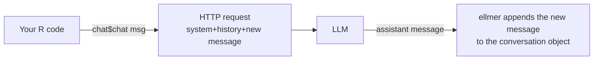

# 4.1 Programming with LLMs

## Learning objectives

By the end of this chapter, you can:

1. **initialize** an `ellmer::chat_*()` conversation and explain provider/model arguments.
2. **control** role, tone, and output format with a system prompt.
3. **inspect** conversation messages and the system/user/assistant roles.
4. **estimate** a conversation turn's token consumption and develop cost intuition.
5. **extract** data ready for downstream storage as an R data frame, using `$chat()` and structured extraction.

## Prerequisite check

- Install packages and understand a dplyr pipeline; otherwise revisit the [tidyverse prerequisites](../index.qmd#prerequisites).
- Have credentials for an LLM provider: OpenAI, Anthropic, or Posit AI Pass.

::: {.callout-note}
Like the workshop, this chapter uses `chat_posit()`. To switch providers, use `chat_anthropic()` or `chat_openai()` with the appropriate credentials. Without credentials, read the code first and do not send requests.

Naming note: older material may use `set_system()` / `extract_data()`. This book consistently uses the workshop's `set_system_prompt()` / `chat_structured()`.
:::

## 1. Anatomy of a conversation: what happens in a call?

A chat interface looks like alternating remarks. **At the API level**, each request resends the *entire history*: system → user → assistant → …



::: {.callout-example}
```r
library(ellmer)

chat <- chat_posit()
chat$chat("Explain functional programming in one sentence")
```
:::

::: {.callout-warning}
## Common misconception: the model remembers you
The model has **no memory** of its own here: ellmer resends the history. Therefore, ① a longer conversation makes each request more expensive, and ② a new chat object does not know what you said in the old one.
:::

## 2. Inspect the conversation: look inside

An ellmer conversation object is **inspectable**, a key difference between programming with a model and merely chatting with it.

::: {.callout-example}
```r
chat <- chat_posit()
chat$set_system_prompt("You are a rigorous statistical editor. Answer in no more than two sentences.")
chat$chat("Should a p-value of 0.06 be described as significant?")

chat   # Print the conversation to inspect its prompt and trace
```
Printing the object lets you inspect the prompt and user/assistant conversation trace.
:::

::: {.callout-important}
## Check In: experiment with roles

Create two conversations with system prompts ① “Answer in as few words as possible” and ② “Answer in detail in three paragraphs.” Ask both: “Which ellmer function creates an Anthropic conversation?” Compare **content** and **style**, then print both conversations to check their system prompts. Adapted from llms `02_conversation`.
:::

## 3. Three elements of a system prompt

| Element | Example | What happens without it |
|---|---|---|
| Role | “You are a clinical report reviewer” | Generic encyclopedia-style replies |
| Constraints | “No more than two sentences”; “Respond only in Chinese” | Length or language drifts |
| Format | “Return three CSV columns” | Further parsing is required |

::: {.callout-caution collapse="true"}
## Just Our Opinion
A system prompt is **an onboarding note for a capable colleague who lacks your context**, not a collection of magic phrases. More than ten constraints suggests moving procedures into chapter 4.4's skills instead of continuing to expand the prompt.
:::

## 4. Tokens and cost intuition

- As a rough heuristic, one token ≈ 0.75 English words ≈ 0.5 Chinese characters; **the full resent input is billed**.
- Cost = input tokens × input price + output tokens × output price. Output often costs 3–5 times as much per token.

::: {.callout-important}
## Practice Exercise 1 (copy)

Run the §2 example: create chat → set the statistical-editor persona with `set_system_prompt()` → ask a question → print `chat`. Comment on how the reply relates to the prompt.
:::

::: {.callout-important}
## Practice Exercise 2 (adapt)

Write `cost_estimate(n_turns, words_per_turn, in_price, out_price)` to estimate total input tokens for n turns. Remember the resent history: input at turn k is approximately the sum of previous turns. Plot costs for 10/20/50 turns. At what point would you consider compressing the history into a summary?
:::

## 5. First structured output: ask for a data frame

Downstream code needs **data it can store and process**, not just natural-language replies.

::: {.callout-example}
```r
chat <- chat_posit()
chat$set_system_prompt("You are a data extraction assistant.")

recipes <- chat$chat_structured(
  "Give three home-cooked dishes suitable for people with hypertension: name, estimated sodium in mg, and a one-sentence reason",
  type = type_array(type_object(
    name = type_string(),
    sodium_mg = type_number(),
    reason = type_string()
  ))
)
dplyr::as_tibble(recipes)
```
`chat_structured()` plus `type_*()` descriptors defines an **output contract**: fields and types are specified in advance.
:::

::: {.callout-note}
Structured output relies on the provider's tool/JSON mode. Chapter 4.2 develops the type system and evals: systematic assessment of prompt quality.
:::

::: {.callout-warning}
## Common mistake: treating chat_structured as a database
LLM numbers are **generated**, not **looked up**. The sodium estimates above must be checked against a real database. In medical contexts, the model supplies the format; evidence supplies the content, with traceable sources.
:::

## 6. The AI-off task

::: {.callout-important}
## Practice Exercise 3 (create · AI off)

**Do not use an AI coding assistant while writing the solution**; this is the chapter's required AI-off activity. Using only this chapter and `?ellmer`, write `translate_labels(labels, target_lang)` to translate a vector of variable labels with an LLM. Require structured output, batch handling, and one retry after failure. Once you finish, allow AI to review your retry logic and record what it finds.
:::

## Capstone

**Task: “Research assistant 0.1.”** Use five paper abstracts from your field, supplied by you or the class dataset. Write an ellmer script extracting research question, method, sample size, main findings, and limitations from each. Produce a tidy tibble and a Quarto report with total tokens and estimated total cost.

| Dimension | Meets expectations | Good | Excellent |
|---|---|---|---|
| Extraction | Five readable fields | Strict types and retries | Check 20% of fields against originals and report accuracy |
| Engineering | Script completes | Functions and error handling | Batch concurrency, previewing chapter 4.2 |
| Cost awareness | Reports total tokens | Costs by turn | Tests a cost-reduction strategy, such as history compression |
| Evidence boundaries | Labels model-generated results | Distinguishes generated from verified content | Discusses sensitivity to limitations |

## SOURCES · Attribution

| Section | Material | Use |
|---|---|---|
| §1–§3 structure and exercises | posit::conf(2026) llms `outline.md` Morning 1 and `_exercises/01_hello-llm, 02_conversation, 06_word-games` (Garrick Aden-Buie, Sara Altman; CC-BY-SA 4.0) | Adapted |
| §5 structured output | llms `_exercises/10_structured-output` | Adapted |
| Hypertension recipe example, cost exercise, research-assistant capstone, rubric | This project | Original |

This chapter is published under CC-BY-SA 4.0.
