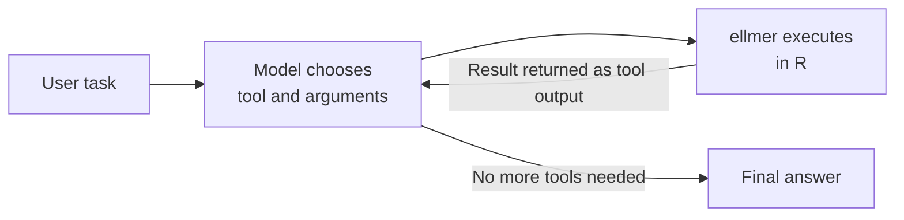

# 4.3 Agents and Tool Calling

## Learning objectives

By the end of this chapter, you can:

1. **define** a tool around an R function, describe arguments with `type_*()`, and register it with a conversation.
2. **explain** the four-step loop: model request → execution → returned result → model continues.
3. **build** a data assistant with read/write/list/edit file tools.
4. **diagnose** loops, invented arguments, and refusal to use tools, and **design** four layers of guardrails.
5. **justify** moving from an expanding system prompt to chapter 4.4's skills.

## Prerequisite check

- Create ellmer conversations, set system prompts, inspect messages, and recognize `type_*()` descriptors. Revisit [4.1](41-llm-basics.qmd) and [4.2](42-structured-output.qmd) §2 if needed.

::: {.callout-note}
We use the llms workshop's Last Blockbuster store scenario. `blockbuster/` contains `members.csv`, `rentals.csv`, `dues.csv`, and the manager's `notes.md`. Copy `_solutions/20_agent-2/blockbuster/` from upstream `llms` into your project, and retain `data/blockbuster/rentals-old.csv` for §4.
:::

## 1. From conversation to action: expose an R function

A model produces text. It cannot play a sound or read your disk unless **you wrap the action as a tool**. A tool definition answers three questions: what input does the model give you, what does your function do, and what text do you return so it can continue?

::: {.callout-example}
```r
library(ellmer)
play_sound <- function(sound) {
  sound <- match.arg(sound, c("correct", "incorrect", "new-round", "you-win"))
  switch(sound,
    correct = beepr::beep("coin"),
    incorrect = beepr::beep("wilhelm"),
    "new-round" = beepr::beep("fanfare"),
    "you-win" = beepr::beep("mario")
  )                                           # Map to sound names supported by beepr
  glue::glue("The '{sound}' sound was played.") # Confirmation returned to the model
}

tool_play_sound <- tool(
  play_sound,
  description = "Play a sound effect",
  arguments = list(
    sound = type_enum(
      c("correct", "incorrect", "new-round", "you-win"),
      description = paste(
        "Which sound to play: 'new-round' after the user picks a theme,",
        "'correct' or 'incorrect' after each answer, 'you-win' at the end."
      )
    )
  )
)
```
:::

The model sees **descriptions and argument types, not the R source**. Describe *when* to use the tool: “Use this when…”, much like chapter 4.2's field descriptions. After `chat$register_tool(tool_play_sound)`, the model can call it when appropriate. Adapted from llms `17_quiz-game-2`.

::: {.callout-warning}
## Common misconception: the return value is for the user
The return from `play_sound()` enters the conversation history; the user hears the **side effect**. Return something the model can act on, such as “Wrote x.” or “Could not find y.”, rather than a progress update intended for a person.
:::

## 2. The tool loop: the heart of an agent

Inside one `$chat()` call, ellmer runs a loop:



The model requests an action, your code executes it, the result returns, and the model continues. The steps are not preprogrammed: each time, the model chooses using the task and previous tool results. **The model chooses the next step.** Hadley Wickham's compact definition is an LLM with read and write tools that repeatedly calls them in a loop.

## 3. Build an agent, part one: reading and writing

The first version needs two tools. Remember three design decisions: ① `proj_path()` uses `blockbuster/` as its path base. ② `write_file` returns confirmation. ③ The system prompt asks the agent to **write scripts for a person to run** when code is needed. The agent does not execute those scripts; the person remains in the execution loop. This path-joining example is **not a sandbox**: `../` can escape it. Use an exercise copy; add normalized-path and root-directory checks before deployment.

::: {.callout-example}
```r
project_dir <- "blockbuster"
proj_path <- function(path) file.path(project_dir, path)

read_file <- function(path) brio::read_file(proj_path(path))

write_file <- function(path, content) {
  brio::write_file(content, proj_path(path))
  paste0("Wrote ", path, ".")
}
tool_read_file <- tool(
  read_file,
  description = "Read the full contents of a file in the workspace. Use this to inspect the store records before you write a script.",
  arguments = list(path = type_string("Path relative to the workspace."))
)

tool_write_file <- tool(
  write_file,
  description = "Write a file in the workspace, overwriting it if it exists. Use this to create a script or its output.",
  arguments = list(
    path = type_string("Path relative to the workspace."),
    content = type_string("The full contents of the file to write.")
  )
)

chat <- chat_posit(
  model = "zai-org/GLM-5.3-Flash",
  system_prompt = paste(
    "You are a coding agent for the Last Blockbuster in Bend, Oregon.",
    "When a task needs code, write an R script for the user to run."
  )
)
chat$register_tool(tool_read_file)
chat$register_tool(tool_write_file)

chat$chat(paste(
  "It is time for the renewal drive. Which members have gone quiet?",
  "Build the win-back list as `win-back.csv` by writing `find_lapsed.R` for me to run."
))
chat   # Full trace: every tool call, argument, and result
```
Adapted from llms `19_agent-1`; the model choice follows the workshop.
:::

Print `chat` and inspect the trace. Which files did it read first? Is the script path correct? **Know the answer before accepting the result**: read `members.csv` yourself before judging whether the agent skipped necessary work.

## 4. Build an agent, part two: discovery and precise edits

Add `list_files` for **discovery**, since the manager can add files at any time, and `edit_file` for **minimal changes**: replace an exact text span only when it occurs **once**. These four tools share their origin with `21_skills-1/_tools.R` and are reused in 4.4 and 4.6.

::: {.callout-example}
```r
list_files <- function() paste(list.files(project_dir), collapse = "\n")
tool_list_files <- tool(
  list_files,
  description = "List the names of files in the workspace. Use this to discover new files before you read or edit them."
)
edit_file <- function(path, old, new) {
  full <- proj_path(path)
  content <- brio::read_file(full)
  matches <- gregexpr(old, content, fixed = TRUE)[[1]]
  if (matches[[1]] == -1L) cli::cli_abort("Could not find the text to replace in {path}.")
  if (length(matches) != 1L) cli::cli_abort("Expected one match in {path}, found {length(matches)}.")
  brio::write_file(sub(old, new, content, fixed = TRUE), full)
  paste0("Edited ", path, ".")
}

tool_edit_file <- tool(
  edit_file,
  description = "Replace one exact span of text in a workspace file. The text must appear exactly once or the tool errors. Use this to patch a script instead of rewriting it.",
  arguments = list(
    path = type_string("Path relative to the workspace."),
    old = type_string("The exact existing text to replace."),
    new = type_string("The text that replaces it.")
  )
)

chat$register_tool(tool_list_files)
chat$register_tool(tool_edit_file)

# With all four tools registered, introduce a mid-task change:
file.copy("data/blockbuster/rentals-old.csv", project_dir, overwrite = TRUE)
chat$chat(paste(
  "The manager found an old register export and dropped it in the folder.",
  "Bring the win-back list up to date."
))
```
Adapted from llms `20_agent-2`.
:::

The two `cli_abort()` checks return **errors instead of guesses** when text is absent or ambiguous. The model can retry with a more precise `old`. Validation is a guardrail.

::: {.callout-important}
## Check In: predict the trace, then verify

After adding `rentals-old.csv`, but before the next request, predict the tool sequence. Will it start with `list_files`? Rewrite `find_lapsed.R` or use `edit_file`? Run and print `chat`: what differed? Did the tool description or system prompt influence rewriting versus a precise edit? Adapted from `20_agent-2`, STEP 5.
:::

## 5. Failure modes and guardrails

Three failure modes require structural responses, not merely a “smarter model”:

| Failure | Symptom | Response |
|---|---|---|
| Endless loop | Repeated reads; `old` never unique | Reject ambiguous matches; watch the trace and interrupt repetition |
| Invented arguments | Nonexistent paths or columns | Validate, return errors, list files before reading |
| Avoiding tools | Answers from memory without reading | Require reading first in the system prompt; describe when to use tools |

Four layers, ordered by practical value:

1. **Sandboxing:** Add normalized-path and root-directory checks to `proj_path()`; restrict external filenames with a `basename()` allowlist ([4.6](46-shinychat.qmd) §4).
2. **Tool validation:** Treat every argument as **untrusted user input**; return informative errors to the model.
3. **Turn budget:** Split tasks, limit external `$chat()` requests, and manually interrupt repeated traces.
4. **Human review:** The agent writes a script; a person runs it, retaining control of that execution.

::: {.callout-warning}
## Common mistake: unnecessary tools
Each extra tool increases opportunities for misuse and token overhead. Make two reliable before adding more.
:::

## 6. Next: move procedures out of the prompt

An increasingly capable agent accumulates instructions about letter tone, lapsed-member definitions, and prohibited discounts. Every turn pays for them and divides attention. Chapter 4.4 introduces **skills: reusable operating instructions**. Keep a one-line directory visible, then load full instructions when needed. This chapter's four file tools return there.

::: {.callout-caution collapse="true"}
## Just Our Opinion
Tools determine the agent's floor; instructions determine its ceiling. Start in that order. Two validated tools and ten prompt lines often beat ten tools and three pages of instructions. The loop is simply “model requests, your code executes”; the interesting question is how tightly you bound its actions.
:::

::: {.callout-important}
## Practice Exercise 1 (copy)

Create a workspace containing two CSVs and `notes.md`. Reproduce §3's read/write tools and wiring, and complete a read-then-write task. Print `chat`; submit the trace and a one-sentence human review. Based on `19_agent-1`.
:::

::: {.callout-important}
## Practice Exercise 2 (adapt)

Upgrade §3 to the four tools in §4 and rerun. Then deliberately repeat a string in a CSV so `old` matches twice. Observe the model correcting itself after `edit_file` errors. Submit the preceding call sequence and how the arguments change on the second attempt. Based on `20_agent-2`.
:::

::: {.callout-important}
## Practice Exercise 3 (create · AI off)

**Round 1 (AI off throughout):** Design a fifth, domain-specific tool: query a read-only database view, read SPSS data, or search an internal vocabulary. Write its R function, description, and parameter types, including at least two argument checks. **Round 2 (AI allowed):** Ask an assistant only: “What three invalid arguments is a model most likely to supply?” Add checks and test them; record one case AI found that you missed.
:::

## Capstone

**Task: “Domain mini-agent 1.0.”** Build a workspace around real data, four file tools, at least one domain tool, and a restrained system prompt. Design an acceptance task with a **mid-task change**, such as a new file. Submit a Quarto report with the complete tool trace, human review, and failure log.

| Dimension | Meets expectations | Good | Excellent |
|---|---|---|---|
| Tool design | Five working tools | Descriptions state when to use them; actionable results | Domain tool validates inputs and reports errors defensively |
| Boundaries | Paths confined to workspace | Every argument checked | Turn budget and human interruption points explained |
| Completion | Correct main artifact | Incorporates mid-task change | Demonstrates diagnosis and repair of one failure |
| Failure analysis | At least two failures recorded | Classified using §5 | States which tasks this agent should not handle |

## SOURCES · Attribution

| Section | Material | Use |
|---|---|---|
| §1 tools; §2 agent definition and loop | llms `_solutions/17_quiz-game-2`, slides-08 | Adapted |
| §3–§4 Blockbuster agent and file tools | llms `_solutions/19_agent-1`, `_solutions/20_agent-2`, `21_skills-1/_tools.R` | Adapted |
| §5 failure modes and guardrails; §6 progression; exercises, capstone, rubric | This project | Original |

This chapter is published under CC-BY-SA 4.0.
