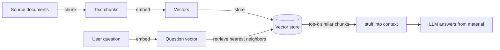

# 4.5 Retrieval and Tool Protocols

## Learning objectives

By the end of this chapter, you can:

1. **explain** knowledge-cutoff and private-data gaps, and why retrieval helps.
2. **trace** six RAG steps: chunk → embed → store → retrieve → stuff → answer.
3. **build** a website-based vector store with `ragnar` and inspect retrieval results.
4. **tune** retrieval by reasoning about chunk size and embedding similarity.
5. **wire** a retrieval tool to ellmer to produce answers with sources.
6. **compare** MCP's server/tool model and choose among RAG, MCP, and direct context.

## Prerequisite check

- Create ellmer conversations and system prompts; revisit [4.1](41-llm-basics.qmd) if needed.
- Understand tool registration and the agent loop ([4.3](43-agents.qmd)). Section 5's `ragnar_register_tool_retrieve()` attaches a ready-made retrieval tool.

::: {.callout-note}
Local embeddings use LM Studio running `text-embedding-nomic-embed-text-v2-moe` at localhost:1234 through an OpenAI-compatible interface. Embedding needs no cloud API; fetching this chapter's webpages still needs the network, and §5's `chat_posit()` responses still need cloud credentials.
:::

## 1. Why retrieve? Two ways models lack knowledge

LLMs have two inherent gaps: **outdated knowledge** after their training cutoff and **private information** they never saw, such as your department's SOPs, course notes, or data dictionary. A model may fabricate an answer rather than remain silent. Chapter 4.1's rule applies: the model supplies format; facts need sources.

Turn a closed-book exam into an **open-book exam**: retrieve relevant passages from your documents, put them in context, then ask the model to answer from them. This is retrieval-augmented generation, or RAG.

::: {.callout-warning}
## Common misconception: RAG cures hallucinations
RAG reduces invention caused by missing source material. It does not prevent misreading available material or retrieving the wrong passages. An open-book exam still goes wrong if you open the wrong page. Return to evaluation in chapter 4.2.
:::

## 2. The RAG pipeline



The corresponding ragnar operations are:

| Step | ragnar function |
|---|---|
| Find pages | `ragnar_find_links()` |
| Read Markdown | `read_as_markdown()` |
| Chunk | `markdown_chunk()` |
| Embed and store | `ragnar_store_create(embed = ...)` and `ragnar_store_insert()` |
| Build retrieval index | `ragnar_store_build_index()` |
| Retrieve | `ragnar_register_tool_retrieve()`, attached to the conversation |

## 3. A minimal RAG pipeline in about fifty lines

Build a store from R for Data Science, adapted from llms `51_rag` and the ragnar website's usage example:

::: {.callout-example}
```r
library(ragnar)

base_url <- "https://r4ds.hadley.nz"
pages <- ragnar_find_links(base_url, children_only = TRUE)

dir.create(here::here("ch45"), recursive = TRUE, showWarnings = FALSE)
store <- ragnar_store_create(
  here::here("ch45/r4ds.ragnar.duckdb"),
  title = "R for Data Science",
  embed = \(x) embed_lm_studio(x, model = "text-embedding-nomic-embed-text-v2-moe")
)

for (page in pages) {
  chunks <- page |>
    read_as_markdown() |>
    markdown_chunk()
  ragnar_store_insert(store, chunks)   # Insertion creates embeddings automatically
}

ragnar_store_build_index(store)
ragnar_store_inspect(store)   # Interactive inspector: question in, matching chunks out
```
:::

`ragnar_store_inspect()` opens an app where you enter a question and inspect retrieved chunks. This is a **central part of RAG development**: investigate what gets retrieved, not just the final model.

::: {.callout-important}
## Check In: deliberately cause retrieval to fail

Try the question supplied with `51_rag`: somebody wants to filter `data1` using `data2$code` but gets zero rows. Inspect the matches. Then ask something **not covered** by the book, such as joining tables in pandas. Which failure is more dangerous: no matches, or many irrelevant matches?
:::

## 4. Two controls: chunking and embeddings

**Chunking** decides how large a piece of text to keep together. Large chunks mix topics, dilute embeddings, and add noise. Small chunks can split an answer so neither half is sufficient. `markdown_chunk()` uses structure, such as headings and paragraphs, to preserve coherent topics. See `?markdown_chunk()` for parameters; this is a step you can directly control.

**Embedding** maps a passage into a long numeric vector, with the aim that **semantically similar texts have nearby vectors**. Retrieval compares the question vector with stored vectors to find nearby chunks. This has an important implication:

::: {.callout-warning}
## Common misconception: wording differences always defeat retrieval
A user may ask “How do I connect two tables?” while a book says “join two tables.” Embeddings can often bridge that difference. Completely mismatched jargon, such as clinical shorthand versus textbook terminology, is harder. Test real users' wording before deployment, not only the document author's phrasing.
:::

## 5. Connect a conversation that cites its sources

The final step makes retrieval a **tool** in an ellmer conversation. The model decides when to query the store. Adapted from `51_rag`, Step 3:

::: {.callout-example}
```r
library(ellmer)

chat <- chat_posit(
  system_prompt = r"--(
You are an expert R programmer and mentor. You are concise.

Before responding, retrieve relevant material from the knowledge store.
Quote or paraphrase passages, clearly marking your own words versus
the source. Provide a working link for every source you cite.
  )--"
)

ragnar_register_tool_retrieve(chat, store, top_k = 10)

live_console(chat)
```
:::

The system prompt sets the discipline: retrieve first, distinguish sources, and provide links. The tool supplies the capability. `top_k` controls how many chunks return: more adds expense and noise; fewer saves cost but may miss information. Use chapter 4.2's evaluation approach to choose.

## 6. MCP: one protocol, many servers

RAG helps a model read your material. MCP, the Model Context Protocol, standardizes how it connects to **tools**. Think of a USB interface: clients such as Posit Assistant or Claude Desktop discover and invoke tools and resources exposed by compatible servers.

- **HTTP server:** a remote process connected through a URL.
- **stdio server:** a local child process communicates through standard input/output. To expose R functions, a server translates their signatures into MCP tools. This resembles chapter 4.3's `register_tool()`, but the tools can be **reused across clients**.

::: {.callout-example}
Connect the context7 documentation server in Positron, adapted from llms `52_mcp`:

1. Run **MCP: Add Server...** in the Command Palette and select **HTTP**.
2. Enter `https://mcp.context7.com/mcp` and the Server ID `context7`.
3. Choose Workspace, for this project only, or Global.
4. Open Posit Assistant, select polars code, and ask “Rewrite this polars code in dplyr”, adding `#context7`. Observe the documentation-tool calls checking current APIs rather than relying solely on training memory.
:::

::: {.callout-note}
context7 effectively offers somebody else's retrieval system. Build your own store (§3) or connect an existing server (§6) according to who owns the material and whether somebody has already prepared it.
:::

## 7. Choosing a route and stating its limits

| Situation | Choose | Reason |
|---|---|---|
| Only a few pages of material | Direct context | A pipeline is unnecessary; apply 4.1's token intuition |
| Private or frequently updated documents for Q&A | RAG | Update stored knowledge without changing code |
| Actions: database queries, APIs, files | Tools / MCP server | Retrieval alone does not perform actions |
| A team uses the same tools through multiple clients | MCP | Implement once, connect through a shared protocol |

Three limitations to report honestly:

1. **Retrieval misses information.** Top-k neighbors do not guarantee semantic relevance. Evaluate questions and inspect their matches ([4.2](42-structured-output.qmd)).
2. **Stores become stale.** Source changes do not automatically replace old embeddings. Establish an update/rebuild schedule before users discover outdated answers.
3. **Included does not mean understood.** A model may ignore middle passages or misread details even in long context. Source-citation instructions mitigate this; they do not eliminate it.

::: {.callout-caution collapse="true"}
## Just Our Opinion
Many domain-assistant projects fail because nobody opened `ragnar_store_inspect()`. Inspect retrieval for 20 real questions before debating models. Retrieval is the larger part you can control; model choice is the smaller, expensive part.
:::

::: {.callout-important}
## Practice Exercise 1 (copy)

Run §3's pipeline; you may restrict it to subpages for one R4DS chapter. Report pages fetched, chunks stored, and the first three matches for the Check In filtering question, with short source excerpts. Adapted from `51_rag`.
:::

::: {.callout-important}
## Practice Exercise 2 (adapt)

Use 15–20 pages to build two stores differing only in `markdown_chunk()` settings. Ask five fixed questions in both inspectors and record whether each retrieved chunk is sufficient on its own. Submit the comparison and explain the better setting and its cost. Follow [4.2](42-structured-output.qmd)'s evaluation discipline.
:::

::: {.callout-important}
## Practice Exercise 3 (create · AI off)

**Round 1 (AI off throughout):** Handwrite a ten-question retrieval test in real users' language: five clearly answered by the corpus and five **tempting questions that are not actually answered**. **Round 2 (AI allowed):** Ask an assistant only: “Which questions are ambiguous or can be reworded toward the documents' vocabulary? Give three adversarial rewrites.” Retest and report which unanswerable questions retrieve apparently credible passages.
:::

## Capstone

**Task: “Domain knowledge assistant 1.0.”** Choose material you own, such as notes, SOPs, or project documentation. Build a ragnar store, connect it to a conversation, and provide a source-citing Q&A interface; `live_console()` is enough. Submit ten evaluations recording whether retrieved chunks support each answer, whether citations are faithful, and whether tempting unanswerable questions are resisted. Compare at least two chunking settings.

| Dimension | Meets expectations | Good | Excellent |
|---|---|---|---|
| Retrieval | Working store and Q&A | Supporting chunks for at least 7 of 10 questions | No fabricated sources for tempting questions; explains why |
| Engineering | Script runs | One-step rebuild and replaceable embeddings | Staleness checks through schedules or versions |
| Evaluation | Ten records | Predictions written before running | Reproducible chunking comparison with fixed question set |
| Honest boundaries | Limitations stated | Distinguishes missed retrieval from misreading | Gives a case better served by direct context or MCP |

## SOURCES · Attribution

| Section | Material | Use |
|---|---|---|
| §3, §5 pipeline and assistant skeleton | posit::conf(2026) llms `_exercises/51_rag` / `_solutions/51_rag`, including ragnar's usage example (Garrick Aden-Buie, Sara Altman; CC-BY-SA 4.0) | Adapted |
| §6 Positron setup and context7 task | llms `_exercises/52_mcp/README.R.md` | Adapted |
| Two-gap framing, tuning intuition, selection table, exercises, capstone, rubric | This project | Original |

This chapter is published under CC-BY-SA 4.0.
