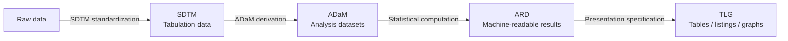

# 4.7 Clinical Reporting with pharmaverse

## Learning objectives

By the end of this chapter, you can:

1. **map** SDTM → ADaM → ARD → TLG and explain each layer in terms of reviewability and traceability.
2. **derive** dates and parameters with admiral's metadata-driven functions rather than copy-and-paste code.
3. **explain** how an Analysis Results Dataset (ARD) separates what is calculated from how it is displayed.
4. **construct** a demographics table from simulated clinical data with gtsummary and extract its internal ARD.
5. **critique** dual programming and the independence of quality control (QC).
6. **judge** which parts of the pipeline AI assistants may and may not handle.

## Prerequisite check (≤5 minutes)

Complete both questions independently; otherwise revisit the [tidyverse prerequisites](../index.qmd#prerequisites).

::: {.callout-important}
## Check In: prerequisites

1. Use dplyr to group a data frame by treatment and calculate group counts and mean ages.
2. A reviewer points to “42%” in a table and asks how it was calculated. Can your code trace it back to source records? Identify where that chain is unclear; this chapter fills the gap.
:::

## 1. Four layers, one evidence chain

In clinical reporting, the audience can be a **regulatory reviewer**, not just your manager. Every number must withstand “Where did this come from?” The workflow is therefore organized as a chain:



| Layer | Purpose | Key ideas |
|---|---|---|
| SDTM | Organize raw data in structures reviewers recognize | Review-oriented data structure |
| ADaM | Derive analysis variables from SDTM | Analysis-ready and traceable |
| ARD | Represent statistical results as a dataset | Machine-readable, reviewable, reusable presentation |
| TLG | Present results as tables, listings, and graphs meeting specifications | Layout is a specification |

::: {.callout-note}
SDTM and ADaM are CDISC (Clinical Data Interchange Standards Consortium) data standards, widely used in regulatory submissions. This chapter does not teach the standards clause by clause. It explains how the R ecosystem, particularly pharmaverse (§7), organizes code along this chain.
:::

::: {.callout-caution collapse="true"}
## Just Our Opinion
The most expensive reporting failure can be **not being able to demonstrate that the calculation is correct**. Standards, packages, and processes reduce the work needed to answer a reviewer's questions.
:::

## 2. ADaM: admiral's metadata-driven approach

Older derivation scripts often contain row-by-row if-else logic, hand-filled dates, and copies of a previous study with numbers changed. Reviewers struggle to identify the actual derivation rule.

admiral encourages a **declarative** approach: specify the dataset, source variable, and rule. The derivation becomes a parameterized function call: **arguments document the rule, and calls record its application**.

::: {.callout-example}
Medical-history dates may omit the month or day. For imputation, admiral makes the rules explicit:

```r
library(admiral)
library(tibble)

mh_raw <- tribble(
  ~USUBJID,      ~MHSTDTC,
  "01-701-1015", "2024-02",
  "01-701-1015", "2019",
  "01-701-1019", ""
)

derive_vars_dtm(
  dataset = mh_raw,
  new_vars_prefix = "AST",
  dtc = MHSTDTC,
  highest_imputation = "M",   # Impute no higher than the month level
  date_imputation = "first",  # Missing month/day: choose the earliest
  time_imputation = "first"
)
# No year: return NA rather than impute; the limit is explicit in the arguments
```
:::

`derive_param_computed()` derives a parameter from others. For example, mean arterial pressure is `MAP = (SYSBP + 2 × DIABP) / 3`: put the formula in `set_values_to` and the source parameters in `parameters`. The calculation and its inputs remain visible.

::: {.callout-warning}
## Common mistake: ad hoc date-filling if-else code
Code such as `if (nchar(x) == 4) paste0(x, "-01-01")` can create different undocumented rules for each study. **Make rules explicit parameters** so they can be reviewed; that is a central purpose of admiral.
:::

## 3. ARD: make results data before making them a table

Traditional scripts mix calculation and layout: a layout change prompts recalculation; a statistic change requires reformatting. ARD inserts a layer where **statistical results themselves are tidy data**. Each row records variable, group, statistic, value, and context. Presentation functions consume this dataset.

The {cards} package produces ARDs. First create **simulated** demographics data, reused in §4. Do not expose real trial data; the `pharmaverseadam` package also supplies example ADaM data for teaching.

::: {.callout-example}
```r
library(cards)
library(tibble)

adsl_mock <- tribble(
  ~USUBJID,      ~TRT01A,    ~AGE, ~SEX, ~BMIBL,
  "01-701-1015", "Placebo",   64, "F",   26.1,
  "01-701-1016", "Placebo",   71, "M",   24.3,
  "01-701-1023", "Placebo",   58, "F",   31.5,
  "01-701-1028", "Placebo",   67, "M",   27.9,
  "01-701-1044", "Active",    60, "F",   25.2,
  "01-701-1049", "Active",    73, "M",   23.7,
  "01-701-1052", "Active",    61, "F",   33.0,
  "01-701-1057", "Active",    66, "M",   26.8
)

ard_tabulate(
  data = adsl_mock,
  variables = SEX,
  by = TRT01A,
  denominator = adsl_mock
)
```

The output is long-form data: `group1`/`group1_level` identify the group, `variable`/`variable_level` identify what is summarized, and `stat_name`/`stat_label`/`stat` record the statistic and value. A percentage such as 42% can become **machine-readable data**, not merely text embedded in a display table.
:::

For hierarchical summaries, such as adverse events by system organ class and preferred term, use `ard_stack_hierarchical()` with `variables = c(AESOC, AEDECOD)`, `by = ARM`, `id = USUBJID`, and `denominator = adsl`. The arguments describe the hierarchy.

::: {.callout-note}
ARD brings **results into data governance**: they can be compared, versioned, and reused by gtsummary, tfrmt, or ggplot2. It is more than another table storage format.
:::

## 4. Tables: start with gtsummary, extend with tfrmt

Using §3's data, a compact baseline demographics table is:

::: {.callout-example}
```r
library(gtsummary)

tbl <- adsl_mock |>
  tbl_summary(
    by = TRT01A,
    include = c(AGE, SEX, BMIBL),
    type = c(AGE, BMIBL) ~ "continuous",
    statistic = list(
      all_continuous() ~ "{mean} ({sd})",
      all_categorical() ~ "{n} ({p}%)"
    ),
    digits = all_continuous() ~ 1
  ) |>
  add_overall()

tbl
```

Structure adapted from workshop `exercises/05-tables-gtsummary.R`.
:::

Recent gtsummary versions use {cards} as the statistical engine. The table object first constructs ARDs, retrievable with `gather_ard(tbl)`, exposing the statistics behind its cells.

::: {.callout-important}
## Check In: predict before verifying

Change the `all_continuous()` statistic to `"{median} ({p25}, {p75})"`. **First write down** which `stat_name` values you expect to appear in `gather_ard()`, then run and compare. This makes the separation between the ARD and its display directly visible.
:::

tfrmt serves a different stage. When table specifications need review **before database lock**, it expresses **layout as code**. The `group/label/column/param/value` mappings define structure; `body_plan()` defines cell formats such as `n (p%)`. Mock printing produces a **table shell without real data** for review. The same specification receives actual results later.

## 5. Independent programming and QC

In a regulated setting, “I checked my own code” is not the same as independent verification. A common approach is **dual or independent programming**. A production programmer implements the specification; a QC programmer implements it **independently**, using a different person and code path, and sometimes different tools. Compare results item by item, explain discrepancies until resolved, and retain records.

| Role | Purpose | Independence |
|---|---|---|
| Production | Submission deliverables | Does not inspect QC code |
| QC | Verify production results | Does not inspect production code |

::: {.callout-warning}
## Trap: the same AI writes both implementations
Production and QC generated by the same assistant may share the same hidden mistake: **false independence**. Independence also matters when AI is used. Tools may differ, people must remain separate, and both sides' use should be recorded. Chapter 4.8 develops the governance details.
:::

## 6. AI helps iteration; it does not supply the final evidence

What does “AI-Powered” mean in the workshop title? **AI assists iteration, not the generation of final evidence.** Reported numbers come from deterministic code applied to data. AI may draft code, suggest formatting, or explain errors. An example exercise prompt is: “How do I format n and p as `n (p%)` in a tfrmt cell?”

| Suitable assistance | Human responsibility |
|---|---|
| Draft tfrmt/gtsummary layout code | Final interpretation of specifications |
| Explain admiral errors and arguments | Medical/statistical judgment behind derivation rules |
| Review code against a specification | Sign-off on results and submission text |
| Write renaming, export, or documentation helpers | QC independence and accountability |

Transparency, reproducibility, and reviewability still apply. Another person must be able to replay and inspect work involving AI. Chapter 4.1 provides LLM foundations.

## 7. A pharmaverse map

| Layer | Representative packages | Responsibility |
|---|---|---|
| SDTM | sdtm.oak · pharmaversesdtm | Map raw data to SDTM; the latter supplies example data |
| Metadata | metacore | Make standards and specifications usable as R data |
| ADaM | admiral and therapeutic-area extensions | Declarative derivation functions |
| Example data | pharmaverseadam · pharmaverseraw | Teaching ADaM and raw data |
| ARD | cards · cardx | Machine-readable statistical results |
| Tables | gtsummary · tfrmt · rtables | Data summaries, layouts as code, table-building frameworks |
| Delivery | docorator · xportr | Documents with headers/footers and PDF/Word output; xpt transport files |

You do not need to master every package. Start with the one or two layers you own and consult the rest as needed.

::: {.callout-important}
## Practice Exercise 1 (copy)

Run §4's table, then record expected versus actual behavior for three checks: ① Typical: `include = c(AGE, SEX)`. ② Boundary: introduce one `NA` in `SEX`; how is it displayed, and can an argument control it? ③ Variation: remove `by` but retain `add_overall()`; what happens to the columns?
:::

::: {.callout-important}
## Practice Exercise 2 (adapt)

Adapt §2's MAP derivation to BMI. Use `derive_param_computed()` to derive `BMIDER` from `HEIGHT` in cm and `WEIGHT` in kg: `AVAL = WEIGHT / (HEIGHT / 100)^2`. Supply `PARAMCD`, `PARAM`, and `AVALU`. Validate with a four-row ADVS tribble, using `01-701-10XX` subject identifiers. Anchor: `exercises/03-ADaM.R`, Exercise 2.
:::

::: {.callout-important}
## Practice Exercise 3 (create · AI integration)

**Round 1 (AI off):** Create ten rows of mini-ADAE with USUBJID, ARM, AESOC, and AEDECOD. Use `ard_stack_hierarchical()` to calculate SOC/PT n and p with `over_variables = TRUE` and your mini-ADSL denominator. Write a tfrmt `n (p%)` table shell and mock-print it. **Round 2 (AI allowed):** Give Posit Assistant the specification and ask only: “Where is this specification most likely to fail when real data arrives?” Record two or three risks it identifies.
:::

## Capstone

**Task: “Mini TLG pipeline.”** Using `pharmaverseadam::adsl` or simulated data you create, complete a small ADaM derivation → cards ARD → gtsummary/tfrmt table → Quarto report. Add a one-page reviewer appendix tracing three selected numbers from the table back to source data.

| Dimension | Meets expectations | Good | Excellent |
|---|---|---|---|
| Alignment | Clearly separated layers | Conventional variable names and structures | Explains why every layer exists |
| Derivation | Explicit parameters | Traceable formula and inputs | Discusses missing/imputed boundaries |
| Tables | Readable and renderable | Statistics and formatting follow the specification | Reusable tfrmt specification |
| Verification | Traceability paths included | Records support independent review | Demonstrates a QC comparison and explains differences |

## SOURCES · Attribution

| Section | Material | Use |
|---|---|---|
| §1 pipeline and chapter structure | posit::conf(2026) pharmaverse schedule, Daniel D. Sjoberg and Becca Krouse | Adapted |
| §2 derivations | Workshop `exercises/03-ADaM.R`, date imputation and MAP | Adapted |
| §3 ARD and hierarchical summaries | Workshop `exercises/04-ARD.R` | Adapted |
| §4–§6 table exercises and AI's role | Workshop `exercises/05-tables-gtsummary.R`, `06-tables-tfrmt.R` | Adapted |
| Mock demographics, independent-programming table, package map, rubric | This project | Original |

This chapter is published under CC-BY-SA 4.0.
