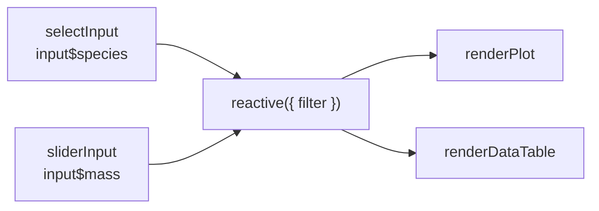

# 2.4 Quarto 仪表盘（动态）

## 本章目标

完成本章后，你能够：

1. **locate** 在交互光谱（静态 → 参数化 → OJS → Shiny）上为需求定位
2. **embed** 用 `server: shiny` / `server: shinylive` 把 Shiny 嵌入 Quarto 仪表盘
3. **wire** 用侧边栏输入（`selectInput`/`sliderInput`）驱动响应式输出
4. **predict** 画响应式图（reactive graph），预测输入变化时哪些输出失效
5. **choose** 按数据敏感度与运维条件在 shinylive / shinyapps.io / Connect 中选型

## 前置自测（≤5 分钟）

能独立完成以下两问再继续；否则先回补 [2.3]：

::: {.callout-important}
## Check In：前置自测

1. 能不看讲义搭出 2.3 的两页仪表盘（页面 / 行 / value box）。
2. `install.packages("shiny")` 已成功；听过「input 只能在 server 端读」
   吗？没听过没关系，§3 就是讲它。
:::

## 1. 交互光谱：从静态到 Shiny

::: {.callout-caution collapse="true"}
## Just Our Opinion
交互是仪表盘里**最贵的特性**：写它、跑它、托管它都要成本。
想加交互前先问：「把 2.3 的静态板每周定时重渲染，能不能解决 90% 的
问题？」多数时候能。剩下的 10%，才值得往下走这条光谱。
:::

| 档位 | 做法 | 读者得到 | 服务器 |
|---|---|---|---|
| 静态 | `quarto render` 一次 | 固定快照 | 任何静态主机 |
| 参数化 | `params:` + `quarto render -P class:"suv"` | 预制变体 | 仍可静态托管 |
| 前端交互 | OJS / htmlwidgets | 浏览器内即时筛选 | 无需服务器 |
| Shiny | `server: shiny` | 任意筛选、服务端计算 | 需要能跑 R 的地方 |

对应的四档**部署模式**（源自工作坊讲义）：静态（static）、定时（scheduled）、
参数化（parameterized）、交互（interactive）——前三档本质是「渲染时机」
问题，只有第四档需要真正的运行时。

## 2. 把 Shiny 嵌进 Quarto：server: shiny

Quarto 仪表盘 + Shiny 的全部门槛是一行 YAML：`server: shiny`。此后文档里出现两类角色：

- **UI 块**（默认）：放 `selectInput()` 这类输入控件，渲染进页面
- **server 块**（`#| context: server`）：读 `input$xx`、执行计算、返回 `render*()` 输出

::: {.callout-warning}
## 高频误区：以为渲染完就完事
`server: shiny` 的产物**不是静态 HTML**——双击打开只有空壳。
开发时用 Positron/RStudio 的 Render 预览（背后起了 Shiny 进程）；
交付时必须托管到能跑 R 的服务器，或改用 shinylive（§6 决策表）。
:::

变体 `server: shinylive`：应用编译成 WebAssembly，在**读者浏览器里**
跑 R（webR），可静态托管——代价与边界见 §6。

## 3. 侧边栏输入驱动响应式输出

完整可跑的最小动态仪表盘（文件 `penguins-live.qmd`）：

::: {.callout-example}
````markdown
---
title: "企鹅交互速览"
format: dashboard
server: shiny
---

```{r}
#| context: setup
library(shiny)
library(ggplot2)
library(dplyr)
penguins <- palmerpenguins::penguins
```

## 筛选 {.sidebar}

```{r}
selectInput("species", "物种",
  choices = c("Adelie", "Gentoo", "Chinstrap"), multiple = TRUE)

sliderInput("mass", "体重区间 (g)",
  min = 2500, max = 6300, value = c(2500, 6300))
```

## 图表

```{r}
#| context: server
selected <- reactive({
  penguins |>
    filter(species %in% input$species,
           between(body_mass_g, input$mass[1], input$mass[2]))
})
```

```{r}
#| context: server
#| title: 嘴峰 × 体重
renderPlot({
  ggplot(selected(),
         aes(bill_length_mm, body_mass_g, color = species)) +
    geom_point()
})
```

```{r}
#| context: server
#| title: 明细表
renderDataTable(
  selected()[, c("species", "island",
                 "bill_length_mm", "body_mass_g")],
  options = list(pageLength = 8))
```
````

`.sidebar` 把一行变成左侧筛选栏；`context: setup` 只跑一次；server 块里
**裸调用** `renderPlot()` / `renderDataTable()`，Quarto 自动在块的位置放好
输出卡片，`#| title:` 照常命名。
:::

::: {.callout-warning}
## 高频错误：在 UI 块里读 input$
`input$species` 只在 `context: server` 块里存在，在普通块里引用
直接报「找不到对象 input」。**口诀：摆控件的块不读值，读值的块不放控件。**
:::

## 4. 响应式心智模型：图与失效

Shiny 的全部行为可以画成一张**响应式图（reactive graph）**：
输入是源，`reactive()` 是中继站，`render*()` 是终点。输入一变，
下游全部**失效（invalidation）**、排队重算；上游不受影响。



对 §3 的例子：拖动体重滑块 → `selected` 失效 → 图和表一起重算；但输入
控件本身、`context: setup` 的数据加载都**不会**重跑——这就是「只算必要的」的全部秘密。

::: {.callout-important}
## Check In：失效预测

把 §3 的 `sliderInput` 换成对 `bill_length_mm` 的区间筛选：
① 响应式图怎么改？画出来；② 哪些块会重算、哪些不会？
先写下预测，再改代码实测对照——预测错的地方就是你模型的缺口。
:::

::: {.callout-note}
这里只装「够用的一升」：图、失效、只算必要的。`eventReactive`、定时器、模块化与调试，2.7 章整章展开。
:::

## 5. 无服务器交互：OJS 备选

读者只想在浏览器里筛一筛、看一看，不需要服务端统计量时，Observable JS
（OJS）是零服务器方案：渲染产物就是静态 HTML。

::: {.callout-example}
```ojs
penguins = FileAttachment("penguins.csv").csv({typed: true})
```

```ojs
viewof bill = Inputs.range([30, 60], {step: 0.5, label: "嘴峰长度 ≥"})
```

```ojs
Inputs.table(penguins.filter(d => d.bill_length_mm >= bill), {rows: 8})
```

数据从 R 侧导出：`write.csv(palmerpenguins::penguins, "penguins.csv")` 放在 `.qmd` 同目录即可。
:::

`viewof` 声明「控件 + 它的值」：左边是 UI，右边是可供下方单元格
引用的变量——OJS 版的输入输出自动连线，没有显式的 server 概念。

::: {.callout-note}
选型经验：图表筛选类交互优先 OJS（便宜、快、可静态托管）；
需要服务端模型、数据库连接、私有凭证时才上 Shiny。
:::

## 6. 部署决策表

| 方案 | R 在哪跑 | 最适合 | 代价 / 边界 |
|---|---|---|---|
| shinylive（WebAssembly） | 读者浏览器（webR） | 教学演示、公开小数据、无 IT 支持 | 包兼容受限、大数据慢、代码与数据随页公开 |
| shinyapps.io | Posit 云 | 公开应用、小团队快速上线 | 免费额度有限、数据要能出公网 |
| Posit Connect / Shiny Server | 自家服务器 | 企业内部、私有数据、权限与定时 | 需要 IT 运维与预算 |
| 定时重渲染静态板（2.3 §7） | CI（GitHub Actions） | 「伪交互」足够的大多数监控 | 不是真交互，只是刷新快照 |

选型第一问永远是**数据能不能出网**：能出网才考虑前三行；不能出网直接进 Connect / Shiny Server，或退回定时静态板。

::: {.callout-important}
## Practice Exercise 1（copy 档）

逐字录入 §3 的 `penguins-live.qmd` 并渲染成功；操作两个控件，
对照 §4 的响应式图验证「哪些输出在动」。交一张截图 + 一行观察。
:::

::: {.callout-important}
## Practice Exercise 2（adapt 档）

给 §3 例子加第二个输出：`renderText()` 卡片，实时显示当前筛选下最重的
企鹅体重。要求只新增 server 块、复用 `selected()`，并把新终点补进响应式图。
:::

::: {.callout-important}
## Practice Exercise 3（create 档 · AI 环节）

**第一轮（禁 AI）**：用体检数据集做「体检交互看板」：sidebar 两个输入
（性别下拉 + 年龄段滑块）驱动一图（`renderPlot`）一表（`renderDataTable`）。
先画响应式图再写代码。
**第二轮（开放 AI）**：把代码贴给 Posit Assistant，只问：「画出这个应用的响应式图，并指出一处会重复计算但不必重复的路径。」
对照你自己画的图，记录差异与一处你会采纳的优化。
:::

## Capstone · 压轴项目

**任务**：把 2.3 的压轴仪表盘升级为动态版（或换数据集重做）：侧边栏两个
输入驱动至少「一图一表」两个响应式输出；至少一个 `reactive()` 中继；从 §6
选定部署路径并写 50 字理由；公开数据集实际部署（shinylive / shinyapps.io），
内部数据交 `server: shiny` 源码 + 演示截图。

| 维度 | 达到 | 良好 | 卓越 |
|---|---|---|---|
| 交互设计 | 两个输入真实影响输出 | 输入粒度服务阅读任务 | 无一控件是摆设，能说明取舍 |
| 响应式正确性 | 输入输出接通 | 有 reactive 中继避免重复计算 | 主动预测并实测失效范围 |
| 部署决策 | 写明所选路径 | 理由覆盖数据敏感度与运维条件 | 完成实际部署并交链接 |
| 工程与可复现 | 渲染成功、结构清晰 | setup/server 分层、代码有注释 | 他人拿到文件可一键复跑 |

## SOURCES · 来源映射

| 讲义节 | 素材 | 性质 |
|---|---|---|
| §1 交互光谱与部署模式 | posit::conf(2024) quarto-dashboards `4-parameters-interactivity-deployment`（Mine Çetinkaya-Rundel 及助教团队 · CC-BY-SA 4.0） | 改编 |
| §2–§3 嵌入式 Shiny 结构 | Quarto 官方 Dashboards: Shiny 文档 + 同工作坊示例 | 引用/改编 |
| §4 响应式心智模型 | posit::conf(2025) shiny-r「Reactivity」讲（Colin Rundel · CC-BY-SA 4.0） | 改编 |
| §5 OJS | Quarto 官方 Interactivity / Observable 文档 | 引用 |
| 体检看板练习、部署决策表、rubric | 本项目 | 原创 |

本章以 CC-BY-SA 4.0 发布。
