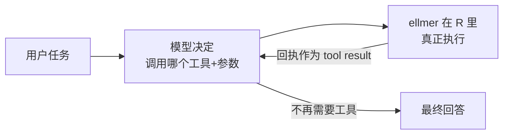

# 4.3 智能体与工具调用 · Agents and Tool Calling

## 本章目标

完成本章后，你能够：

1. **define** 用 `tool()` 包装 R 函数、用 `type_*()` 描述参数，并注册进会话
2. **explain** 工具循环四步：模型请求 → 你执行 → 回传结果 → 模型继续
3. **build** 搭一个带 read / write / list / edit 文件工具的数据助理 agent
4. **diagnose** 识别三类失效（死循环、幻觉参数、拒绝用工具）并 **design** 四层护栏
5. **justify** 说明 system prompt 膨胀时为什么该升级到 4.4 的 skills

## 前置自测

- 能用 ellmer 建会话、设 system prompt、检查消息列表；见过 `type_*()` 描述符（→ 不熟？先回 [4.1](41-llm-basics.qmd)、[4.2](42-structured-output.qmd) §2）

::: {.callout-note}
本章情境沿用 llms 工作坊的「最后一家 Blockbuster 录像带店」：
`blockbuster/` 文件夹里有 `members.csv`、`rentals.csv`、`dues.csv` 和
店长留言 `notes.md`。从上游 `llms` 复制 `_solutions/20_agent-2/blockbuster/`
到当前项目，并保留 `data/blockbuster/rentals-old.csv` 供 §4 使用。
:::

## 1. 从聊天到行动：把 R 函数交出去

模型只会写字——它不能响铃、不能读你的硬盘，除非**你替它把动作包装成工具**。定义工具要回答三问（工作坊原话）：模型给你**什么输入**？函数替它**做什么**？你**回传什么文本**让它继续？

::: {.callout-example}
```r
library(ellmer)
play_sound <- function(sound) {
  sound <- match.arg(sound, c("correct", "incorrect", "new-round", "you-win"))
  switch(sound,
    correct = beepr::beep("coin"),
    incorrect = beepr::beep("wilhelm"),
    "new-round" = beepr::beep("fanfare"),
    "you-win" = beepr::beep("mario")
  )                                           # 映射到 beepr 支持的音效名
  glue::glue("The '{sound}' sound was played.") # 回给模型的回执
}

tool_play_sound <- tool(
  play_sound,
  description = "Play a sound effect",
  arguments = list(
    sound = type_enum(
      c("correct", "incorrect", "new-round", "you-win"),
      description = paste(
        "Which sound to play: 'new-round' after the user picks a theme,",
        "'correct' or 'incorrect' after each answer, 'you-win' at the end."
      )
    )
  )
)
```
:::

关键事实：模型**只看得见 description 与参数类型，看不见 R 源码**——描述要写「何时用」（Use this when...），这和 4.2 的字段 description 是同一门手艺。`chat$register_tool(tool_play_sound)` 注册后，模型会在合适的时机调用它（改编自 llms `17_quiz-game-2`）。

::: {.callout-warning}
## 高频误区：工具的返回值是给模型的，不是给用户的
`play_sound()` 的回执进入对话历史；用户听到的是**副作用本身**。回执要写得让模型能据此决策（"Wrote x." / "Could not find y."），不要写成给人看的进度汇报。
:::

## 2. 工具循环：agent 的心脏

一次 `$chat()` 内部，ellmer 在替你跑一个循环：



模型请求 → 你执行 → 回传 → 模型继续。模型**不是被编程去串步骤**，而是每轮看着「任务 + 已有工具结果」决定下一步——**选择下一步的是模型，不是用户**。Hadley Wickham 的极简定义：agent = 有读工具和写工具、在循环里反复调用它们的 LLM。

## 3. 造一个真 agent（一）：读与写

数据助理第一版只要两个工具，但三个设计决定要先记下：① `proj_path()` 以 `blockbuster/` 为路径基准；② `write_file` 返回回执；③ system prompt 规定「需要代码时，**写脚本给人跑**」——agent 不执行代码，人是执行环。这份路径拼接示例并非沙箱，`../` 仍可越界；仅在练习副本上运行，上线前须增加规范化路径与根目录校验。

::: {.callout-example}
```r
project_dir <- "blockbuster"
proj_path <- function(path) file.path(project_dir, path)

read_file <- function(path) brio::read_file(proj_path(path))

write_file <- function(path, content) {
  brio::write_file(content, proj_path(path))
  paste0("Wrote ", path, ".")
}
tool_read_file <- tool(
  read_file,
  description = "Read the full contents of a file in the workspace. Use this to inspect the store records before you write a script.",
  arguments = list(path = type_string("Path relative to the workspace."))
)

tool_write_file <- tool(
  write_file,
  description = "Write a file in the workspace, overwriting it if it exists. Use this to create a script or its output.",
  arguments = list(
    path = type_string("Path relative to the workspace."),
    content = type_string("The full contents of the file to write.")
  )
)

chat <- chat_posit(
  model = "zai-org/GLM-5.3-Flash",
  system_prompt = paste(
    "You are a coding agent for the Last Blockbuster in Bend, Oregon.",
    "When a task needs code, write an R script for the user to run."
  )
)
chat$register_tool(tool_read_file)
chat$register_tool(tool_write_file)

chat$chat(paste(
  "It is time for the renewal drive. Which members have gone quiet?",
  "Build the win-back list as `win-back.csv` by writing `find_lapsed.R` for me to run."
))
chat   # 开盖：完整轨迹 = 每次工具调用 + 参数 + 回执
```
（改编自 llms `19_agent-1`；模型档位沿用工作坊的选择）
:::

打印 `chat` 检查轨迹：先读了哪些文件？脚本路径对不对？**人知道答案再验收**——你看过 `members.csv`，才有资格判断它有没有偷懒。

## 4. 造一个真 agent（二）：观察与精准修改

第二版加两件工具：`list_files` 给 agent**发现**能力（店长随时丢新文件进来），`edit_file` 给它**最小改动**能力——只许替换**恰好出现一次**的精确文本段。四件套与 `21_skills-1/_tools.R` 同源，4.4/4.6 章直接复用。

::: {.callout-example}
```r
list_files <- function() paste(list.files(project_dir), collapse = "\n")
tool_list_files <- tool(
  list_files,
  description = "List the names of files in the workspace. Use this to discover new files before you read or edit them."
)
edit_file <- function(path, old, new) {
  full <- proj_path(path)
  content <- brio::read_file(full)
  matches <- gregexpr(old, content, fixed = TRUE)[[1]]
  if (matches[[1]] == -1L) cli::cli_abort("Could not find the text to replace in {path}.")
  if (length(matches) != 1L) cli::cli_abort("Expected one match in {path}, found {length(matches)}.")
  brio::write_file(sub(old, new, content, fixed = TRUE), full)
  paste0("Edited ", path, ".")
}

tool_edit_file <- tool(
  edit_file,
  description = "Replace one exact span of text in a workspace file. The text must appear exactly once or the tool errors. Use this to patch a script instead of rewriting it.",
  arguments = list(
    path = type_string("Path relative to the workspace."),
    old = type_string("The exact existing text to replace."),
    new = type_string("The text that replaces it.")
  )
)

chat$register_tool(tool_list_files)
chat$register_tool(tool_edit_file)

# 四件工具注册齐后，模拟「班中变故」：
file.copy("data/blockbuster/rentals-old.csv", project_dir, overwrite = TRUE)
chat$chat(paste(
  "The manager found an old register export and dropped it in the folder.",
  "Bring the win-back list up to date."
))
```
（改编自 llms `20_agent-2`）
:::

注意 `edit_file` 里两道 `cli_abort()`：找不到、或匹配不止一处，都**报错回传**而不是猜测——模型会自己换个更精确的 `old` 重试。校验即护栏。

::: {.callout-important}
## Check In：预测轨迹再验证

`rentals-old.csv` 落地后、真跑第二步之前，先写下你预测的工具调用序列（先 `list_files` 吗？重写 `find_lapsed.R` 还是 `edit_file`？）。运行后打印 `chat` 对比：哪步和预期不同？重写 vs 精准修改被什么影响——description 还是 system prompt？（改编自 `20_agent-2` STEP 5）
:::

## 5. 失败模式与护栏

agent 的三种死法，每种都有对症结构（不是「更聪明的模型」）：

| 失败模式 | 症状 | 对策 |
|---|---|---|
| 死循环 | 反复读同一文件 / `old` 永远不唯一 | 唯一匹配校验报错；盯轨迹，重复即停 |
| 幻觉参数 | path 不存在、编造列名 | 校验 + 报错回传让它自纠；先 `list_files` 再读 |
| 拒绝用工具 | 不读文件，凭记忆编答案 | system prompt 写死「先读再说」；description 写 Use this to... |

四层护栏，按性价比排序：

1. **沙箱**：给示例的 `proj_path()` 补上规范化路径与根目录校验；外部文件名再套 `basename()` 白名单（见 [4.6](46-shinychat.qmd) §4）
2. **工具内校验**：每个参数当**不可信用户输入**处理——能错就报错，错误信息写给模型看
3. **轮数预算**：任务拆小；外层代码控制最多发起几轮 `$chat()`，轨迹重复立即人工打断
4. **人审产物**：agent 写脚本、人跑脚本——副作用经你的手发生

::: {.callout-warning}
## 高频错误：给模型它不需要的工具
每多注册一件工具，误用概率与 token 开销同时上涨——先让两件稳定再加。
:::

## 6. 下一步：把「做法」从 prompt 里搬出去

想让 agent 更能干，system prompt 会越写越长——写信的语气、判定流失的
口径、不许承诺的折扣……每轮请求都在付费，注意力也被稀释。这正是 4.4
的入口：**skills = 可复用的 agent 说明书**，平时只给模型看一行目录，
接活时才把正文整份读入。本章的四件文件工具会原样出现在那里。

::: {.callout-caution collapse="true"}
## Just Our Opinion
agent 的下限由工具决定，上限由说明书决定——但顺序不能反。两个带校验的
好工具 + 十行 system prompt，实战胜过十个工具 + 三页咒语。循环毫不神奇：
它就是「模型请求、你执行」的 while 循环，值得琢磨的是你把它圈在多小的笼子里。
:::

::: {.callout-important}
## Practice Exercise 1（copy 档）

自建一个小 workspace（一个文件夹 + 两个 CSV + 一份 `notes.md`），复刻 §3 的 `read_file` / `write_file` 与 agent 接线，完成一个「先读再写」的两步任务。打印 `chat`，交轨迹与一句人审结论。（copy 自 `19_agent-1`）
:::

::: {.callout-important}
## Practice Exercise 2（adapt 档）

给 §3 的 agent 升级为 §4 的四件套并重跑；然后故意在 CSV 里放一个会让
`old` 匹配两次的重复字符串，观察 `edit_file` 报错后模型的自纠。交付：报错前的调用序列与第二次尝试的参数变化。（adapt 自 `20_agent-2`）
:::

::: {.callout-important}
## Practice Exercise 3（create 档 · 禁 AI 环节）

**第一轮（全程禁用 AI）**：为你的领域设计第五件工具（如「查询数据库
只读视图」「读取 SPSS 数据集」「查内部词表」）：写 R 函数 + 描述 + 参数
类型，内置至少两道参数校验。**第二轮（开放 AI）**：把函数与描述贴给助手，
只问：「模型最可能传出的三种坏参数是什么？」补校验后实测，记录 AI
找到的、你漏掉的那一种。
:::

## Capstone · 压轴项目

**任务**：「领域微 agent 1.0」——围绕你的真实数据建一个 workspace，四件文件工具 + 至少一件领域工具 + 克制的 system prompt；设计一个含**班中变故**（中途丢入新文件）的验收任务。交付：Quarto 报告含完整工具调用轨迹、人审结论、失效记录表。

| 维度 | 达到 | 良好 | 卓越 |
|---|---|---|---|
| 工具设计 | 五件工具齐且能跑 | 描述写明「何时用」，回执可决策 | 领域工具有真实校验与防御性报错 |
| 沙箱与护栏 | 路径锁在 workspace 内 | 参数逐个校验 | 有轮数预算与人工打断点的设计说明 |
| 任务完成 | 主任务产物正确 | 班中变故也被正确吸收 | 主动展示一次失败的诊断与修复过程 |
| 失效分析 | 记录 ≥2 次失败 | 失效被归类到 §5 三模式 | 提出「哪类任务不该交给这个 agent」的边界 |

## SOURCES · 来源映射

| 讲义节 | 素材 | 性质 |
|---|---|---|
| §1 工具定义、§2 agent 定义与循环 | llms `_solutions/17_quiz-game-2`、slides-08（agent loop、「读+写」定义） | 改编 |
| §3–§4 Blockbuster agent 与四件文件工具 | llms `_solutions/19_agent-1`、`_solutions/20_agent-2`、`21_skills-1/_tools.R` | 改编 |
| §5 失效三模式与四层护栏、§6 升级路径、练习与 capstone、rubric | 本项目 | 原创 |

本章以 CC-BY-SA 4.0 发布。
