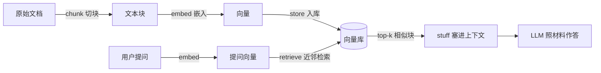

# 4.5 RAG 与 MCP

## 本章目标

完成本章后，你能够：

1. **explain** 知识截止（knowledge cutoff）与私有数据两类失败，以及检索为何是对策
2. **trace** 一条查询走过 RAG 管道的六步：chunk → embed → store → retrieve → stuff → answer
3. **build** 用 `ragnar` 对一个网站建立向量文档库并检查检索结果
4. **tune** 说明切块粒度与嵌入相似度对检索质量的影响方向
5. **wire** 把检索工具挂到 ellmer 会话，产出「带出处」的回答
6. **compare** MCP 的服务器/工具心智模型，并在 RAG / MCP / 直塞上下文间选型

## 前置自测

- 会用 ellmer 建会话、设 system prompt（→ 不熟？先回 [4.1]）
- 知道工具注册与 agent 循环（→ [4.3]；§5 的 `ragnar_register_tool_retrieve()`
  本质就是一个预制检索工具）

::: {.callout-note}
本地嵌入用 LM Studio 跑 `text-embedding-nomic-embed-text-v2-moe`
（localhost:1234，OpenAI 兼容接口）——嵌入步骤无需云端 API；本章抓取网页仍需联网，
§5 的 `chat_posit()` 回答步骤仍需云端凭据。
:::

## 1. 为什么需要检索：模型的两次迷路

LLM 的知识有两个先天缺口：**过期**（训练截止之后的世界它不知道）与
**私有**（你部门的 SOP、你课的讲义、你的数据字典，它从未见过）。缺口上直接
提问，模型不会沉默，它会**编**——4.1 的铁律再次生效：模型负责格式，事实必须有来源。

对策是把闭卷考试改成**开卷考试**：先从你的文档堆捞出相关段落塞进上下文，
再让模型「照着材料答」。这就是 RAG（retrieval-augmented generation，检索增强生成）。

::: {.callout-warning}
## 高频误区：RAG 治幻觉
RAG 降低的是「没材料可依」的编造，治不了「材料在手仍读错」，更治不了
「检索没捞到正确段落」。开卷考试翻错页照样写错——所以结尾要回到评测（4.2）。
:::

## 2. RAG 管道全景



六步对应的 `ragnar` 调用：

| 管道步 | ragnar 函数 |
|---|---|
| 找页面 | `ragnar_find_links()` |
| 读成 Markdown | `read_as_markdown()` |
| chunk | `markdown_chunk()` |
| embed + store | `ragnar_store_create(embed = ...)` + `ragnar_store_insert()` |
| 建检索索引 | `ragnar_store_build_index()` |
| retrieve | `ragnar_register_tool_retrieve()`（作为工具挂给会话） |

## 3. 动手：五十行跑通一个最小 RAG

对《R for Data Science》全书建库（改编自 llms `51_rag`，结构源自 ragnar 官网示例）：

::: {.callout-example}
```r
library(ragnar)

base_url <- "https://r4ds.hadley.nz"
pages <- ragnar_find_links(base_url, children_only = TRUE)

dir.create(here::here("ch45"), recursive = TRUE, showWarnings = FALSE)
store <- ragnar_store_create(
  here::here("ch45/r4ds.ragnar.duckdb"),
  title = "R for Data Science",
  embed = \(x) embed_lm_studio(x, model = "text-embedding-nomic-embed-text-v2-moe")
)

for (page in pages) {
  chunks <- page |>
    read_as_markdown() |>
    markdown_chunk()
  ragnar_store_insert(store, chunks)   # 插入即自动嵌入
}

ragnar_store_build_index(store)
ragnar_store_inspect(store)   # 交互式检查器：问题进去，命中的块出来
```
:::

`ragnar_store_inspect()` 弹出一个检查器 app：贴一个问题，看哪些块被捞出。
这是 RAG 开发的**主战场**——你不调试模型，你调试「捞出什么」。
::: {.callout-important}
## Check In：故意制造一次检索失败

用 `51_rag` 自带的经典问题去检查器里试（有人想把 `data1` 按 `data2$code`
过滤却拿到零行），观察命中块；再问一个书里**没有**的问题（如「怎么用
pandas 合并表」）。哪种失败更危险：什么都捞不到，还是捞到一堆不相干的块？
:::

## 4. 两个旋钮：切块与嵌入

**切块（chunking）**决定「一页纸被撕成多大的碎片」：块太大，一块混多个主题，
嵌入被稀释，命中也夹带噪声；块太小，答案被切断在两块里，任一块都不足以作答。
`markdown_chunk()` 按结构（标题/段落）切，尽量让块主题完整；参数见
`?markdown_chunk()`，这是你控制权最大的一步。

**嵌入（embedding）**的直觉不需要数学：嵌入模型把每段文本变成一个长向量，
训练目标只有一个——**语义相近的文本，向量也相近**。检索就是拿问题向量在库里
找「方向最近」的块。但它有一条重要推论：

::: {.callout-warning}
## 高频误区：换个说法就检索不到
用户问「怎么把两个表接起来」，书里写「join two tables」。词面不同、语义相近，
嵌入通常能兜住；但**行话完全错位**时（临床黑话 vs 教科书术语）会失手。
领域语料上线前，先用真实用户的问法测一轮，别只用文档作者的问法。
:::

## 5. 接上会话：一个会引用出处的问答机器人

管道的最后一跳是把 retrieve 做成**工具**挂回 ellmer 会话，模型自己决定何时查库
（改编自 llms `51_rag` Step 3）：

::: {.callout-example}
```r
library(ellmer)

chat <- chat_posit(
  system_prompt = r"--(
You are an expert R programmer and mentor. You are concise.

Before responding, retrieve relevant material from the knowledge store.
Quote or paraphrase passages, clearly marking your own words versus
the source. Provide a working link for every source you cite.
  )--"
)

ragnar_register_tool_retrieve(chat, store, top_k = 10)

live_console(chat)
```
:::

注意分工：system prompt 定「先检索、标出处、给链接」的纪律，工具给能力，
`top_k` 定每次捞几块——多则贵且杂，少则省但漏；用 4.2 的评测找你的值。

## 6. MCP：一个协议，很多服务器

RAG 解决「模型读你的资料」；MCP（Model Context Protocol）解决「模型用你的
工具」的接线标准化。心智模型：**USB 接口**——客户端（Positron Assistant、
Claude Desktop 等）是插座，任何实现了 MCP 的服务器插上来，它暴露的工具、
资源就被客户端统一发现和调用。

- **HTTP 服务器**：远程进程，一个 URL 接入
- **stdio 服务器**：客户端在你本机拉起子进程，经标准输入输出对话——想把一组
  R 函数暴露给助手，就写一个把函数签名翻译成 MCP 工具的 stdio 服务器；
  效果等同 4.3 的 `register_tool()`，但**跨客户端复用**

::: {.callout-example}
在 Positron 里接入文档检索服务器 context7（改编自 llms `52_mcp`）：

1. 命令面板运行 **MCP: Add Server...**，选 **HTTP**
2. URL 填 `https://mcp.context7.com/mcp`，Server ID 填 `context7`
3. 作用域选 Workspace（仅本项目）或 Global
4. 打开 Positron Assistant，选中一段 polars 代码，提示词末尾加 `#context7`：
   「把这段 polars 代码改写成 dplyr」——观察它调用 context7 的文档工具
   核对最新 API，而不是凭训练记忆写
:::

::: {.callout-note}
对照：context7 给的东西本质是「别人的 RAG」。自己建库（§3）还是接别人的
服务器（§6），取决于资料是不是你的、别人是否已经做好。
:::

## 7. 选型与诚实边界

| 场景 | 选 | 理由 |
|---|---|---|
| 资料总共几页 | 直塞上下文 | 不值得建管道；4.1 的 token 直觉即可 |
| 私有/常更新的资料 + 问答 | RAG | 知识在库里，换资料不换代码 |
| 需要动作（查库、调 API、操作文件） | tools / MCP 服务器 | 检索给不出「做」的能力 |
| 团队多种客户端都要用同一组工具 | MCP | 协议即插座，写一次处处接入 |

三条诚实的边界：

1. **检索会漏**：top-k 近邻不保证语义等价；关键问答必须回到
   「问题集 → 命中检查」的评测循环（→ [4.2]）
2. **库会陈旧**：源文档更新后旧嵌入还在库里；重建索引要有节奏，
   别等用户发现答案过期
3. **塞进去 ≠ 读进去**：上下文再长，模型也可能忽略中段或曲解细节；
   「带出处作答」的纪律（§5）是缓解不是根治

::: {.callout-caution collapse="true"}
## Just Our Opinion
多数「领域知识助手」项目死因不是模型不行，而是从没打开过
`ragnar_store_inspect()`。先手看 20 个真实问题各捞出什么，再谈选模型：
检索质量是你能控制的 80%，模型选型是剩下的 20%——而且最贵。
:::

::: {.callout-important}
## Practice Exercise 1（copy 档）

跑通 §3 全管道（范围可缩到 R4DS 某一章的子页面）。报告：抓到多少页、
入库多少块、Check In 那个过滤问题命中的前三个块（贴原文片段）。
（改编自 llms 工作坊 `51_rag`）
:::

::: {.callout-important}
## Practice Exercise 2（adapt 档）

只用 15–20 个页面建两个库，唯一差异是 `markdown_chunk()` 的设置。写 5 个
固定问题在两个检查器里各跑一遍，逐题记录命中块是否「单独足以作答」。
交付对照表，并回答：哪种设置更优，代价是什么？（评测纪律参照 [4.2]）
:::

::: {.callout-important}
## Practice Exercise 3（create 档 · 禁 AI 环节）

**第一轮（全程禁用 AI）**：为你的领域手写「检索问券」：10 个真实用户问法——
5 个语料里明确有答案、5 个**看似有实则没有**（诱惑性问题）。
**第二轮（开放 AI）**：把问券交给助手，只问：「哪些问法有歧义或会被改写得更
接近文档措辞？给我 3 个对抗性改写。」用改写后的问券复测，报告哪些
「没有答案」的问题被捞出了貌似可信的块。
:::

## Capstone · 压轴项目

**任务**：「领域知识助手 1.0」——选一份你拥有的资料（讲义 / SOP / 项目文档），
用 ragnar 建库、挂到会话、部署为带出处纪律的问答机器人（`live_console()` 即可），
交付 10 题评测报告：每题记录命中块是否支持答案、回答是否如实引用、诱惑题
是否被顶住。至少对比两种切块设置。

| 维度 | 达到 | 良好 | 卓越 |
|---|---|---|---|
| 检索质量 | 库建成、能问答 | 10 题中 ≥7 题命中支持块 | 诱惑题无一「编出出处」并解释成因 |
| 管道工程 | 脚本跑通 | 重建可一键执行、嵌入可换 | 库的陈旧检查方案（更新节奏或版本标记） |
| 评测纪律 | 10 题有记录 | 预期先于运行写下 | 切块对照结论可复现（固定问券入库） |
| 边界诚实 | 报告含局限 | 区分「检索漏」与「读错」 | 给出一个「不该上 RAG、该直塞/MCP」的反例 |

## SOURCES · 来源映射

| 讲义节 | 素材 | 性质 |
|---|---|---|
| §3、§5 管道与机器人代码骨架 | posit::conf(2026) llms `_exercises/51_rag` / `_solutions/51_rag`（含 ragnar 官网 usage 示例，Garrick Aden-Buie, Sara Altman · CC-BY-SA 4.0） | 改编 |
| §6 Positron 接入步骤与 context7 任务 | llms `_exercises/52_mcp/README.R.md` | 改编 |
| 两次迷路框架、旋钮直觉、选型表、练习改造、capstone、rubric | 本项目 | 原创 |

本章以 CC-BY-SA 4.0 发布。
