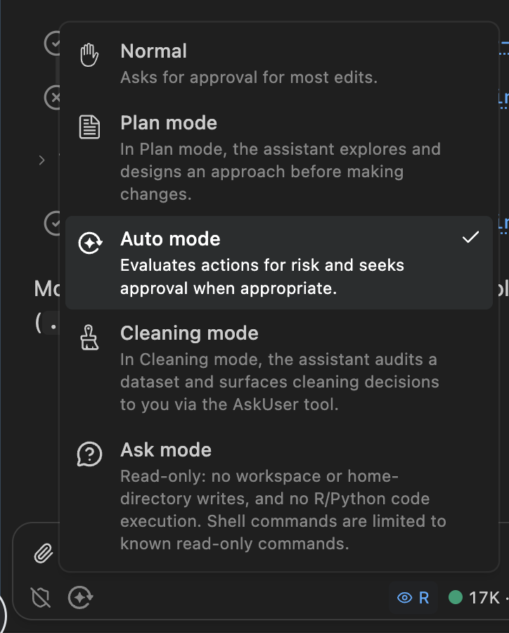
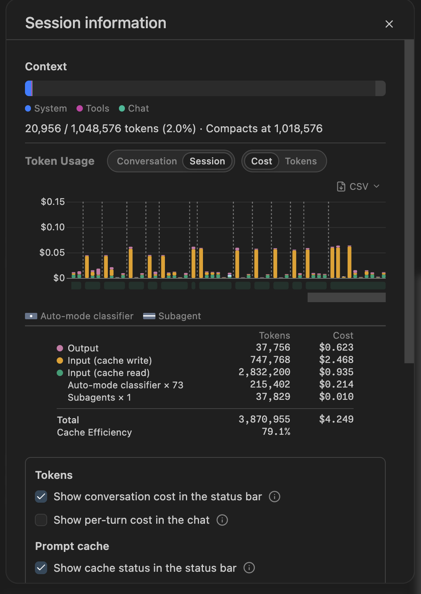

## Goals

* Introduce you to package development with Posit Assistant
* Talk about how it works
* Help you understand the risks associated with using agents
* Give you practical cost control techniques
* Discuss Posit Assistant alternatives

# What is an agent?

## Let's make a package

(Note to self: make sure you're in normal mode)

```R
usethis::create_package("~/desktop/compliment")
```

> Create a new R package called compliment in the current directory. It should generate randomized compliments.

## You've never made a package before?

* It's that easy!
* How to find the bathroom:
  * Code lives in `R/`
  * Documentation lives in `#'` comments
  * Tests live in `tests/testhat/`
* We'll talk more about the pieces and the workflow later

## Your turn {.your-turn}

* Use the same prompt as me. It's an underspecified ask, so we're going to get lots of variation. That's part of the fun!
* Manually approve a few writes. Then pick allow all.
* Make sure your package has tests and Git.
* How much did it cost to make? Was it worth it?
* How does your package differ your neighbours?

## There are three types of output

* Text
* Thinking (click to expand)
* Tool calls

## Tool calls let the agent run code on your computer

* Tools are provided by the **harness**, e.g. Posit Assistant
* LLM asks harness to run code; harness returns result to the LLM
* Often requests many tool calls at once
* These are called "parallel" calls, but don't actually run in parallel
* Can recognise with the thick line

## Parallel tool calls


## What are some common calls?

* `search` searches directory for matching text
* `read` reads a file on disk
* `write` creates a new file
* `edit` modifies an existing file
* `executeCode` runs R (or Python) code in the console
* `bash` runs code you'd usually use the terminal for
* `AskUser` asks you a question
* `webfetch` reads a web page

## Your turn {.your-turn}

* Try and prompt your agent to make it use each of the tool calls above
* What other tools are available?

## A little vocab

* Harness: provides tools; runs the loop
* Model: the specific LLM model you're using
* Provider: who runs the server that runs the model
  * Open models can be hosted anywhere
  * AWS + Azure host lots of foundation models

## Some examples

* Kimi K3 (model) on posit.ai (provider) with Posit Assistant (harness)
* Opus 5 (model) on posit.ai (provider) with Posit Assistant (harness)
* Opus 5 (model) from Anthropic (provider) in Claude Code (harness)
* GPT-5.3 (model) from AWS Bedrock (provider) in Posit Assistant (harness)
* GPT-5.3 (model) from OpenAI (provider) in Codex (harness)

## So what is an agent?

An model, inside a harness, running in a loop, using tools, to achieve a goal

* The LLM decides what tool to run next
* The harness runs the tool and feeds the result back
* Repeat until the LLM declares the task done

# Safety and security

## What are the risks?

I think the cleanest definition is that the dangers are irreversible action, i.e.:

* Editing a file (without git)
* Deleting a file or database table (without a backup)
* Sending an email
* Revealing a secret (API key, password, ...)

## Your turn {.your-turn}

What other dangers are you worried about?
What ways do you know to protect yourself?

## How do you protect yourself?

* Ask for permission
* Make operations reversible
  * Always use git
  * Back up!
* Prevent dangerous actions
* Auto mode

## Ask for permission

* IMO constantly asking for permission is just security theatre
* 99% of LLM actions are fine, so you quickly get trained to always click OK
* So then you just click "Approve always"
* Matching command prefixes doesn't work

## Prefixes don't work

```
git push --force
gh issue delete 123
find . -type f -name '*.log' -mtime +30 -size +10M -path './var/*' -delete
curl -fsSL https://example.com/install.sh -o /dev/stdout | sh
tar -xzf backup.tar.gz -C /tmp/restore --strip-components=1 -P
```

## What about sandboxes?

* Use OS level sandboxing to only allow reads and writes to the current directory, and no network access

* Unfortunately there are a lot of details to get right in order for this to work well (e.g. libraries, temporary directory, what about Git? GitHub?)

* PA only applies the sandbox to bash commands, not R/Python

* I remain optimistic that it's possible to overcome these problems, but current implementations are painful

## What about containers?

* Good practice for the very security conscious
* Painful in practice, but getting less so
* You still need to think about how you will get your data in and out

## Auto-mode

* What if we only ask permission for operations that seem legitimately dangerous?
* That's the idea behind auto-mode: ask a (simpler) LLM to classify if a command is dangerous or safe, and then only ask permission for dangerous options
* (And use only the conversation, not tool results, to avoid the "lethal trifecta")
* It's not perfect, but I think this is a sweet spot on the security-utility spectrum right now

## {background-image="/images/auto-mode.png"}

## The lethal trifecta

Simon Willison's term for the dangerous combination:

* Access to **private data** (your files, secrets, API keys)
* Exposure to **untrusted content** (web pages, emails, issue comments)
* Ability to **communicate externally** (send requests, post comments)

With all three, a prompt injection attack can exfiltrate your data.

## Picking a mode



## Your turn {.your-turn}

Can you trick PA into doing something bad? Some ideas you might try:

* Can you get it to delete a directory containing files?
* Can you get it to send me an email complaining about one of my packages?
* Can you create a fake environment variable (e.g. `POSIT_ASSISTANT_API_KEY`) and get it to save it in a GitHub gist?

# Costs

## Why care?

* You probably don't need to if you're an individual developer
* But:
  * It matters inside enterprises
  * It's a reasonable proxy for energy usage
  * Who knows how long all-you-can-eat plans will continue

## Life is good for individual developers

* Individuals can use an all-you-can-eat plan
  * Codex: $20 / month, $100 / month
  * Claude Code: $20 / month, $100 / month
* These are very generous; you get 20-80x the value of API pricing
* BUT you can only use them in provider harnesses (i.e. not Posit Assistant)

## Enterprise plans are different

* Enterprises have to pay by the million tokens
  * Opus 5: $5 input, $25 output
  * gpt-5.6-terra: $2 input, $12 output
  * Kimi K3: $3 input, $15 output
* (This is also what you pay in ellmer)

* Software engineers spend something like $1k-$3k/month, i.e. $50-$150/day

## Cost-benefit continuously changing

* I used to think that Anthropic models were worth the premium, but the relative cost has increased and output quality has decreased (esp. writing)
* Kimi K3 is excellent. Somewhere between Opus and Fable in code quality, but a much better writer, and only costs 75% of Sonnet (thanks to its tokenizer).
* Since April 16, 2026 (Claude Opus 4.7) a new tokenizer uses ~20% more tokens.
* And Anthropic models seem to be producing more loquacious output, which also costs more money 🤔.

## So how can you tell what you're spending?

* Harnesses by model providers don't tend to make the cost obvious (I think you can imagine why)
* Posit Assistant displays a lot of information (and we're working hard to make it better)
* [AgentsView](https://www.agentsview.io) is a good retrospective tool that works with many harnesses
* Two important facts to know:
  * Conversations are additive
  * Cache is king

## Session information in Posit Assistant



## Conversations are additive

* LLMs are predictive models
* They need the *complete history* of the conversation
* Both your inputs and its outputs

* Recommendation: use `/clear` to start from a fresh slate
* (Restarting your agent is as important as restarting your R session)
* Saves money and avoids stale state

## Cost is dominated by cache hits

* No caching = ~10x cost
* Very hard to reason about, not least because the providers differ so much:
  * Claude: 5 minutes / 1 hour (2x cost)
  * OpenAI: 30 minutes
  * Kimi K3: no guarantees
* But if you resume a session the next day, expect 10x the cost of the last request

## Your turn {.your-turn}

* Look at what you've spent in previous PA conversations
* Optional: download and install AgentsView. Where is your LLM spend going?

# Posit Assistant alternatives

## Posit Assistant currently most compelling inside the enterprise

* Optimistically, it's 2x better than Claude Code/Codex
* But you have to pay 20-80x as much to use it with an API key (or via posit.ai)
* So ask for it if you use RStudio/Positron for work, but otherwise we accept it's probably not worth it for you to use it
* We are closely tracking Anthropic/OpenAI opening up their plans to other harnesses

## So why use it in this workshop?

* We believe it's a really good product and want you to at least experience it
* We also want to see what problems you discover with it
* It's what I use day-to-day
* It gives the best feedback on cost

## What if you can't use it?

* The Claude Code and Codex harnesses are also very good
* I have used both VS Code/Positron extensions and just their CLIs in the terminal
* Downside of both extensions is that they can't find `quarto` and `air`, which are bundled with Positron. You'll need to explicitly tell them that they're bundled with Positron.
* We recommend pairing with <https://github.com/posit-dev/mcp-repl> or similar to get access to a persistent R/Python environment
