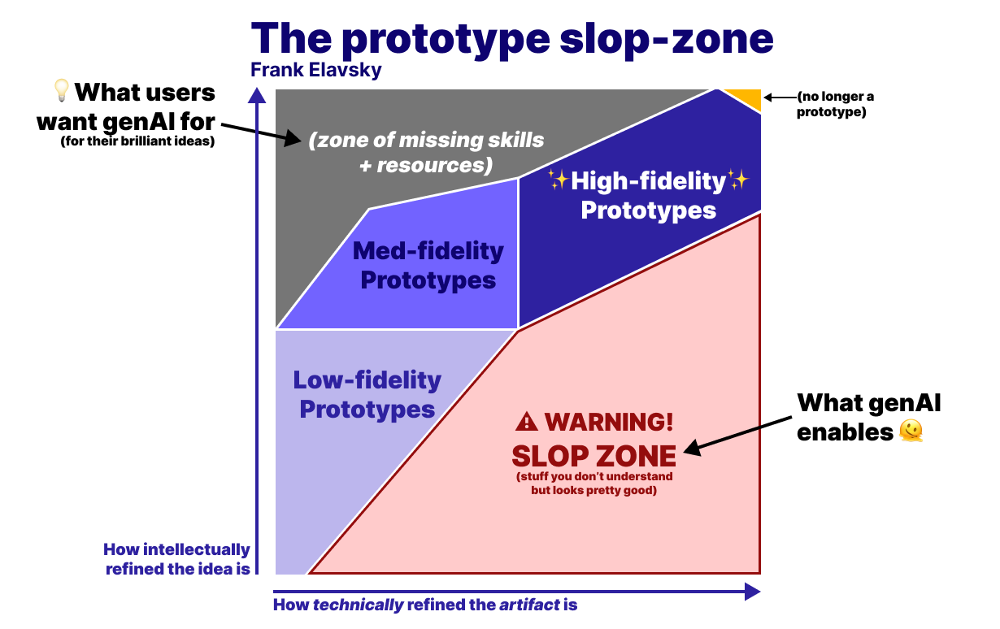
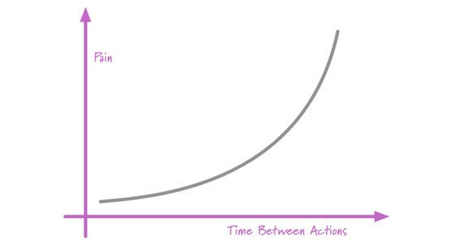

<!--
This deck is a holding pen for "Deep Thoughts" interludes (a la SNL's
"Deep Thoughts by Jack Handey"): short breaks featuring one outside
blog post/idea, meant to interrupt long stretches of talking.

Before delivery: cut these slides apart and sprinkle one into each
main module deck, roughly where energy is flagging. Delete this file
once they've all been redistributed.

Each Deep Thought slide has no title text (to leave room for the quote):
  - a pull-quote from the piece
  - a small-print credit at the bottom, with the blog post title as the
    link text, e.g. [title](url) — author

Reactions happen in the Discord channel, not on-slide.
-->

## {background-color="#1a1a2e"}

::: {style="text-align: center; color: white;"}
### 🌌 Deep thoughts

*(with apologies to Jack Handey)*
:::

## {.center .smaller}

> Anyone who has attempted to gamify some experience knows that if you want to keep people hooked, make them feel like they're always almost at the next level.
>
> Vibe coding does this naturally.
>
> The agent builds you something amazing in five minutes, then the 10% that's wrong takes longer to fix than the 90% that was right took to build. But it never feels that way.
>
> It always feels like you're right on the precipice of completion.

<small>[help! my husband is addicted to Claude Code.](https://hils.substack.com/p/help-my-husband-is-addicted-to-claude) — Hilary Gridley</small>

## {.center .smaller}

> Vibe coding extremely scratches the male itch to monitor the situation. You stand there with your arms crossed, watching your little agents work, feeling like Jeff Bezos in a headset overseeing a rocket launch. Very powerful. Very in control. The situation is being monitored.

{height="350"}

<small>[help! my husband is addicted to Claude Code.](https://hils.substack.com/p/help-my-husband-is-addicted-to-claude) — Hilary Gridley</small>

## {.center .smaller}

{height="380"}

> Folks often assume what they lack are skills, when they often lack skills AND well-refined ideas.

<small>[The prototyping bottleneck](https://www.frank.computer/blog/2026/03/prototyping-bottleneck.html) — frank.computer</small>

## {.center .smaller}

*Terence Tao discussing a surprising math result with ChatGPT*

> > It is remarkable that the jacobian is constant, that is an exceptional amount of cancellation. Does this polynomial map have any symmetry or other structure that makes this cancelation less miraculous?
>
> What stands out is the **shape** of the interaction. Tao starts his inquiry by noting a single, precise detail that intrigues him.

<small>[Code is the byproduct](https://yagmin.com/blog/code-is-the-byproduct/) — yagmin.com</small>

## {.center .smaller}

> Note what Tao is not doing.
>
> He is not building a rich contextual background for the LLM to unpack. He does not list his credentials or say, "you are a mathematical genius, make no mistakes."
>
> Instead, he is terse and precise. He asks narrow questions and gets narrow responses.
>
> Keep your requests narrow and specific. Let the output compound through repeated inquiries. Engage with the goal of improving your personal understanding.

<small>[Code is the byproduct](https://yagmin.com/blog/code-is-the-byproduct/) — yagmin.com</small>

## {.center .smaller}

> How do you construct shared understanding? By narrowing the LLM's focus through domain-specific wording and keeping requests specific and cumulative.
>
> Tao pins ChatGPT to a "deep mathematics" headspace through terminology and the specificity of his question.
>
> If you don't understand something, set the stage for the LLM and it will capably fill in the missing 20%.

<small>[Code is the byproduct](https://yagmin.com/blog/code-is-the-byproduct/) — yagmin.com</small>

## {.center .smaller}

> the relationship with the machine changes depending on the Job To Be Done

> please argue with the insurance company for me, chase the refund, reschedule the meeting across six calendars, fill out the form, and do not invite me into a Delightful Collaborative Experience with the God Computer.

> but if I sit down because I want to make music, handing me the finished song is a fairly spectacular misunderstanding...the process wasn’t “friction” on the way to the result.

> sometimes I want "do this for me," sometimes "do this with me" or "show me how." sometimes I just need enough of a boost to do something I couldn’t do before.

<small>[The task isn't the job](https://sunilpai.dev/posts/the-task-isnt-the-job/) — Sunil Pai</small>

## If it hurts, do it more often {.center .smaller}

{height="380"}

Why?

* Many tasks easier when tackled in small chunks
* Feedback loops allow small course corrections
* Practice makes you better at it

<small>[FrequencyReducesDifficulty](https://martinfowler.com/bliki/FrequencyReducesDifficulty.html) — Martin Fowler</small>
