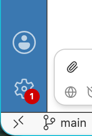
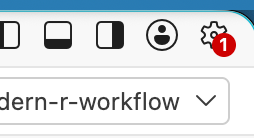

Please complete the following steps before the workshop so we can dive straight into the material.

You need:

* A laptop

* A recent version of Positron, preferably the latest release. Go here:

  - <https://positron.posit.co/download.html>
  - If you already have Positron, check for an update! A red badge on the gear icon (lower-left or upper-right, depending on your layout) means an update is available:

    ::: {layout-ncol="2"}
    

    
    :::

  - You can also check the application menu (e.g. on macOS, the **Positron** menu): if there's an option like "Restart to Update", choose it

    {width="60%"}

* A recent version of R (>= 4.2), but preferably the current version, which is R 4.6.1

    - <https://cloud.r-project.org/>
    - If you're updating R, consider using rig to do so: <https://rig.r-lib.org>. Then, in a terminal, do `rig add release`.

* Get your R installation ready for package development work. In R:

    - `install.packages("pak")`: [pak](https://pak.r-lib.org/) is our preferred way to install packages
    - `pak::pak("devtools")`: installs [devtools](https://devtools.r-lib.org/)
    pak::pak("devtools")
    - `pak::pak("devtools", upgrade = TRUE)`: more aggressive version of the above that brings all of devtools's dependencies up to their latest release
    - `devtools::dev_sitrep()`: gives a package development "situation report"

* Sign up for Posit AI Pass **using the same email address as your conf/workshop registration**. You can start a free trial and, **if your email matches what we have**, we can give you credits to use on the day of the workshop.

    - <https://posit.ai/>
    - Open [Posit Assistant](https://assistant.posit.co/) in Positron and sign in with your Posit AI Pass
    - Say "hi" to Posit Assistant to check that all is well. Expect a response along the lines "Hello, how can I help?".
    - If you need to use Posit AI Pass with a different email than your conf registration, ask a TA to help you sort this out.
    - The "Using Posit AI Pass token credits" section of the [Workshop Tech Setup](https://posit-workshop-setup.share.connect.posit.cloud/) is relevant to our workshop.

* Join us on Discord, our primary communication method during the workshop:

    - Join the posit::conf Discord server: [pos.it/joinconf26](https://pos.it/joinconf26); sign up for an account if you don't already have one
    - Set your display name to the one you used to register for the conference
    - In your "About me," put the name of the workshop you're enrolled in
    - Then head to the workshop channel: [#workshop-modern-r-workflow](https://discord.com/channels/1381993558437007490/1532807523524939927)

* Optional: Get the development version of [Posit Assistant](https://assistant.posit.co/) by pressing Cmd/Ctrl + Shift + P to open the command palette and run `Posit Assistant: Check for newer dev build`. Follow the prompts to restart Posit Assistant.

* Optional: We won't be teaching Git or GitHub, but you'll see us use them throughout the workshop. If you've been meaning to install Git or set up a GitHub account, now's a good time. [Happy Git with R](<https://happygitwithr.com/>) is a great resource for getting set up.
