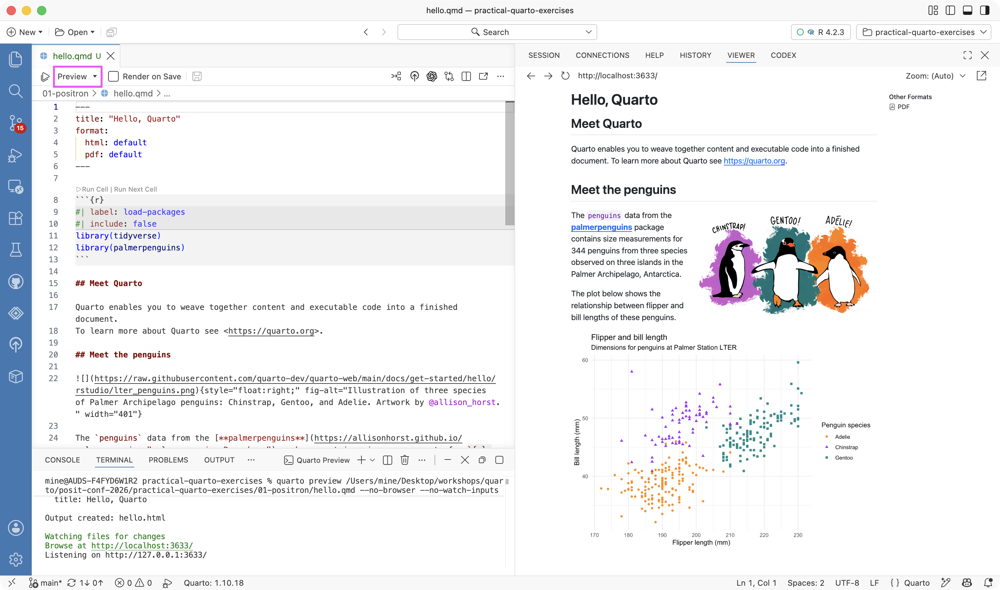
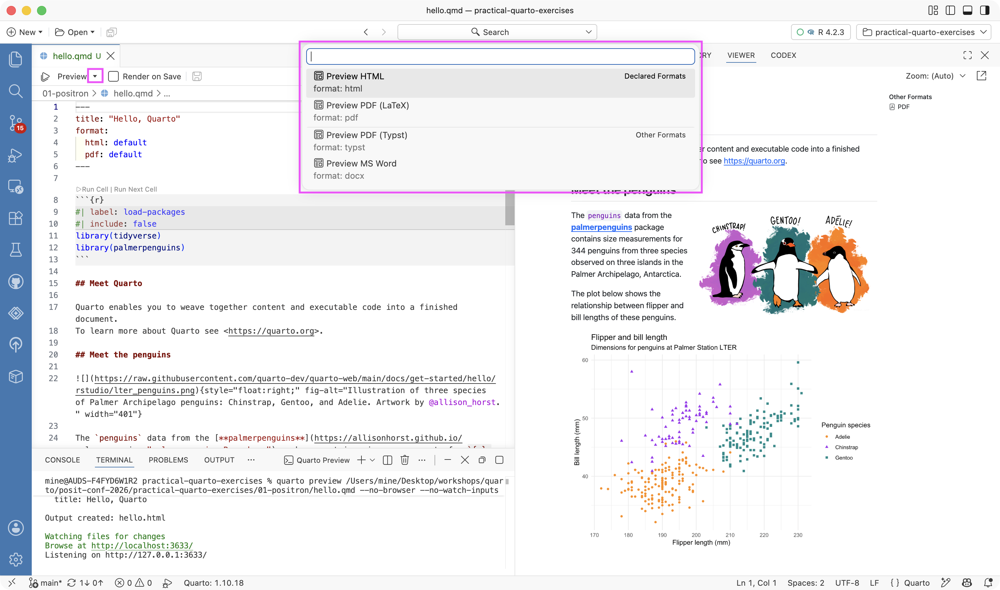
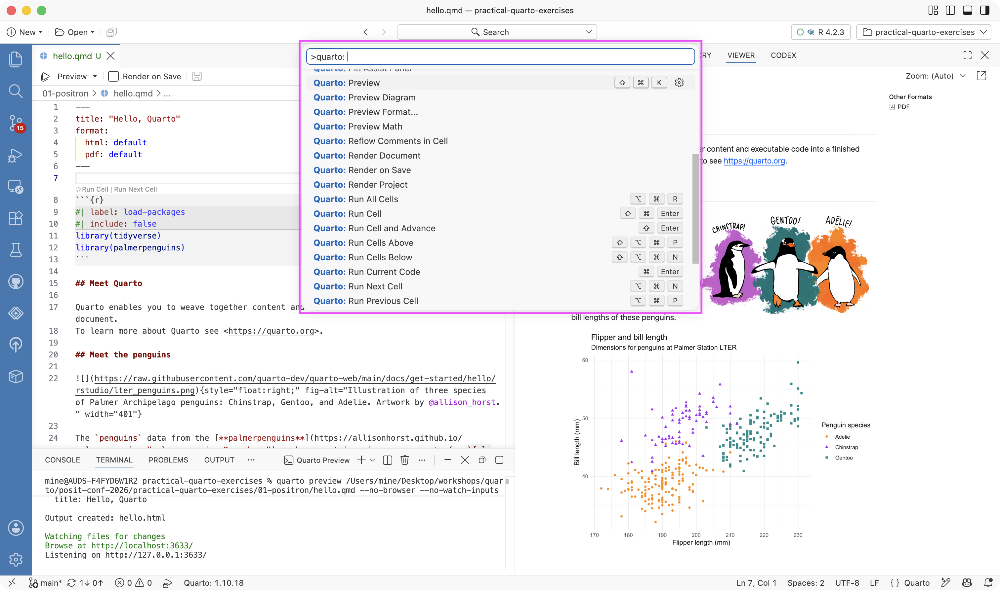
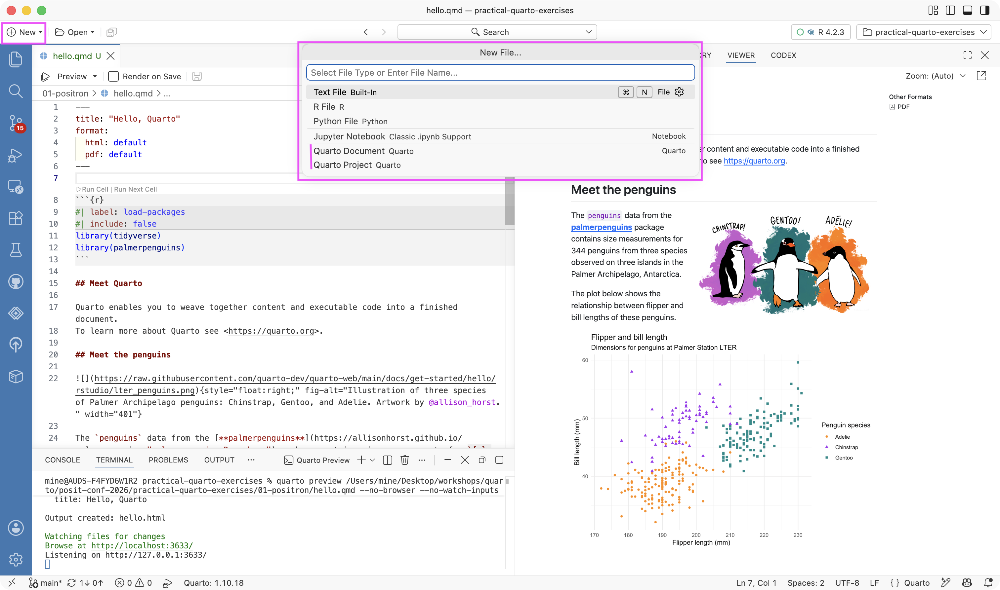
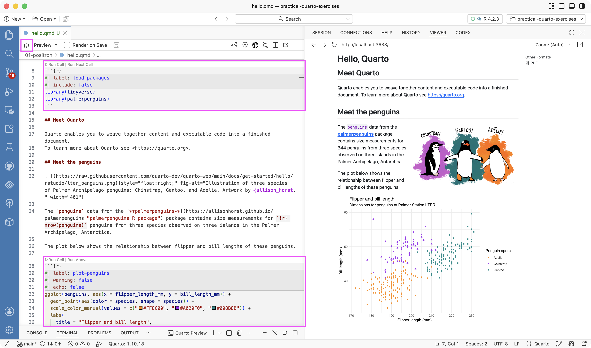
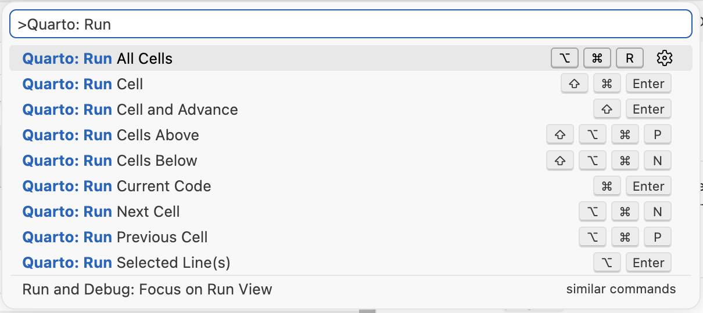
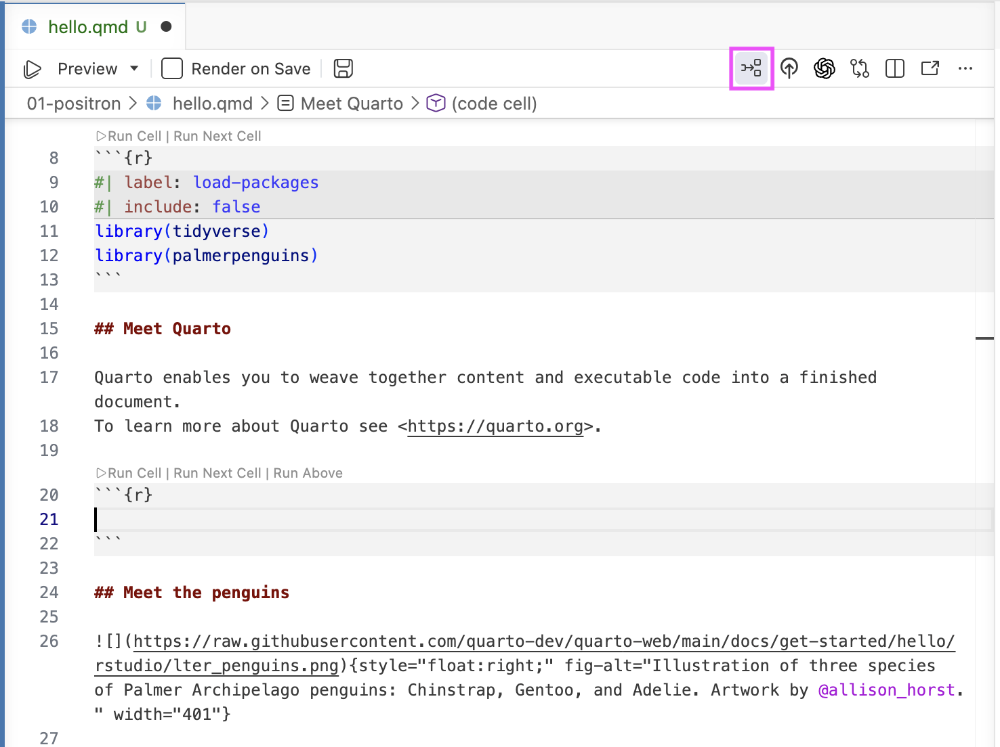
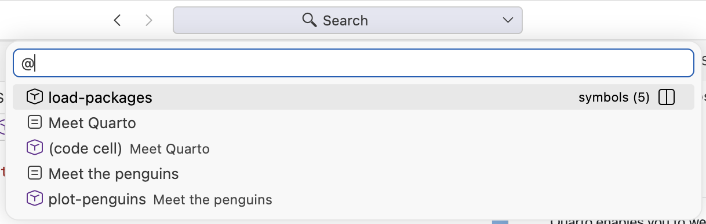

# Quarto + Positron

## Positron is Quarto-ready out of the box

::: {.columns}

::: {.column}

**Bundled Quarto CLI**

(or one it finds on your path)

= what you need to run `quarto` commands in the Terminal

:::

::: {.column}

**Quarto extension**

= provides the `Quarto: ...` commands and UI support

:::

:::

::: footer
Learn more: <https://quarto.org/docs/tools/positron>
:::

# Basic workflow

## Demo: basic workflow

1. Open `hello.qmd`

2. Click **Preview** (aka the Render button in RStudio)

3. Quarto commands are run in the **Terminal** pane

4. Rendered output opens in the **Viewer** pane

::: notes
Demo this live.
:::

## The Preview button {.smaller}

::: {.columns}

::: {.column width="65%"}

{.screenshot fig-alt="Positron with hello.qmd open in the editor, the Preview button in the editor toolbar, quarto preview running in the Terminal pane, and the rendered document in the Viewer pane."}

:::

::: {.column width="35%"}

::: {.incremental}

- **Preview** button in the editor toolbar

- Shortcut: `cmd/ctrl + shift + K` — same as Render in RStudio

- Quarto version in the status bar

- Runs `quarto preview` in the Terminal

- Opens the rendered document in the Viewer

:::

:::

:::

::: {.callout-tip .fragment}
Want a real browser instead? Set `quarto.render.previewType` to `external`.
:::

## Aside: Preferences in Positron {.smaller}

::: {.columns}

::: {.column width="40%"}

**In the UI**

- Command palette: `Preferences: Open User Settings` or `Preferences: Open Workspace Settings`

- Search by setting name, e.g. `quarto.render`

:::

::: {.column .fragment width="60%"}

**In JSON**

- Command palette: `Preferences: Open User Settings (JSON)` or `Preferences: Open Workspace Settings (JSON)`

- User settings stored at user level (outside of the workspace), specific location depends on OS:

  ::: {.small}
  - macOS: `~/Library/Application Support/Positron/User/settings.json`
  - Windows: `%APPDATA%\Positron\User\settings.json`
  - Linux: `~/.config/Positron/User/settings.json`
  :::

- Workspace settings in `.vscode/settings.json` in the workspace

:::

:::

::: footer
Learn more: <https://code.visualstudio.com/docs/configure/settings>
:::

## Aside: Preferences in Positron {.smaller}

::: incremental
- Any setting you change in the UI is written to the JSON

- **Workspace wins over User** — so a project can set its own rules, and `.vscode/settings.json` can be checked into Git for all collaborators.

- Settings can be scoped to a language, with a `"[quarto]": { ... }` block.

- Filter for **Modified** settings (`@modified`) to see settings you've changed.

- Right-clicking a setting offers **Copy Setting as JSON**.

- For RStudio switchers: <https://positron.posit.co/migrate-rstudio-settings-and-extensions.html> covers bringing RStudio settings and keybindings across.
:::

## Preview a specific format

::: {.columns}

::: {.column width="65%"}

{.screenshot fig-alt="The Preview button dropdown listing declared formats, Preview HTML and Preview PDF (LaTeX), and other formats, Preview PDF (Typst) and Preview MS Word."}

:::

::: {.column width="35%"}

- The Preview dropdown lists the formats declared in the document

- Command: `Quarto: Preview Format...`

:::

:::

## Everything is a command

::: {.columns}

::: {.column width="60%"}

{.screenshot fig-alt="The command palette filtered to Quarto:, showing commands including Preview Format, Clear Preview, Create Project, Edit in Visual Mode, Format Cell, Go to Next Cell, Insert Code Cell, New Document, and New Presentation."}

:::

::: {.column width="40%"}

- Filter the command palette with `Quarto:` to see the whole set

- `Quarto: Render Document` renders all declared formats

- `Quarto: Render Project` renders every file in the project

:::

:::

::: notes
Demo this live.
:::

## Render on Save {.smaller}

By default, saving does **not** re-render — renders can be slow.

Three ways to turn it on:

::: {.incremental}

1. The **Render on Save** checkbox in the editor toolbar:

   {.screenshot fig-alt="The editor toolbar showing the Preview button, the Render on Save checkbox, and a floppy disc icon for save."}

2. The setting `quarto.render.renderOnSave` — search `quarto.render` in Settings

3. Per document or project, in YAML — supersedes the setting:

   ```{.yaml filename="hello.qmd"}
   editor:
     render-on-save: true
   ```

:::

## Start a new document

::: {.columns}

::: {.column width="60%"}

{.screenshot fig-alt="The New File dialog in Positron with file type options including Quarto Document and Quarto Project."}

:::

::: {.column width="40%"}

**File > New File...** then **Quarto Document**

or the command palette:

{.screenshot fig-alt="The command palette filtered to Quarto: New, showing Quarto: New Document, New Notebook, and New Presentation."}

:::

:::

# Document workflow

## Demo: document workflow

- **Code cells:** the actions above each cell, the `Quarto: Run ...` commands, output in the Console or inline

- **Navigation:** Breadcrumbs, Outline pane, Go to Symbol in Editor

::: notes
Demo each live, then walk through the screenshots.
:::

## Code cells

::: {.columns}

::: {.column width="60%"}

{.screenshot fig-alt="A Quarto document in the Positron editor with Run Cell and Run Next Cell actions above a code cell."}

:::

::: {.column width="40%"}

- **Run Cell | Run Next Cell** actions above each cell

- Run selection: `cmd/ctrl + enter`

- Run cell: `shift + cmd/ctrl + enter`

- Run all cells: `opt/alt + cmd/ctrl + R`

:::

:::

## Code cells, from the command palette

{.screenshot fig-alt="The command palette filtered to Quarto Run, showing Quarto: Run All Cells, Run Cell, Run Cell and Advance, Run Cells Above, Run Cells Below, Run Current Code, Run Next Cell, Run Previous Cell, and Run Selected Lines, with their keyboard shortcuts."}

## Inline output

Output from code cells, in the editor, next to the code that made it — the `.Rmd` experience RStudio users are used to.

::: {.incremental}

- Off by default: turn on `quarto.inlineOutput.enabled`

- Each `.qmd` gets its **own isolated R or Python session**

- Paths behave like they do at render time — no more "works in the console, breaks on render"

- Want a console alongside it? `Console: Show Notebook Console`, or set `console.showNotebookConsoles`

:::

::: footer
Learn more: <https://positron.posit.co/quarto-inline-output.html>
:::

::: notes
The isolated session is the part worth dwelling on: cells run in a kernel scoped to that document, with the document's directory as the working directory.
That is the same contract `quarto render` gives you, which is why the "it worked interactively" class of bug mostly goes away.

Trade-off to name out loud: it is a different mental model from one shared Console for everything.
If someone leans on objects created in the Console, inline output will feel like it took something away.
:::

## Your turn 1: Enable inline output

::: exercise-folder
[Exercise](https://github.com/posit-conf-2026/practical-quarto-exercises): `01-positron`
:::

::: your-turn
Enable inline output for `hello.qmd` and run the code cells one at a time and then all at once.

**Optional:** Go to settings and turn on `Console: Show Notebook Console`.
:::



## Insert a code cell

::: {.columns}

::: {.column width="55%"}

{.screenshot fig-alt="A new untitled Quarto document with the Insert Code Cell button in the editor toolbar."}

:::

::: {.column width="45%"}

- **Insert Code Cell** in the editor toolbar

- Shortcut: `shift + cmd/ctrl + I`

- Command: `Quarto: Insert Code Cell`

:::

:::

## Navigation

::: {.columns}

::: {.column width="65%"}

{.screenshot fig-alt="Positron with the breadcrumbs dropdown showing the document sections and the Outline pane listing load-packages, Meet Quarto, Meet the penguins, and plot-penguins."}

:::

::: {.column width="35%"}

- **Breadcrumbs** at the top of the editor

- **Outline** pane in the sidebar

- **Go to Symbol in Editor**: `cmd/ctrl + shift + O`, or type `@` in the command palette

:::

:::

## Go to Symbol in Editor

{.screenshot fig-alt="The Go to Symbol in Editor quick pick listing the symbols in the document: load-packages, Meet Quarto, Meet the penguins, and plot-penguins."}

::: notes
Headings and labelled cells both show up as symbols — one more reason to label your cells.
:::

## Editing assistance {.smaller}

::: incremental

- **YAML intelligence:** Completion for YAML options, red squiggles for invalid ones on save.
  - Works in the front matter, in `_quarto.yml`, and in cell options; the diagnostics fire when the document is saved.

- **Help pane:** Hover for tooltips, `F1` opens full help for the function under the cursor.

- **Live preview:** LaTeX math and Mermaid/Graphviz diagrams preview as you type (`cmd/ctrl + shift + L`).
  - `Quarto: Show Assist Panel` opens a sidebar panel that shows an image thumbnail when the cursor is on an image path, and a live equation preview when editing LaTeX math.

- **Snippets:** `Insert Snippet` for boilerplate: code blocks, callouts, divs.
  - Snippets only show up in IntelliSense if `editor.snippetSuggestions` is set to something other than `none`.
  - The `Insert Snippet` command works either way.

:::

# Settings worth adopting

## Settings worth adopting {.smaller}

```{.json filename="settings.json"}
{
    "[quarto]": {
        "editor.formatOnSave": true,
        "editor.defaultFormatter": "quarto.quarto",
        "editor.wordWrap": "on",
        "editor.guides.bracketPairs": "active",
        "editor.language.brackets": [[":::", ":::"]],
        "editor.language.colorizedBracketPairs": [[":::", ":::"]]
    },
    "editor.rulers": [80, { "color": "#b22222", "column": 120 }],
    "files.watcherExclude": { "**/.quarto/**": true },
    "search.exclude": { "**/.quarto": true, "**/_freeze": true }
}
```

::: aside
Adapted from: CANOUIL, M. (2025-11-20). Optimising VS Code and Positron for Quarto: Essential Settings for Better Editing. Mickael.canouil.fr. <https://mickael.canouil.fr/posts/2025-11-20-quarto-editor-settings> (CC BY-NC-SA 4.0)
:::

## Formatting

```{.json filename="settings.json" code-line-numbers="2-4,9"}
{
    "[quarto]": {
        "editor.formatOnSave": true,
        "editor.defaultFormatter": "quarto.quarto",
        "editor.wordWrap": "on",
        "editor.guides.bracketPairs": "active",
        "editor.language.brackets": [[":::", ":::"]],
        "editor.language.colorizedBracketPairs": [[":::", ":::"]]
    },
    "editor.rulers": [80, { "color": "#b22222", "column": 120 }],
    "files.watcherExclude": { "**/.quarto/**": true },
    "search.exclude": { "**/.quarto": true, "**/_freeze": true }
}
```

## Word wrap

Long lines wrap -- recommend breaking at sentences:

```{.json filename="settings.json" code-line-numbers="2,5,9"}
{
    "[quarto]": {
        "editor.formatOnSave": true,
        "editor.defaultFormatter": "quarto.quarto",
        "editor.wordWrap": "on",
        "editor.guides.bracketPairs": "active",
        "editor.language.brackets": [[":::", ":::"]],
        "editor.language.colorizedBracketPairs": [[":::", ":::"]]
    },
    "editor.rulers": [80, { "color": "#b22222", "column": 120 }],
    "files.watcherExclude": { "**/.quarto/**": true },
    "search.exclude": { "**/.quarto": true, "**/_freeze": true }
}
```

## Rulers {.smaller}

Rulers at 80 and 120 as visual guides:

```{.json filename="settings.json" code-line-numbers="10"}
{
    "[quarto]": {
        "editor.formatOnSave": true,
        "editor.defaultFormatter": "quarto.quarto",
        "editor.wordWrap": "on",
        "editor.guides.bracketPairs": "active",
        "editor.language.brackets": [[":::", ":::"]],
        "editor.language.colorizedBracketPairs": [[":::", ":::"]]
    },
    "editor.rulers": [80, { "color": "#b22222", "column": 120 }],
    "files.watcherExclude": { "**/.quarto/**": true },
    "search.exclude": { "**/.quarto": true, "**/_freeze": true }
}
```

## Bracket pairs

Fold and color-match fenced divs:

```{.json filename="settings.json" code-line-numbers="2,6-8,9"}
{
    "[quarto]": {
        "editor.formatOnSave": true,
        "editor.defaultFormatter": "quarto.quarto",
        "editor.wordWrap": "on",
        "editor.guides.bracketPairs": "active",
        "editor.language.brackets": [[":::", ":::"]],
        "editor.language.colorizedBracketPairs": [[":::", ":::"]]
    },
    "editor.rulers": [80, { "color": "#b22222", "column": 120 }],
    "files.watcherExclude": { "**/.quarto/**": true },
    "search.exclude": { "**/.quarto": true, "**/_freeze": true }
}
```

## Exclude {.smaller}

Exclude files in `.quarto/` and `_freeze/` from search and file watching to gain speed, especially helpful in big projects:

```{.json filename="settings.json" code-line-numbers="11-12"}
{
    "[quarto]": {
        "editor.formatOnSave": true,
        "editor.defaultFormatter": "quarto.quarto",
        "editor.wordWrap": "on",
        "editor.guides.bracketPairs": "active",
        "editor.language.brackets": [[":::", ":::"]],
        "editor.language.colorizedBracketPairs": [[":::", ":::"]]
    },
    "editor.rulers": [80, { "color": "#b22222", "column": 120 }],
    "files.watcherExclude": { "**/.quarto/**": true },
    "search.exclude": { "**/.quarto": true, "**/_freeze": true }
}
```

## Your turn 2: Adopt the recommended settings

::: exercise-folder
[Exercise](https://github.com/posit-conf-2026/practical-quarto-exercises): `01-positron`
:::

::: your-turn
Grab the recommended settings from `settings-worth-adopting.txt` and add them to your workspace or user settings.

Access these settings via the command palette: `Preferences: Open User Settings (JSON)` or `Preferences: Open Workspace Settings (JSON)`.
:::



# Coming from RStudio

## What's different? {.smaller}

::: {.incremental}

- **Publishing**: no button in the editor toolbar, but the pre-installed [Posit Publisher extension](https://positron.posit.co/publish-to-connect.html) deploys to Connect and Connect Cloud in one click — no shinyapps.io, RPubs, or Quarto Pub.

- **Inline output**: off by default, and each document gets its own session, we already saw how to turn it on.

- **R Markdown:**
  - R Markdown (`.Rmd`) files preview with Quarto by default.
  - `R: Render Document With R Markdown` renders with `rmarkdown` instead.
  - `R: New R Markdown from Template` starts from a template.
  - Advanced `.Rmd` features like `params` have no interactive support

:::

::: footer
Learn more: <https://positron.posit.co/quarto.html>
:::

## Updating Quarto {.smaller}

::: {.columns}

::: {.column}

**Strategy 1: Rely entirely on Positron's bundled Quarto**

- Get updates as Positron is updated (with auto-update on)

- Currently, no easy way to use this version outside of Positron

:::

::: {.column}

**Strategy 2: Manage Quarto manually from [quarto.org](https://quarto.org/docs/download/)**

- Positron will prefer this install, even if it's older

- You can specify a path with the `quarto.path` setting

:::

:::

Either way: the status bar tells you which one won, and changing `quarto.path` takes a restart.

# Formatting with Air

## Demo: formatting with Air

1. Open `hello.qmd` and mangle an R cell — odd spacing, one long pipe chain

2. Fix it once: `Quarto: Format Cell`

3. Turn on format on save: `Air: Initialize Workspace Folder`

4. Mangle the cell again, save, watch it snap back

::: notes
Demo this live.

Point out that formatting only touches code cells — prose and YAML are left alone.
The format-on-save setup lands in `.vscode/settings.json`; the last slide of this section shows exactly what was written.
:::

## Air: an R code formatter

::: {.incremental}

- An extremely fast R code formatter, from Posit

- Ships with Positron — nothing to install, nothing to update

- Formats R code in `.R` files, and R cells in `.qmd` files when the Quarto extension is active

:::

::: footer
Learn more: <https://posit-dev.github.io/air>
:::

::: notes
Same idea as `usethis::use_tidy_style()`, but automatic and instantaneous.

Air itself is R-only.
But note what format-on-save actually does in a `.qmd`: the Quarto formatter takes the save and dispatches cell by cell to whatever formatter is registered for that language — Air for R, Ruff for Python.
So "Air formats my document" is shorthand; the honest version is "Quarto routes each cell to its language's formatter, and Air is the R one."
:::

## Air in a Quarto document

::: {.columns}

::: {.column}

**Format once:**

- Command: `Quarto: Format Cell` — formats the cell the cursor is in

- Or format just a selection: `cmd/ctrl + K`, then `cmd/ctrl + F`

:::

::: {.column}

**Format on save:**

- Command: `Air: Initialize Workspace Folder`

- Writes `.vscode/settings.json` and `air.toml` — check them in so all collaborators get the same setup

:::

:::

## What format on save looks like

```{.json filename=".vscode/settings.json"}
{
  "[r]": {
    "editor.formatOnSave": true,
    "editor.defaultFormatter": "Posit.air-vscode"
  },
  "[quarto]": {
    "editor.formatOnSave": true,
    "editor.defaultFormatter": "quarto.quarto"
  }
}
```

::: notes
This is what `Air: Initialize Workspace Folder` writes for you.
The `[quarto]` block is the piece that makes it apply to R cells in `.qmd` files.
:::

## Your turn 3: Format with Air

::: exercise-folder
[Exercise](https://github.com/posit-conf-2026/practical-quarto-exercises): `01-positron`
:::

::: your-turn
1. Open `hello.qmd` and mangle an R cell — odd spacing, one long pipe chain

2. Fix it once: `Quarto: Format Cell`

3. Turn on format on save: `Air: Initialize Workspace Folder`

4. Mangle the cell again, save, watch it snap back

5. Inspect the `.vscode/settings.json` and `air.toml` files that were written
:::



# LLM assistance

## Your turn 4: Posit Assistant {.smaller}

::: exercise-folder
[Exercise](https://github.com/posit-conf-2026/practical-quarto-exercises): `01-positron`
:::

::: your-turn
1. Open the Posit Assistant pane in the sidebar, log in with the email address you registered for the conference

2. Ask it to explain the `plot-penguins` cell in `hello.qmd` — it can see the open document and the session

3. Ask it to write alt text for the penguins plot, then paste the result into `fig-alt`

4. Run `/report` to export the conversation as a `.qmd`

5. Read it, check it's accurate, *then* keep it
:::



## Posit Assistant

AI assistance built into Positron, aware of your R/Python session:

::: {.incremental}

- **Chat** in the sidebar — sees your console, variables, and files, and can edit the open document

- **Inline completions** as you type — needs a Posit AI Pass or a Copilot sign-in

- **`/report`** turns the conversation into a reproducible `.qmd`

- **Fix** and **Explain** buttons on error output

:::

::: footer
Learn more: <https://assistant.posit.co/docs/getting-started>
:::

## Practical, deliberate uses in a Quarto workflow {.smaller}

::: {.columns}

::: {.column}

**Good fits:**

- Draft and revise prose; tighten wording

- Write alt text for figures

- Explain or debug a code cell; interpret an error message

- Fix YAML indentation and option typos

:::

::: {.column}

**Your job, not its job:**

- Review every word before finalizing

- Run every line of code it writes

- Check every factual claim

- Keep secrets and credentials out of prompts

:::

:::

# Wrap-up

## Learn more {.smaller}

- [Quarto docs: Guide > Tools > Positron](https://quarto.org/docs/tools/positron/) — the Positron-specific Quarto features

- [Positron docs: Quarto](https://positron.posit.co/quarto.html) — `quarto.path`, rendering `.Rmd` files with {rmarkdown}

- [Positron docs: inline output](https://positron.posit.co/quarto-inline-output.html) — per-document sessions, output in the editor

- [Formatting R code with Air](https://positron.posit.co/guide-r-air.html) — setup, format on save, `air.toml`

- [Posit Assistant docs](https://assistant.posit.co/docs/getting-started/) and the [AI + Quarto tutorial](https://positron.posit.co/tutorial-ai-quarto.html)

# Questions?
