# Templates and template partials

## What is a template?

You write a document.

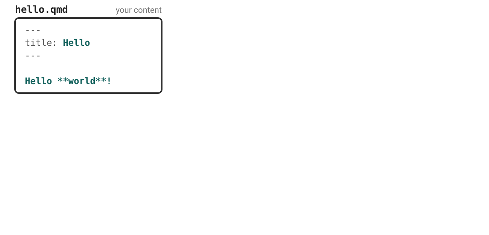{fig-alt="One box, labelled hello.qmd, your content, holding a short Quarto document: a YAML header setting title to Hello, then the line Hello asterisk asterisk world asterisk asterisk exclamation mark. The value Hello and the body line are teal."}

::: notes
Title in the YAML, one line of markdown.

Teal is yours. 
:::

## What is a template? {visibility="uncounted"}

Render it, and you get an HTML document.

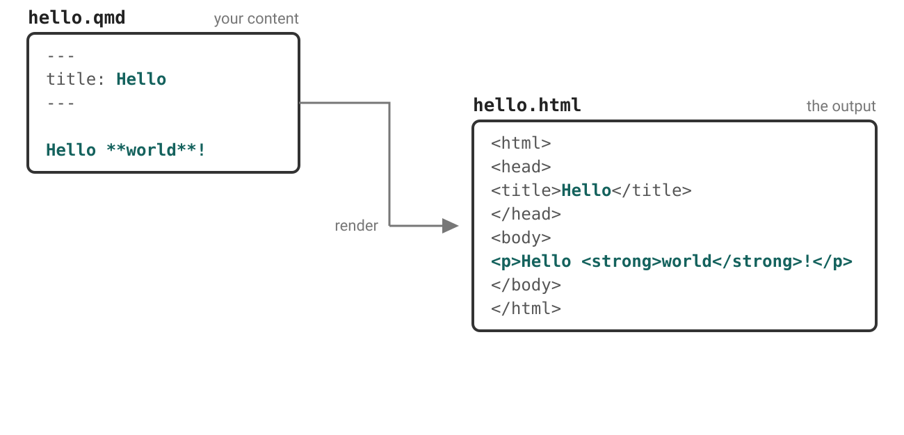{fig-alt="The document on the left, with a connector stepping down from it, labelled render, arrowing into hello.html on the right: a full HTML page of which only two parts are teal, Hello inside the title element and a paragraph reading Hello world. Everything else is grey, and nothing yet explains where it came from."}

::: notes
Only the teal came from the document. Where does the other stuff come from?
:::

## What is a template? {visibility="uncounted"}

A **template**: boilerplate, with named holes.

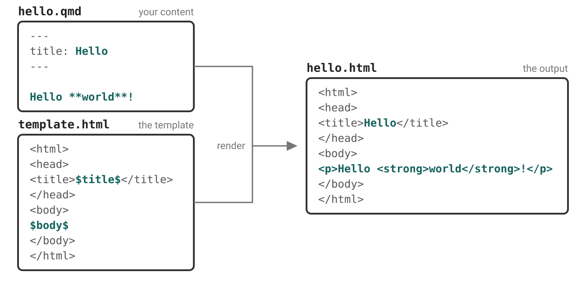{fig-alt="The same figure with template.html revealed below the document, its connector joining the render line. The template is HTML boilerplate with two teal placeholders, dollar title dollar inside the title element and dollar body dollar inside the body. They line up with the two teal parts of the output, and the grey boilerplate lines up with the grey output."}

::: notes
The template provides the boilerplate: with named holes for your content.
E.g. `$title$` takes a value from the YAML **by name**. — the mechanism
the next hour rests on. 

Notice `$body$` is your content translated.  Pandoc did that.
:::

## What is a partial?

Part of the template renders the title block.

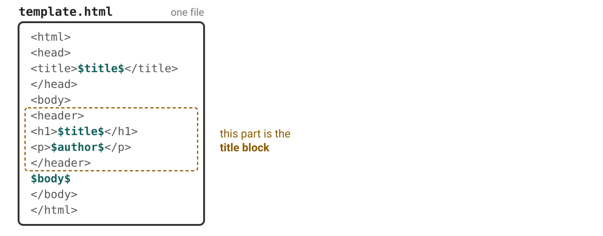{fig-alt="A box labelled template.html, one file, holding a small but complete HTML template: html, head, a title element with the teal dollar title dollar, then a body containing a header element with an h1 of dollar title dollar and a paragraph of dollar author dollar, then dollar body dollar. The header element and its two indented lines are ringed in an amber dashed box, annotated: this part is the title block."}

::: notes
Same file as the previous slide, grown a little.

There's a chunk that has one job, make the title block.
:::

## What is a partial? {visibility="uncounted"}

Pull it out into its own file, now its a **partial**.

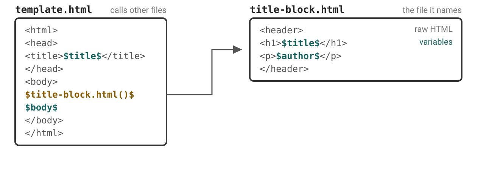{fig-alt="The same template.html box, with the header markup gone and the amber call dollar title-block dot html parens dollar in its place. A connector runs from that call to a new box on the right, labelled title-block.html, the file it names, holding the header element with an h1 of the teal dollar title dollar and a paragraph of the teal dollar author dollar. Its tags are annotated raw HTML and its placeholders annotated variables."}

::: notes
That gets pulled out into it's own file and referenced in the template. It's called a partial, and inside looks just like a template, HTML boilerplate with holes for content.
:::

## What is a partial? {visibility="uncounted"}

Quarto does this for many parts of the page.

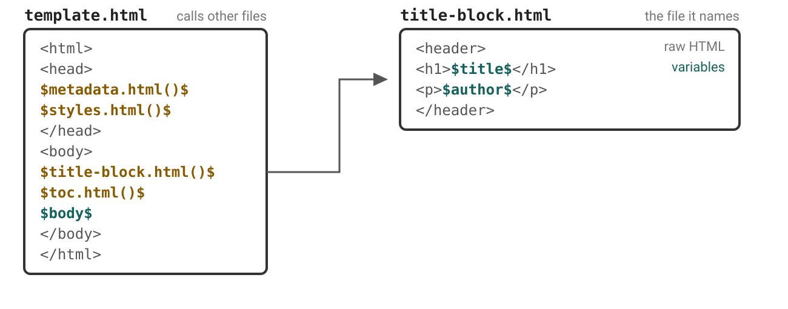{fig-alt="The same figure, with the rest of the template also replaced by amber calls: dollar metadata dot html parens dollar and dollar styles dot html parens dollar in the head, and dollar toc dot html parens dollar beside the title-block call in the body. Only dollar body dollar, in teal, and the literal html, head and body tags remain."}

::: notes
Same thing happens with other parts of the document: metadata, styles, etc.
:::

## What is a partial? {visibility="uncounted"}

Replace a partial without touching the rest of the template

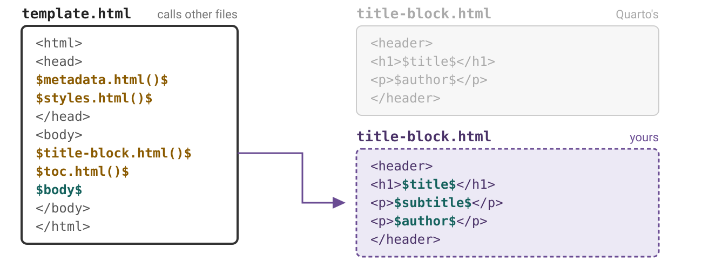{fig-alt="The same figure with Quarto's title-block.html box faded to grey and a second box below it drawn with a purple dashed border, labelled title-block.html, yours. It holds the same header element plus an extra paragraph containing the teal dollar subtitle dollar. The connector from the call now points at your box."}

::: notes
Partition allows you to override a partial without touching the rest of the template. 
That's what we'll do today.
:::

# Case study

The **Bureau of Regional Statistics** publishes a quarterly release as a
standalone HTML file.

## Every release must carry:

::: {.incremental}
- the agency masthead
- the reference period and the region
- the release status — Provisional, Revised, or Final
:::

::: {.fragment}
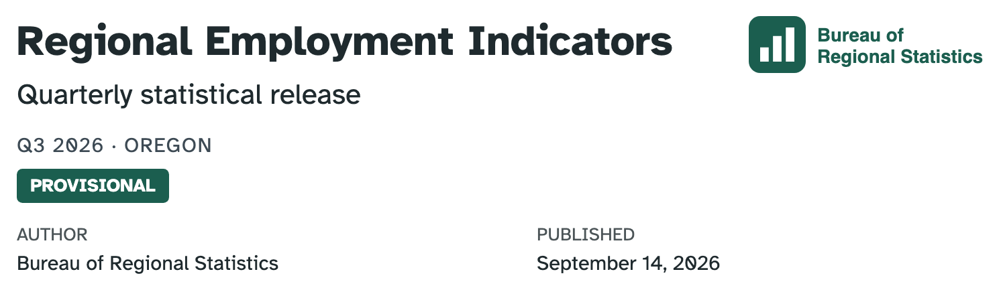{.screenshot fig-alt="The finished title block. The agency logo and wordmark sit at the top right. Regional Employment Indicators is large and bold at the left, with the subtitle Quarterly statistical release beneath it. Below that, in small grey letter-spaced capitals, Q3 2026 dot OREGON. Under that a dark green rectangular badge reads PROVISIONAL in white capitals. Author and Published run along the bottom in two columns."}
:::

::: notes
**this is a publishing requirement, not a design preference.** 

The same shape applies to any organization's report template: fields that must appear on every document.
:::


## Setup: replace the partial

::: {.example-folder}
(Optional) Follow along: `03-partials/00-setup`
:::

1. Pull the brand:

   ```{.bash .wrap}
   quarto use brand posit-conf-2026/practical-quarto-exercises/brs-brand
   ```

2. Copy [`templates/title-block.html`](https://github.com/quarto-dev/quarto-cli/blob/main/src/resources/formats/html/templates/title-block.html)
   into the folder.

3. Register it:

   ```{.yaml filename="report.qmd"}
   format:
     html:
       template-partials:
         - title-block.html
   ```

::: notes
Render before adding partial. Add partial. Render. Nothing changes.

Add something obvious to check its wired up.

Point out `$title$`. Dollar signs indicate Pandoc template syntax. Can access metadata values.

Notice brand has `logo`, but standalone HTML docs don't get logo.
:::

## Our starting point

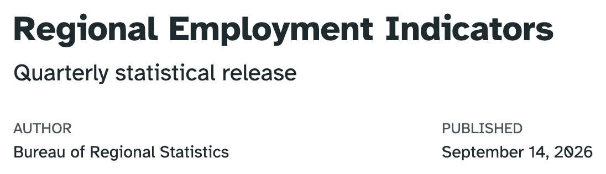{.screenshot fig-alt="The title block after the setup demo. Regional Employment Indicators in large bold type, the subtitle Quarterly statistical release below it, then Author, Bureau of Regional Statistics, and Published, September 14 2026, in two columns. No logo, no reference period, no status."}

::: notes
The partial is theirs now and the page is unchanged by it.
:::

## Your turn 1: add the masthead

::: your-turn

1. Add a `masthead` key to the YAML of `report.qmd`:

   ```yaml
   masthead: _brand/brs-logo.svg
   ```

2. Add this line to `title-block.html`, right after `<header ...>`:

   ```{.html .wrap}
   
   ```

3. Render.

4. Challenge: Provide the `alt` text via metadata too.
:::

::: exercise-folder
[Exercise](https://github.com/posit-conf-2026/practical-quarto-exercises): `03-partials/01-masthead`
:::



::: notes
Touch on review:

- `$variable$` substitutes a value
- Any YAML key becomes a template variable. `masthead` is *your* key. Quarto has
  no `masthead` option and never reads it.
:::

## 

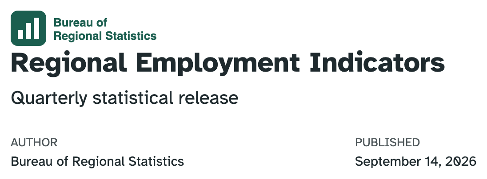{.screenshot fig-alt="The same title block with the agency logo and wordmark now added above the title, at full size on the left. Below it, Regional Employment Indicators, the subtitle, and the Author and Published columns."}

::: notes
Resist fixing styling ...
:::

## Pandoc template syntax {.smaller}

Write in the format you are targeting: HTML here

Anything inside `$...$` or `${...}` is Pandoc's template syntax. 

| Write | Get |
|---|---|
| `$title$` | the value of the `title` metadata key |
| `$brs-release.period$` | reach into nested metadata with a dot |
| `$title-block.html()$` | include a partial — the `()` mean a *file* |

[Pandoc's template syntax →](https://pandoc.org/MANUAL.html#template-syntax)

::: notes
The distinction that matters today: `$name$` substitutes a **value**,
`$name.html()$` includes a **file**. Only the second is replaceable through
`template-partials`.

`$title$s` works, but `${title}s` is clearer — both give `Hellos`. The two
forms are interchangeable everywhere, including partial calls and
`${if(x)}…${endif}`.

`$$` matters the moment a partial contains a literal dollar — a price, or
`$(...)` in a script.

Conditionals and loops are on the same page of the manual. We meet them in
turns 3 and 4.
:::

## Your turn 2: add period and region

Already in your YAML, and shown by nothing:

```{.yaml filename="report.qmd"}
brs-release:
  period: "Q3 2026"
  region: Oregon
```

::: your-turn

1. Copy, then complete, this line to `title-block.html`, below the subtitle's `$endif$`:

   ```html
   <p class="report-period">______ &middot; ______</p>
   ```

2. Render. What happens when you remove `brs-release` from `report.qmd`?

:::

::: exercise-folder
[Exercise](https://github.com/posit-conf-2026/practical-quarto-exercises): `03-partials/02-period-and-region`
:::



::: notes
After: delete `region:` and render. A separator with nothing after it — the
bridge to turn 3.
:::

## 

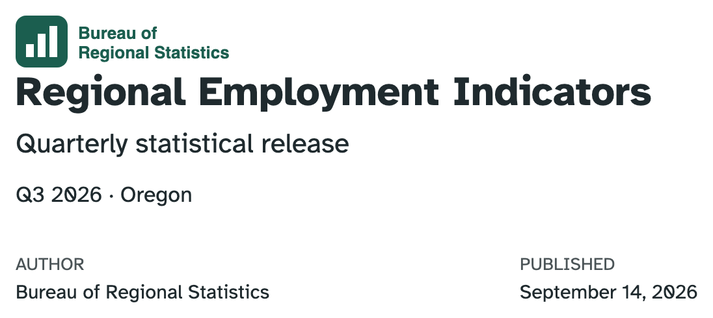{.screenshot fig-alt="The title block with a new line reading Q3 2026 dot Oregon added below the subtitle, in the same size and colour as body text."}

::: notes
`Q3 2026 · Oregon`, rendered exactly as written — unlike the date above it,
which Quarto reformatted before the template ever saw it.
:::

## Your own metadata, your own namespace

```{.wrap .yaml filename="report.qmd"}
masthead: _brand/brs-logo.svg   # our name at the top level
brs-release:                    # our name with names inside
  period: "Q3 2026"
  region: Oregon
```

::: {.fragment}
Every top-level name you invent is a bet that Quarto will never claim it.
:::

::: {.fragment}
Nest, and you place that bet **once** instead of once per field.
:::

::: notes
The obvious name is `logo`. It's taken — a real Quarto option in beamer,
revealjs, typst and dashboards, free in `format: html` only.

Render this same file to typst with `logo:` set and Quarto puts the image in
the page background itself. Module 04 picks this up.

`masthead` is safe. Nesting means you don't have to know which names are.
:::

## Condition markup on presence

```{.html filename="title-block.html"}
$if(subtitle)$
<p class="subtitle lead">$subtitle$</p>
$endif$
```

::: {.fragment}
Read as **if `subtitle` has a value, then...**. 
:::

::: {.fragment}
Prevents empty `<p></p>` in the document.
:::

::: notes
They've been rendering this since setup without reading it.

Pandoc has no comparison operator. `$if(x)$` asks "does this have a value?" and
nothing else — which is why a default has to live in the template.
:::


## Your turn 3: add status

::: your-turn

1. Add `status: Provisional` under `brs-release:` in `report.qmd`.

2. In `title-block.html`, below the reference period, show the status in a
   `<span class="report-status">` — but only when `brs-release.status` is set.

3. Render. Then delete the `status:` line and render again — the badge should
   disappear, leaving nothing behind.

:::

::: exercise-folder
[Exercise](https://github.com/posit-conf-2026/practical-quarto-exercises): `03-partials/03-release-status`
:::



::: notes
No snippet, so the work is reading their own file and adapting it.

The assistant is a sanctioned escape hatch here.

After: `status` nests under `brs-release:` — the turn 2 rule, applied unprompted.
The badge is unstyled and looks like nothing, which is the cue for turn 4.
:::

## 

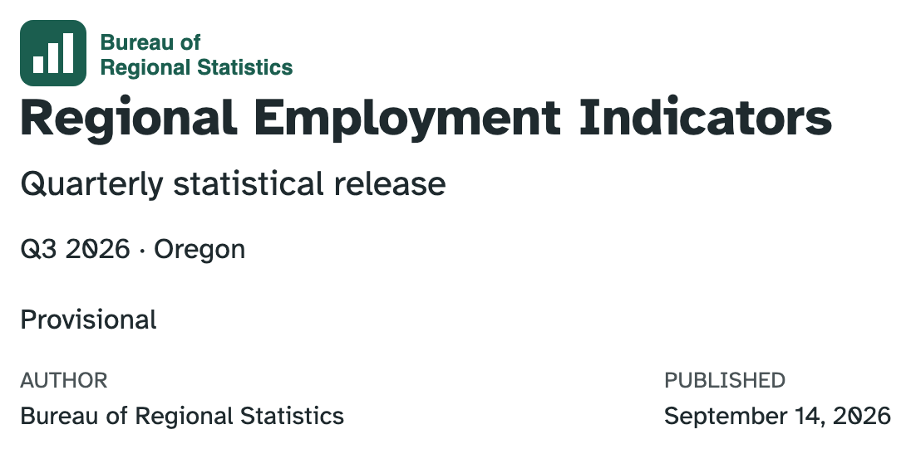{.screenshot fig-alt="The title block with the word Provisional added below the reference period line, in plain body text with no styling."}

::: notes
Provisional as plain text. It carries the right information and reads like
nothing, which is exactly the setup for turn 4: three classes in the markup,
still no CSS.
:::

## More Pandoc template syntax {.smaller}

| Write | Get |
|---|---|
| `$if(x)$` … `$else$` … `$endif$` | conditionals |
| `$for(x)$` … `$endfor$` | loop over an array |
| `$sep$` | inside a loop: emitted **between** items, never after the last |
| `${x/uppercase}` | a pipe — also `lowercase`, `length`, `reverse`, `nowrap`, … |
| `$--` | a comment, to the end of the line |

[Pandoc's template syntax →](https://pandoc.org/MANUAL.html#template-syntax)

::: notes
A signpost, not a lesson. You have met `$if$`; the rest is "this exists, the
manual has it".

`$sep$` is worth ten seconds: a separator that knows it is between things.
:::

## For HTML: styling lives outside the partials

```{.html filename="title-block.html"}
<span class="report-status">$brs-release.status$</span>
```

::: {.fragment}
No color. No size. No position. Just a `class`.
:::


::: {.fragment}
Style using SCSS:
```{.scss filename="custom.scss"}
/*-- scss:rules --*/
.report-status { background-color: $primary; }
```
:::

::: {.fragment}
Three classes:`report-masthead`,`report-period`, `report-status`. 
:::

::: notes
A partial decides *what* appears and in what order. A stylesheet decides what
it looks like. Cross that line and nobody can restyle your template.

This is why the snippets shipped with class names already in them.
:::

## Your turn 4: style what you built {.smaller}

::: your-turn

**Don't edit `title-block.html`.**

1. Ask Posit Assistant to style your title block. Start with the prompt below then describe what you want.

2. Render. Not what you asked for? Say what is wrong and go again.

3. Skim `custom.scss`. Change one of the brand variables used and render again.

:::

Example prompt:
```{.markdown .wrap}
I'm in @03-partials/04-style. Write SCSS to style my title block. Use our brand variables ($primary, $secondary, $brand-forest, $text-muted) and never a hard-coded color.
```

::: exercise-folder
[Exercise](https://github.com/posit-conf-2026/practical-quarto-exercises): `03-partials/04-style`
:::



## One answer {.scrollable}

::: {.panel-tabset}

### Result

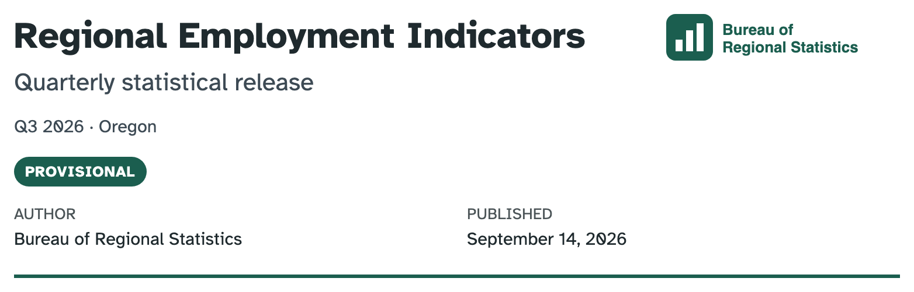{.screenshot fig-alt="The finished title block. The agency logo and wordmark sit at the top right. The title Regional Employment Indicators is large and bold at the left, the subtitle Quarterly statistical release below it in muted slate, then the reference period Q3 2026 dot Oregon in small grey text. Below that a dark green rounded pill reads PROVISIONAL in white capitals. Author and Published run underneath in two columns, and a dark green rule closes the block."}

### The prompt

```{.markdown .wrap}
I'm in @03-partials/04-style. Write SCSS to style my title block. Use our brand variables ($primary, $secondary, $brand-forest, $text-muted) and never a hard-coded color.

I want the masthead on the right, and the status styled like a badge.
```

### `custom.scss`

```{.wrap .scss}
/*-- scss:rules --*/

// Accent rule under the whole masthead block.
#title-block-header {
  border-bottom: 3px solid $primary;
  padding-bottom: 1rem;
  margin-bottom: 1.5rem;
  // Clear the floated masthead so the description/metadata sit below.
  overflow: hidden;
}

// Logo floats to the right of the title text.
.report-masthead {
  float: right;
  width: auto;
  max-height: 4rem;
  margin-left: 1.5rem;
}

.subtitle {
  color: $secondary;
}

// Release period reads as secondary metadata.
.report-period {
  color: $text-muted;
  font-size: 0.9rem;
  margin-bottom: 0.75rem;
}

// Status pill. color-contrast() picks a readable foreground from the
// brand background instead of hard-coding black or white.
.report-status {
  display: inline-block;
  padding: 0.25em 0.75em;
  border-radius: 999px;
  background-color: $brand-forest;
  color: color-contrast($brand-forest);
  font-size: 0.75rem;
  font-weight: 600;
  letter-spacing: 0.05em;
  text-transform: uppercase;
}
```

:::

::: notes
It styled `#title-block-header` and `.subtitle` which I didn't ask for.
:::

# Wrapping up

## Replace partials to...

* Expose custom metadata fields in `title-block` for `format: html`
* Zhuzh up your `title-slide` 💅 in `format: revealjs`
* Create a custom layout for `format: typst`

## Partials for various formats {.smaller}

They exist! <https://quarto.org/docs/journals/templates.html>

::: {.panel-tabset}

### LaTeX

```
document-metadata.latex
passoptions.latex
doc-class.tex
fonts.latex
font-settings.latex
common.latex
pandoc.tex
  tables.tex
  graphics.tex
  citations.tex
  babel-lang.tex
  tightlist.tex
  biblio-config.tex
after-header-includes.latex
hypersetup.latex
before-title.tex
title.tex
before-body.tex
toc.tex
before-bib.tex
biblio.tex
after-body.tex
```

### Typst

```
numbering.typ 
definitions.typ
typst-template.typ
page.typ
typst-show.typ
notes.typ
biblio.typ
```

### HTML

```
metadata.html
title-block.html
  title-metadata.html 
    _title-meta-author.html
toc.html
```

### Revealjs

```
toc-slide.html
title-slide.html
```

### Beamer

```
passoptions.latex
doc-class.tex
fonts.latex
font-settings.latex
common.latex
pandoc.tex
  tables.tex
  graphics.tex
  citations.tex
  babel-lang.tex
  tightlist.tex
  biblio-config.tex
after-header-includes.latex
hypersetup.latex
before-title.tex
title.tex
before-body.tex
toc.tex
before-bib.tex
biblio.tex
after-body.tex
```

:::

## Full or partial?

- Replacing an entire template offers full control of output but comes with the risk of omitting required variables that can break Pandoc/Quarto features.

- Safer approaches:

  - Selectively **replace** partials that exist within the master LaTeX or HTML template

  - Replace the entire LaTeX or HTML template, but then **include** partials provided with Quarto to ensure that your template takes advantage of all Pandoc and Quarto features

## Sharing: a custom format extension {.smaller}

Everything you built, in one folder someone else can install:

::: {.columns}
::: {.column width="42%"}

```{.default filename="_extensions/brs/"}
_extension.yml
title-block.html
brs.scss
brs-logo.svg
```

:::
::: {.column width="58%"}

```{.yaml filename="_extension.yml"}
title: BRS Report
author: Bureau of Regional Statistics
version: 1.0.0
contributes:
  formats:
    html:
      masthead: brs-logo.svg
      template-partials:
        - title-block.html
      theme: [default, brs.scss]
```

:::
:::


::: {.example-folder}
[Example](https://github.com/posit-conf-2026/practical-quarto-exercises): `brs-format`
:::

[Creating formats →](https://quarto.org/docs/extensions/formats.html)

# Questions?

# Resources 

## The full `template.html` {.scrollable}

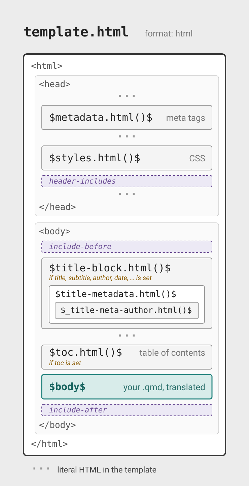{.nostretch width="80%" fig-align="center" fig-alt="A schematic of template.html as an ordered stack inside literal html, head, and body tags, each section drawn as a box. Inside the head: metadata.html (meta tags), styles.html (CSS), and a dashed header-includes slot. Inside the body: a dashed include-before slot; title-block.html (only if title, subtitle, author, date, or similar metadata is set), drawn as a container nesting title-metadata.html, which nests _title-meta-author.html; toc.html (table of contents, only if toc is set); the body; and a dashed include-after slot. Dotted marks between the boxes indicate the template's literal HTML boilerplate."}

[`html/pandoc/template.html` →](https://github.com/quarto-dev/quarto-cli/blob/main/src/resources/formats/html/pandoc/template.html)

## There is more than one `title-block.html` {.smaller}

Quarto picks one for you based on your YAML, and
the docs link to the wrong one for the default:

| Your YAML | Partial that renders |
|-----------|----------------------|
| *(nothing — Bootstrap default)* | [`templates/title-block.html`](https://github.com/quarto-dev/quarto-cli/blob/main/src/resources/formats/html/templates/title-block.html) ← **you used this one** |
| `title-block-banner: true` | [`templates/banner/title-block.html`](https://github.com/quarto-dev/quarto-cli/blob/main/src/resources/formats/html/templates/banner/title-block.html) |
| `title-block-style: manuscript` | [`templates/manuscript/title-block.html`](https://github.com/quarto-dev/quarto-cli/blob/main/src/resources/formats/html/templates/manuscript/title-block.html) |
| `title-block-style: none` | [`pandoc/title-block.html`](https://github.com/quarto-dev/quarto-cli/blob/main/src/resources/formats/html/pandoc/title-block.html) — Pandoc's plain block |

## Template: `format: revealjs` {.scrollable}

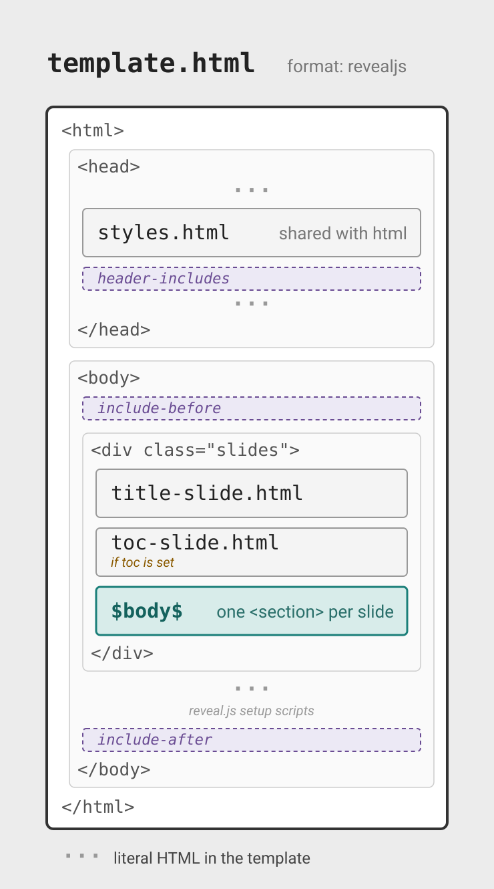{.nostretch width="80%"  fig-alt="A schematic of template.html for revealjs as an ordered stack inside literal html, head, and body tags, each section drawn as a box. Inside the head: styles.html (shared with the html format) and a dashed header-includes slot. Inside the body: a dashed include-before slot, then a box marking the div with class slides, holding title-slide.html, toc-slide.html (only if toc is set), and the body (one section element per slide), then the template's literal reveal.js setup scripts shown as a dotted mark, and last a dashed include-after slot. Dotted marks between the boxes indicate the template's literal HTML boilerplate."}

[`revealjs/pandoc/template.html` →](https://github.com/quarto-dev/quarto-cli/blob/main/src/resources/formats/revealjs/pandoc/template.html)

## Template: `format: pdf` {.scrollable}

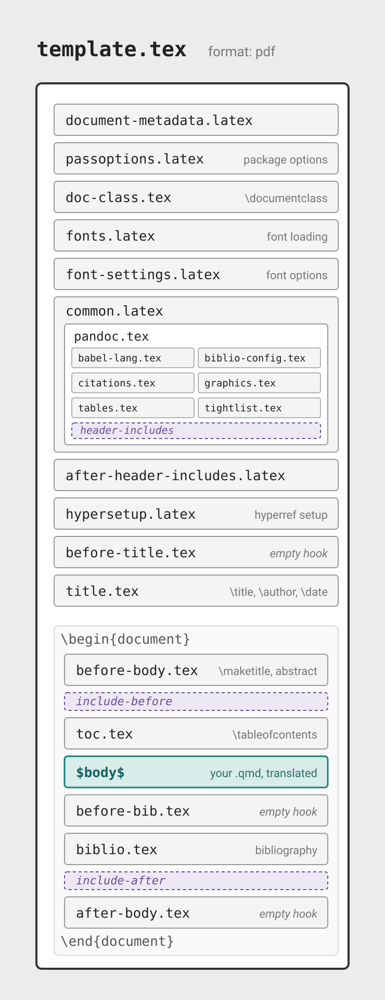{.nostretch width="80%"  fig-alt="A schematic of template.tex as an ordered stack of partial files. The preamble partials come first: document-metadata.latex, passoptions.latex, doc-class.tex, fonts.latex, and font-settings.latex, then common.latex drawn as a container nesting pandoc.tex, which holds six leaf partials (babel-lang, biblio-config, citations, graphics, tables, tightlist) and the dashed header-includes slot, then after-header-includes.latex, hypersetup.latex, before-title.tex (empty hook), and title.tex. The document section, delimited by the literal begin-document and end-document lines, holds before-body.tex, a dashed include-before slot, toc.tex, the body, before-bib.tex (empty hook), biblio.tex, a dashed include-after slot, and after-body.tex (empty hook)."}

[`pdf/pandoc/template.tex` →](https://github.com/quarto-dev/quarto-cli/blob/main/src/resources/formats/pdf/pandoc/template.tex)

## Localized strings in templates {.smaller}

Hard-coding "Table of contents" in a partial breaks the moment someone sets
`lang:`. 

Since Quarto 1.10, the strings Quarto already translates are template
variables:

```{.html}
<h2>${quarto.language.toc-title-document}</h2>
```

::: {.fragment}
| `lang: en` | `lang: fr` |
|---|---|
| Table of contents | Table des matières |
| Abstract | Résumé |
:::

[Localized strings in templates →](https://quarto.org/docs/authoring/language.html#localized-strings-in-templates)

::: notes
The `quarto.language` namespace exposes every string Quarto localizes, resolved
for the document's `lang`. 
:::
