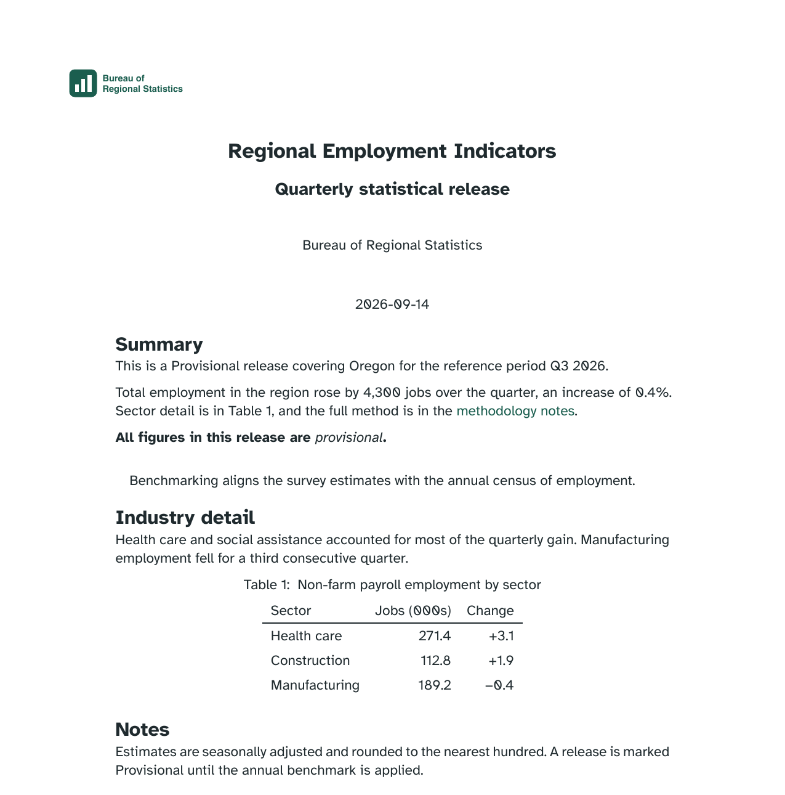
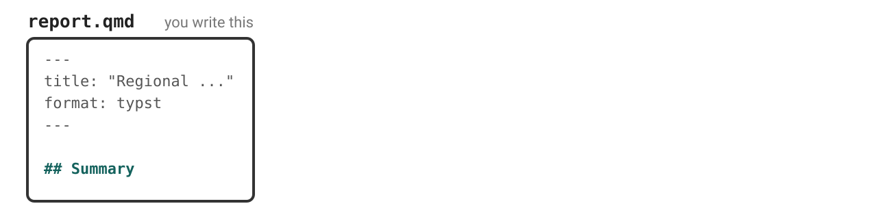
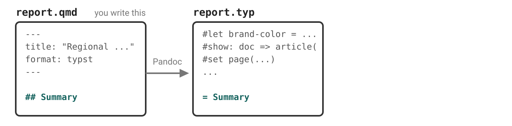
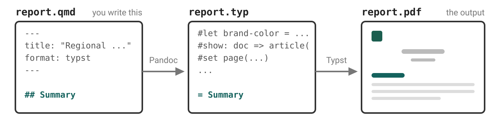
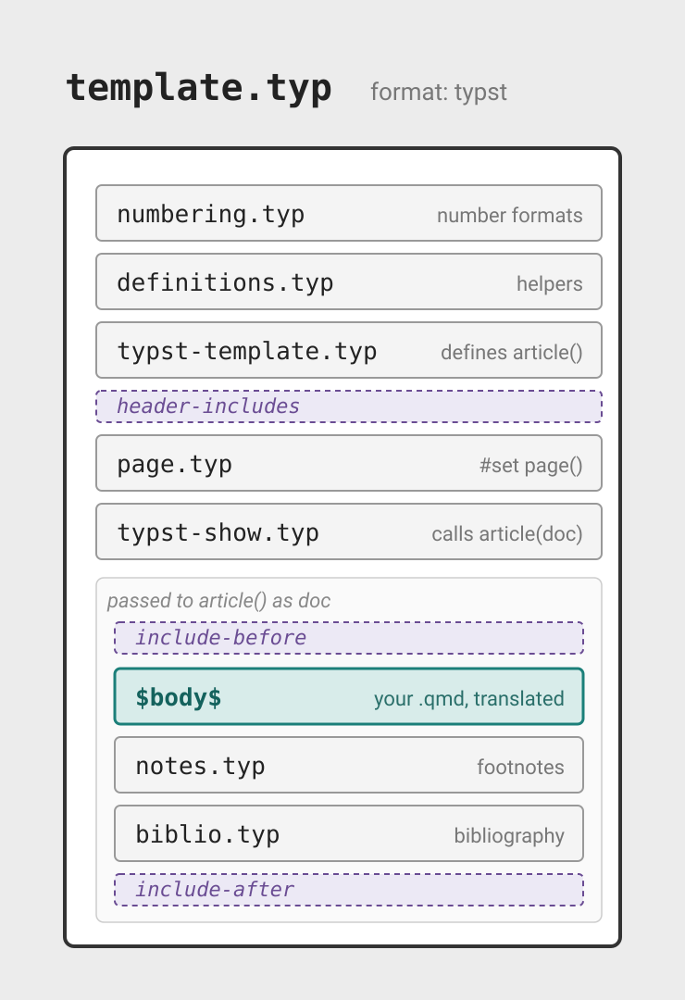
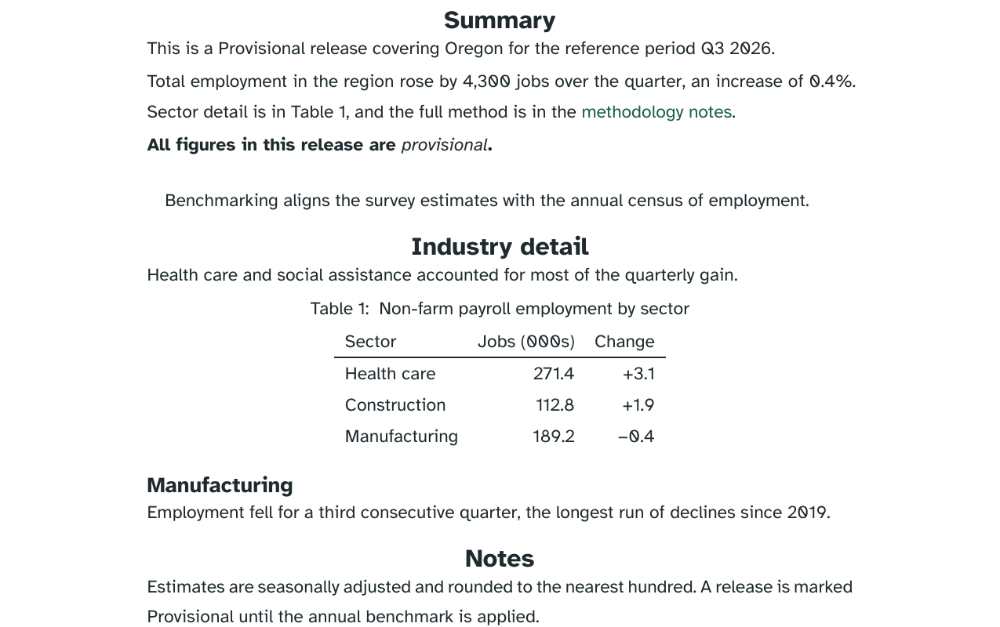
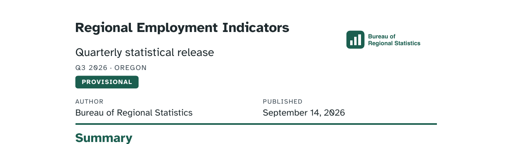

# Case study

The **Bureau of Regional Statistics** publishes a quarterly release.

## Same release, new requirement {.smaller}

The Bureau of Regional Statistics quarterly release. Every one must carry:

::: {.incremental}
- the agency mark
- the reference period and the region
- the release status — Provisional, Revised, or Final
:::

::: {.fragment}
Last module we built all three into an HTML title block. Now it has to be a PDF.
:::

::: notes
Do not sell Typst yet. Get them to render one first.

The starter is the document without the title block work — a clean sheet, not
their module 03 folder.
:::

## Your turn 1: render it as a PDF

::: your-turn

1. Add `typst` as a second format in `report.qmd`. Keep `html`:

   ```{.yaml filename="report.qmd"}
   format:
     html: default
     typst: default
   ```

2. Render with **Quarto: Preview Format…** command and pick Typst.

3. Render the HTML too. Compare the two formats.

:::

::: exercise-folder
[Exercise](https://github.com/posit-conf-2026/practical-quarto-exercises): `04-typst/01-first-pdf`
:::



::: notes
No TeX install.

`Quarto: Preview Format…` — the command from this morning.

Add, don't replace. They end holding both outputs, which is what makes step 3
possible.

Steer the comparison to the **logo**, and to the status with nothing marking
it.
:::

##

{.screenshot fig-alt="The first page of the rendered PDF. The agency logo and wordmark sit small at the top left. Regional Employment Indicators is centred below it in bold, with the subtitle Quarterly statistical release, then Bureau of Regional Statistics and the date 2026-09-14. The Summary section follows, with a sentence naming the status, period and region, a paragraph pointing at Table 1 and a green methodology notes link, a bold line reading All figures in this release are provisional, and an indented quotation about benchmarking. Then an Industry detail section with Table 1, Non-farm payroll employment by sector, and the start of a Notes section."}

::: notes
Same brand in both: Atkinson Hyperlegible, brand ink for the text, forest links.

The **logo** only shows up in the PDF. Brand cannot place it in a standalone
HTML document — module 03 built a partial for exactly that. Here it arrives
with no configuration.

The date is `2026-09-14` here and `September 14, 2026` in the HTML.

`{}` in the Summary works in both.
:::

## Why Typst?

::: {.incremental}
- **Already installed.** `format: pdf` needs a LaTeX distribution. Typst ships
  inside Quarto.

- **Faster.** Render, look, change, look again.

- **Uses your brand.** Colors, fonts, and the logo, from the same `_brand.yml`.
:::

::: notes
Typst is a binary dependency, in the same `quarto check` list as Pandoc.

Brand reaches none of this in LaTeX. The `.tex` has no trace of it.

Headings are brand ink here, not primary. Turn 3 changes that.
:::

## Two ways to reach metadata {.smaller}

|  | Last module | [This module]{.fragment fragment-index=1} |
|---|---|---|
| **Where you write it** | `title-block.html`, a partial | [`report.qmd`, the body]{.fragment fragment-index=1} |
| **What you write** | `$brs-release.status$` | [`{}`]{.fragment fragment-index=1} |
| **What it is** | Pandoc template syntax | [a Quarto shortcode]{.fragment fragment-index=1} |

: {tbl-colwidths="[20,40,40]"}

::: {.fragment fragment-index=2}
Pandoc's template syntax only runs when Pandoc is **filling a template**.
:::

[Pandoc's template syntax →](https://pandoc.org/MANUAL.html#template-syntax)

[Quarto's `meta` shortcode →](https://quarto.org/docs/authoring/variables.html#meta)

::: notes
`$brs-release.status$` typed in the body is just text.

Both reach a nested key with a dot.

The shortcode also works inside a raw Typst block too.
:::

# Quarto writes the Typst

## `.qmd` → `.typ` → `.pdf` {.smaller}

::: {.r-stack}
{.nostretch width="100%" fig-alt="One box, labelled report.qmd and annotated you write this, holding a YAML header that sets title and format typst, then a markdown heading reading hash hash Summary in teal."}

{.fragment .nostretch width="100%" fig-alt="The report.qmd box on the left, an arrow labelled Pandoc, and a second box labelled report.typ holding grey boilerplate lines — a brand-color definition, a show colon doc arrow article call, a set page call — and then in teal the line equals Summary."}

{.fragment .nostretch width="100%" fig-alt="Three boxes in a row joined by two labelled arrows. report.qmd on the left, an arrow labelled Pandoc, report.typ in the middle holding grey boilerplate and a teal equals Summary line, an arrow labelled Typst, and report.pdf drawn as a rendered page with a logo mark, a centred title and lines of body text."}
:::

::: fragment
Keep the intermediate `.typ`:

```{.yaml filename="report.qmd"}
format:
  typst:
    keep-typ: true
```
:::

::: notes
Two renders, not one. Pandoc gets you to Typst; Typst gets you to PDF.

The middle file is normally deleted. Keep it and you can read it, and errors
point into it.
:::

## Your content translated to Typst {.smaller .scrollable}

```{.typst .wrap .number-lines startFrom="432" filename="report.typ"}
= Summary
<summary>
This is a Provisional release covering Oregon for the reference period Q3 2026.

Total employment in the region rose by 4,300 jobs over the quarter, an increase of 0.4%. Sector detail is in #ref(<tbl-sectors>, supplement: [Table]), and the full method is in the #link("https://example.gov/brs/methods")[methodology notes].

#strong[All figures in this release are #emph[provisional].]

#quote(block: true)[
Benchmarking aligns the survey estimates with the annual census of employment.
]
```

::: {.fragment}
Template contributes 431 lines above it...
:::

::: notes
Every line above 432 came from the template and its partials, or from the
brand.

475 lines in total for a two-page release.

Scroll up through it live. Do not read it out — just show the scale, then land
on `#show: doc => article(` and `brand-color`.
:::

## Template: `format: typst` {.scrollable}

{fig-alt="A schematic of template.typ as an ordered stack of partial files: numbering.typ (number formats), definitions.typ (helpers), typst-template.typ (defines article()), a dashed header-includes slot, page.typ (#set page()), and typst-show.typ (calls article(doc)). A box labeled passed to article() as doc holds the rest: a dashed include-before slot, the body, notes.typ (footnotes), biblio.typ (bibliography), and a dashed include-after slot."}

::: notes
The boilerplate, in order. Their content is the box in the middle.
:::

# Typst syntax

## Text is content

::: {.columns}
::: {.column width="62%"}
```{.typst filename="badge.typ"}
Provisional
```
:::
::: {.column width="38%"}
```{typst}
//| alt: "The word Provisional, as plain text."
Provisional
```
:::
:::

::: notes
A `.typ` starts in markup mode. Text is text.

`=` is a heading, `-` a list item. Typst has `*bold*` and `_italic_` too —
Pandoc just does not use them.
:::

## `#` switches into code

::: {.columns}
::: {.column width="62%"}
```{.typst filename="badge.typ"}
rect()
```
\

::: {.fragment fragment-index=1}
```{.typst filename="badge.typ"}
#rect()
```
:::
:::

::: {.column width="38%"}
```{typst}
//| alt: "The text `rect()`."
rect()
```

::: {.fragment fragment-index=1}
```{typst}
//| alt: "An empty rectangle with a thin black outline."
#rect()
```
:::
:::
:::

::: {.fragment fragment-index=2}
Empty parentheses: a call with no arguments.
:::

[Typst: `rect` →](https://typst.app/docs/reference/visualize/rect/)

::: notes
One character is the whole difference. Without the `#` you get the characters
`rect()` back as text.

The docs page for `rect` is the next two slides, ahead of time.
:::

## Arguments go in the parentheses

::: {.columns}
::: {.column width="62%"}
```{.typst filename="badge.typ"}
#rect(fill: green)
```
:::
::: {.column width="38%"}
```{typst}
//| alt: "A solid green rectangle."
#rect(fill: green)
```
:::
:::

::: notes
Named arguments. A function's reference page is a list of these.

`green` is built in.
:::

## Use `[]` to pass content arguments

::: {.columns}
::: {.column width="62%"}
```{.typst filename="badge.typ"}
#rect(fill: green)[Provisional]
```
:::
::: {.column width="38%"}
```{typst}
//| alt: "A small green rectangle with the word Provisional inside it in black."
#rect(fill: green)[Provisional]
```
:::
:::

::: {.fragment}
This is the same call:

```{.typst}
#rect(fill: green, [Provisional])
```
:::

[Typst: trailing content blocks →](https://typst.app/docs/reference/foundations/function/)

::: notes
`[...]` is a content block. The box now has something in it.

Typst calls the `[...]` after the parentheses a **trailing content block**, and
you will see both spellings in the docs.

With nothing else in the parentheses they can go too: `#rect[Provisional]`.
A function can even take several trailing blocks — `#enum(start: 2)[A][B]`.
:::

## Your turn 2: read the Typst {.smaller}

::: your-turn

1. Render, then open `report.typ`. Scroll down to `= Summary` — everything
   below it is your content.

2. Find a call — it starts with `#`.

3. Search for the function in the [Typst reference](https://typst.app/docs/reference/).
   Say in plain words what it does, and whether any **arguments** are being passed to it.

4. Again, with another one.

:::

::: exercise-folder
[Exercise](https://github.com/posit-conf-2026/practical-quarto-exercises): `04-typst/02-read-the-typ`
:::



::: notes
All four are in the first section: `#ref`, `#link`, `#quote`, and a `#strong`
with an `#emph` nested inside it.

Arguments vary on purpose — `#strong` takes none, `#quote(block: true)` takes a
named one, `#link` and `#ref` take one unnamed and then content.

Collect two or three out loud. The reference being readable is the point, not
finishing.
:::

## You can nest content and calls

::: {.columns}
::: {.column width="62%"}
```{.typst filename="badge.typ"}
#rect(fill: green)[
  #text(fill: white)[Provisional]
]
```
:::
::: {.column width="38%"}
```{typst}
//| alt: "A small green rectangle with the word Provisional inside it in white."
#rect(fill: green)[
  #text(fill: white)[Provisional]
]
```
:::
:::

::: notes
They just met this in their own file — `#strong[... #emph[provisional] ...]`.

Inside `[...]` you are back in content mode, so the second `#` does the same
job as the first.

This is the shape the status badge needs.
:::

## Writing Typst in a `.qmd`

A raw block passes straight through:

````{.markdown filename="report.qmd" code-line-numbers="|1,3"}
```{=typst}
#rect(fill: green)[Provisional]
```
````

::: {.fragment}
Lands in `report.typ` untouched. Every other format ignores it.
:::

::: notes
Same mechanism as `{=html}`. The `=` means "this is already in the target
language, do not translate it".

Render this document to HTML and the block is dropped, silently.

This is how the status badge gets into the document.
:::

## The release status badge {.smaller}

::: {.columns}
::: {.column width="70%"}
````{.markdown .wrap filename="report.qmd" code-line-numbers="4|3,5|2,6"}
```{=typst}
#rect(fill: brand-color.primary, radius: 3pt)[
  #text(fill: white)[
    {}
  ]
]
```
````
:::
::: {.column width="30%"}
{.screenshot fig-alt="A dark green rounded rectangle with the word Provisional inside it in white type."}
:::
:::

::: notes
Read it inside out: take the status, make it white text, put it inside a
primary-coloured rectangle.

Everything from the last section, one step each: a call, an argument, a
content block, and a call inside it.

`brand-color.primary` instead of a hex code, and `{}` instead of
`$status$`.

This block is in the next exercise folder already.
:::

# Set and show rules

## Every element has a function {.smaller}

Even if not explicitly called, all layout and styling happens with functions:

| Element | Its function |
|---|---|
| Text | [`text()`](https://typst.app/docs/reference/text/text/) |
| Heading | [`heading()`](https://typst.app/docs/reference/model/heading/) |
| Paragraphs | [`par()`](https://typst.app/docs/reference/model/par/) |
| Page | [`page()`](https://typst.app/docs/reference/layout/page/) |

: {tbl-colwidths="[45,55]"}

::: notes
Nothing is exempt. `Provisional` on its own is a `text` element — we just
never named the function.

Typst's own word for these is **element function**, and its docs say every one
of them can be customised with set and show rules. That is the next two slides.

Their `.typ` already has `set par`, `set text`, `set heading` and `set page`,
all written by Quarto from the YAML and the brand.
:::

## A `set` rule changes the default

::: {.columns}
::: {.column width="62%"}
```{.typst .wrap filename="styles.typ"}
Provisional

#set text(fill: brand-color.primary)

Provisional
```
:::
::: {.column width="38%"}
```{typst}
//| alt: "The word Provisional in black, then the word Provisional in brand green below it."
Provisional

#set text(fill: brand-color.primary)

Provisional
```
:::
:::

::: notes
From here on, not everywhere. The first one was already rendered.

`#set f(arg: value)` — the arguments are the function's own.
:::

## Adding `show` scopes it to an element

::: {.columns}
::: {.column width="62%"}
```{.typst .wrap filename="styles.typ"}
#show heading: set text(fill: brand-color.primary)

= Summary

Ordinary text here

== Manufacturing
```
:::
::: {.column width="38%"}
```{typst}
//| alt: "Two brand green headings, Summary large and Manufacturing smaller beneath it."
#show heading: set text(fill: brand-color.primary)

= Summary

Ordinary text here

== Manufacturing
```
:::
:::

::: {.fragment}
A **show-set rule**: the `show` keyword, a **selector**, a colon, then a set
rule.
:::

[Typst: styling →](https://typst.app/docs/reference/styling/)

::: notes
Read it as: wherever a heading appears, apply this.

Nothing had to be marked up — `show` finds the elements itself.
:::

## `.where()` narrows the selector

::: {.columns}
::: {.column width="62%"}
```{.typst .wrap filename="styles.typ"}
#show heading.where(level: 1): set text(fill: brand-color.primary)

= Summary
== Manufacturing
```
:::
::: {.column width="38%"}
```{typst}
//| alt: "A brand green Summary heading with a black Manufacturing heading beneath it."
#show heading.where(level: 1): set text(fill: brand-color.primary)

= Summary
== Manufacturing
```
:::
:::

::: notes
Same rule, narrower selector. `heading.where(level: 1)` is still the `heading`
function, with a filter on it.

Careful: Quarto shifts levels down by one, so a markdown `##` is Typst level 1.
:::

## Your `.typ` is already full of these {.smaller}

```{.typst .wrap filename="report.typ"}
#set page(
  paper: "us-letter",
  margin: (x: 1.25in, y: 1.25in),
  numbering: "1",
  columns: 1,
)

#set text(fill: brand-color.foreground)
#show heading: set text(font: ("Atkinson Hyperlegible",), weight: 600, )
#show link: set text(fill: rgb("#1b5e4f"), )
```


::: notes
The page block is `page.typ`, filled from defaults you never set.

The brand lines are the module 03 callback — brand was unreachable from an
HTML partial, and here it is, in scope, in the body. Yours can say
`brand-color.primary` instead of a hex code.
:::

## Your turn 3: set and show rules {.smaller}

In `report.qmd`, add a **new raw block above the badge**, so the rules apply to
everything below.

::: your-turn

1. Write a **set rule** to loosen the paragraphs — `par` has a `leading`
   argument. [`par` →](https://typst.app/docs/reference/model/par/)

2. Write a **show-set rule** to centre the section headings.
   [`align` →](https://typst.app/docs/reference/layout/align/)

3. Challenge: step 2 caught `### Manufacturing` too. Narrow the selector to the top-level sections only.

:::

::: exercise-folder
[Exercise](https://github.com/posit-conf-2026/practical-quarto-exercises): `04-typst/03-set-and-show`
:::



::: notes
`report.qmd`, not `report.typ` — the `.typ` is generated, and anything typed
there is gone on the next render.

Both rules have a model in that generated file, though.

Step 1 is `#set`, step 2 is `#show`. Say that if nobody moves.

The bonus needs the heading shift — `##` is level 1. Staged in the README.

Fast finishers: the menu of free wins.
:::

## One answer {.smaller}

::: {.panel-tabset}

### Result

{.screenshot fig-alt="The middle of the rendered PDF. The Summary, Industry detail and Notes headings are centred, while the Manufacturing subsection heading stays at the left margin. Paragraph lines sit further apart than before."}

### The block

````{.markdown filename="report.qmd"}
```{=typst}
#set par(leading: 1em)
#show heading.where(level: 1): set align(center)
```
````

:::

::: notes
Two lines. One changes a default everywhere, one changes it inside headings
only.

The `### Manufacturing` subsection staying left is the selector doing its job.
:::

# Further customization

## When a raw block is not enough {.smaller}

| You want | Reach for |
|---|---|
| rules used across documents | `include-before: styles.typ` |
| a header or footer on every page | override `page.typ` |
| a different title block | override `typst-show.typ`, `typst-template.typ` |

: {tbl-colwidths="[48,52]"}

::: notes
A raw block styles what is already there. It cannot touch the title block —
that is built before your content arrives.

`#set page()` in the body starts a new page too, so a body raw block cannot
even reach page one.
:::

## Seed with the defaults, hand to an agent {.smaller}

```{.markdown .wrap}
I've added page.typ, typst-show.typ and typst-template.typ, 
unedited copies of Quarto's Typst partials, already registered in report.qmd. 
Edit the partials to rebuild the title block: 
title and subtitle alongside a right aligned the brand logo, 
the reference period and region, 
then the release status as a badge. 
```

::: notes
Do not ask for partials from scratch — it will drop the machinery behind
cross-references, footnotes and the bibliography.

`page.typ` is the interesting change: a **deletion**. Editing a partial is as
often about removing default behaviour as adding to it.

The logo comes from `_brand.yml`, not a document key. `$logo$` on its own
renders the string `true`; you want `$logo.path$`.

Brand **colours** are not template variables — only `brand.typography.*` is.
`brand-color` is a Typst variable, so pass it from `typst-show.typ`.
:::

## With a little iteration...

{.screenshot fig-alt="A rebuilt PDF title block. Regional Employment Indicators is large and bold at the left with the subtitle beneath it, and the agency logo and wordmark at the right. Below, in small grey letter-spaced capitals, Q3 2026 dot OREGON, then a dark green badge reading PROVISIONAL in white capitals. Author and Published run beneath in two labelled columns, above a dark green rule."}

::: example-folder
[Example](https://github.com/posit-conf-2026/practical-quarto-exercises): `04-typst/05-title-block`
:::

::: notes
The same layout as the HTML title block from module 03, in the format that
could not have it.

Read the folder, don't work through it. The README lists what the first pass
got wrong and what is still not right.
:::

# Wrapping up

## When LaTeX is still right

::: {.incremental}
- an existing journal template — different language, no path across
- an established math workflow built on LaTeX packages
- HTML, when screen-reader users are a primary audience
:::

::: notes
Say this plainly. Typst is not a replacement for all of it.
:::

## Free with Typst 

::: {.incremental}
- **`gt` tables.** Structure and CSS styling both translate. Stay in R.
- **`pdf-standard: ua-1`.** One line, and a tagged PDF.
- **Page layout.** `papersize`, `margin`, `page-numbering`, `columns`.
:::

::: notes
`ua-1` needs `quarto install verapdf` to be validated. Without it the render
still succeeds and the check is skipped.

Passing validation is not the same as meeting the standard.
:::

# Questions?

# Resources

## Reading `.typ` in your editor {.smaller}

**Tinymist Typst** — syntax highlighting and completion for `.typ` files.

```{.default}
myriad-dreamin.tinymist
```

[Open VSX](https://open-vsx.org/extension/myriad-dreamin/tinymist) ·
[VS Code Marketplace](https://marketplace.visualstudio.com/items?itemName=myriad-dreamin.tinymist) ·
[Docs](https://myriad-dreamin.github.io/tinymist/)

::: notes
Positron installs extensions from Open VSX, and this one is there.

It covers `.typ` files. A `{{=typst}}` raw block inside a `.qmd` is not
highlighted — the grammar only injects into fences labelled `typ` or `typst`.

`nvarner.typst-lsp` is the predecessor and contributes no grammar. Uninstall
it if you have both.
:::

## Where the Typst partials live {.smaller}

```{.default}
numbering.typ
definitions.typ
typst-template.typ
page.typ
typst-show.typ
notes.typ
biblio.typ
```

Source for a version:
[`quarto-cli/src/resources/formats/typst/pandoc/quarto`](https://github.com/quarto-dev/quarto-cli/tree/v1.11.4/src/resources/formats/typst/pandoc/quarto)

