

### What to bring

**Bring your [personal laptop]{.text-danger} and a power cord.** This is going to be a hands-on workshop, meaning that you’ll be writing code and collaborating with new friends you’ll make at the workshop.


::: {.callout-tip title="Set up Posit AI Pass"}
{.img-fluid style="display: block; margin-inline: auto; max-height: 80px; margin-bottom: 0.5em"}

We'll use [Posit AI](https://posit.ai) for every activity in this workshop. Posit AI Pass is a subscription from Posit. It gives you access to LLMs in Posit Assistant, and from [ellmer] and [chatlas] in your R or Python code.

You don't need an API key, a payment method, or a Posit AI subscription. A free Posit AI account is enough:

1. Go to [posit.ai](https://posit.ai) and sign up for a **Free** account with the email you used to register for posit::conf(2026). You can sign up with email, Google, or GitHub.

That's it. Your workshop pass gives you a credit grant for the day of the workshop. (If you're already a paid Posit AI Pass subscriber, you'll receive the credit grant too.)

The first time you call an LLM from ellmer or chatlas, your browser opens so you can log in. After that, you stay logged in for the rest of the day.

If you'd also like to try local models (they're free), [install LM Studio and download a model](local-models.qmd).
:::

:::::: {.callout-important title="Bring your own laptop"}
You'll need a computer with internet access and the ability to install R or Python packages.

We **strongly recommend** using a *personal laptop* rather than a work laptop.
Many work laptops have restrictions that may prevent you from installing necessary software or accessing certain websites.

You'll also want to bring a power cord to keep your laptop charged throughout the workshop.
And a bottle of water to stay hydrated (for you, not your laptop)!
::::::

## Create accounts

In this workshop, we'll be using a few different online services.
If you don't already have accounts with these services, you'll need to create them before we get started.

-   [posit::conf(2026) Discord]()
    -   Used to communicate during the workshop and ask questions via text. Also used for general online participation during the conference.
    -   Make sure your [display name](https://support.discord.com/hc/en-us/articles/12620128861463-New-Usernames-Display-Names#h_01GXPQABMYGEHGPRJJXJMPHF5C) is the one you used to register for the conference.
    -   Join using the [posit::conf(2026) Discord invitation]().
    -   Workshop channel: [``]()
-   [GitHub](https://github.com/join)
    -   The workshop materials are hosted on GitHub and we may use GitHub in an activity during the workshop.

```{=html}
<!--
* [Posit Cloud](#using-posit-cloud)
-->
```

```{=html}
<!--
## Using Posit Cloud

::: {.callout-note title="Back-up Plan"}
We're providing a Posit Cloud workspace with all of the packages and files ready-to-go for the workshop.

::: lead
Join the Posit Cloud workspace at []().
:::
:::


::: {.callout-warning title="Posit Cloud Space Not Yet Available"}
The link to join the space is not yet available.
This page will be updated on the day of the workshop.

You will need a Posit Cloud account and you can create one for free at [posit.cloud/plans](https://posit.cloud/plans).
Click "Learn more" under the Free plan to sign up.
:::


I've prepared a Posit Cloud workspace for workshop participants with a project for you to use during our time together.
The project contains all of the files and packages pre-installed and ready to go.
All you need to do is log in and start coding!

If you already have a Posit Cloud account, first [join the  space on Posit Cloud]().
Otherwise [sign up for a free account](https://posit.cloud/plans) and then join the space.
You can create an account with your email or login with Google, GitHub or Clever.

Once you're part of the [ space](), select the `` assignment to create and launch a new project just for you.

::: {.shadow-lg .p-2 .border .border-1 .rounded-2 .text-center}
TODO: Update posit cloud workspace screenshot
{.img-fluid alt=""}
:::
-->
```

## Use Posit Cloud (recommended)

The easiest way to follow along is our Posit Cloud workspace.
It comes with R, Python, and every package and file used in the workshop, already installed.
You work in your browser, so there's nothing to install on your laptop.

::: {.callout-warning title="Workspace link coming soon"}
The link to join the Posit Cloud workspace will be emailed to you shortly before the workshop starts.
:::

If you don't have a Posit Cloud account, [sign up for a free one](https://posit.cloud/plans).
You can sign up with your email, Google, GitHub, or Clever.
When the workspace link is available, join the space and launch the workshop project.

When the project opens, pick the project that corresponds with the editor of your choice: **Positron** or **RStudio**.

::: {.shadow-lg .p-2 .border .border-1 .rounded-2 .text-center}
{.img-fluid alt=""}
:::


## Choose your IDE

You can use any IDE you like to follow along with the workshop.
We'll be using [Positron](https://positron.posit.co), the free, next-generation data science IDE from Posit.

::: text-center
[{style="max-width:600px" alt="Positron IDE screenshot"}](https://positron.posit.co)

[<i class="bi bi-display-fill"></i> Download Positron](https://positron.posit.co/download.html){.btn .btn-primary}
:::

Of course, you're welcome to use [RStudio](https://posit.co/download/rstudio-desktop/), [VS Code](https://code.visualstudio.com/) or any other IDE you prefer.

::: {.callout-tip title="Why use Positron?"}
Positron comes with [Posit Assistant](https://assistant.posit.co) built in, an AI coding assistant for data science.
Posit Assistant uses context from your interactive work — loaded data, plots, and console history — so its guidance fits core data science workflows like exploratory analysis, data cleaning, and modeling.

You'll set up Posit Assistant in [the next section](#posit-assistant-and-posit-ai-pass).
:::


## Posit Assistant and Posit AI Pass

You use the same steps to set up Posit Assistant in Posit Cloud and in Positron on your own computer.
Open Posit Assistant, sign in to Posit AI, and you're done.
After that, [ellmer] and [chatlas] use the same sign-in from your R and Python code.

:::::: {.panel-tabset}

#### Step 1: Open Posit Assistant

Click the Posit Assistant icon in the left activity bar, then click **Help me set it up**.

::: text-center
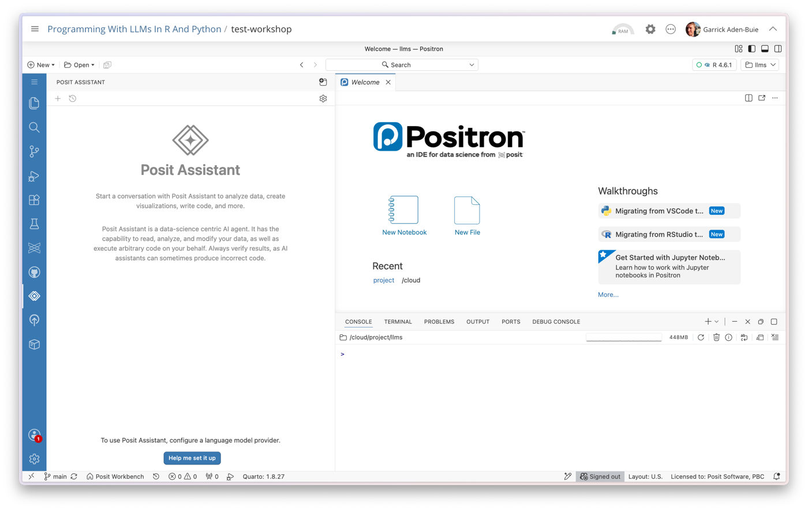{.img-fluid}
:::

#### Step 2: Start setup

Click **Configure AI providers**.

::: text-center
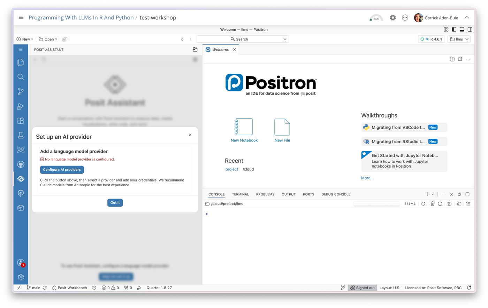{.img-fluid}
:::

#### Step 3: Choose Posit AI

Select **Posit AI** as the provider, leave **OAuth** selected, then click **Sign in**.

::: text-center
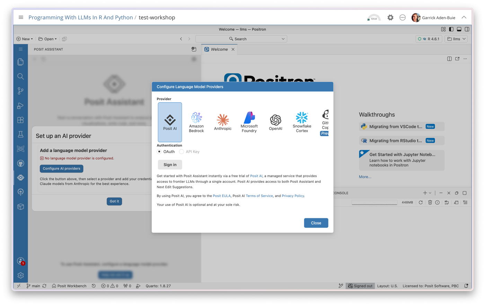{.img-fluid}
:::

#### Step 4: Sign in

Positron shows a code and copies it to your clipboard.
Click **OK**, and your browser opens.
Sign in to Posit AI with the account you created above and paste the code when asked.

::: text-center
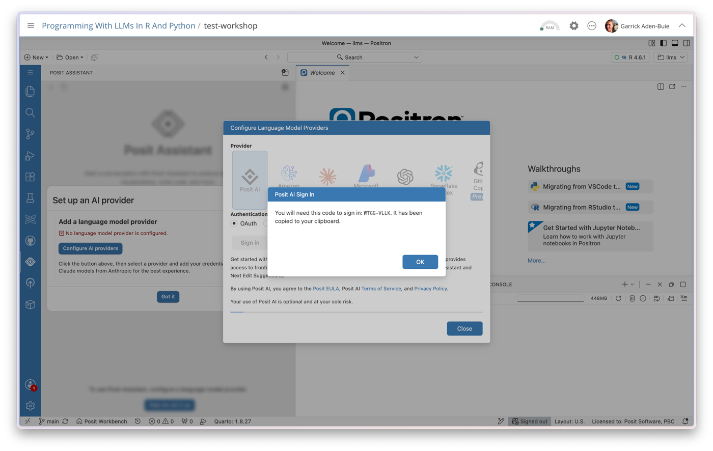{.img-fluid}
:::

#### Step 5: You're ready

Back in Positron, you'll see "Posit Assistant is ready!".

::: text-center
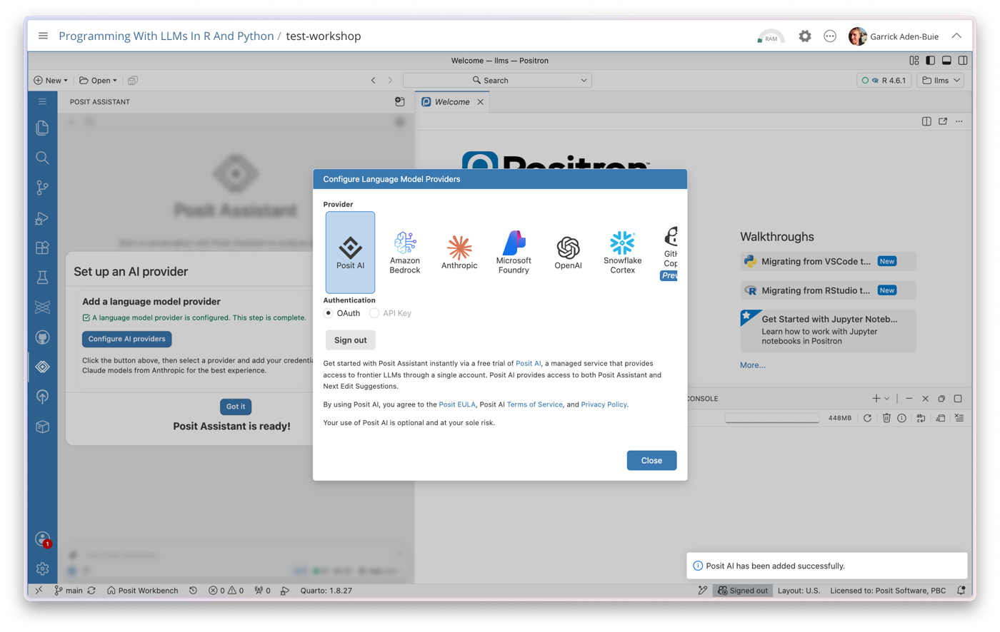{.img-fluid}
:::

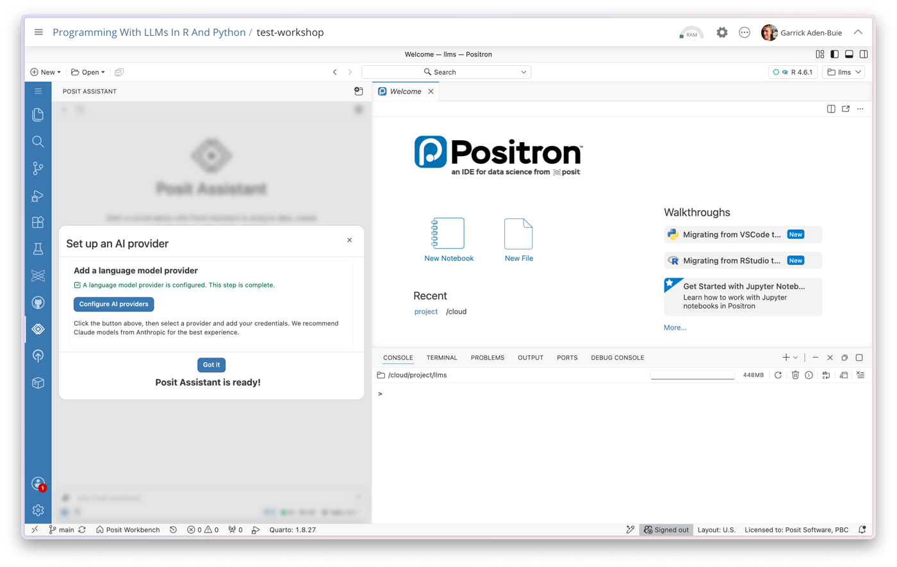{.img-fluid}

#### Step 6: Pick a model

Open the model picker at the bottom of the Posit Assistant pane to see the models included with Posit AI Pass.

::: text-center
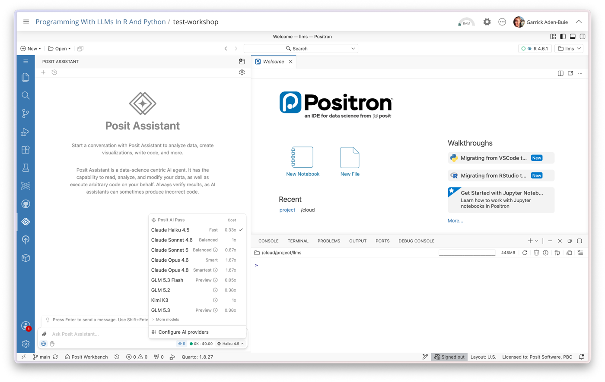{.img-fluid}
:::

#### Step 7: Try it out

Ask a question to confirm everything works.

::: text-center
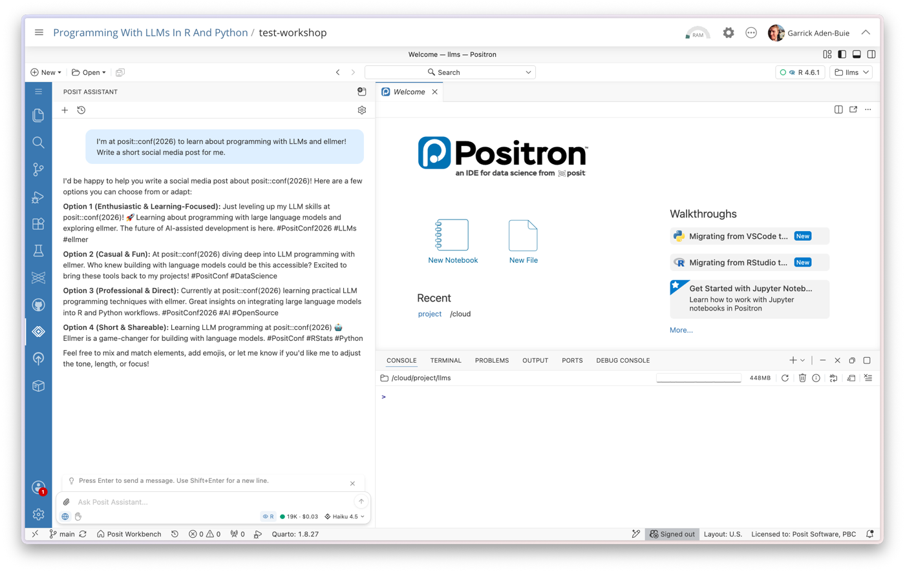{.img-fluid}
:::

::::::

### Use Posit AI Pass from ellmer and chatlas

The first time you call an LLM from ellmer or chatlas, your browser opens so you can log in to Posit AI.
After that, you stay logged in for the rest of the day.

::: {.panel-tabset group="lang"}

#### {height="36px" alt="R"}

``` r
library(ellmer)

# The first time, ellmer opens your browser so you can log in to Posit AI:
chat <- chat_posit()
#> Copy XXXX-XXXX and paste when requested by the browser.
#> Press <enter> to proceed:

chat$chat("What is the capital of France?")
#> The capital of France is Paris.
```

#### {height="36px" alt="Python"}

``` python
from chatlas import ChatPosit

# The first time, chatlas opens your browser so you can log in to Posit AI:
chat = ChatPosit()
# Copy XXXX-XXXX and paste when requested by the browser.
# Press <enter> to proceed:

chat.chat("What is the capital of France?")
# The capital of France is Paris.
```

:::

## Use your own computer

If you're using Posit Cloud, you can skip this section.
Everything below is for running the materials on your own computer.

To prepare for the workshop, you need to [clone the repository]() and install the necessary packages.

### Clone the repository

::::::: panel-tabset
#### {width="32px"} Positron

In Positron, use **File** \> **New Folder from Git...**.
Enter the repository link `.git` and choose a location on your computer to save the project.

::: text-center
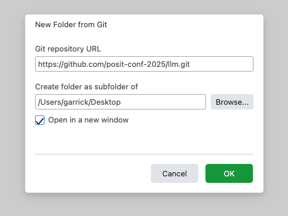
:::

#### {width="32px"} RStudio

In RStudio, use the project dropdown menu (top right) or **File** \> **New Project...**.
Choose **Version Control** and then pick **Git**.

::: text-center
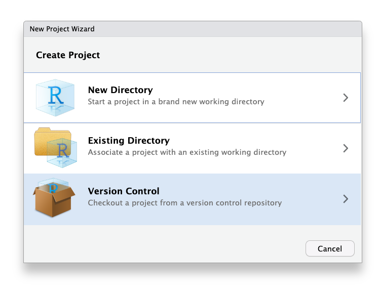{style="max-width:400px"}
:::

Enter the repository link `.git` and choose a location on your computer to save the project.

::: text-center
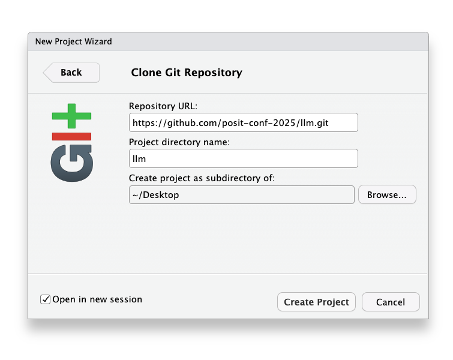{style="max-width:400px"}
:::

#### 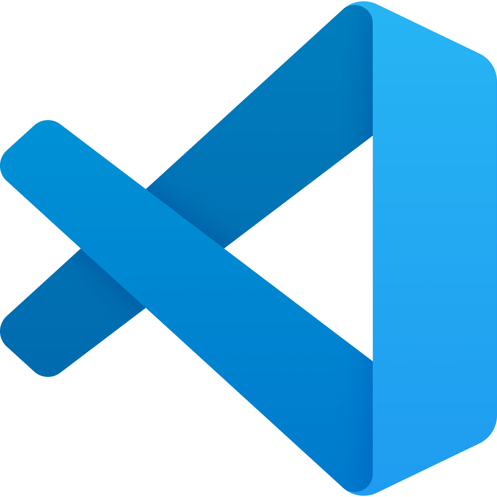{width="32px"} VS Code

In VS Code,

1.  open the command palette with `Ctrl+Shift+P` (Windows/Linux) or `Cmd+Shift+P` (Mac).
2.  Type `Git: Clone` and select it.
3.  Enter the repository link: `.git`
4.  Choose a location on your computer to save the project.

::: text-center
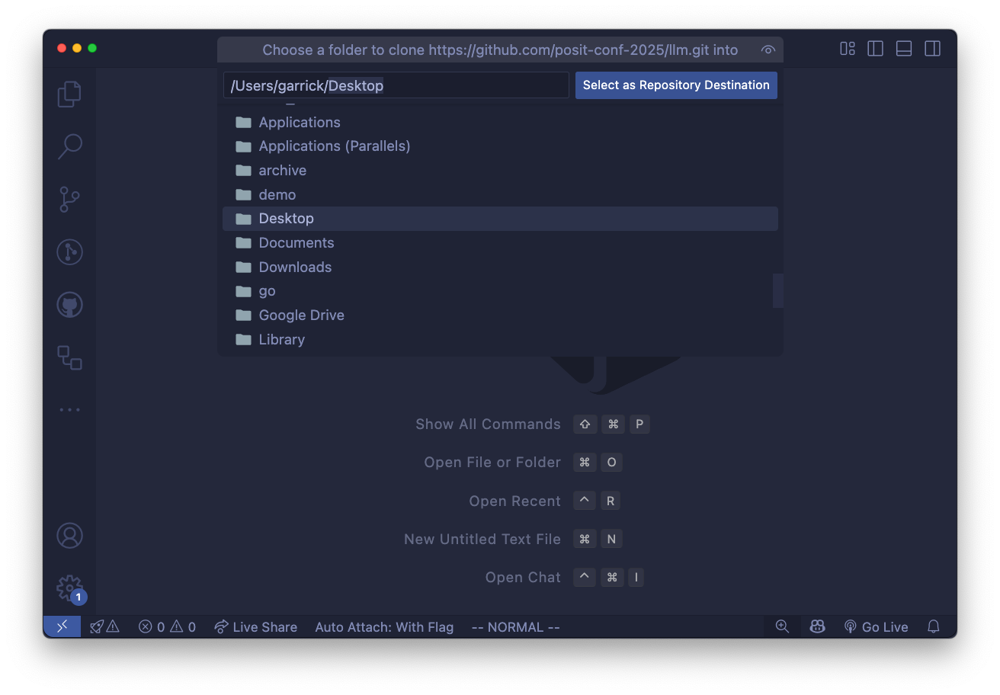{style="max-width:400px"}
:::

#### {width="36px"} usethis

You can use the [usethis](https://usethis.r-lib.org) package to quickly clone the repository:

``` r
usethis::create_from_github(
  "posit-conf-2026/llms",
  # Decide where to put the project here:
  destdir = "~/Desktop/llms"
)
```

This will download the repository and open the project in RStudio.

#### {width="32px"} GitHub

``` bash
cd ~/Desktop # or somewhere you can find easily

gh repo clone posit-conf-2026/llms
cd llms
```

#### {width="32px"} git

``` bash
cd ~/Desktop # or somewhere you can find easily

git clone https://github.com/posit-conf-2026/llms.git
cd llms
```
:::::::

### Set up your environment

This workshop is designed so that you can use either R or Python.
You can choose to use only one language throughout, or you can even switch between R and Python during the workshop!

Even if you're only planning to use R, consider installing [`uv`, a package and environment manager for Python](https://docs.astral.sh/uv/) (see the Python instructions below).
That way, you can easily try the Python examples during the workshop if you want to.

:::: {.panel-tabset group="lang"}
#### {height="36px" alt="R"}

First, make sure you're using [a recent version of R](https://r-project.org).
I used [R 4.5](https://r-project.org) but any recent version of R (\>= 4.1) should work.
I also use [rig](https://github.com/r-lib/rig) to manage my R installations, since it makes it easy to install new versions of R and switch between them.

Then, open the project in your IDE and run the following commands in the R console to install the required packages with [pak]:

```r
# Install pak if you don't have it already
# install.packages("pak")

# Add the Posit and RStudio R-Universe repos for easy dev package installation
pak::repo_add("https://posit-dev.r-universe.dev")
pak::repo_add("https://rstudio.r-universe.dev")

pak::local_install_deps()
```

<details><summary>Alternative: Direct package installation</summary>

```r

```

</details>

#### {height="36px" alt="Python"}

We're using [uv](https://docs.astral.sh/uv/) by Astral to manage our Python environment and dependencies.
If you don't have `uv` installed, you can install it by following [uv's installation instructions](https://docs.astral.sh/uv/getting-started/installation/).

Once you're set up with `uv`, open the project in your IDE and run the following command in the terminal to create the Python environment and install the necessary packages:

``` bash
uv sync -p 3.14
```

That command will create a virtual environment in the project directory and install all the required packages listed in the `pyproject.toml` file.
The `-p 3.14` flag tells `uv` to use Python 3.14, which is the version we recommend for the workshop.
You're free to use whatever version of Python you like, but we've found that 3.14 gives the best experience with Positron and the packages we use.
::::

## Local models

Local models do not provide the same quality of responses as flagship models from AI providers like OpenAI or Anthropic, but you can run them on your own computer without having to pay for API access or sending your data to a third party.

**You do not need to install LM Studio or use local models to participate in the workshop.**
That said, they're a fun way to experiment with LLMs without incurring API costs.

If you'd like to try local models, we recommend [LM Studio](https://lmstudio.ai) with the [Bonsai 27B](https://lmstudio.ai/models/prism-ml/bonsai-27b) model.
See [Local models with LM Studio](local-models.qmd) for full instructions, other model recommendations, and a note on using [ollama] instead.

## The night before the workshop

If you've followed the instructions above, you should be all set for the workshop!
But we'll likely be making some last-minute changes to the workshop materials as we get closer to the event.

To be completely ready-to-go on the day of the workshop, make sure that you get the latest version of the materials the night before the workshop.

-   **Update your local copy of the repository:**

    Use `git pull` in the terminal, or the **Git: Pull** command in your IDE.

-   **Update your R packages:**

    If you're using R, run `pak::local_install_deps()` again to make sure you have the latest package versions.

-   **Update your Python packages:**

    If you're using Python, run `uv sync -p 3.14` again to make sure you have the latest package versions.
