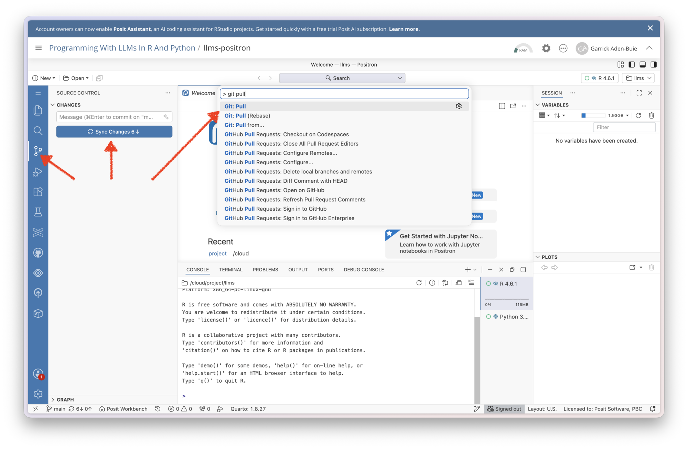
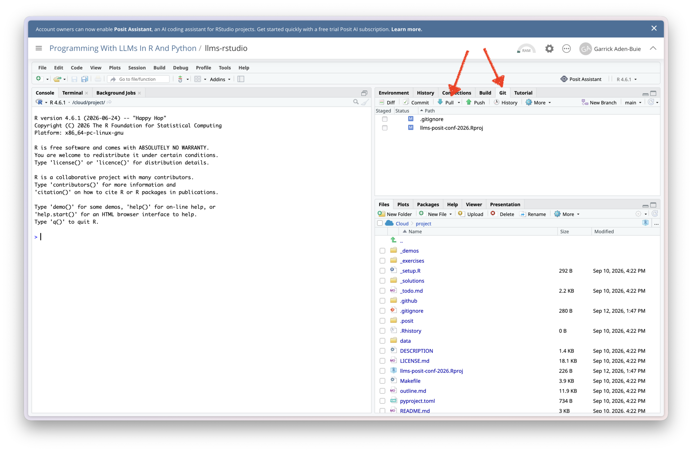

## {background-video="assets/robot-logs-in.mp4" background-video-loop="true" background-video-muted="true"}

```{=html}
<style>
.title-slide-white * {
  color: white !important;
  font-weight: bold !important;
}
.title-slide-white .quarto-title-authors *,
.title-slide-white .date {
  color: black !important;
}
</style>
```

## Welcome to [Programming&nbsp;with&nbsp;LLM&nbsp;APIs&nbsp;]{.dark-blue}! {.center .fs-step-2 background-image="assets/retro-mac.jpg" background-size="cover" background-position="bottom left" autoslide=20000}

* Find a seat where you can see the screen!

* Get set up for the workshop: \
  [posit-conf-2026.github.io/llms]{.code .b .orange}

* Join the Discord: [pos.it/joinconf26]{.code .orange .b}

* [wifi: <br>&nbsp;pwd: ]{.code}

* Conference details: [conf.posit.co/2026]{.code .orange .b}

```{=html}
<style>
.reveal .footer {
  font-size: 0.5em !important;
  color: white !important;
}
</style>
```

## {.no-invert-dark-mode background-image="assets/space-git-pull.png" background-size="cover" background-position="bottom right"}

## Set up your Posit Cloud space

Join us at [https://bit.ly/conf26-llms]{.orange .b}

::: tr
Pick: Positron or RStudio?
:::

{width="100%"}

## Positron: Open the project

::: tc
{style="max-height: 80%"}
:::

## Positron: Get the latest updates

* Open git panel, git fetch, then sync changes
* Or **Git: Pull** in Command Palette

{style="width: 100%; max-height: unset"}

## Rstudio: Get the latest updates

* Open Git panel
* Click **⬇ Pull**

{style="width: 100%; max-height: unset"}

## Install All The Things {.center}

Open the `llms` project and...

### {height="1em" alt="R" style="vertical-align: bottom"}

```r
install.packages("pak") # if you don't have it yet

pak::local_install_deps()
```

### {height="1em" alt="" style="vertical-align: bottom"} Python {style="margin-top: 1em"}

```python
uv sync -p 3.14
```
