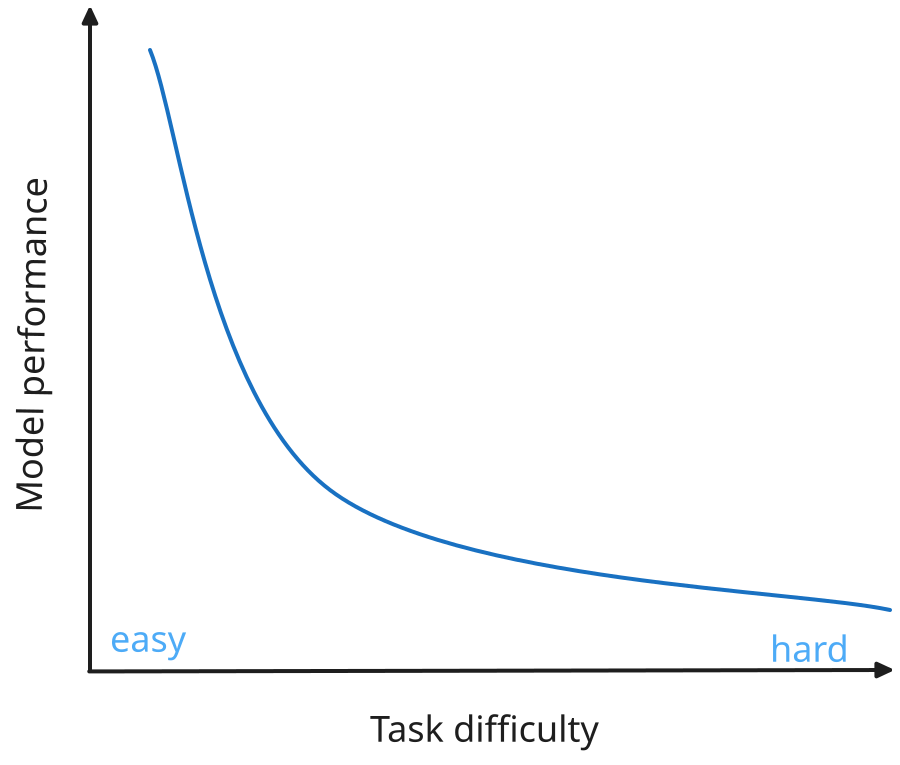
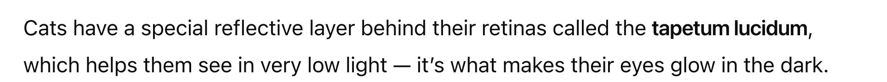
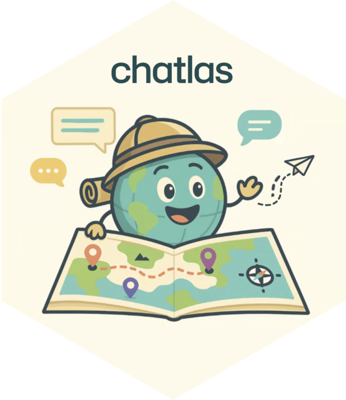
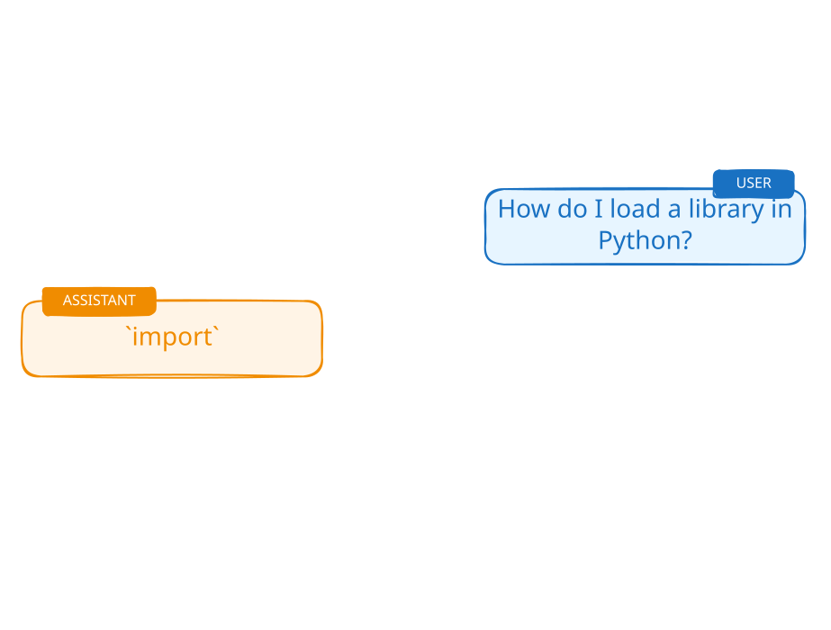
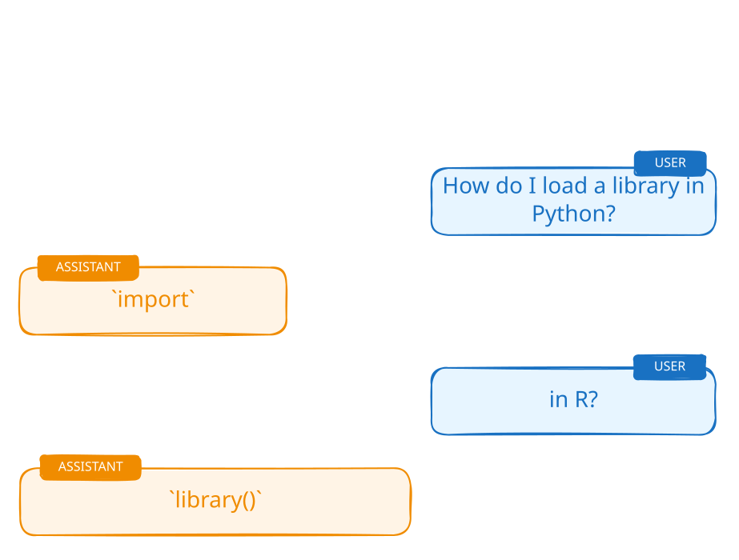

# How to think about LLMs {.dark-blue background-image="assets/retro-mac.jpg" background-size="cover" background-position="bottom left"}

```{r}
source("_incremental_slides.R")
```

::: notes
Let's talk a bit about how to think at a high level about LLMs before we dive into some code
:::

## Think Empirically, Not Theoretically {.center .text-center}

## Think Empirically, Not Theoretically {.center .text-center}

- It's okay to (mostly) treat LLMs as **black boxes**. \
  We're not going to focus on how they work internally

- **Just try it!** When wondering if an LLM can do something,\
  experiment rather than theorize

- You might think they could not possibly do things\
  _that they clearly can do today_

- And you might think _surely_ they can do something\
  that it turns out they're _terrible_ at

::: notes
Think empirically, not theoretically.
There are some things LLMs can clearly do today that you would have thought possible, and things That they can't do that you would have thought they would have been able to.
:::

## {.center}

::: notes
You might expect a performance to look something like this.
:::

{style="max-width: 90%; max-height: 550px; display: block; margin-left: auto; margin-right: auto;"}

## LLMs are jagged {.center}

{style="max-width: 90%; max-height: 550px; display: block; margin-left: auto; margin-right: auto;"}

::: notes
It really looks something more like this.
:::

## [Embrace the Experimental Process]{.dib .bg-black .ph4 .white} {.center .text-center background-image="assets/national-cancer-institute-Okk-eID2Z9k-unsplash.jpg" background-size="cover" background-position="center"}

::: {.footer style="color: rgba(255,255,255,0.5);"}
Photo by <a href="https://unsplash.com/@nci?utm_source=unsplash&utm_medium=referral&utm_content=creditCopyText" style="color: rgba(255,255,255,0.5);">National Cancer Institute</a> on <a href="https://unsplash.com/photos/Okk-eID2Z9k?utm_source=unsplash&utm_medium=referral&utm_content=creditCopyText" style="color: rgba(255,255,255,0.5);">Unsplash</a>
:::

::: notes
Embrace the experimental process.
:::

## Start Simple, Build Understanding {.center .text-center}

## Start Simple, Build Understanding {.center .text-center}

- We're going to focus on the **core building blocks**.

- All the incredible things you see AI do \
  **decompose to just a few key ingredients**.

::: notes
We're gonna focus on the core building blocks. The goal for today is to really for you to sense those building blocks, feel like you're exploring, have some fun, build intuition.
:::


# [Anatomy of a Conversation]{.white} {.no-invert-dark-mode background-image="assets/jaroslaw-glogowski-oAYKzeP0qF4-unsplash.jpg" background-size="cover" background-position="left 30%"}

::: {.footer style="color: rgba(255,255,255,0.5);"}
Photo by <a href="https://unsplash.com/@jglogowski?utm_source=unsplash&utm_medium=referral&utm_content=creditCopyText" style="color: rgba(255,255,255,0.5);">Jaroslaw Glogowski</a> on <a href="https://unsplash.com/photos/oAYKzeP0qF4?utm_source=unsplash&utm_medium=referral&utm_content=creditCopyText" style="color: rgba(255,255,255,0.5);">Unsplash</a>
:::

::: notes
First, let's talk about what happens when we talk to an LLM.
:::

## {.center}


{.fragment}

::: notes
Those conversations often look something like this:

You ask a question and ChatGPT responds.
You can keep talking to ChatGPT and it keeps responding,
almost like you're having a conversation with a person.

We can do the same thing from R and Python.
:::

## We can do this from R and Python!

::: {.easy-columns}
::: tc
{style="max-width: 100%; max-height: 500px"}

**R**
:::

::: tc
{style="max-width: 100%; max-height: 500px"}

**Python**
:::
:::

::: notes
We can build the same back-and-forth interaction in code. We'll use ellmer in R
and chatlas in Python.
:::

## A complete example

::: {style="--code-font-size: 0.82em"}
[{height="24px" alt="R"} ellmer]{.flex .items-center .gap-1}

```r
library(ellmer)

chat <- chat_posit()

chat$chat("Tell me a fact about cats.")
```

::: fragment
```text
#> **Cats can't taste sweetness.**
#> They lack the specific taste receptor gene
#> (Tas1r2) that allows most mammals to
#> detect sugary flavors.
```
:::
:::

::: notes
You just saw a conversation in a chat UI. This is the same basic interaction
from R.

At a high level, this loads a package, creates a chat client, and sends it a
message.
:::

## A complete example {transition="fade"}

::: {style="--code-font-size: 0.82em"}
[{height="24px" alt="Python"} chatlas]{.flex .items-center .gap-1}

```python
import chatlas

chat = chatlas.ChatPosit()

chat.chat("Tell me a fact about cats.")
```

::: fragment
```text
#> **Cats can't taste sweetness.**
#> They lack the specific taste receptor gene
#> (Tas1r2) that allows most mammals to
#> detect sugary flavors.
```
:::
:::

::: notes
The same three steps work in Python: import a package, create a chat client,
and send it a message.
:::

## How does this work?

Most LLMs are accessible through HTTP APIs

::: notes
This is pretty much a normal API. If you have queried an API to get data, this
is fundamentally the same thing.
:::

##

::: notes
so how does this work?
Talking to an LLM like ChatGPT happens through HTTP requests and responses.
When you send a message, the chat client sends a POST request. The server runs
the model, then returns the response.
:::

```{r}
#| output: asis

incremental_slides(
  pattern = "intro-conversation-api-.+[.]svg$",
  template = r"(::: {{.mt6}}

:::)",
  collapse = "\n\n## \n\n"
)
```

## {transition="fade"}

::: {.easy-columns .smaller style="--code-font-size: 0.66em"}
::: col
[{height="24px" alt="R"} ellmer]{.flex .items-center .gap-1}

```{.r code-line-numbers="1"}
library(ellmer)
```
:::

::: col
[{height="24px" alt="Python"} chatlas]{.flex .items-center .gap-1}

```{.python code-line-numbers="1"}
import chatlas
```
:::
:::

::: notes
First, load the package for your language, just as you would any other package.
:::

## {transition="fade"}

::: {.easy-columns .smaller style="--code-font-size: 0.66em"}
::: col
[{height="24px" alt="R"} ellmer]{.flex .items-center .gap-1}

```{.r code-line-numbers="3"}
library(ellmer)

chat <- chat_posit()
```
:::

::: col
[{height="24px" alt="Python"} chatlas]{.flex .items-center .gap-1}

```{.python code-line-numbers="3"}
import chatlas

chat = chatlas.ChatPosit()
```
:::
:::

::: notes
Next, create a chat client. This is the object we'll use to send messages and
receive responses.
:::

## {transition="fade"}

::: {.easy-columns .smaller style="--code-font-size: 0.66em"}
::: col
[{height="24px" alt="R"} ellmer]{.flex .items-center .gap-1}

```{.r code-line-numbers="5"}
library(ellmer)

chat <- chat_posit()

chat$chat("Tell me a fact about cats.")
```
:::

::: col
[{height="24px" alt="Python"} chatlas]{.flex .items-center .gap-1}

```{.python code-line-numbers="5"}
import chatlas

chat = chatlas.ChatPosit()

chat.chat("Tell me a fact about cats.")
```
:::
:::

::: notes
Finally, call the chat method and pass the message as a string.
:::

##

::: {style="--code-font-size: 0.56em"}
[{height="24px" alt="R"} ellmer]{.flex .items-center .gap-1}

```r
chat
```
```{.markdown code-line-numbers="|2|2,4"}
<Chat Posit turns=2>
── user ─────────────────────────────────────────────
Tell me a fact about cats.
── assistant ────────────────────────────────────────
Cats have a special reflective layer behind their retinas that
helps them see in very low light.
```

::: fragment
[{height="24px" alt="Python"} chatlas]{.flex .items-center .gap-1}

```python
print(chat)
```
```{.markdown code-line-numbers=false}
## User turn:

Tell me a fact about cats.

## Assistant turn:

Cats have a special reflective layer behind their retinas that
helps them see in very low light.
```
:::

:::

::: {.fragment .absolute top=100 right=50 class="w-50 ba b--dark-teal bg-washed-green dark-green pa3 br2 flex items-start tl"}
Messages have **roles**.
:::

::: notes
The chat objects contain the conversation history. What do you notice?

Each message has a role. The user supplies a prompt, and the assistant supplies
the model's response.
:::

## Messages have roles

{style="max-width: 90%; max-height: 550px; display: block; margin-left: auto; margin-right: auto;"}

::: notes
When you send a message to an LLM, you send both the text and a role.

The user role marks a message from the person using the application.
:::

## Messages have roles

{style="max-width: 90%; max-height: 550px; display: block; margin-left: auto; margin-right: auto;"}

::: notes
The assistant role marks the model's response.
:::

## Messages have roles

{style="max-width: 90%; max-height: 550px; display: block; margin-left: auto; margin-right: auto;"}

::: notes
A conversation alternates between user and assistant messages. The role tells
the model who contributed each part of the history.
:::

## Messages have roles

{style="max-width: 90%; max-height: 550px; display: block; margin-left: auto; margin-right: auto;"}

::: notes
The system role contains instructions from the developer. It can set behavior,
style, and constraints for the whole conversation. The person using a chat
interface usually does not see it.
:::

## Message roles

| Role        | Description                                                       |
|:-----------|:------------------------------------------------------------------|
| <code style="color: #868e96 !important">system</code>    | Instructions that set the behavior of the assistant                  |
| <code style="color: #1971c2 !important">user</code>       | Messages from the person interacting with the assistant          |
| <code style="color: #f08c00 !important">assistant</code>  | The AI model's responses to the user                              |

::: notes
To recap, user and assistant roles identify the two sides of the exchange. The
system role gives the model instructions that persist across the conversation.
:::

## System prompts {transition="fade"}

::: {.easy-columns .smaller style="--code-font-size: 0.56em"}
::: col
[{height="24px" alt="R"} ellmer]{.flex .items-center .gap-1}

```{.r code-line-numbers="3-6"}
library(ellmer)

chat <- chat_posit(
  system_prompt = "Answer in haikus."
)

chat$chat("Tell me a fact about sheep.")
```
:::

::: col
[{height="24px" alt="Python"} chatlas]{.flex .items-center .gap-1}

```{.python code-line-numbers="3-6"}
import chatlas

chat = chatlas.ChatPosit(
    system_prompt="Answer in haikus."
)

chat.chat("Tell me a fact about sheep.")
```
:::
:::

::: notes
Both packages accept a `system_prompt` argument when you create the chat
client. Here we're using a silly instruction so its effect will be obvious.
:::

## System prompts {transition="fade"}

::: {.easy-columns .smaller style="--code-font-size: 0.52em"}
::: col
[{height="24px" alt="R"} ellmer]{.flex .items-center .gap-1}

```{.r code-line-numbers="8-11"}
library(ellmer)

chat <- chat_posit(
  # Set the response style
  system_prompt = "Answer in haikus."
)

chat$chat("Tell me a fact about sheep.")
#> Woolly white cloud grows
#> Sheep never sleep flat on ground
#> Fear keeps them standing.
```
:::

::: col
[{height="24px" alt="Python"} chatlas]{.flex .items-center .gap-1}

```{.python code-line-numbers="8-11"}
import chatlas

chat = chatlas.ChatPosit(
    # Set the response style
    system_prompt="Answer in haikus."
)

chat.chat("Tell me a fact about sheep.")
#> Woolly white cloud grows
#> Sheep never sleep flat on ground
#> Fear keeps them standing.
```
:::
:::

::: notes
The model follows the instruction and answers in a haiku. The system prompt
shapes every response produced by this chat client.
:::

## The chat object {transition="fade"}

::: {.easy-columns .smaller style="--code-font-size: 0.46em"}
::: col
[{height="24px" alt="R"} ellmer]{.flex .items-center .gap-1}

```r
chat
```
```{.markdown code-line-numbers=false}
<Chat Posit turns=3>
── system ─────────────────────────
Answer in haikus.
── user ───────────────────────────
Tell me a fact about sheep.
── assistant ──────────────────────
Woolly white cloud grows
Sheep never sleep flat on ground
Fear keeps them standing.
```
:::

::: col
[{height="24px" alt="Python"} chatlas]{.flex .items-center .gap-1}

```python
print(chat)
```
```{.markdown code-line-numbers=false}
## System turn:
Answer in haikus.

## User turn:
Tell me a fact about sheep.

## Assistant turn:
Woolly white cloud grows
Sheep never sleep flat on ground
Fear keeps them standing.
```
:::
:::

::: notes
When we inspect the chat object again, we can see all three roles. The system
prompt is part of the history that guides the assistant's response.
:::


# Your Turn `02_conversation` {.slide-your-turn}

1. Set up a `chat` with this system prompt:

   > Answer in as few words as possible.

1. **Ask:** _What creates an Anthropic chat in ellmer and chatlas?_

1. **Ask:** _What about OpenAI?_

5. Then, create a new `chat` with no system prompt and ask only the second question: _What about OpenAI?_

5. How do the answers to 3 and 4 differ? Why?

::: notes
There are two takeaways to discuss afterward. The system prompt persists across
calls on the first chat, so its answers stay brief. A new chat has no memory of
the first question and no system prompt, so "What about OpenAI?" has less
context and may produce a longer or less relevant answer.
:::

# Demo: `clearbot` {.slide-demo style="--code-font-size: 0.66em"}

👨‍💻 [_demos/03_clearbot/app.py]{.code .b .purple}

**System prompt:**

```{.markdown code-line-numbers=false}
Answer in as few words as possible.
```

**First question:**

```{.markdown code-line-numbers=false}
What creates an Anthropic chat in ellmer and chatlas?
```

**Second question:**

```{.markdown code-line-numbers=false}
What about OpenAI?
```

::: notes
Use clearbot to show the full conversation history sent with each request. The
demo makes the next point visible: the model itself does not retain the earlier
exchange.
:::

# [How to talk to robots]{.dib .bg-black .ph4 .white style="position: relative; top: -3em;"} {.no-invert-dark-mode background-image="assets/andy-kelly-0E_vhMVqL9g-unsplash.jpg" background-size="cover" background-position="center"}

::: {.footer style="color: rgba(255,255,255,0.5);"}
Photo by <a href="https://unsplash.com/@askkell?utm_source=unsplash&utm_medium=referral&utm_content=creditCopyText" style="color: rgba(255,255,255,0.5);">Andy Kelly</a> on <a href="https://unsplash.com/photos/0E_vhMVqL9g?utm_source=unsplash&utm_medium=referral&utm_content=creditCopyText" style="color: rgba(255,255,255,0.5);">Unsplash</a>
:::

## {.center}


{.fragment}

::: notes
Those conversations often look something like this:

You ask a question and ChatGPT responds.
You can keep talking to ChatGPT and it keeps responding,
almost like you're having a conversation with a person.
:::

## [Is this actually a conversation?]{.dib .bg-black .ph4 .white} {.no-invert-dark-mode background-image="assets/marija-zaric-wFWXRDilwKo-unsplash.jpg" background-size="cover" background-position="center"}

::: {.footer style="color: rgba(255,255,255,0.5);"}
Photo by <a href="https://unsplash.com/@simplicity?utm_source=unsplash&utm_medium=referral&utm_content=creditCopyText" style="color: rgba(255,255,255,0.5);">Marija Zaric</a> on <a href="https://unsplash.com/photos/wFWXRDilwKo?utm_source=unsplash&utm_medium=referral&utm_content=creditCopyText" style="color: rgba(255,255,255,0.5);">Unsplash</a>
:::

::: notes
It feels like a conversation, but it works differently from a conversation
between people. Clearbot showed what happens behind the scenes.
:::

## LLMs are stateless {.center}

::: incremental
- The LLM doesn't remember anything between requests

- For each response, the LLM receives the **conversation history** again

- The LLM reconstructs the "conversation" from that history
:::

::: notes
The LLM has amnesia - it forgets everything after each response.
Each generation starts from the context that the LLM receives.

To continue the conversation, the chat system gives the LLM the conversation history again.
That's what clearbot showed you - the full history becomes context for each new response.
:::

## ChatGPT {.center}

::: r-fit-text
**Chat**ting with a **G**enerative **P**re-trained **T**ransformer
:::

::: {.fragment .r-fit-text}
**LLM** &rarr; **L**arge **L**anguage **M**odel
:::

::: notes
GPT is a type of LLM, but not all LLMs are GPTs.

LLM: Deep learning on huge amounts of text data to understand and generate human language.
GPT: Specific architectural design of LLMs.

From now on, we'll use **LLM** to refer to any large language model.
:::

## How to make an LLM {.center}

::: notes
LLMs learn patterns from huge amounts of text. That training lets them use
context and generate language that resembles the material they learned from.
:::

::: {.columns}
::: {.column}
**If you read everything<br>ever written...**

* Books and stories

* Websites and articles

* Poems and jokes

* Questions and answers
:::
::: {.column .fragment}
<br>**...then you could...**

- Answer questions
- Write stories
- Tell jokes
- Explain things
- Translate between languages
:::
:::


## The cat sat in the ____ {.center}

::: incremental
::: {.columns style="font-size: 6rem;"}
::: {.column}
* 🎩
* 🛌
* 📦
:::
::: {.column}
* 🪟
* 🛒
* 👠
:::
:::
:::

::: notes
The model builds a response one token at a time, choosing a likely next token
from the context it has received.

The breakthrough insight is the attention mechanism in the Transformer architecture.
Instead of processing the input one token at a time,
attention lets GPT models relate all input tokens in parallel.

The attention mechanism allows the model to:

* Weigh the importance of every word in relation to every other word
* Capture long-range dependencies that traditional models missed
* Process input tokens in parallel

The model still generates new tokens one at a time.
:::

## Actually: tokens, not words {.center}

::: {.incremental}
- Fundamental units of information for LLMs
- Words, parts of words, or individual characters
  - "hello" → 1 token
  - "unconventional" → 3 tokens: `un|con|ventional`
- Important for:
  - Model input/output limits
  - [API pricing](https://llmpricecheck.com/calculator/) is usually by token
- Not just words, but images can be tokenized too
:::

::: notes
Tokens are the units the model reads and generates. A token may be a whole word,
part of a word, or a character. Token counts matter because models limit how
many they can process, and APIs commonly use them to measure usage.
:::

## {background-image="assets/token-approximations.png" background-size="contain" visibility="hidden"}

::: footer
<https://llm-stats.com/>
:::

::: notes
Modern models have context windows that range from tens of thousands
to around 1 million input tokens.

Which is kind of like saying that you could paste

* 30 hours of podcasts
* 1,000 pages of a book
* 60,000 lines of code

into the chat window and the model could "pay attention" to it all.
:::


# Demo: <br> `token-possibilities` {.slide-demo style="--code-font-size: 0.66em"}

👨‍💻 [_demos/04_token-possibilities/app.R]{.code .b .purple}

::: notes
This demo shows a response being built token by token. Pause to look at the
possible next tokens and their probabilities. The model repeats this choice
until the response is complete.
:::

# [Programming is fun, but I kind of like ChatGPT...]{.bg-white .f1 .normal .relative style="top: -14px"} {background-image="assets/shinychat-input-empty.png" background-size="contain" background-position="center"}

::: notes
Transition from calling the model in code to using the same chat client through
an interactive interface.
:::

# [ellmer and chatlas can do that, too!]{.bg-white .f1 .normal .relative style="top: -14px"} {background-image="assets/shinychat-input-focused.png" background-size="contain" background-position="center"}

## {.center}

::: {.table-no-border}
| | Console | Browser |
|:---:|:---:|:---:|
| {height="4em" alt="ellmer"} | `live_console(chat)` | `live_browser(chat)` |
| {height="4em" alt="chatlas"} | `chat.console()` | `chat.app()` |

: {tbl-colwidths="[20,40,40]"}
:::

::: notes
As we'll see, everything we're going to do today can be done
in either R or Python and ellmer and chatlas are designed to be similar.

But they're in different languages and those languages have different
conventions and idioms, so they're not completely identical. If they were,
one or the other would start to feel unnatural to use.
:::

# Your Turn `05_live` {.slide-your-turn}

::: {style="--li-margin: 0.66em;"}
1. Your job: write a groan-worthy roast of Hadley Wickham

2. Bonus points for puns, rhymes, and one-liners

3. Don't be mean

4. Share your best with a neighbor.
:::


