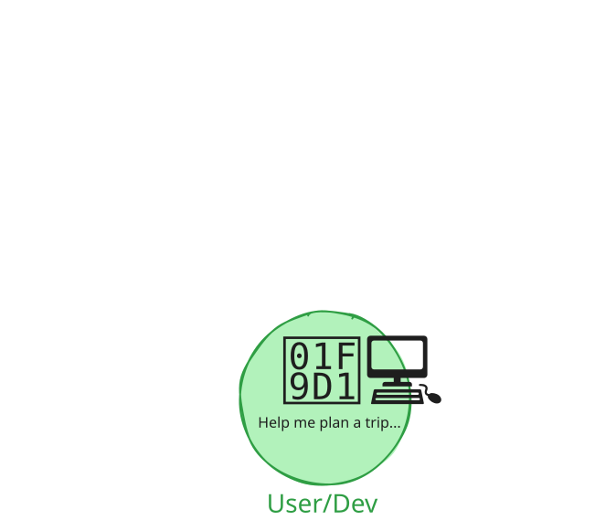
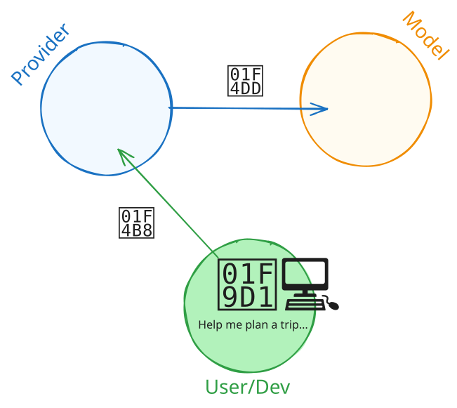
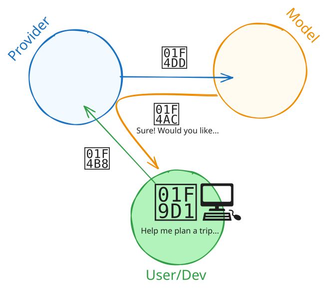
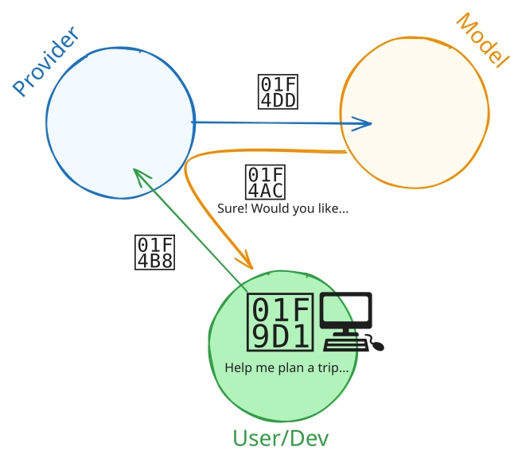
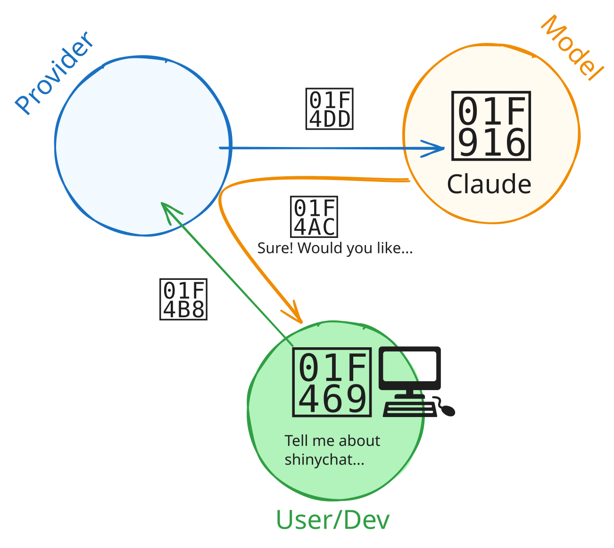
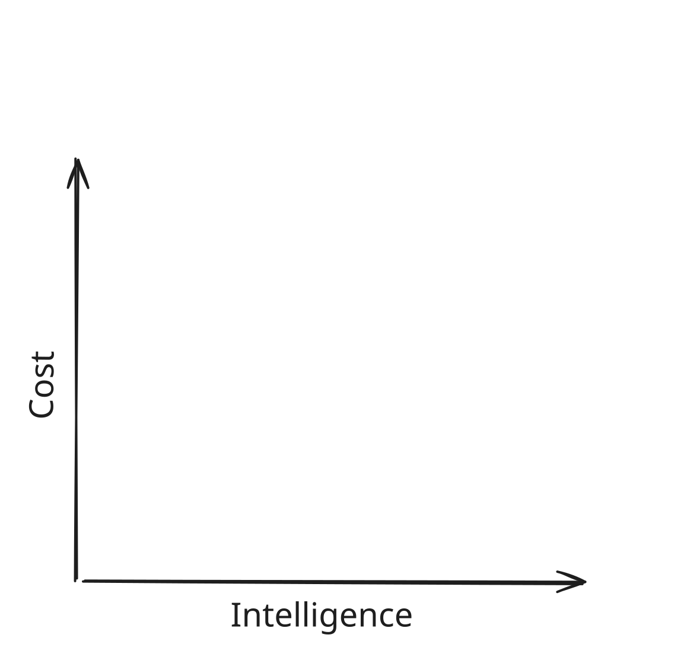
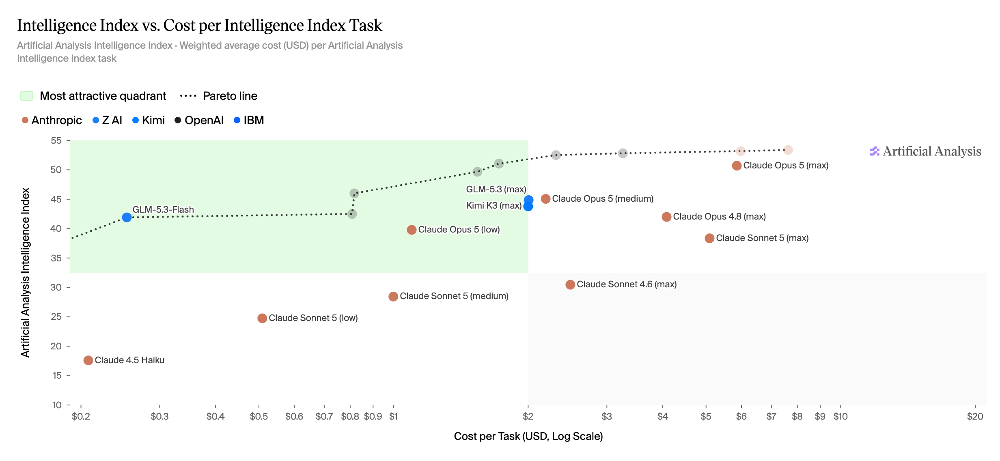
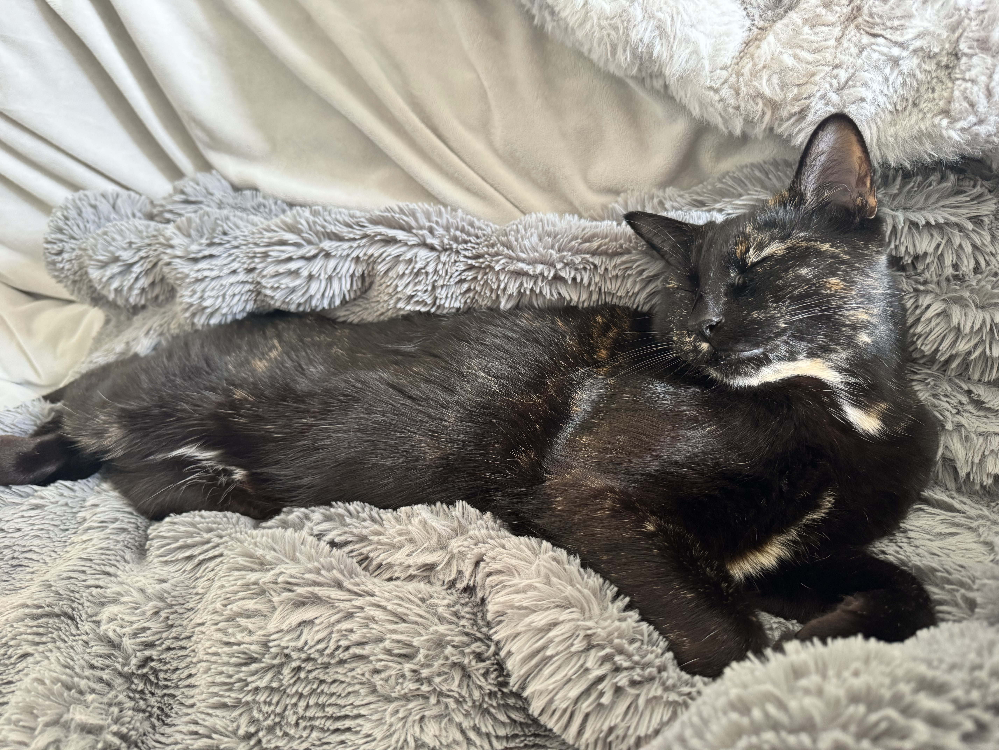
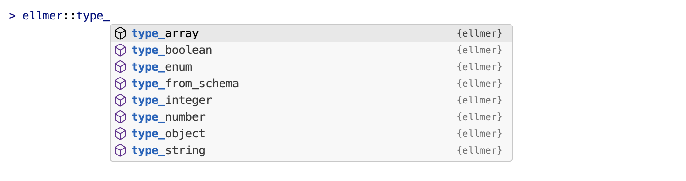

# [Providers and Models]{.white .ph4 style="background-color: #4ea8a7e6;"} {.no-invert-dark-mode background-image="assets/sunira-moses-Naj9-n5apvs-unsplash.jpg" background-size="cover" background-position="center"}

## {.center}

::: {.r-fit-text .incremental}
**Provider**
:    company that hosts and serves models

**Model**
:    a specific LLM with particular capabilities
:::

```{=html}
<style>
dt {
  line-height: 0.8;
}

dd {
  margin-bottom: 1em;
  margin-left: 0 !important;
}

dd:before {
  content: "\2192";
  font-family: var(--r-code-font);
  font-size: 0.8em;
  opacity: 0.66;
}
</style>
```

## {.text-center transition="fade"}



## {.text-center transition="fade"}


## {.text-center transition="fade"}



## {.text-center transition="fade"}


## {.text-center transition="fade"}



## {.text-center transition="fade"}



## {.text-center transition="fade"}


## {.text-center transition="fade"}



::: notes
Posit AI Pass is the provider we will use today.
It hosts models from several companies, including Anthropic's Claude models.
:::

## How are models different?

::: incremental
1. **Context:** How many tokens can you give the model?
1. **Speed:** How many tokens per second?
1. **Cost:** How much does it cost to use the model?
1. **Intelligence:** How smart is the model?
1. **Capabilities:** Does it support images, reasoning, tools, or structured output?
:::

::: notes
1. Context: 1M tokens is common among the newest models here.
   Smaller models can still have shorter windows like 200k for Claude Haiku 4.5.
1. Speed: In the table, output speed ranges from about 38 tokens/sec (Claude Opus 4.6) to 85 (Gemma 4 26B).
   These are Artificial Analysis measurements.
1. Cost: Relative Posit AI Pass costs range from 0.1x for Gemma 4 26B to 1.67x for the Claude Opus models.
   Output tokens usually cost more than input tokens.
:::

## {transition="fade"}

{style="display: block; margin: auto;"}

::: notes
Anthropic builds a family of models called Claude.
Within that family, model tiers trade speed and cost for intelligence.
:::

## {transition="fade"}

{style="display: block; margin: auto;"}

::: notes
* Haiku is small, fast, and cheap.
* Sonnet balances speed and intelligence.
* Opus is the largest and most intelligent.

The positions are conceptual, not benchmark results.
Version numbers identify newer generations within each tier.
:::

## {transition="fade"}

{style="display: block; margin: auto;"}

::: notes
OpenAI now uses space-themed names such as Luna, Terra, Sol, and Astra.
Earlier model families used labels such as mini, nano, and pro.
:::

## Open-weight and local models

::: {.incremental}
* **Open-weight** means the trained weights are available to download under a license.
* Run them locally, self-host them, or use a service like Hugging Face.
* Posit AI Pass also serves selected open-weight models.
* Some models are small enough to run on your laptop. Larger models require more memory or specialized hardware.
* LM Studio and Ollama are common tools for running models locally.
:::

::: notes
Open-weight does not necessarily mean open-source or unrestricted.
The model's license determines how you can use, modify, and redistribute it.

A model running on your computer is local.
A model running on infrastructure managed by your organization is self-hosted.

Open-weight models aren't necessarily local.
:::


## Posit AI Pass: Models from various providers {.smaller}

::: {.fragment}

:::

## Artificial Analysis ([artificialanalysis.ai](https://artificialanalysis.ai/leaderboards/models)) {.center}

[{width="111%" style="max-width: none; transform: translateX(-5%);" fig-alt="Scatter plot of Artificial Analysis Intelligence Index against cost per task for 16 models available through Posit AI. The upper-left green quadrant marks models with higher intelligence and lower cost."}][artificial-analysis-intelligence-cost]

::: notes
Up and to the left is better.
That means higher intelligence at a lower cost per task.

The green area marks the most attractive quadrant, and the dotted curve marks the Pareto line.
:::

[artificial-analysis-intelligence-cost]: https://artificialanalysis.ai/models?cost=intelligence-vs-cost-per-task&models=deepseek-v4-flash,claude-4-5-haiku-reasoning,claude-sonnet-4-6-adaptive,claude-sonnet-5,claude-sonnet-5-medium,claude-sonnet-5-low,claude-opus-4-6-adaptive,claude-opus-4-8,claude-opus-5,claude-opus-5-medium,claude-opus-5-low,glm-5-3-flash,glm-5-3,glm-5-2,kimi-k3,kimi-k3-low#intelligence-comparison-tabs

## Start capable, then test smaller

::: incremental
1. Start with a recent model that supports the capabilities you need.
1. Try a faster or cheaper model.
1. Keep the smaller model if it performs well on your task.
:::

## {#ellmer .center .smaller transition="fade"}

:::::: {style="display: flex; flex-direction: row; align-items: center; gap: 1em;"}
::::: {.column style="flex: 0 0 auto;"}
{width="170px"}
:::::

::::: {.column}
:::: fragment
**Providers**

::: incremental
* `chat_posit()`
* `chat_openai()`
* `chat_anthropic()`
* `chat_google_gemini()`
:::
::::

:::: fragment
**Open-weight and local models**

* `chat_lmstudio()`
* `chat_huggingface()`
::::

:::: fragment
**Enterprise**

* `chat_aws_bedrock()`
::::

:::: fragment
and more!
::::
:::::
::::::

::: footer
<https://ellmer.tidyverse.org/>
:::

## {#chatlas .center .smaller transition="fade"}

::::: {style="display: flex; flex-direction: row; align-items: center; gap: 1em;"}
:::: {.column style="flex: 0 0 auto;"}
::: {style="text-align: center; width: 260px;"}
**chatlas**

{width="190px"}
:::
::::

:::: {.column}
**Providers**

* `ChatPosit()`
* `ChatOpenAI()`
* `ChatAnthropic()`
* `ChatGoogle()`

**Open-weight and local models**

* `ChatLMStudio()`
* `ChatHuggingFace()`

**Enterprise**

* `ChatBedrockAnthropic()`

and more!
::::
:::::

::: footer
<https://posit-dev.github.io/chatlas/get-started/models.html>
:::

::: notes
The constructor determines which provider receives the request.
Direct access to Anthropic, OpenAI, or Google requires credentials for that provider.

Posit AI Pass is also a provider.
It hosts models created by several companies.
For example, `ChatPosit(model="moonshotai/Kimi-K3")` sends the request through Posit AI Pass, not directly to Moonshot AI.
:::

## Switch models with `model=`

::: {.easy-columns .smaller style="--code-font-size: 0.56em"}
::: col
[{height="36px" alt="R"} ellmer]{.flex .items-center .gap-1}

```r
chat <- chat_anthropic(
  model = "claude-sonnet-5"
)
```

::: fragment
```r
chat <- chat_anthropic(
  model = "claude-opus-4-8"
)
```
:::
:::

::: col
[{height="36px" alt="Python"} chatlas]{.flex .items-center .gap-1}

```python
chat = chatlas.ChatAnthropic(
    model="claude-sonnet-5"
)
```

::: fragment
```python
chat = chatlas.ChatAnthropic(
    model="claude-opus-4-8"
)
```
:::
:::
:::

::: notes
Both calls use Anthropic as the provider.
Only the model changes.
Direct Anthropic access requires Anthropic credentials.
:::

## Shortcut: `chat()` and `ChatAuto()` {transition="fade"}

::: {.easy-columns .smaller style="--code-font-size: 0.56em"}
::: col
[{height="36px" alt="R"} ellmer]{.flex .items-center .gap-1}

```{.r code-line-numbers="3"}
library(ellmer)

chat <- chat("posit")
```
:::

::: col
[{height="36px" alt="Python"} chatlas]{.flex .items-center .gap-1}

```{.python code-line-numbers="3-5"}
import chatlas

chat = chatlas.ChatAuto("posit")
```
:::
:::

::: notes
`chat()` and `ChatAuto()` provide a common interface across providers.
Give them a provider name to use that provider's default model.
Posit AI Pass currently selects Claude Sonnet 5 by default.
:::

## Shortcut: `chat()` and `ChatAuto()` {transition="fade"}

::: {.easy-columns .smaller style="--code-font-size: 0.56em"}
::: col
[{height="36px" alt="R"} ellmer]{.flex .items-center .gap-1}

```{.r code-line-numbers="3-5"}
library(ellmer)

chat <- chat(
  "posit/moonshotai/Kimi-K3"
)
```
:::

::: col
[{height="36px" alt="Python"} chatlas]{.flex .items-center .gap-1}

```{.python code-line-numbers="3-5"}
import chatlas

chat = chatlas.ChatAuto(
    "posit/moonshotai/Kimi-K3"
)
```
:::
:::

::: notes
Use `"provider/model"` to select both at once.
This example still uses Posit AI Pass as the provider and selects Kimi K3 as the model.
:::

## List models available through Posit AI Pass

::: {.easy-columns .smaller style="--code-font-size: 0.66em"}
::: col
[{height="36px" alt="R"} ellmer]{.flex .items-center .gap-1}

```r
library(ellmer)

models_posit()
```
:::

::: col
[{height="36px" alt="Python"} chatlas]{.flex .items-center .gap-1}

```python
import chatlas

chatlas.ChatPosit().list_models()
```
:::
:::

# Your Turn `07_models` {.slide-your-turn}



1. List the models available through Posit AI Pass.
1. Send the same prompt to two models.
1. Compare the responses.


# [Multimodal input]{.hidden} {background-image="assets/bud-helisson-kqguzgvYrtM-unsplash.jpg" background-size="cover" background-position="center"}

::: notes
Modern LLMs can handle images and PDFs in addition to text.
This is called multimodal input.
:::

[Multimodal input]{.white .b .absolute top="-400px" right=0 style="font-size: 3em;"}

## A picture is worth a thousand words {.center}

::: {.fragment .text-center}
{fig-alt="A tortoiseshell cat sleeping on a gray blanket." height="400"}

::: fragment
or, for Claude Sonnet 5, [274 tokens]{.b .blue}.
:::
:::

::: notes
`content_image_file()` resizes images to fit within 512 by 512 pixels by default.
This 4:3 photo becomes 512 by 384 pixels.
Claude Sonnet 5 currently reports 274 input tokens for an image-only request.
The count depends on the model and image-processing settings.
chatlas's `content_image_file()` also defaults to at most 512 by 512 (`resize="low"`), but prints a `MissingResizeWarning` unless you pass `resize` explicitly. use `resize="high"` for higher quality.
:::

## 🌆 content_image_file {transition="fade"}

::: notes
Use `content_image_file()` to pass an image from your local filesystem.
Provide the path to the image.
:::

::: {style="--code-font-size: 0.58em"}
[{height="36px" alt="R"} ellmer]{.flex .items-center .gap-1}

```{.r code-line-numbers="4|5-8"}
library(ellmer)

chat <- chat("posit")
image <- content_image_file("assets/cat.png")
chat$chat(
  image,
  "What do you see in this image?"
)
```


[{height="36px" alt="Python"} chatlas]{.flex .items-center .gap-1}

```{.python code-line-numbers="4|5-8"}
import chatlas

chat = chatlas.ChatAuto("posit")
image = chatlas.content_image_file("assets/cat.png")
chat.chat(
    image,
    "What do you see in this image?"
)
```
:::

## [🐈](https://placecats.com/bella/400/400){target="_blank" rel="noopener noreferrer"} content_image_url {transition="fade"}

::: notes
Use `content_image_url()` to pass an image from a URL.
The rest of the call stays the same.
:::

::: {style="--code-font-size: 0.66em"}
[{height="36px" alt="R"} ellmer]{.flex .items-center .gap-1}

```{.r code-line-numbers="5"}
library(ellmer)

chat <- chat("posit")
chat$chat(
  content_image_url("https://placecats.com/bella/400/400"),
  "What do you see in this image?"
)
```


[{height="36px" alt="Python"} chatlas]{.flex .items-center .gap-1}

```{.python code-line-numbers="5"}
import chatlas

chat = chatlas.ChatAuto("posit")
chat.chat(
    chatlas.content_image_url("https://placecats.com/bella/400/400"),
    "What do you see in this image?"
)
```
:::

## Your Turn `08_vision` {.slide-your-turn}

1. I've put some images of food in the `data/recipes/images` folder.

2. Your job: show the food to the LLM and see if it gets hungry.



## 📑 content_pdf_file

::: notes
LLMs can also read PDFs.
Use `content_pdf_file()` to pass a PDF from your filesystem.
:::

::: {style="--code-font-size: 0.66em"}
[{height="36px" alt="R"} ellmer]{.flex .items-center .gap-1}

```{.r code-line-numbers="5"}
library(ellmer)

chat <- chat_posit(model = "claude-haiku-4-5")
chat$chat(
  content_pdf_file("financial-report.pdf"),
  "What's my tax liability for 2024?"
)
```


[{height="36px" alt="Python"} chatlas]{.flex .items-center .gap-1}

```{.python code-line-numbers="5"}
import chatlas

chat = chatlas.ChatPosit(model="claude-haiku-4-5")
chat.chat(
    chatlas.content_pdf_file("financial-report.pdf"),
    "What's my tax liability for 2024?"
)
```
:::

## 📑 content_pdf_url

::: notes
Use `content_pdf_url()` to pass a PDF from a URL.
The rest of the call stays the same.
:::

::: {style="--code-font-size: 0.66em"}
[{height="36px" alt="R"} ellmer]{.flex .items-center .gap-1}

```{.r code-line-numbers="5"}
library(ellmer)

chat <- chat_posit(model = "claude-haiku-4-5")
chat$chat(
  content_pdf_url("http://pdf.secdatabase.com/1757/0001104659-25-042659.pdf"),
  "Describe Tesla's executive compensation and stock award programs."
)
```


[{height="36px" alt="Python"} chatlas]{.flex .items-center .gap-1}

```{.python code-line-numbers="5"}
import chatlas

chat = chatlas.ChatPosit(model="claude-haiku-4-5")
chat.chat(
    chatlas.content_pdf_url(
        "http://pdf.secdatabase.com/1757/0001104659-25-042659.pdf"
    ),
    "Describe Tesla's executive compensation and stock award programs."
)
```
:::

## Your Turn `09_pdf` {.slide-your-turn}

1. We have the actual recipes as PDFs in the `data/recipes/pdf` folder.

2. Your job: ask the LLM to convert the recipes to markdown.



# Structured output {background-image="assets/vitaly-taranov-J6hE2DTWSEw-unsplash.jpg" background-size="cover" background-position="center top"}

::: notes
Structured output asks an LLM to return data in a predictable format instead of free text.
:::

## How would you extract name and age? {style="--code-font-size: 0.66em"}

::: notes
Here's a common problem. You have messy text data and need to extract specific field like name and age.
:::

```{r}
#| echo: true

age_free_text <- list(
  "I go by Alex. 42 years on this planet and counting.",
  "Pleased to meet you! I'm Jamal, age 27.",
  "They call me Li Wei. Nineteen years young.",
  "Fatima here. Just celebrated my 35th birthday last week.",
  "The name's Robert - 51 years old and proud of it.",
  "Kwame here - just hit the big 5-0 this year."
)
```

## If you wrote R code, it might look like this... {.scrollable style="--code-font-size: 0.66em"}

::: notes
If you tried to solve this with traditional R code, you'd need complex regex patterns and string parsing. This is painful.
:::

```{r}
#| echo: true

word_to_num <- function(x) {
  # normalize
  x <- tolower(x)
  # direct numbers
  if (grepl("\\b\\d+\\b", x)) {
    return(as.integer(regmatches(x, regexpr("\\b\\d+\\b", x))))
  }
  # hyphenated like "5-0"
  if (grepl("\\b\\d+\\s*-\\s*\\d+\\b", x)) {
    parts <- as.integer(unlist(strsplit(
      regmatches(x, regexpr("\\b\\d+\\s*-\\s*\\d+\\b", x)),
      "\\s*-\\s*"
    )))
    return(10 * parts[1] + parts[2])
  }
  # simple word numbers
  ones <- c(
    zero = 0,
    one = 1,
    two = 2,
    three = 3,
    four = 4,
    five = 5,
    six = 6,
    seven = 7,
    eight = 8,
    nine = 9,
    ten = 10,
    eleven = 11,
    twelve = 12,
    thirteen = 13,
    fourteen = 14,
    fifteen = 15,
    sixteen = 16,
    seventeen = 17,
    eighteen = 18,
    nineteen = 19
  )
  tens <- c(
    twenty = 20,
    thirty = 30,
    forty = 40,
    fifty = 50,
    sixty = 60,
    seventy = 70,
    eighty = 80,
    ninety = 90
  )
  # e.g., "nineteen"
  if (x %in% names(ones)) {
    return(ones[[x]])
  }
  # e.g., "thirty five" or "thirty-five"
  x2 <- gsub("-", " ", x)
  parts <- strsplit(x2, "\\s+")[[1]]
  if (
    length(parts) == 2 && parts[1] %in% names(tens) && parts[2] %in% names(ones)
  ) {
    return(tens[[parts[1]]] + ones[[parts[2]]])
  }
  if (length(parts) == 1 && parts[1] %in% names(tens)) {
    return(tens[[parts[1]]])
  }
  return(NA_integer_)
}

# Extract name candidates
extract_name <- function(s) {
  # patterns that introduce a name
  pats <- c(
    "I go by\\s+([A-Z][a-z]+)",
    "I'm\\s+([A-Z][a-z]+(?:\\s+[A-Z][a-z]+)?)",
    "They call me\\s+([A-Z][a-z]+(?:\\s+[A-Z][a-z]+)?)",
    "^([A-Z][a-z]+) here",
    "The name's\\s+([A-Z][a-z]+)",
    "^([A-Z][a-z]+)\\s" # fallback: leading capital word
  )
  for (p in pats) {
    m <- regexpr(p, s, perl = TRUE)
    if (m[1] != -1) {
      return(sub(p, "\\1", regmatches(s, m)))
    }
  }
  NA_character_
}

# Extract age phrases and convert to number
extract_age <- function(s) {
  # capture common age phrases around a number
  m <- regexpr(
    "(\\b\\d+\\b|\\b\\d+\\s*-\\s*\\d+\\b|\\b[Nn][a-z-]+\\b)\\s*(years|year|birthday|young|this)",
    s,
    perl = TRUE
  )
  if (m[1] != -1) {
    token <- sub(
      "(years|year|birthday|young|this)$",
      "",
      trimws(substring(s, m, m + attr(m, "match.length") - 1))
    )
    return(word_to_num(token))
  }
  # handle pure word-number without trailing keyword (e.g., "Nineteen years young." handled above)
  m2 <- regexpr("\\b([A-Z][a-z]+)\\b\\s+years", s, perl = TRUE)
  if (m2[1] != -1) {
    token <- tolower(sub("\\s+years.*", "", regmatches(s, m2)))
    return(word_to_num(token))
  }
  # handle hyphenated "big 5-0"
  m3 <- regexpr("big\\s+(\\d+\\s*-\\s*\\d+)", s, perl = TRUE)
  if (m3[1] != -1) {
    token <- sub("big\\s+", "", regmatches(s, m3))
    return(word_to_num(token))
  }
  NA_integer_
}
```

## If you wrote R code, it might look like this... {.scrollable}

::: notes
Here's what running that code looks like.
The missing values and incorrect age for Kwame show how brittle handwritten parsing can be.
:::

::: {.easy-columns .gap-2}
```{r}
#| echo: true

dplyr::tibble(
  name = purrr::map_chr(age_free_text, extract_name),
  age = purrr::map_int(age_free_text, extract_age)
)
```

```{r}
#| echo: true

age_free_text
```
:::

## But if you ask an LLM... {transition="fade"}

::: notes
But with an LLM, you can just ask it to extract the name and age. Much simpler!
:::

```{.r code-line-numbers="4-5|8,11"}
library(ellmer)

chat <- chat_posit(
  system_prompt = "Extract the name and age."
)

chat$chat(age_free_text[[1]])
#>

chat$chat(age_free_text[[2]])
#>
```

## But if you ask an LLM... {transition="fade"}

::: notes
And it works! The LLM correctly extracts names and ages. But the output is still free text - wouldn't it be nice to get proper R objects?
:::

```{.r code-line-numbers="8-12"}
library(ellmer)

chat <- chat_posit(
  system_prompt = "Extract the name and age."
)

chat$chat(age_free_text[[1]])
#> Name: Alex; Age: 42

chat$chat(age_free_text[[2]])
#> Name: Jamal; Age: 27
```

## Wouldn't this be nice? {transition="fade"}

::: notes
What we really want is a proper R list with named fields. That's what structured output gives us.
:::

```{.r}
chat$chat(age_free_text[[1]])
#> list(
#>   name = "Alex",
#>   age = 42
#> )
```

## Structured chat output {transition="fade"}

::: notes
this is a job for chat_structured(), which will return structured data instead of text. But we need to tell it what structure we want.
`chat_structured()` requires a type
:::

```{.r code-line-numbers="1"}
chat$chat_structured(age_free_text[[1]])
#> list(
#>   name = "Alex",
#>   age = 42
#> )
```

## Structured chat output {transition="fade"}

::: notes
Define the structure with type_object(). Specify each field and its type. Then pass it to chat_structured().
:::

```{.r code-line-numbers="1-4|6"}
type_person <- type_object(
  name = type_string(),
  age = type_integer()
)

chat$chat_structured(age_free_text[[1]], type = type_person)
#> list(
#>   name = "Alex",
#>   age = 42
#> )
```

## Structured chat output {transition="fade"}

::: notes
And you get back proper R objects: a character vector for name, an integer for age. 
:::

```{.r code-line-numbers="7-11"}
type_person <- type_object(
  name = type_string(),
  age = type_integer()
)

chat$chat_structured(age_free_text[[1]], type = type_person)
#> $name
#> [1] "Alex"
#>
#> $age
#> [1] 42
```

## ellmer's type functions

::: notes
Here are the type functions available in ellmer.
You can add descriptions to explain what each field means.
:::



::: fragment
```{.r}
type_person <- type_object(
  name = type_string("The person's name"),
  age = type_integer("The person's age in years")
)
```
:::

## In Python, use Pydantic {transition="fade"}

```{.python code-line-numbers="2|4-6|9-12|13"}
import chatlas
from pydantic import BaseModel

class Person(BaseModel):
    name: str
    age: int

chat = chatlas.ChatPosit(model="claude-haiku-4-5")
chat.chat_structured(
    "I go by Alex. 42 years on this planet and counting.",
    data_model=Person
)
#> Person(name='Alex', age=42)
```

::: notes
Pydantic defines the expected fields and types for one structured result.
chatlas converts the Pydantic model into a schema for the provider.
After the provider responds, chatlas uses Pydantic to validate the response and return a `Person`.
The same Pydantic model works for single, parallel, and batch requests.
chatlas, rather than Pydantic, controls how the requests are submitted.
:::

::: footer
[chatlas: Structured Data](https://posit-dev.github.io/chatlas/get-started/structured-data.html)
:::

## In Python, use Pydantic {transition="fade"}

```{.python code-line-numbers="2,4-6"}
import chatlas
from pydantic import BaseModel, Field

class Person(BaseModel):
    name: str = Field(description="The person's name")
    age: int = Field(description="The person's age in years")

chat = chatlas.ChatPosit(model="claude-haiku-4-5")
chat.chat_structured(
    "I go by Alex. 42 years on this planet and counting.",
    data_model=Person
)
#> Person(name='Alex', age=42)
```

::: notes
Field descriptions give the model context about what to extract.
When the input might omit a value, allow `None` in the field's type.
This helps the model return a missing value instead of inventing one.
:::

## In Python, use Pydantic {transition="fade"}

```{.python code-line-numbers="2|4-10"}
import chatlas
from pydantic import BaseModel, ConfigDict

class Person(BaseModel):
    model_config = ConfigDict(use_attribute_docstrings=True)

    name: str
    """The person's name"""
    age: int
    """The person's age in years"""
```

::: notes
Attribute docstrings require the class source code to be available at runtime.
They do not work in an interactive interpreter, where `Field(description=...)` is more reliable.
:::

::: footer
[pydantic: use_attribute_docstrings](https://docs.pydantic.dev/latest/api/config/#pydantic.config.ConfigDict.use_attribute_docstrings)
:::

# Your Turn `10_structured-output` {.slide-your-turn}

1. We also have text versions of the recipes in `data/recipes/text`.

1. Use `ellmer::type_*()` or a Pydantic model to extract structured data from the recipe you used in **activity 09**.

1. I've given you the expected structure, you just need to implement it.



# Parallel calls {background-image="assets/barna-bartis-1DLPzq1kL3M-unsplash.jpg" background-size="cover" background-position="center"}

## Structured chat output {transition="fade"}

```{.r code-line-numbers="6-11"}
type_person <- type_object(
  name = type_string(),
  age = type_integer()
)

chat$chat_structured(age_free_text[[1]], type = type_person)
#> $name
#> [1] "Alex"
#>
#> $age
#> [1] 42
```

::: notes
One prompt produces one structured result.
So far, every example processes one string at a time.
:::

## Structured chat output {transition="fade"}

```{.r code-line-numbers="6-7"}
type_person <- type_object(
  name = type_string(),
  age = type_integer()
)

chat$chat_structured(age_free_text, type = type_person)
#> ???
```

::: notes
Pose the question: what happens if we pass the whole list of prompts instead of just one?
Take guesses from the room before advancing to the next slide.
:::

## Structured chat output {transition="fade"}

```{.r code-line-numbers="6-11"}
type_person <- type_object(
  name = type_string(),
  age = type_integer()
)

chat$chat_structured(age_free_text, type = type_person)
#> Error in `FUN()`:
#> ! `...` must be made up strings or <content> objects, not a list.
```

::: notes
It fails: `chat_structured()` takes individual prompts via `...`, not a collection.
The takeaway is that you can't vectorize structured output by passing a list.
This is the motivation for `parallel_chat_structured()`, which we see next.
:::

## Parallel chat calls {transition="fade"}

```{.r}
chat <- chat_posit(model = "claude-haiku-4-5")

parallel_chat_structured(
  chat,
  age_free_text,
  type = type_person,
  max_active = 4,
  on_error = "stop"
)
```

::: notes
We use claude-haiku-4-5 for these parallel examples.
GLM-5.3-Flash sometimes returned incomplete structured extractions 
:::

## Parallel chat calls {transition="fade"}

```{.r}
chat <- chat_posit(model = "claude-haiku-4-5")

parallel_chat_structured(
  chat,
  age_free_text,
  type = type_person,
  max_active = 4,
  on_error = "stop"
)
#> [working] (0 + 0) -> 2 -> 4 | ■■■■■■■■■■■■■■■■■■■■■             67%
```

## Parallel chat calls {transition="fade"}

```{.r}
chat <- chat_posit(model = "claude-haiku-4-5")

parallel_chat_structured(
  chat,
  age_free_text,
  type = type_person,
  max_active = 4,
  on_error = "stop"
)
#>     name age
#> 1   Alex  42
#> 2  Jamal  27
#> 3 Li Wei  19
#> 4 Fatima  35
#> 5 Robert  51
#> 6  Kwame  50
```

## Batch chat calls {transition="fade"}

```{.r code-line-numbers="1"}
batch_chat_structured(
  chat,
  age_free_text,
  type = type_person,
  path = "people.json"
)
```

::: notes
This introduces the batch helper.
The current `chat` uses Posit AI, so this call is not runnable yet.
The next slide switches to a direct provider that supports batching.
:::

## Batch chat calls {transition="fade"}

```{.r code-line-numbers="5"}
batch_chat_structured(
  chat,
  age_free_text,
  type = type_person,
  path = "people.json"
)
```

::: notes
The path stores the batch job state and completed responses.
You can stop waiting and later call the same function with the same path to resume.
:::

## Batch chat calls {transition="fade"}

```{.r code-line-numbers="1"}
chat <- chat("anthropic/claude-haiku-4-5")
batch_chat_structured(
  chat,
  age_free_text,
  type = type_person,
  path = "people.json"
)
```

::: notes
This final call is runnable with direct Anthropic credentials.
Posit AI does not expose the Anthropic batch API.
:::

## Parallel chat calls in Python

```{.python code-line-numbers="6|8-14|16"}
prompts = [
    "I go by Alex. 42 years on this planet and counting.",
    "Pleased to meet you! I'm Jamal, age 27.",
]

chat = chatlas.ChatPosit(model="claude-haiku-4-5")

results = await chatlas.parallel_chat_structured(
    chat,
    prompts,
    Person,
    max_active=4,
    on_error="stop",
)

people = [result.data for result in results]
```

::: notes
`Person` still defines and validates one structured result.
It does not control parallel processing.
`parallel_chat_structured()` is asynchronous in Python, so call it with `await`.
chatlas submits ordinary requests concurrently and keeps at most `max_active` requests active.
Each result contains the extracted Pydantic object in its `data` attribute.
:::

## Batch vs. parallel

::: easy-columns
::: col
### Parallel

* Sends ordinary requests at the same time

* Returns results during the current session

* Uses ordinary per-request pricing

* Works through Posit AI
:::

::: col
### Provider batch API

* Uploads requests to a provider-managed queue

* May take up to 24 hours

* Often has lower per-token pricing

* Is not available through Posit AI
:::
:::

::: notes
Parallel processing does not combine the prompts into one request.
It sends one normal request for each prompt and limits how many requests are active.

A provider batch API is a separate service.
The provider stores the requests, schedules them, and makes the results available later.
That scheduling flexibility is why providers can offer lower batch prices.

Posit AI supports parallel ordinary requests but does not expose provider batch APIs.
:::

## chatlas.batch_chat_structured {transition="fade"}

```{.python}
chat = chatlas.ChatAuto("anthropic/claude-haiku-4-5")
results = chatlas.batch_chat_structured(
    chat=chat,
    prompts=prompts,
    data_model=Person,
    path="people.json",
)
```

::: notes
`Person` still defines and validates each structured result in the batch.
chatlas submits the prompts through the provider's batch API and retrieves the results.
This example also requires direct Anthropic credentials.
:::

# Your Turn `11_parallel` {.slide-your-turn}

1. Take your `type_recipe` or `Recipe` model from **activity 10**...

2. And apply it to _all the text recipes_ in `data/recipes/text`.

3. Use `parallel_chat_structured()` with Posit AI.

4. Allow no more than four active requests at once.

5. Save the results to `data/recipes/recipes.json` and try the Shiny recipe cookbook app.


