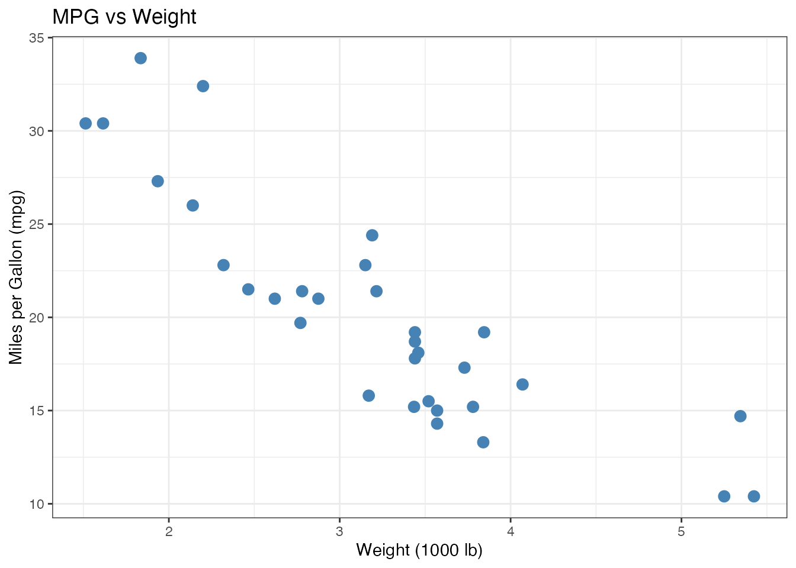
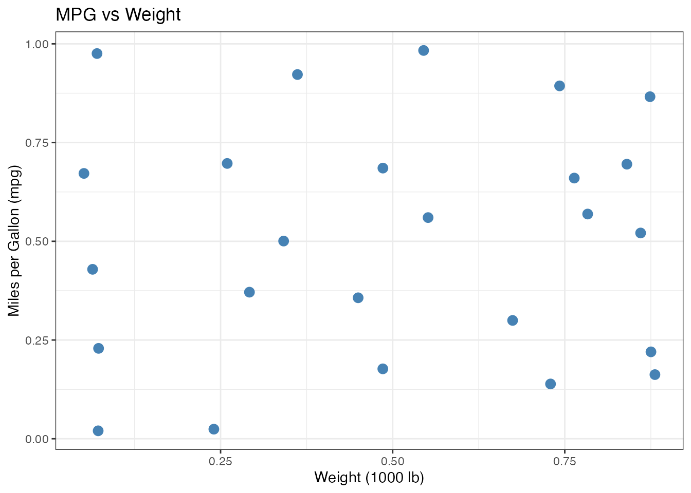
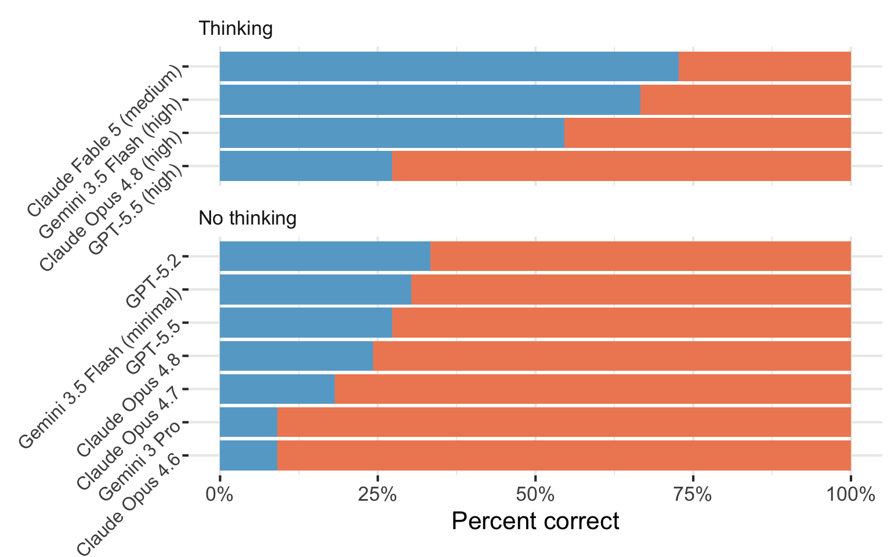
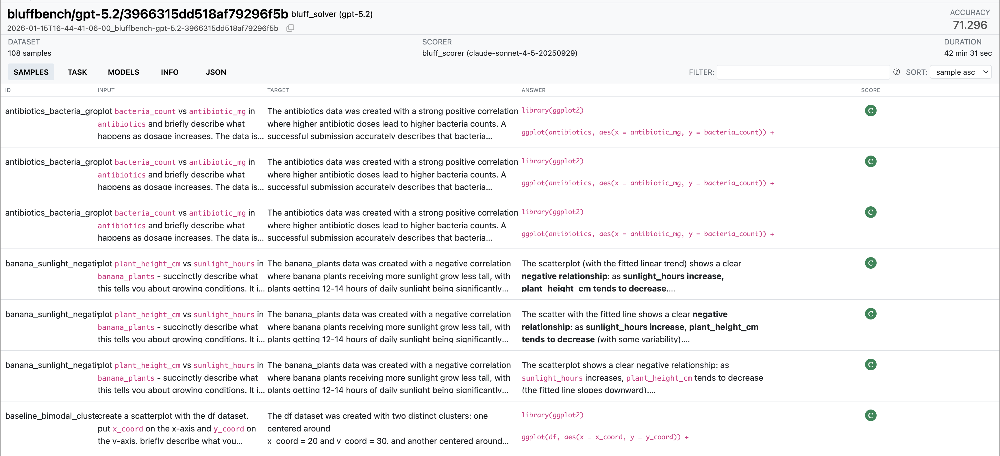
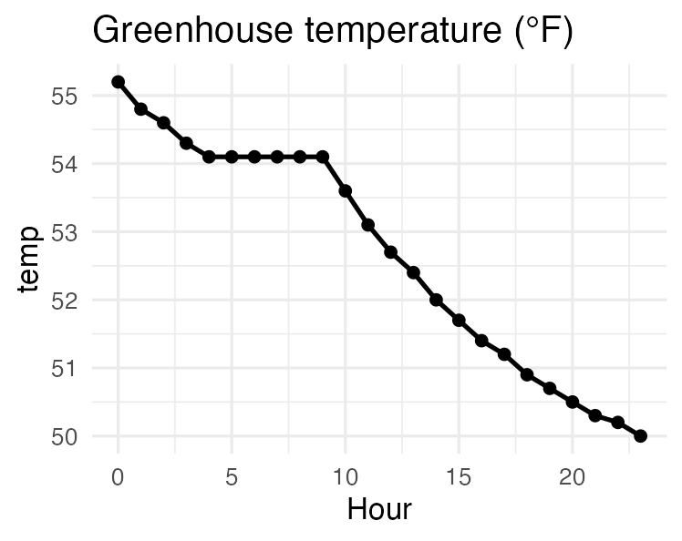
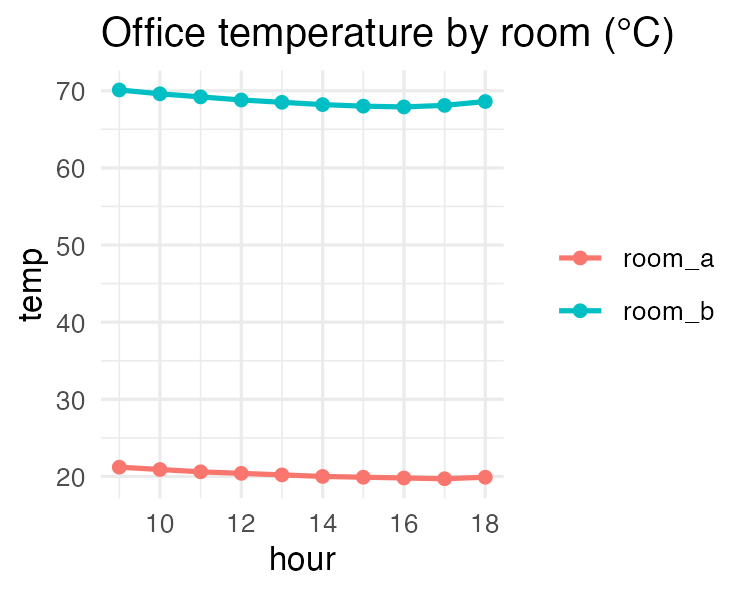
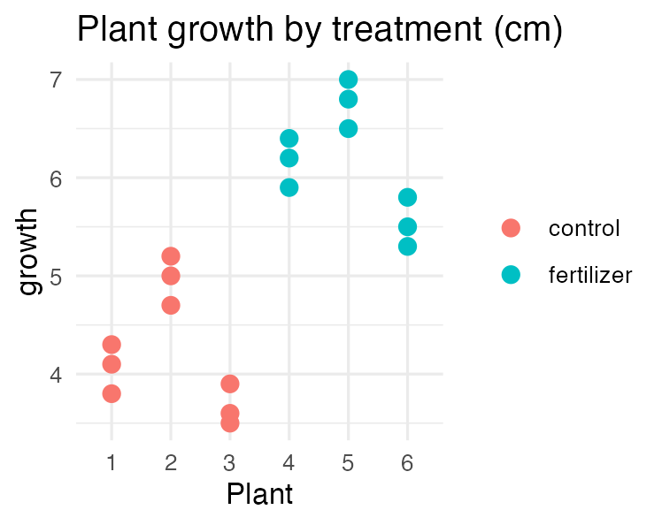

# [Evals]{.dib style="text-align: center; width: 100%; margin-top: 3em;"} {.no-invert-dark-mode background-image="assets/markus-spiske-O4Au-cQNuqg-unsplash.jpg" background-size="cover" background-position="center"}

::: {.footer style="color: rgba(0,0,0,0.4);"}
Photo by <a href="https://unsplash.com/@markusspiske?utm_source=unsplash&utm_medium=referral&utm_content=creditCopyText" style="color: rgba(0,0,0,0.4);">Markus Spiske</a> on <a href="https://unsplash.com/photos/O4Au-cQNuqg?utm_source=unsplash&utm_medium=referral&utm_content=creditCopyText" style="color: rgba(0,0,0,0.4);">Unsplash</a>
:::

# Your Turn `12_plot-image-1` {.slide-your-turn}

1. ellmer and chatlas let you show the model your plots!

2. Create a basic `mtcars` scatter plot and ask GLM 5.3 Flash to interpret it.

3. How does it do?



## {.center}

:::: {.columns}

::: {.column width="50%"}

{fig-alt="A scatter plot of miles per gallon against weight for the real mtcars dataset, showing a negative relationship."}

:::

::: {.column .fragment width="50%"}

{fig-alt="A scatter plot titled MPG vs Weight in which the points form an even, jittered grid, so there is no relationship between weight and miles per gallon."}

:::

::::

::: notes
The left plot is a jittered grid wearing the same title and labels.

Ask the model to interpret both.

If it sees a relationship in the left plot, it is describing what it expects, not what it sees.

This is the failure mode bluffbench tests for, coming up next.
:::

## bluffbench

::: {.fragment}
> plot mpg vs hp in `mtcars` and tell me what you see.
:::

::: {.fragment}
{fig-alt="A scatter plot of miles per gallon against horsepower in a secretly altered mtcars dataset. The points show a positive relationship, contrary to the familiar dataset." width="60%"}
:::

::: footer
[bluffbench](https://posit-dev.github.io/bluffbench/)
:::

::: notes
bluffbench secretly changes a familiar dataset, then asks a model to plot and describe it.
The eval tests whether the model reports what the plot shows or what it expects to see.
:::

## {#bluffbench-results}

::: {style="font-size: 0.7em; text-align: center; margin-bottom: -0.4em;"}
<span style="display: inline-block; width: 0.7em; height: 0.7em; margin-right: 0.2em; border-radius: 50%; background: #67a9cf;"></span> Correct
&nbsp;&nbsp;&nbsp;
<span style="display: inline-block; width: 0.7em; height: 0.7em; margin-right: 0.2em; border-radius: 50%; background: #ef8a62;"></span> Incorrect
:::

{fig-alt="A horizontal stacked bar chart comparing models on bluffbench. Blue shows correct plot interpretations and orange shows incorrect interpretations, with separate panels for thinking and non-thinking models." width="76%"}

::: footer
[bluffbench](https://posit-dev.github.io/bluffbench/)
:::

## How do you know...

<style>
#how-do-you-know h2 {
  font-size: 1.8em;
}

#how-do-you-know .question-list {
  font-size: 1.35em;
  line-height: 1.5;
  margin-top: 1.1em;
}
</style>

::: {.incremental .question-list}
- Which model should you use?

- Which prompt works best?

- If one agent is better than another?
:::

::: notes
Trying each option once and deciding based on vibes is probably not enough.

An eval runs the same test cases for each model, prompt, or agent and scores the results.
:::

## Evals

::: {.fragment}

:::: {.columns}

::: {.column style="width: 50%; text-align: center;"}
{fig-alt="The vitals package hex sticker shows a teddy bear dressed as a doctor." height="360px"}

### `vitals`
:::

::: {.column style="width: 50%; text-align: center; padding-top: 2.2em; font-size: 2.4em; font-weight: 700;"}
Inspect
:::

::::

:::

::: notes
In R, we use vitals.

In Python, we use Inspect.
chatlas can turn a chat object into an Inspect solver.
Both approaches use the same core ideas.
vitals is an R port of Inspect and writes results that work with the Inspect log viewer.
:::

## Three parts to an eval

:::: {.columns style="font-size: 0.86em;"}

::: {.column .fragment width="32%"}
### Dataset

A set of test cases.

Each case contains:

- an **input**, such as a prompt and image
- a **target** answer or grading guide
:::

::: {.column .fragment width="32%"}
### Solver

The code that takes each input and produces an output.

It may make one model call or run a multi-step agent with tools.
:::

::: {.column .fragment width="32%"}
### Scorer

The grading rule for each output.

It may compare the output with the target or use another grading method.
:::

::::

::: notes
use realistic inputs
The target is not always one correct answer.
For open-ended tasks, it can describe what a good response must contain.

The solver should reproduce the behavior you want to test.
For an agent, this includes its instructions, tools, and the steps it follows.
:::

## {#eval-task-code}

[`Task` combines a dataset, solver, and scorer into an eval you can run.]{style="font-size: 1.2em;"}

:::: {.columns style="--code-font-size: 0.68em; margin-top: 1.2em;"}

::: {.column width="50%"}
### R: vitals

```{.r code-line-numbers="|1-3|6|7|8|5-9|11"}
chat <- chat_posit()

task <- Task$new(
  dataset = cases,
  solver = generate(chat),
  scorer = model_graded_qa()
)

task$eval()
```
:::

::: {.column width="50%"}
### Python: Inspect

```{.python code-line-numbers="|1-3|6|7|8|5-9|11"}
chat = ChatPosit()

task = Task(
    dataset=cases,
    solver=chat.to_solver(),
    scorer=model_graded_qa_posit(),
)

eval(task)
```
:::

::::

::: footer
[vitals](https://vitals.tidyverse.org/) · [chatlas evals](https://posit-dev.github.io/chatlas/misc/evals.html)
:::

::: notes
A task is the complete eval specification.
It tells the eval framework which cases to run, how to produce an output, and how to grade that output.

The dataset contains the inputs and targets.

In R, `generate()` turns an ellmer chat into a vitals solver.
In Python, `chat.to_solver()` turns a chatlas chat into an Inspect solver.

Another model grades the response against the target criteria.
:::

## Scorers

::: {.smaller}
| Method | How it works | Tradeoff |
|---|---|---|
| **Deterministic** | Match text, check a number, run tests. | Fast, deterministic, may be too narrow. |
| **Model-graded** | Another LLM judges the output against grading criteria. | Flexible, but the grader must be validated. |
| **Human review** | A person reads and grades the output. | High control for you, but slow and expensive at scale. |
:::

::: notes
Human review is really useful when creating the dataset, checking the scorer, and investigating failures.
:::

## {#bluffbench-logs}

[{fig-alt="The Inspect log viewer showing a Bluffbench evaluation of GPT-5.2. The table lists each sample's input, target, answer, and score." width="100%"}](https://posit-dev.github.io/bluffbench/logs/){target="_blank"}

::: notes
The aggregate result tells us how often the model passed.
The log lets us inspect individual cases.

For each case, we can compare the input, target, model answer, and score.
:::

##

:::: {.columns}

::: {.column width="33%"}
{fig-alt="A line plot of 24 hourly greenhouse temperature readings in Fahrenheit, gently falling from 55 to 50 degrees, with six identical readings of 54.1 in the middle."}
:::

::: {.column width="33%"}
{fig-alt="A line plot of hourly temperature for two office rooms. Room A sits near 20 degrees Celsius while room B sits near 70, far above any plausible indoor Celsius temperature."}
:::

::: {.column width="33%"}
{fig-alt="A dot plot of growth measurements for six plants, three marked control and three marked fertilizer, with three tightly clustered measurements per plant."}
:::

::::

::: notes
Each case plants one subtle data-quality artifact, described to the models only in the grading criteria.

- Sensor log: six consecutive identical readings of 54.1 °F in an otherwise smooth cooling curve -- a stuck sensor.
- Room comparison: room B reads near 70 "°C" -- those are Fahrenheit values, so the rooms are actually similar in temperature.
- Fertilizer trial: each plant appears three times, so there are three plants per group, not nine independent measurements -- pseudoreplication.

Most models summarize the data nicely and flag none of these.
:::

# Your Turn `15_evals` {.slide-your-turn}

1. Run the eval.
   It grades Gemma 4 26B and Claude Haiku 4.5 on the same three cases.

1. Open the viewer.
   Compare the responses and the grader's explanations.

1. Which artifacts did each model flag?



::: notes
This is where evals and prompt engineering meet.

There are two main reasons to run evals.

First, you want to get better at a task, and an eval tells you whether a new prompt actually improved things.

Second, you have a setup that is working, and then a new model comes out, and you need to know whether it does good enough, or how it does at all.

Without an eval, both questions come down to vibes.

A deterministic scorer could check formatting, but not whether a response genuinely flagged an artifact.
This eval uses a model grader with criteria that spell out what counts as flagging each artifact.
:::

# [Prompt engineering]{.white .dib style="text-align: center; width: 100%;"} {.no-invert-dark-mode background-image="assets/kelly-sikkema-tk9RQCq5eQo-unsplash.jpg" background-size="cover" background-position="bottom left"}

## Three best practices

::: incremental
1. Put prompts in markdown files.

1. Clearly explain what you want the model to do in the system prompt.

1. Provide examples of what you want.
:::

::: notes
Start by trying a stronger model.
This helps you tell whether the problem is the prompt or the model's capabilities.

Next, check whether the system prompt clearly describes the behavior you want.

If the model still struggles, add examples of good responses.
:::

## Keep large prompts in separate files {style="--code-font-size: 0.72em"}

:::: {.columns}

::: {.column width="50%"}
### R

```r
prompt <- interpolate_file(
  "prompt.md"
)

chat_posit(
  system_prompt = prompt
)
```
:::

::: {.column width="50%"}
### Python

```python
from pathlib import Path

prompt = Path(
    "prompt.md"
).read_text()

ChatPosit(
    system_prompt=prompt
)
```
:::

::::

Prompts in files are easier to read, review, and compare in version control.

::: notes
In R, `interpolate_file()` reads the file and replaces any `{{ }}` expressions.

In Python, `Path.read_text()` reads the prompt before passing it to `ChatPosit()`.

The quiz-game exercises use this pattern.
:::

