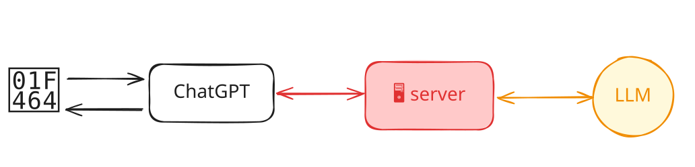
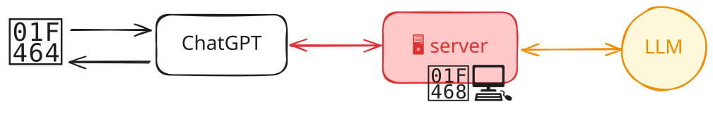
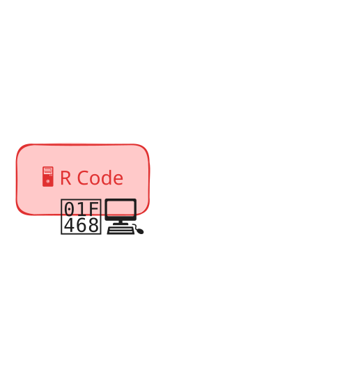
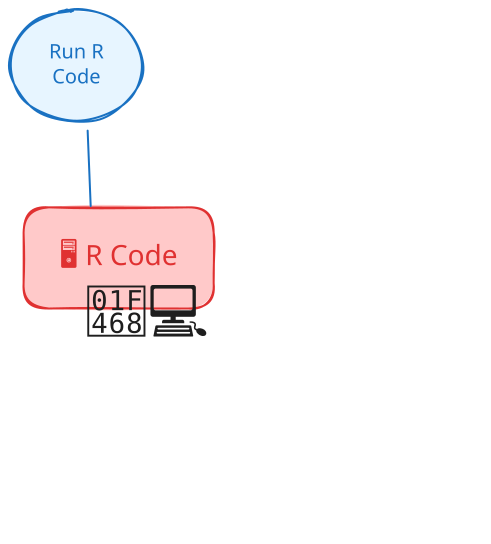
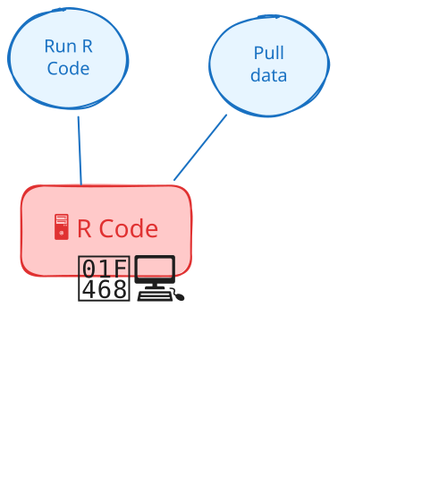
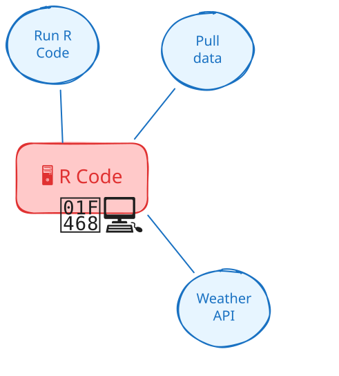
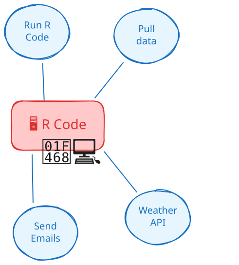
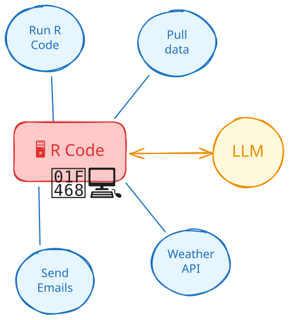

# [Tool calling]{.hidden} {.no-invert-dark-mode background-image="assets/robot-tools.jpg" background-size="cover" background-position="center"}

::: hidden
A robot wearing a tool belt, selects a tool from a wall of futuristic space tools. A sign above the wall reads "Tools".
:::

## Recall: How do LLMs work? {.center}

::: incremental
1. You write some words

2. The LLM writes some more words

3. You _use those words_
:::

## On its own, can a word-writing model... {.center}

::: {.incremental style="font-size: 1.5em"}
* Access the internet?

* Send an email?

* Interact with the world?
:::

## Let's try it

```{.r}
library(ellmer)

chat <- chat("openai/gpt-4.1-nano")

chat$chat("What's the weather like in Houston, TX?")
chat$chat("Who are the keynote speakers at posit::conf(2026)?")
chat$chat("What day is it?")
```

::: mt3
```{.python}
import chatlas

chat = chatlas.Chat(model="openai/gpt-4.1-nano")
chat.chat("What's the weather like in Houston, TX?")
chat.chat("Who are the keynote speakers at posit::conf(2026)?")
chat.chat("What day is it?")
```
:::

::: notes
Run these in the terminal.

Ask: how could we get the model to know these answers? Let's start with the easiest one: what day is it?

Answer: we could just tell it in the system prompt.

What about keynote speakers? We could include that in the system prompt too. But what if the schedule changes?

What about the weather? The model can't know that because it's not connected to the internet.
:::

## Tools {.center}

a.k.a. _functions_, _tool calling_ or _function calling_

::: incremental
* Bring real-time or up-to-date information to the model

* Let the model interact with the world
:::

::: notes
Tools are extra capabilities that you give to the LLM, like the ability to search the posit::conf(2026) schedule.
These capabilities are things that the model can't do on its own.
The goal is let the model pull in real-time, or up-to-date, or high-quality information as needed, depending on the conversation.

They can also give the model new abilities to take action on behalf of the user.
:::

# Chatbot Systems

## {.center style="text-align: center" transition="fade"}



::: footer
user vs. programmer
:::

## {.center style="text-align: center" transition="fade"}




## {.center style="text-align: center" transition="fade"}


## {.center style="text-align: center" transition="fade"}




## {.center style="text-align: center" transition="fade"}




## {.center style="text-align: center" transition="fade"}




## {.center style="text-align: center" transition="fade"}




## {.center style="text-align: center" transition="fade"}




## {.center style="text-align: center" transition="fade"}




## How do tool calls work? {.center}

What should I wear to posit::conf(2026) in Houston?

::: notes
So how do we connect the LLM to the code that this data scientist has written (or could write) to give the model new abilities?
:::

## Human in the loop {.center}

👨‍💻 [_demos/15_demo_manual-tools]{.code .b .purple}

## Wait... I can write code! {.center}

👨‍💻 Work through the script to register the tool, then run the app to see it in action

👨‍💻 [16_weather-tool-01-start.R]{.code .b .purple} → [16_weather-tool-app.R]{.code .b .purple}

::: notes
Live-code the demo script from `-start` to `-end` to register the tool with ellmer or chatlas, then just run the Shiny app (R or Python) so everyone sees the tool calls happening in the chat UI.
:::

::: footer
[ellmer: ContentToolResult](https://ellmer.tidyverse.org/reference/Content.html) · [chatlas: ContentToolResult](https://posit-dev.github.io/chatlas/reference/types.ContentToolResult.html) · [Tool calling UI in shinychat](https://shiny.posit.co/blog/posts/shinychat-tool-ui/)
:::

## {.center style="text-align: center" transition="fade"}


::: notes
Zooming out again, the conversation starts with a user sending a message to the chatbot.

In this case, the user asks the model whether they can go to the pool today.
(I live in Houston, TX.)

How much does the model know about the weather in Houston, TX?

**What's the weather like today in Houston, TX?**

> I'm unable to provide real-time weather updates. For the latest weather forecast in Houston, TX, please check a trusted weather service such as
the National Weather Service, Weather.com, or a weather app on your device.

**Go ahead and guess**

> Sure! Since it's September in Houston, TX, you can generally expect hot and humid weather. Temperatures might range from the mid-80s to low 90s
Fahrenheit (around 29-34°C). There could also be some afternoon thunderstorms or showers, which are common along the Gulf Coast. Keep a
fan or air conditioning handy if you're indoors, and stay hydrated!
:::

## {.center style="text-align: center" transition="fade"}


::: notes
Now imagine we've told the LLM that it has access to a tool called `get_weather()`.
Knowing that it 1) needs to know the weather in Houston and 2) it doesn't know the weather in Houston, TX; the model decides to use the weather tool.

It sends back a message that includes a tool call, basically instructions to call the `get_weather()` function with the argument `77010`.
Notice that the model _does know_ that the Hilton Americas-Houston is in the 77010 ZIP code.
:::

## {.center style="text-align: center" transition="fade"}


::: notes
The programmer can then take that message from the LLM with the instructions to call the tool and they go off and run the code that satisfies the tool request, in this case querying the weather API for the weather in 77010 because that has been a stable fact for a long time.
:::

## {.center style="text-align: center" transition="fade"}


::: notes
The weather API sends back some data:

* The forecast is mostly sunny
* High of 98ºF
* Low of 78ºF
:::

## {.center style="text-align: center" transition="fade"}


::: notes
The programmer sends that data back to the LLM.
Note that it's often in a pretty raw format, like JSON.
Not the kind of thing you'd want to read directly unless you're the kind of person who likes reading computer data formats.
:::

## {.center style="text-align: center" transition="fade"}


::: notes
The LLM doesn't mind JSON though, so it reads the data and generates a response that _incorporates_ the data from the tool call.
:::

## {.center style="text-align: center" transition="fade"}


## Recap: Tool definitions in R

```{.r code-line-numbers="|1|2|3|4-11"}
tool_get_weather <- tool(
  tool_fn,
  description = "How and when to use the tool",
  arguments = list(
    .... = type_string(),
    .... = type_integer(),
    .... = type_enum(
      c("choice1", "choice2"),
      required = FALSE
    )
  )
)
```

## Recap: Tool definitions in Python

```{.python}
def get_weather(lat, lon):
    return NWS.GetCurrentForecast(lat, lon)
```

## Recap: Tool definitions in Python

```{.python code-line-numbers="1-1"}
def get_weather(lat: float, lon: float):
    return NWS.GetCurrentForecast(lat, lon)
```

## Recap: Tool definitions in Python

```{.python code-line-numbers="2-11"}
def get_weather(lat: float, lon: float):
    """
    Get forecast data for a specific latitude and longitude.

    Parameters
    ----------
    lat : str
        Latitude of the location.
    lon : str
        Longitude of the location.
    """
    return NWS.GetCurrentForecast(lat, lon)
```

# Your Turn `17_quiz-game-2` {.slide-your-turn}

1. I've set up a Quiz Game app with a function that plays a sound when called.

1. Your job: teach the model to play sounds at the right moments in the game.

1. _You can use your prompt or switch `_exercises` &rarr; `_solutions` to use ours._



::: notes
Follow up question: why send a string back to the LLM that says the sound was played?
:::

# [Tool UI]{.hidden} {.no-invert-dark-mode background-image="assets/robot-tools-shinychat.jpg" background-size="cover" background-position="center"}

::: hidden
A robot is standing in front of a display case, pointing at a holographic interface showing various tools and options. The robot appears to be selecting a tool from the interface.
:::

## Tool Annotations

* Provide **hints** to clients about tool behavior

* Help humans and AI systems make informed decisions about tool usage

* All properties are **hints only** - not guaranteed to be accurate

* [MCP Tool Annotations Spec](https://modelcontextprotocol.io/specification/2025-06-18/schema#toolannotations){preview-link=true}

## Key Annotations

| Property | Description |
|:---------|:------------|
| **`title`** | Human-readable tool name |
| **`icon`** | Icon shown next to the tool (shinychat only) |
| **`readOnlyHint`** | Tool doesn't modify environment |
| **`destructiveHint`** | May perform destructive updates |
| **`idempotentHint`** | Repeated calls with same arguments return same |
| **`openWorldHint`** | Interacts with external entities vs. closed domain |

: {tbl-colwidths="[30, 70]"}

## Tool Annotations in R

```{.r code-line-numbers="|4-8|5-6|7"}
tool_get_weather <- tool(
  get_weather,
  # description, arguments, ...
  annotations = tool_annotations(
    title = "Get Weather",
    readOnlyHint = TRUE,
    icon = fontawesome::fa_i("cloud-sun")
  )
)
```

::: footer
[ellmer: Tool Annotations](https://ellmer.tidyverse.org/reference/tool_annotations.html){preview-link=true}
:::

## Tool Annotations in Python

```{.python code-line-numbers="1|2|3-9|4-5|6-8"}
chat.register_tool(
    get_weather,
    annotations={
        "title": "Get Weather",
        "readOnlyHint": True,
        "extra": {
            "icon": faicons.fa_i("cloud-sun"),
        },
    },
)
```

::: footer
[chatlas (Python): ToolAnnotations](https://posit-dev.github.io/chatlas/reference/types.ToolAnnotations.html){preview-link=true}
:::


## Your Turn `18_quiz-game-3` {.slide-your-turn}

1. Add tool annotations to our `play_sound` tools.

2. Pick an icon from [FontAwesome free icons](https://fontawesome.com/search?q=speaker&ic=free&o=r)



## Tools in Shiny

::: incremental
* Define the tool function **inside the server**

* You can **update reactive values** in the tool function!

* You can **read reactive values**, _if you `isolate()` reads_. (Be careful!)

* _We will come back to this later_ 😉
:::
