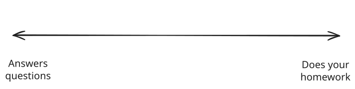
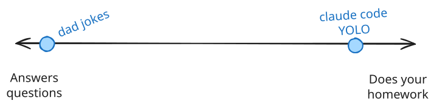
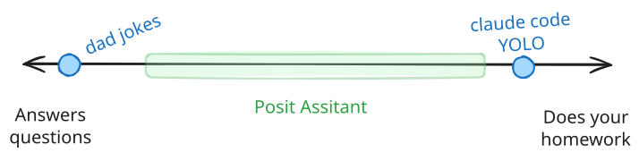
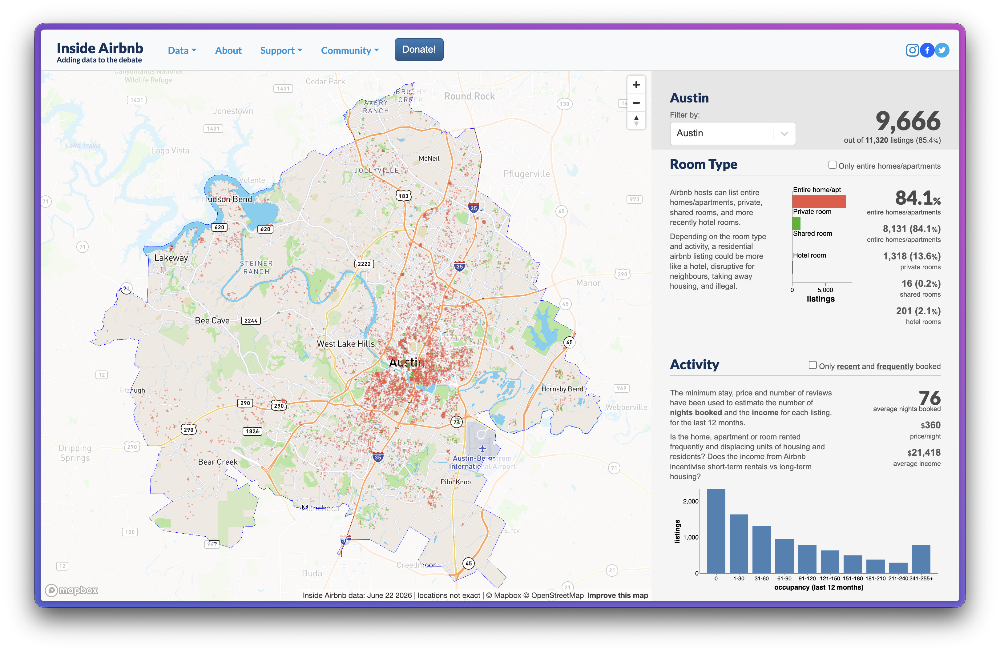
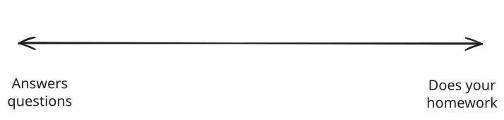
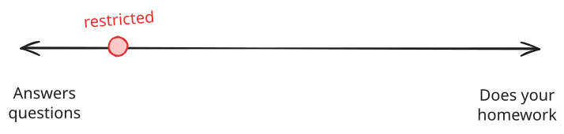
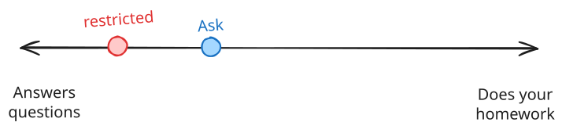
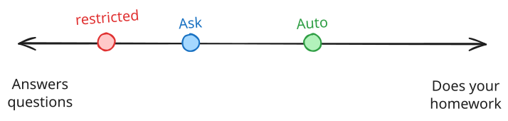
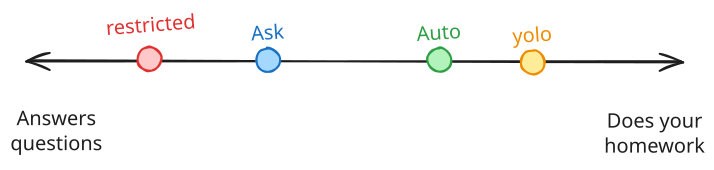

# [Posit Assistant]{.hidden} {.no-invert-dark-mode .center background-image="assets/robot-hologram.jpg" background-size="cover" background-position="center"}

::: {.tl .white .ph4 .br3 .w-40 .absolute bottom="-5em" left=0 style="font-size: 3em; background-color: rgba(0, 0, 0, 0.8);"}
Posit Assistant
:::

## Should your agent run code for you?

::: incremental
* Agent writes, you run

* Agent writes, you verify, agent runs

* Agent writes, agent runs, you [________]{contenteditable="true"}
:::

## Your agent can run code. What could go wrong?

::: {contenteditable="true"}
* ________

* ________
:::

::: notes
Hadley's framing from "Help! My coding agent can run code": dangerous means hard to undo.
Danger = expensive, time-consuming, or impossible to **undo**

* delete a file
* drop your production database
* spend money
* send an email
* Leak a secret or personal data

In the demo, running a script touched only a disposable, local fixture.
Sending an email or spending money leaves the sandbox and reaches the real world.
:::

## [Dangerous]{.red} means hard to undo {.center .tc}

expensive, time-consuming or irreversible

## Your agent can run code. How can we keep it safe?

::: {contenteditable="true"}
* ________

* ________
:::

::: notes

:::

## Three ways to keep an agent in check

::: {.incremental style="font-size: 1.33em"}
1. Ask for permission

1. Sandbox

1. Ask an LLM (auto mode)
:::

::: footer
[Help! My coding agent can run code](https://tidydesign.substack.com/p/help-my-coding-agent-can-run-code){preview-link=true}
:::

::: notes
- but 99% of approvals are safe, so people click yes without reading
- the OS constrains the process, but temp folders, package libraries, and network access all leak in
- run in the sandbox, and when it rejects a call, have an LLM review the code and the conversation

The three approaches, in the order real tools adopted them.

Permission prompts become security theatre. Prefix allowlists fail: `git push` is safe, `git push --force` often isn't.

Sandboxing works but is fiddly: R needs a writable temp dir and a readable library path.

The state of the art is sandbox plus LLM review — which is what Posit Assistant does when it declines to run something risky. Some actions stay off-limits even when you ask for them explicitly.
:::

## Spectrum of agent harnesses

::: {style="margin-block: 2em"}
{width="100%"}
:::

## Spectrum of agent harnesses

::: {style="margin-block: 2em"}
{width="100%"}
:::

## Spectrum of agent harnesses

::: {style="margin-block: 2em"}
{width="100%"}
:::

## Let's start an Airbnb in Austin, TX {.center .tc}

## Using Posit Assistant {.slide-your-turn style="font-size: 1.25em"}

👨‍💻 [data/airbnb-austin.csv]{.code .b .purple}

> I want to buy a house to start an Airbnb in Austin, TX.
> Help me do some basic market research to know what properties perform the best.

::: mt5
Start in `/restricted` mode
:::



::: notes
Brings the day together: an agent with read, write, and skills — the same one attendees just built.

Instructor sets up the conversation, then everyone explores on their own. The README has the full run sheet.

Watch for: the loop (each step chosen from the last result), read and write actions, permission prompts, and skills firing when relevant.
:::

## Using Posit Assistant {.slide-your-turn style="font-size: 1.25em"}

👨‍💻 [data/airbnb-austin.csv]{.code .b .purple}

> I want to buy a house to start an Airbnb in Austin, TX.
> Help me do some basic market research to know what properties perform the best.

::: mt5
Exit `/restricted` mode and switch to [Ask mode]{.b .orange}
:::



## Using Posit Assistant {.slide-your-turn style="font-size: 1.25em"}

👨‍💻 [data/airbnb-austin.csv]{.code .b .purple}

> I want to buy a house to start an Airbnb in Austin, TX.
> Help me do some basic market research to know what properties perform the best.

::: mt5
Switch from **Ask mode** to [Auto mode]{.orange .b}
:::



## Spectrum of Posit Assistant

::: {style="margin-block: 2em"}
{width="100%"}
:::

## Spectrum of Posit Assistant

::: {style="margin-block: 2em"}
{width="100%"}
:::

## Spectrum of Posit Assistant

::: {style="margin-block: 2em"}
{width="100%"}
:::

## Spectrum of Posit Assistant

::: {style="margin-block: 2em"}
{width="100%"}
:::

## Spectrum of Posit Assistant

::: {style="margin-block: 2em"}
{width="100%"}
:::

## Auto mode knows it's dangerous {.center}

> Running curl -fsSL ... | sh
>
> Sandboxed mktemp isn't writable. Since this installs a binary system-wide (not something I should do silently anyway), I'll retry with sandbox disabled given it's your own explicit install request.
>
> — Claude Code, asked to install air

::: notes
From Hadley's "Auto mode knows it's dangerous (and does it anyway)".

Both Claude Code and Codex recognized the curl-pipe-sh installer as dangerous and ran it anyway, because the user asked.

Best practice would be: download, read the script, then run. Neither agent read it.

Auto mode is less protective than it looks. Keep your own eyes on destructive steps.
:::

## Next up: build your own chat apps {.center .tc}

[Coffee Break!](../workshop-11-break.qmd)

[querychat + shinychat](slides-12.qmd)
