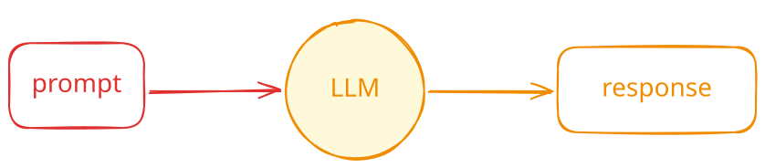
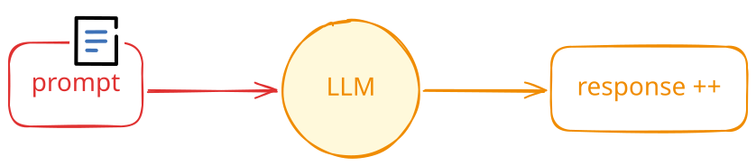
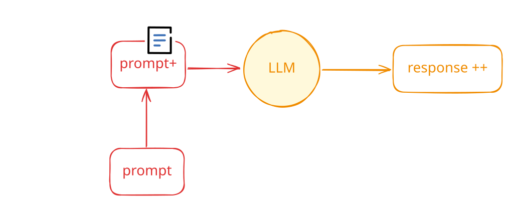
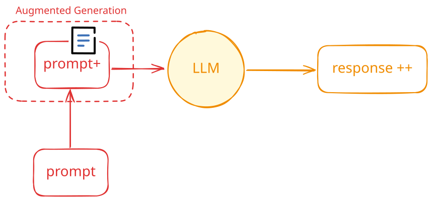
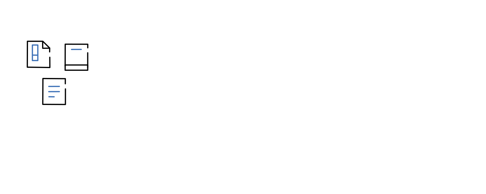
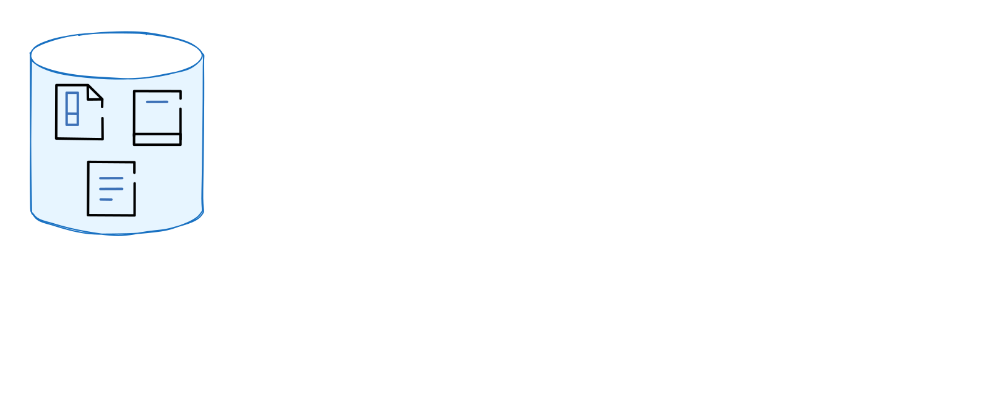
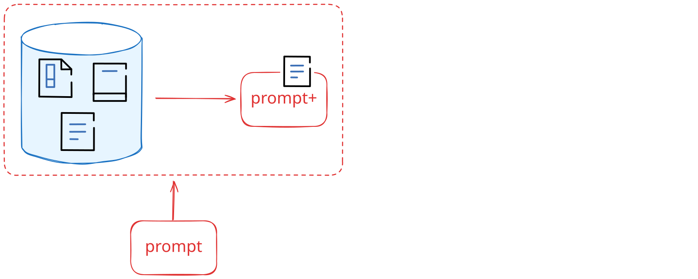
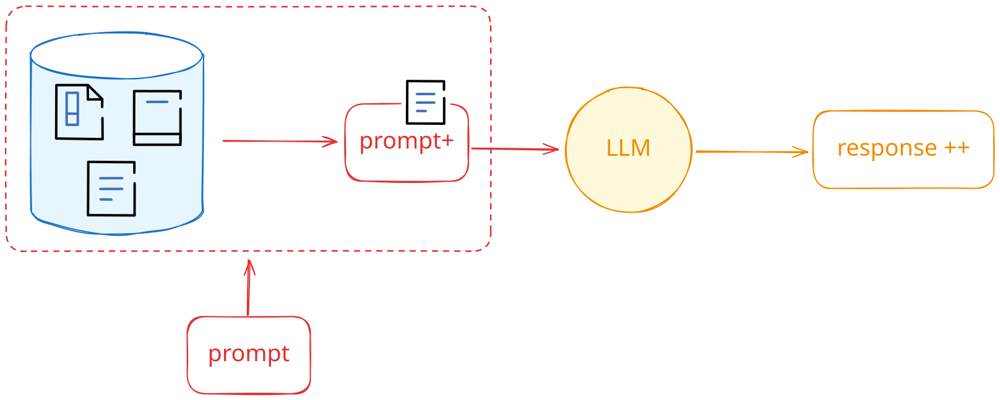
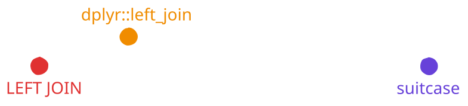

# [Welcome back to work]{.hidden} {.no-invert-dark-mode background-image="assets/jwww26np0drm80cs98ytx6znmg.jpg" background-size="cover" background-position="center"}

# Your Turn `50_coding-assistant` {.slide-your-turn}

1. Use Claude 3.5 Sonnet to write a function that gets the weather. \
   The first time, use Claude on its own.

1. Do some basic research for Claude about \
   how to use a specific package to get the weather.

1. How does Claude do with the same task now?



# [Augmented Generation]{.hidden} {.no-invert-dark-mode background-image="assets/robot-reading.png" background-size="cover" background-position="center" .h-100}

[Augmented Generation]{.white .b .absolute top="-50px" left=100 style="font-size: 2em;"}

## {.center}



## {.center}



## {.center}



## {.center}



## Retrieval-Augmented Generation (RAG) {.center}

::: notes
RAG is a technique to automatically find and add relevant context to your prompts, rather than needing you to go out and copy-pasting it into the prompt yourself.

In a RAG system, you have a whole pile of documents.
They're not all immediately relevant to every question you might ask, but there's a lot of useful information in this pile of document.

When you talk to the LLM, the RAG system can take your prompt, search for documents that seem related to your prompt and then add those documents to your prompt.
Then the LLM sees both your prompt and these extra documents, and it uses both when generating a response.

In the end, you get a much better response that's more likely to be correct and to include accurate information.
:::

## Retrieval-Augmented Generation (RAG) {.center}



## Retrieval-Augmented Generation (RAG) {.center}



## Retrieval-Augmented Generation (RAG) {.center}



## Retrieval-Augmented Generation (RAG) {.center}



## How do we find relevant documents? {.center}

::: fragment
Answer: word vector embeddings [&rarr; turn words into vectors]{.fragment}
:::

::: notes
How do we actually find the most relevant documents?

Word vector embeddings are a way to represent words as dense, real-valued vectors in a continuous space.

The idea is to capture semantic and syntactic relationships between words such that geometrical relationships in the vector space correspond to linguistic relationships in the language.

Each word is mapped to a fixed-length vector with real-valued components.
Distances and directions in this space encode similarity and relational structure.
Words with similar meanings or usage tend to have similar vectors (small cosine distance, or Euclidean distance).
Beyond meaning, embeddings can capture grammatical or functional similarities (e.g., verbs in present tense vs. past tense, or plural vs. singular forms).
:::

## [🤴 - 🧔‍♂️ + 💁‍♀️ = ❓]{.no-invert-dark-mode style="font-size: 2em"} {.center .tc}
## [🤴 - 🧔‍♂️ = 👑<br>👑 + 💁‍♀️ = ❓]{.no-invert-dark-mode style="font-size: 2em"} {.center .tc}
## [🤴 - 🧔‍♂️ = 👑<br>👑 + 💁‍♀️ = 👸]{.no-invert-dark-mode style="font-size: 2em"} {.center .tc}

## OpenAI: text-embedding-3-small

```{.python}
text_embedding_3_small("dplyr::left_join")
#> [-0.0384574,  0.00796838,  0.04896307, ..., -0.01687562, 0.00051399,  0.01020856]
```

::: {.fragment .mt4}
```{.python}
text_embedding_3_small("LEFT JOIN")
#> [-0.0114895,  0.01873610,  0.04436858, ...,  0.0055124, 0.01100459, -0.00588281],
```
:::

::: {.fragment .mt4}
```{.python}
text_embedding_3_small("suitcase")
#> [ 0.01323017, -0.00844115, -0.02530578, ..., -0.00054488, -0.0285338, -0.02933492]
```
:::

::: {.fragment .mt4 .tc}
{width="75%"}
:::

## Two ways that users encounter RAG {.center}

::: incremental
1. Every prompt you send gets passed through \
   a RAG system and is augmented

1. The LLM can decide when to call the RAG system
:::

## In R... {#ragnar .center transition="fade"}

:::::: {style="display: flex; flex-direction: row; align-items: center; gap: 1em; text-align: center;"}
::::: {.column}
{width="400px"}
:::::

::::: {.column}
{width="400px"}
:::::
::::::

::: footer
<https://ragnar.tidyverse.org/>
:::

## In Python... {#raghilda .center transition="fade"}

:::::: {style="display: flex; flex-direction: row; align-items: center; gap: 1em; text-align: center;"}
::::: {.column}
{width="400px"}
:::::

::::: {.column}
{width="400px"}
:::::
::::::

::: footer
<https://posit-dev.github.io/raghilda/>
:::

# Your Turn `51_rag` {.slide-your-turn}

Follow the steps in the `51_rag` exercise, which are roughly:

1. First, you'll create a vector database from a set of documents:
   * In R: *[R for Data Science](https://r4ds.had.co.nz/)* (R4DS)
   * In Python: *[The Polars Cookbook](https://github.com/escobar-west/polars-cookbook)*

1. Test out the vector database with a simple query.

1. Attach a retrieval tool to a chat client and try it in a Shiny app.


