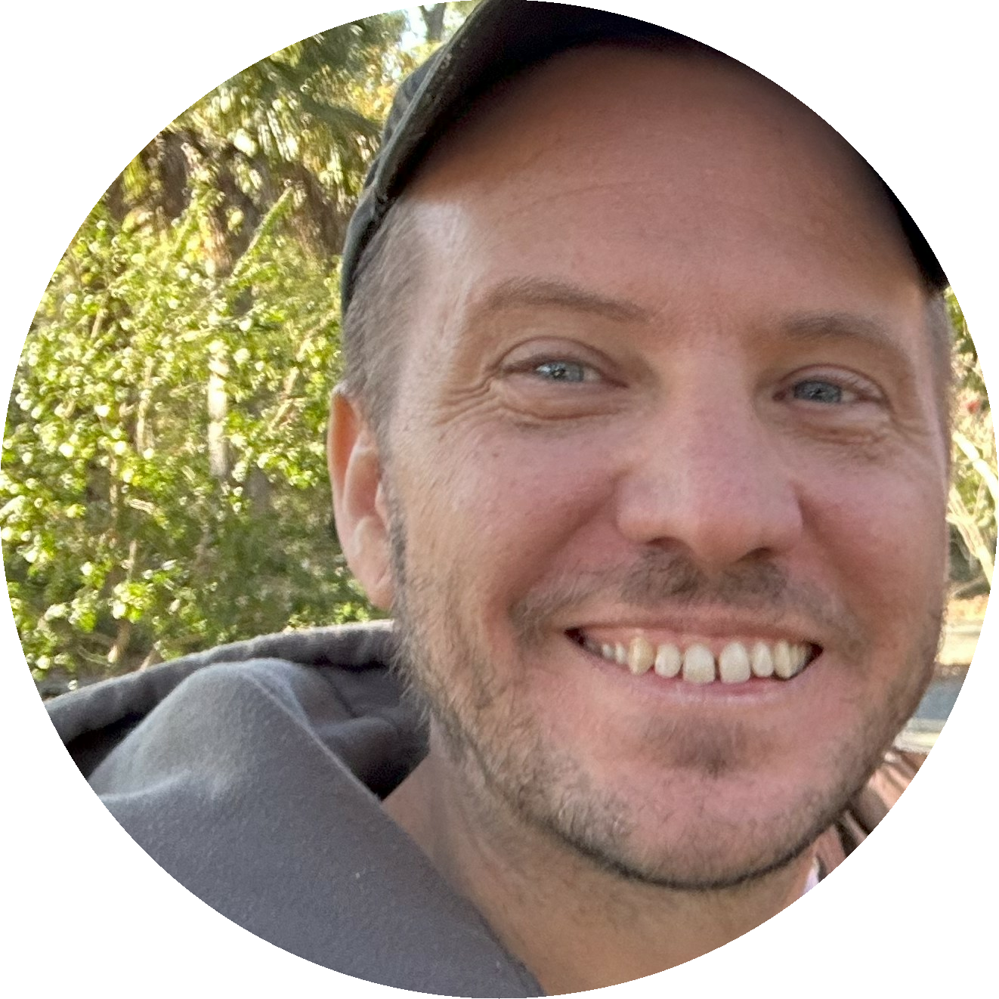
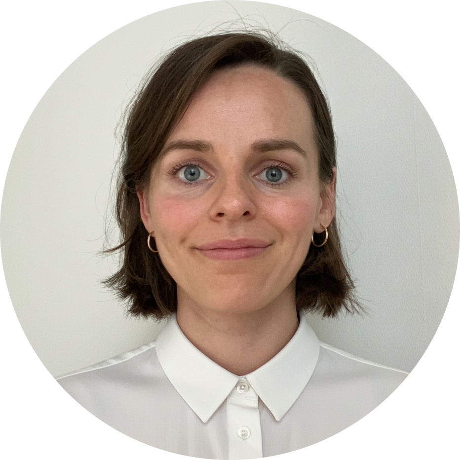

::: {.hero-badges}
[[🗓️]{.ico} September 14, 2026 · 09:00 – 17:00 CDT]{.badge-item}
[[🏨]{.ico} Hilton Americas-Houston · 1600 Lamar Street, Houston, TX]{.badge-item}
[[📝]{.ico} Workshop Registration](http://pos.it/conf){.badge-cta}
:::

## Description

Modern clinical reporting workflows are evolving fast, and this workshop helps you keep pace with a practical, end-to-end approach in R. You'll learn how to move from raw data to analysis deliverables using Pharmaverse tools, including standards-aligned SDTM preparation, efficient creation of ADaM datasets, and generation of high-quality tables, listings, and graphs (TLGs) supported by Analysis Results Datasets (ARDs). You'll also see where AI-assisted tooling can fit naturally into the workflow to support faster iteration and reduce manual rework, without sacrificing transparency, reproducibility, or reviewability. Leave with a modular, reusable playbook for applying R to every stage of clinical reporting across your team.

## Schedule

::: {.schedule-table}
| Time          | Activity                                                             |
|---------------|---------------------------------------------------------------------|
| 09:00 – 09:45 | [Introduction to Pharmaverse and AI Agents](slides/01-intro/index.html)               |
| 09:45 – 10:30 | [SDTM with sdtm.oak](slides/02-SDTM/index.html)                                    |
| 10:30 – 11:00 | *Coffee Break*                                                      |
| 11:00 – 12:30 | [ADaMs with {admiral} and friends](slides/03-ADaM/index.html)       |
| 12:30 – 13:30 | *Lunch*                                                             |
| 13:30 – 14:15 | [Analysis Results Datasets](slides/04-ARD/index.html)               |
| 14:15 – 15:00 | [Create Tables with {gtsummary}](slides/05-tables-gtsummary/index.html) |
| 15:00 – 15:30 | *Coffee Break*                                                      |
| 15:30 – 16:15 | [Create Tables with {tfrmt}](slides/06-tables-tfrmt/index.html)      |
| 16:15 – 17:00 | [Other Topics Overview + Wrap-up](slides/07-advancedai-wrapup/index.html) |
:::

## Pre-work

- [ ] Bookmark this site. You'll reference it throughout the workshop.   [posit-conf-2026.github.io/pharmaverse](https://posit-conf-2026.github.io/pharmaverse)

- [ ] Sign up for a *free* [Posit Cloud](https://posit.cloud/) account.

- [ ] Bring your laptop **and** charger to the workshop.

## Instructors

::: {.instructor-grid}

::: {.instructor-card}
{fig-alt="Headshot of Daniel Sjoberg"}

[**Daniel D. Sjoberg**](https://www.danieldsjoberg.com/){.instructor-name}

[Executive Director of Data Sciences & Clinical Data Analytics, Kardigan (he/him)]{.instructor-role}

Daniel leads the Data Science and Clinical Analytics groups at Kardigan. Previously was a Senior Principal Innovation Data Scientist and Real-time Analytics Group Lead at Genentech, a Lead Data Science Manager at the Prostate Cancer Clinical Trials Consortium, and an academic biostatistician at Memorial Sloan Kettering Cancer Center for 13 years. He enjoys R package development, creating many packages on [CRAN](https://cran.r-project.org/web/packages/), [R-Universe](https://ddsjoberg.r-universe.dev/ui#packages), and [GitHub](https://github.com/ddsjoberg). He's a co-organizer of [rainbowR](https://rainbowr.netlify.app/) and of the [R Medicine Conference](https://rconsortium.github.io/RMedicine_website/), and a recipient of the Brian Bole Award for Excellence from Open Source in Pharma and the ASA Innovation in Programming Award.

::: {.instructor-social}
[`r fontawesome::fa("link", fill = "#7090A5")`](https://www.danieldsjoberg.com/)
[`r fontawesome::fa("bluesky", fill = "#7090A5")`](https://bsky.app/profile/ddsjoberg.bsky.social)
[`r fontawesome::fa("linkedin", fill = "#7090A5")`](https://www.linkedin.com/in/ddsjoberg/)
[`r fontawesome::fa("github", fill = "#7090A5")`](https://github.com/ddsjoberg/)
:::
:::

::: {.instructor-card}
{fig-alt="Headshot of Becca Krouse"}

[**Becca Krouse**]{.instructor-name}

[Data Scientist, GSK Data Science Innovation & Engineering]{.instructor-role}

Becca focuses on enabling users across Biostatistics. A biostatistician by training, she has experience spanning 15 years in the field of clinical research and specializes in developing R-based tools.
:::

::: {.instructor-card}
{fig-alt="Headshot of Ben Straub"}

[**Ben Straub**]{.instructor-name}

[Senior Manager Statistical Data Scientist, Praxis Precision Medicines]{.instructor-role}

Ben Straub is a Senior Manager Statistical Data Scientist at Praxis Precision Medicines. He has worked in the industry for 8 years and is always actively involved with internal and external initiatives around R Adoption activities for Clinical Reporting and beyond. Ben is actively helping to develop and maintain an end-to-end R package pipeline [(pharmaverse)](https://pharmaverse.org/) that addresses all the needs of Clinical Reporting with many awesome companies and individuals. He is very excited for the future of using R and open source within Pharma.

::: {.instructor-social}
[`r fontawesome::fa("linkedin", fill = "#7090A5")`](https://www.linkedin.com/in/ben-straub)
:::
:::

::: {.instructor-card}
{fig-alt="Headshot of Magdalena Krochmal"}

[**Magdalena Krochmal** (Magda)]{.instructor-name}

[Senior Real-Time Visual Analytics Specialist, Roche]{.instructor-role}

Magda has over a decade of experience bridging advanced data engineering and user-centered application design. With a strong focus on clinical submission innovations, she is actively involved in the development and implementation of the SDTM automation project, {roak}. Magda leverages her expertise in R, Shiny, and AI-driven workflows to engineer intuitive medical data review tools, translating complex clinical data into high-impact, interactive visual analytics.

::: {.instructor-social}
[`r fontawesome::fa("linkedin", fill = "#7090A5")`](https://www.linkedin.com/in/magdalena-krochmal/)
:::
:::

:::
