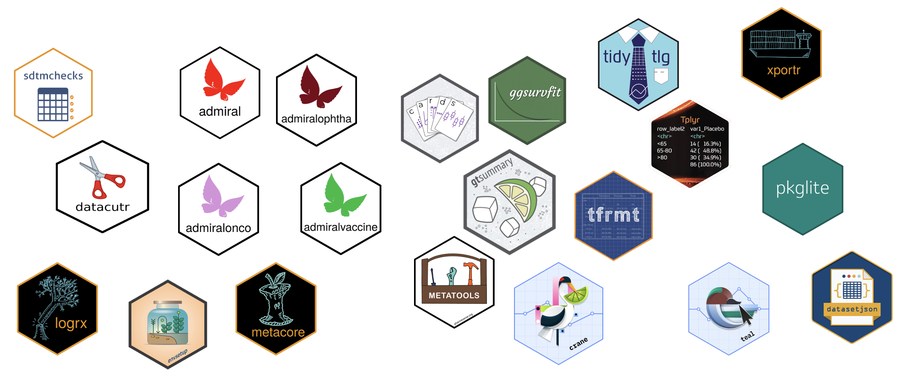
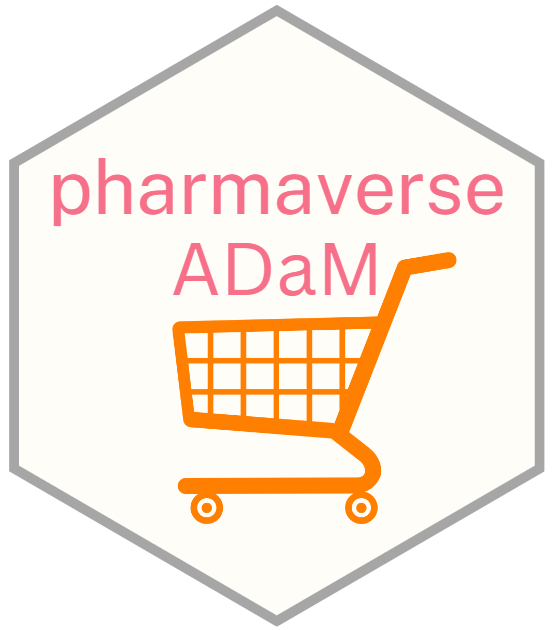
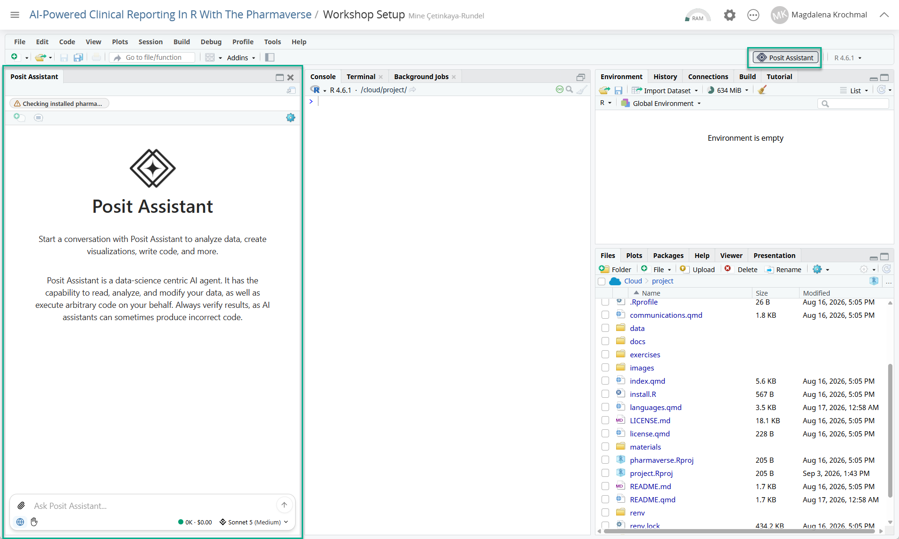
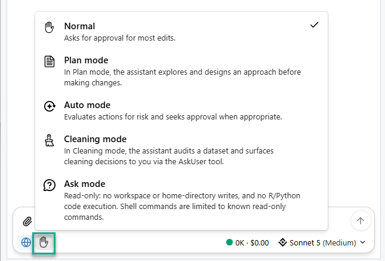
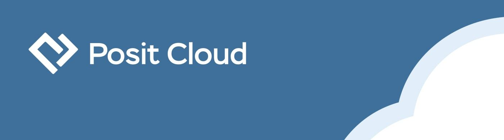
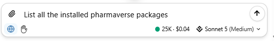

## AI-powered clinical reporting in R with the Pharmaverse

-   Find a seat where you can see the screen!

-   Join the Posit Cloud workspace: [link](https://posit.cloud/spaces/805889/join?access_code=mONmRVun3L8xnHX7mn225bnxYUJflMi1mWue5312)

-   Join the Slack from [pharmaverse.slack.com/](https://pharmaverse.slack.com/)

-   **WiFI**: Posit Conf 2026 \| `conf2026`

## posit::conf(2026) — good to know {.smaller}

::::: {.pv-info}

:::: {.pv-info-card .pv-info-soft .pv-info-wide}
::: {.pv-info-ico}
📶
:::
::: {.pv-info-body}
[WiFi]{.pv-info-title}
Network **Posit Conf 2026** · Password `conf2026`
:::
::::

:::: {.pv-info-card}
::: {.pv-info-ico}
🧘
:::
::: {.pv-info-body}
[Meditation / Prayer]{.pv-info-title}
Room **332**
:::
::::

:::: {.pv-info-card}
::: {.pv-info-ico}
🤱
:::
::: {.pv-info-body}
[Mother's Room]{.pv-info-title}
Room **333**
:::
::::

:::: {.pv-info-card}
::: {.pv-info-ico}
🎤
:::
::: {.pv-info-body}
[Speakers Lounge]{.pv-info-title}
Room **334**
:::
::::

:::: {.pv-info-card .pv-info-soft .pv-info-wide}
::: {.pv-info-ico}
📣
:::
::: {.pv-info-body}
[Social & photos]{.pv-info-title}
`#PositConf2026` · **red lanyards** = please don't photograph
:::
::::

:::::

## Instructors


## Your turn! Meet your neighbor!

::::: {.pv-info}

:::: {.pv-info-card}
::: {.pv-info-ico}
🙋
:::
::: {.pv-info-body}
[Who are you?]{.pv-info-title}
:::
::::

:::: {.pv-info-card}
::: {.pv-info-ico}
💼
:::
::: {.pv-info-body}
[What do you do?]{.pv-info-title}
:::
::::

:::: {.pv-info-card}
::: {.pv-info-ico}
🎯
:::
::: {.pv-info-body}
[What do you hope to get out of today?]{.pv-info-title}
:::
::::

:::::

# Workshop outline

## What to expect from this workshop {.smaller}

::: {.pv-expect-head}

[Explore pharmaverse R packages for **clinical reporting**]{.pv-expect-tag}
:::

:::::: {.pv-expect}

::::: {.pv-expect-row .fragment}
::: {.pv-expect-body}
[Raw data]{.pv-expect-stage} [test data & CDASH / non-CDASH inputs]{.pv-expect-desc}
:::
:::: {.pv-expect-pkg}
`pharmaverseraw`
::::
:::::

::::: {.pv-expect-row .fragment}
::: {.pv-expect-body}
[SDTM]{.pv-expect-stage} [standardize raw data into SDTM domains]{.pv-expect-desc}
:::
:::: {.pv-expect-pkg}
`sdtm.oak`
::::
:::::

::::: {.pv-expect-row .fragment}
::: {.pv-expect-body}
[ADaM]{.pv-expect-stage} [build analysis-ready datasets from SDTM]{.pv-expect-desc}
:::
:::: {.pv-expect-pkg}
`admiral` · `metacore` · `metatools`
::::
:::::

::::: {.pv-expect-row .fragment}
::: {.pv-expect-body}
[Tables & ARDs]{.pv-expect-stage} [summaries, TLGs, analysis results datasets]{.pv-expect-desc}
:::
:::: {.pv-expect-pkg}

`cards` · `gtsummary` · `tfrmt` · `docorator`

::::
:::::

::::: {.pv-expect-accent .fragment}
::: {.pv-expect-body}
[AI agents & skills]{.pv-expect-stage} [accelerate every step — hands-on exercises throughout]{.pv-expect-desc}
:::
:::::

::::::

## Workshop Expectations {.smaller}

:::::: columns
:::: {.column width="70%"}

-   Ask questions!

-   Be respectful to each other and yourself

::::

::: {.column width="30%"}

:::
::::::

## Your Background {.smaller}

-   Basic knowledge of R and packages in the tidyverse

-   Basic knowledge of CDISC Standards (ADaM and SDTM Domains)

    -   Check out the [ADaM IG and other documents for CDISC](https://www.cdisc.org/standards/foundational/adam)

    -   Check out [admiral](https://pharmaverse.github.io/admiral/cran-release/) and [admiraldiscovery](https://pharmaverse.github.io/admiraldiscovery/articles/reactable.html) for CDISC implementation

-   🦺 However, CDISC knowledge _not_ required, and you will learn! 🦺

-   💓 **Pulse Check:** Who is using AI tools in their daily work?


## Welcome to the pharmaverse! {.smaller}

:::::: columns
:::: {.column width="70%"}

-   <https://pharmaverse.org/>

-   Goals

    -   Align pharma industry on a set of open source packages based in R to deliver the clinical data pipeline

    -   Design, collaborate, and deliver new solutions where suitable tools do not exist

::::

::: {.column width="30%"}

:::
::::::

## End-to-End: Clinical Reporting Packages {.smaller}

<https://pharmaverse.org/e2eclinical/>



## End-to-End: The Data {.smaller}




## Not that kind of -verse {.smaller}

```{r}
#| error: true
library(pharmaverse)
```

-   The pharmaverse is a collection of open-source tools

-   But we would not want to attempt to load **all of them** at once.

## Industry working on a similar goal {.smaller}

-   Standards (ie CDISC) means standard tools can be created and shared

-   Collaboration in the “post competitive” space means everyone has access to free solutions

-   Team and Regulators seeing consistent packages being used across multiple teams speeds up development and review

## pharmaverse: TRUE or FALSE? {.smaller}

::: {.pv-tf-list}

::: {.pv-tf-row}
[pharmaverse makes decisions on how R **should** be used in the pharma space]{.pv-tf-stmt}
[[✘]{.pv-tf-ico} FALSE]{.pv-tf-ans .pv-tf-false .fragment}
:::

::: {.pv-tf-row}
[pharmaverse is a **source of information** on R packages for the clinical data workflow]{.pv-tf-stmt}
[[✔]{.pv-tf-ico} TRUE]{.pv-tf-ans .pv-tf-true .fragment}
:::

::: {.pv-tf-row}
[pharmaverse lets **commercial interests** from collaborators drive decisions]{.pv-tf-stmt}
[[✘]{.pv-tf-ico} FALSE]{.pv-tf-ans .pv-tf-false .fragment}
:::

::: {.pv-tf-row}
[pharmaverse's scope **starts at SDTM and ends at TLF** creation]{.pv-tf-stmt}
[[✘]{.pv-tf-ico} FALSE]{.pv-tf-ans .pv-tf-false .fragment}
:::

::: {.pv-tf-row}
[you **don't need to be part of** pharmaverse to use the tools coming from it]{.pv-tf-stmt}
[[✔]{.pv-tf-ico} TRUE]{.pv-tf-ans .pv-tf-true .fragment}
:::

::: {.pv-tf-row}
[pharmaverse packages need to be reviewed by **your own GxP process**]{.pv-tf-stmt}
[[✔]{.pv-tf-ico} TRUE]{.pv-tf-ans .pv-tf-true .fragment}
:::

:::

# Agents & skills {background-color="#003559"}

## Ways to use LLMs {.smaller}

The main difference is **how much the AI does for you** — from answering
questions to taking action in your project:

<br>

:::: {.pv-cards}
::: {.pv-card}
[💬]{.pv-ico}
[Chat]{.pv-title}
Ask questions, get explanations & code — **you copy and paste**
<br>*ChatGPT, Claude, Gemini*
:::
::: {.pv-card}
[⌨️]{.pv-ico}
[Assistant / Ask]{.pv-title}
In-IDE help with your file context — **you accept the edits**
<br>*Copilot, Cursor, Posit Assistant*
:::
::: {.pv-card .pv-accent}
[🤖]{.pv-ico}
[Agent]{.pv-title}
Reads files, runs code, edits the project — **multi-step, you review**
<br>*same tools, agent mode*
:::
::::

::: {.pv-ai}
[🎯]{.pv-ico} More autonomy → less typing, more reviewing. Today we focus on the
**agent** end of the spectrum — and Posit Assistant gives us both **Ask** and
**Agent** modes.
:::

## Posit Assistant {.smaller}

In **Posit Cloud**, we will be using **Posit Assistant** — an AI assistant
built right into the IDE.



## Posit Assistant — modes {.smaller}

Posit Assistant offers a few modes depending on how much you want it to do:

<br>

:::: {.pv-cards}
::: {.pv-card}
[💬]{.pv-ico}
[Ask]{.pv-title}
Answer questions and explain code — **no changes made**
:::
::: {.pv-card .pv-accent}
[🤖]{.pv-ico}
[Agent]{.pv-title}
Plan and carry out **multi-step edits** across your project
:::
::::

<div style="text-align: center;"></div>

## Why AI fits clinical reporting {.smaller}

Clinical programming is full of **standardized, repetitive patterns** —
exactly what AI is good at drafting (and you are good at reviewing).

<br>

:::: {.pv-cards}
::: {.pv-card}
[📐]{.pv-ico}
[Standards]{.pv-title}
CDISC gives predictable structure the AI can learn
:::
::: {.pv-card}
[🔁]{.pv-ico}
[Repetition]{.pv-title}
The same mapping patterns recur across variables & domains
:::
::: {.pv-card}
[🧑‍⚖️]{.pv-ico}
[Review culture]{.pv-title}
We already double-check everything — human-in-the-loop by design
:::
::::

## Agent vs. skill {.smaller}


:::: {.pv-cards}
::: {.pv-card}
[🤖]{.pv-ico}
[Agent]{.pv-title}
An AI assistant that can **read your project, run R, and edit code** — not
just chat. It plans and carries out multi-step tasks.
:::
::: {.pv-card .pv-accent}
[🧠]{.pv-ico}
[Skill]{.pv-title}
A **reusable, checked-in instruction set** that teaches the agent *your*
conventions — the pharmaverse way of doing a task.
:::
::::

::: {.pv-flow .pv-flow-accent}
[[🧠]{.pv-ico}Skill = knowledge]{.pv-step}
[[🤖]{.pv-ico}Agent = executor]{.pv-step}
[[👀]{.pv-ico}You = reviewer]{.pv-step}
:::

## One agent, many skills {.smaller}

**What the agent does in practice** — a loop, not a single answer:

<br>

::: {.pv-flow .pv-flow-accent}
[[📖]{.pv-ico}Read<br>files & specs]{.pv-step}
[[🧭]{.pv-ico}Plan<br>the steps]{.pv-step}
[[⌨️]{.pv-ico}Write<br>R code]{.pv-step}
[[▶️]{.pv-ico}Run<br>& check]{.pv-step}
[[👀]{.pv-ico}You<br>review]{.pv-step}
:::

<br>

The same agent, pointed at a different **skill**, helps at every stage:

<br>

::: {.pv-flow}
[[📦]{.pv-ico}SDTM<br>skill]{.pv-step}
[[🧬]{.pv-ico}ADaM<br>skill]{.pv-step}
[[📊]{.pv-ico}ARD<br>skill]{.pv-step}
[[📑]{.pv-ico}TLG<br>skill]{.pv-step}
:::

<br>

::: {.pv-ai}
[💡]{.pv-ico} We'll see a concrete **SDTM mapping skill** in the next session —
turning an aCRF into `sdtm.oak` code that you review and run.
:::

## What a skill looks like in practice {.smaller}

Skills live in an **`.agents/`** folder in the repo. A skill can be **one
file** — or a **folder** with supporting material.

::::::: columns

:::::: {.column width="48%"}
[**Single document**]{.pv-title}

::::: {.pv-tree}
[📁 .agents/skills/]{.pv-dir}<br>
└─ [📄 sdtm-mapping.md]{.pv-main}
:::::

Good for a focused, self-contained task. Everything the agent needs in
one place.
::::::

:::::: {.column width="52%"}
[**Folder with resources**]{.pv-title}

::::: {.pv-tree}
[📁 .agents/skills/sdtm-oak-mapping/]{.pv-dir}<br>
├─ [📄 SKILL.md]{.pv-main} [← entry point]{.pv-cmt}<br>
├─ 📁 examples/<br>
│&nbsp;&nbsp;├─ 📄 vs_domain.R<br>
│&nbsp;&nbsp;└─ 📄 dm_domain.R<br>
└─ 📁 reference/<br>
&nbsp;&nbsp;&nbsp;├─ 📄 ct_spec.csv<br>
&nbsp;&nbsp;&nbsp;└─ 📄 algorithms.md
:::::

Scales to reusable patterns: worked code, specs, house style.
::::::

:::::::

::: {.pv-ai}
[🔑]{.pv-ico} Skills are kept in the **`.agents/`** folder. The agent reads
`SKILL.md` first, then opens the extra files **only when the task needs
them** — not all at once.
:::

## `AGENTS.md` in practice {.smaller}

Project-wide **house rules** the agent reads for *every* task — checked into the repo root.

::::: {.pv-skill}

[[🤖]{.pv-ico} AGENTS.md]{.pv-skill-head}

:::: {.pv-skill-body}
```markdown
# Project: Study ABC-123 clinical reporting

## Conventions
- Use the pharmaverse (sdtm.oak, admiral, gtsummary).
- Style: tidyverse; pipe with |>; snake_case objects.
```
::::
:::::

::: {.pv-ai}
[💡]{.pv-ico} `AGENTS.md` = *who we are & how we work* — global context, always on.
:::

## `SKILL.md` in practice {.smaller}

A **task-specific** recipe — loaded only when that task comes up.

::::: {.pv-skill}

[[🧠]{.pv-ico} .agents/skills/sdtm-oak-mapping/SKILL.md]{.pv-skill-head}

:::: {.pv-skill-body}
```markdown
---
name: sdtm-oak-mapping
description: Map a raw dataset to an SDTM domain from raw + aCRF.
---

# Map a raw dataset to an SDTM domain

Use when: creating an SDTM domain from raw + aCRF.

Steps
1. List target variables and their CT from the spec.
2. Pick the algorithm per variable.
3. Chain topic then qualifiers; run and preview.

See examples/vs_domain.R for a full worked case.
```
::::
:::::

::: {.pv-ai}
[🔑]{.pv-ico} A `SKILL.md` **must start with YAML frontmatter** with two required
fields — `name` and `description`. `AGENTS.md` is *always* loaded; a skill is
pulled in *on demand*, keeping each prompt lean.
:::

## Good skills: short & to the point {.smaller}

A skill is loaded into the prompt — **longer skill = more tokens = higher
cost & slower**, and the signal gets diluted.

::::::::: {.pv-gb}

:::::::: {.pv-good}
[✅ To the point]{.pv-gb-head}

- *When to use*, then clear steps
- Points to examples instead of pasting them
- One responsibility per skill

::::::: {.pv-meter}
tokens / cost

:::::: {.pv-bar}
::::: {.pv-fill .pv-fill-lo}
:::::
::::::
:::::::
::::::::

:::::::: {.pv-bad}
[❌ Too long]{.pv-gb-head}

- Whole standards pasted inline
- Repeats what the model already knows
- Ten tasks crammed into one file

::::::: {.pv-meter}
tokens / cost

:::::: {.pv-bar}
::::: {.pv-fill .pv-fill-hi}
:::::
::::::
:::::::
::::::::

:::::::::

::: {.pv-ai}
[💡]{.pv-ico} Aim for **instructions, not encyclopedias**. Teach the *how* and
*where to look* — let the model bring the general knowledge.
:::

## URLs & big references {.smaller}

Can a skill point to external resources? **Yes** — and it should, for
anything large.

::: {.pv-steps}
- [1]{.pv-num} [🔗]{.pv-ico} **URLs are allowed** — the agent can fetch a page *on demand*
- [2]{.pv-num} [📚]{.pv-ico} Big files are read **in chunks / searched**, not all at once
- [3]{.pv-num} [🎯]{.pv-ico} Link the **specific section**, not the whole spec
:::

::::: {.pv-gb}

:::: {.pv-bad}
[❌ Don't]{.pv-gb-head}

- Paste the full **CDISC SDTMIG (400+ pages)** into the skill
- Blows the context window, adds cost, buries the point
::::

:::: {.pv-good}
[✅ Do]{.pv-gb-head}

- Summarise the **rules you actually apply**
- Link the exact codelist / IG section as a URL
- Keep a small `ct_spec.csv` the agent can query
::::

:::::

::: {.pv-ai}
[⚖️]{.pv-ico} Rule of thumb: **retrieve, don't embed.** A skill is a map to the
knowledge — not a copy of it.
:::

## Working environment {.smaller}

-   For consistency, we will be working in **Posit Cloud**

-   Everything has been installed and set up for you

-   Following the course, all content from this workshop will be available on the course website and GitHub




## Quick warm-up {.smaller}

```{r}
#| echo: false
#| cache: false
library(countdown)
countdown(minutes = 5, play_sound = TRUE)
```

1. Open the workshop project in **Posit Cloud**.
2. Show the sidebar with the toolbar icon in the top right of the IDE, then click the button to **install Posit Assistant** in the project.
3. Click **Sign in to try Posit AI for free** and authorize in your browser. Create your Posit AI account at **posit.ai** using the **same email you registered with** — that's how your workshop credits attach.
4. *Optional:* turn on inline completions with **Tools → Global Options → Assistant** and pick **Posit AI Next Edit Suggestions**. These are unlimited and free.
5. [**➡️ Ask your Posit Assistant to list all the installed pharmaverse packages!**]{.pv-highlight}




