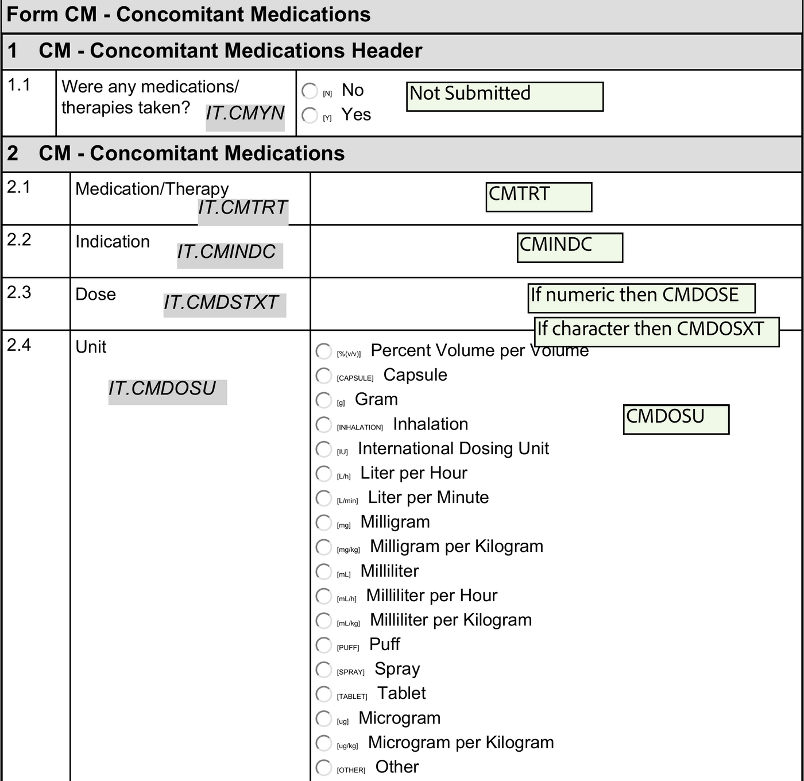
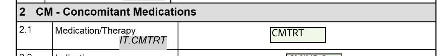
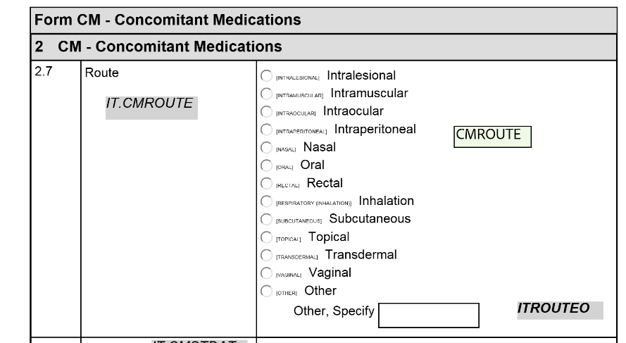
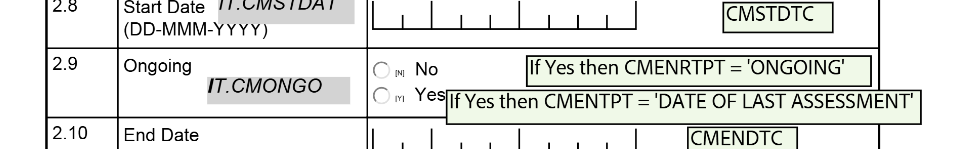
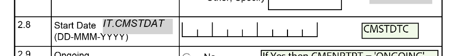

---
title: "CDISC SDTM datasets in R"
subtitle: "Pharmaverse Workshop"
author: "Magdalena Krochmal"
event: "posit::conf(2026)"
logo: "images/sdtmoak-logo.png"
footer: "[Pharmaverse Workshop (posit-conf-2026.github.io/pharmaverse/)](https://posit-conf-2026.github.io/pharmaverse/)"
editor: source
engine: knitr
format: 
  revealjs: 
    theme: ../slides.scss
    template-partials:
      - title-slide.html
    transition: fade
    slide-number: true
    chalkboard: true
execute:
  echo: true
  freeze: false
cache: false
resources:
  - images/pharmaverse-hex.png
--- 
```{r}
#| include: false
library(glue)
library(link)
library(sdtm.oak)
library(dplyr)

# Study controlled terminology used by the live mapping examples
study_ct <- read.csv("metadata/sdtm_ct.csv")

# CM raw data (CDASH) used by the workshop mapping examples
cm_raw <- read.csv("datasets/cm_raw_data_cdash.csv", stringsAsFactors = FALSE)
cm_raw <- admiral::convert_blanks_to_na(cm_raw)
cm_raw <- cm_raw |>
  generate_oak_id_vars(pat_var = "PATNUM", raw_src = "cm_raw")

# Disabled: link::auto()'s global text hook re-scans the whole rendered
# document, including the HTML already produced by the explicit
# link::to_call()/to_pkg() calls used throughout this deck's algorithm
# tables below - re-matching that already-linked text breaks knitr's
# text-hook post-processing (htmltools "length-one character vector"
# error). Every sdtm.oak function reference in this deck is already
# manually linked via link::to_call(), so auto() isn't needed.
# link::auto(keep_pkg_prefix = FALSE, keep_braces = FALSE)

# Package hexes
admiral_img <- "https://raw.githubusercontent.com/pharmaverse/sdtm.oak/master/man/figures/logo.svg"
pharmaverse_img <- "https://raw.githubusercontent.com/pharmaverse/pharmaverse-pkg/master/man/figures/banner.png"
dplyr_img <- "https://raw.githubusercontent.com/tidyverse/dplyr/master/man/figures/logo.png"

# Set image sizes
img_bullet_size <- 80
img_right_size <- 150
img_center_size <- 300
```

## Objectives

By the end of this session you will:

<br>

::::: {.pv-cards}
:::: {.pv-card}
[🧩]{.pv-ico}
[Understand]{.pv-title}
How `sdtm.oak` and its **reusable algorithms** work
::::
:::: {.pv-card}
[⚙️]{.pv-ico}
[Build]{.pv-title}
The SDTM `CM` domain with live code
::::
:::: {.pv-card}
[🤖]{.pv-ico}
[Accelerate]{.pv-title}
The same mappings with an **AI agent + skill**
::::
:::::

## Agenda

::: {.pv-agenda}
::: {.pv-agenda-item}
[📦]{.pv-agenda-ico}
[Intro to `sdtm.oak`]{.pv-agenda-title}
[20 min]{.pv-agenda-time}
:::
::: {.pv-agenda-item}
[💊]{.pv-agenda-ico}
[`CM` domain 🤖]{.pv-agenda-title}
[15 min]{.pv-agenda-time}
:::
::: {.pv-agenda-item}
[✏️]{.pv-agenda-ico}
[Exercise 🤖]{.pv-agenda-title}
[10 min]{.pv-agenda-time}
:::
:::

# Introduction to `sdtm.oak`

## `sdtm.oak` in pharmaverse {.smaller}

:::::: columns
:::: {.column width="60%"}
::: incremental
-   Sponsored by CDISC COSA, pharmaceutical companies, including Roche, Pfizer, GSK, Vertex, Atorus Research, Pattern Institute, Transition Technologies Science.
-   Inspired by the Roche's `roak` package.
-   Addresses a critical gap in the pharmaverse suite by enabling study programmers to create SDTM datasets in R, complementing the existing capabilities for ADaM, TLGs, eSubmission, etc.
:::
::::

::: {.column width="40%"}

:::
::::::

## Challenges in SDTM Programming {.smaller}

SDTM maps from **raw data** — so the challenges come from the source.
`sdtm.oak` (on **CRAN**) is designed to meet each one:

::::: {.pv-solve}

:::: {.pv-solve-row}
::: {.pv-solve-key}
🔌 EDC agnostic
:::
::: {.pv-solve-val}
**Raw data structure varies** — different EDC systems use different dataset names, variable names, and structures.
:::
::::

:::: {.pv-solve-row}
::: {.pv-solve-key}
📐 Standards agnostic
:::
::: {.pv-solve-val}
**Collection standards vary** — even with CDASH, sponsors build different eCRFs; proprietary standards are common.
:::
::::

:::: {.pv-solve-row}
::: {.pv-solve-key}
🧩 Modular
:::
::: {.pv-solve-val}
**Mapping is repetitive** — composable algorithms build any domain from the same building blocks.
:::
::::

:::::

## The EDC landscape {.smaller}

Sponsors and CROs collect raw data in **many different systems** — each with its
own data model, export format, and naming conventions.

::: {.pv-badges}
[Medidata Rave]{.pv-badge}
[Oracle InForm]{.pv-badge}
[Veeva CDMS]{.pv-badge}
[IBM Clinical]{.pv-badge}
[OpenClinica]{.pv-badge}
[REDCap]{.pv-badge}
[paper-to-EDC]{.pv-badge}
[vendor labs]{.pv-badge}
:::

They differ in three ways that matter for mapping:

::::: {.pv-solve}
:::: {.pv-solve-row}
::: {.pv-solve-key}
🏷️ Names
:::
::: {.pv-solve-val}
Different variable & dataset names (`SYS_BP` vs `IT.SYSBP`), plus vendor metadata columns.
:::
::::
:::: {.pv-solve-row}
::: {.pv-solve-key}
📐 Shape
:::
::: {.pv-solve-val}
Wide (one column per test) vs long (one row per test).
:::
::::
:::: {.pv-solve-row}
::: {.pv-solve-key}
🔤 Values
:::
::: {.pv-solve-val}
Collected terms vary (`Sit` vs `SITTING`, `mm Hg` vs `mmHg`).
:::
::::
:::::

::: {.pv-ai}
[🔌]{.pv-ico} **`sdtm.oak` doesn't care which system** produced the raw data.
:::

## Same data, many raw shapes — 🏷️ eCRF {.smaller}

*How it's collected — dedicated fields vs a generic grid.*

::::: {.pv-compare}
:::: {.pv-panel}
[[🗄️]{.pv-ico} Medidata Rave — dedicated fields]{.pv-panel-head}

::: {.pv-panel-body}
:::: {.pv-ecrf}
::: {.pv-field}
[Systolic BP]{.pv-label} [120 mmHg]{.pv-input .pv-filled}
:::
::: {.pv-field}
[Position]{.pv-label} [SITTING]{.pv-input .pv-filled}
:::
::::
[One field per test, unit fixed on the form]{.pv-note}
:::
::::

:::: {.pv-panel .pv-panel-b}
[[🗄️]{.pv-ico} Oracle InForm — generic grid]{.pv-panel-head}

::: {.pv-panel-body}
| Test | Result | Unit |
|------|--------|------|
| SYSBP | 120 | mmHg |
| DIABP | 80 | mmHg |

[Test name is *data*, not a column]{.pv-note}
:::
::::
:::::

## Same data, many raw shapes — 📐 Raw table {.smaller}

*What the programmer receives — wide vs long.*

::::: {.pv-compare}
:::: {.pv-panel}
[[🗄️]{.pv-ico} Rave — wide]{.pv-panel-head}

::: {.pv-panel-body}
| SUBJ | SYS_BP | DIA_BP | POS |
|------|--------|--------|-----|
| 1015 | 120 | 80 | SIT |

[Each test is its **own column**]{.pv-note}
:::
::::

:::: {.pv-panel .pv-panel-b}
[[🗄️]{.pv-ico} InForm — long]{.pv-panel-head}

::: {.pv-panel-body}
| SUBJ | VSTESTCD | VSORRES |
|------|----------|---------|
| 1015 | SYSBP | 120 |
| 1015 | DIABP | 80 |

[Each test is its **own row**]{.pv-note}
:::
::::
:::::

## Same data, many raw shapes — 🔤 Standards {.smaller}

*What's stored — CDASH-aligned vs proprietary terms.*

::::: {.pv-compare}
:::: {.pv-panel}
[[✅]{.pv-ico} CDASH-aligned]{.pv-panel-head}

::: {.pv-panel-body}
| Variable | Collected |
|----------|-----------|
| VSPOS | `SITTING` |
| VSORRESU | `mmHg` |

[Terms already close to CDISC CT]{.pv-note}
:::
::::

:::: {.pv-panel .pv-panel-b}
[[🏢]{.pv-ico} Proprietary]{.pv-panel-head}

::: {.pv-panel-body}
| Variable | Collected |
|----------|-----------|
| POSITION | `Sit` |
| UNIT | `mm Hg` |

[Free-text-ish values → need CT mapping]{.pv-note}
:::
::::
:::::

::: {.pv-ai}
[🔑]{.pv-ico} Same algorithms map all of these — only `raw_var` / `raw_dat` change,
and `assign_ct()` + a CT spec reconcile the values (`Sit`, `SITTING` → `SITTING`).
:::

## Real raw data: `pharmaverseraw::vs_raw` {.smaller}

The workshop data mimics a real EDC export — note the vendor-specific names:

```{r}
#| echo: true
#| eval: false
names(pharmaverseraw::vs_raw)
#>  [1] "STUDY"  "PATNUM"  "INSTANCE"  "FORM"  "FORML"  "VTLD"
#>  [7] "IT.HEIGHT_VSORRES"  "IT.WEIGHT"  "IT.TEMP"  "IT.TEMP_LOC"
#> [11] "TMPTC"  "SYS_BP"  "DIA_BP"  "PULSE"  "SUBPOS"
```

::::: {.pv-cards}
:::: {.pv-card}
[🏷️]{.pv-ico}
[Item prefixes]{.pv-title}
`IT.` prefix, mixed styles: `SYS_BP` vs `IT.TEMP`
::::
:::: {.pv-card}
[📄]{.pv-ico}
[Vendor columns]{.pv-title}
`INSTANCE`, `FORM`, `VTLD` — not SDTM, EDC metadata
::::
:::: {.pv-card}
[🎯]{.pv-ico}
[Your job]{.pv-title}
Map these → `VS.VSTESTCD`, `VSORRES`, `VSORRESU`, `VSTPT`…
::::
:::::

# `sdtm.oak`

```{=html}
<style>
.centered-image {
  display: block;
  margin-left: auto;
  margin-right: auto;
  max-width: 100%;
  height: auto;
}
</style>
```

## The SDTM concept {.smaller}

SDTM organizes everything as **observations** about **subjects** — each observation is a **row**, described by **variables**.

::: {.pv-concept}
[[🧍]{.pv-ico} Subject]{.pv-concept-node} [→]{.pv-concept-arrow} [[👀]{.pv-ico} Observation]{.pv-concept-node} [→]{.pv-concept-arrow} [[📊]{.pv-ico} Row of variables]{.pv-concept-node}
:::

> *"Subject **101** had **mild nausea** starting on **study day 6**."*

::::: {.pv-obs}
:::: {.pv-obs-cell .pv-role-id}
[Identifier]{.pv-obs-role}
[101]{.pv-obs-val}
::::
:::: {.pv-obs-cell .pv-role-topic}
[Topic]{.pv-obs-role}
[NAUSEA]{.pv-obs-val}
::::
:::: {.pv-obs-cell .pv-role-timing}
[Timing]{.pv-obs-role}
[Study day 6]{.pv-obs-val}
::::
:::: {.pv-obs-cell .pv-role-qual}
[Qualifier]{.pv-obs-role}
[MILD]{.pv-obs-val}
::::
:::::

## Every variable has a **role** {.smaller}

A variable's *role* determines what it tells you about the observation.

::::: {.pv-roles}
:::: {.pv-role .pv-role-id}
[🆔]{.pv-ico}
[Identifier]{.pv-role-name}
Study, subject, domain, sequence number
::::
:::: {.pv-role .pv-role-topic}
[🎯]{.pv-ico}
[Topic]{.pv-role-name}
The focus of the observation (e.g. the lab test)
::::
:::: {.pv-role .pv-role-timing}
[🕒]{.pv-ico}
[Timing]{.pv-role-name}
When it happened (start / end dates)
::::
:::: {.pv-role .pv-role-qual}
[🏷️]{.pv-ico}
[Qualifier]{.pv-role-name}
Extra detail: results, units, descriptors
::::
:::: {.pv-role .pv-role-rule}
[⚙️]{.pv-ico}
[Rule]{.pv-role-name}
Start / end / branch / loop in Trial Design
::::
:::::

::: {.fragment}
**Qualifiers** carry most of the detail — they split into 5 kinds:

::::: {.pv-cards}
:::: {.pv-card}
[Grouping]{.pv-title}
`--CAT`, `--SCAT`
::::
:::: {.pv-card}
[Result]{.pv-title}
`--ORRES`, `--STRESC`
::::
:::: {.pv-card}
[Synonym]{.pv-title}
`--DECOD`, `--TEST`
::::
:::: {.pv-card}
[Record]{.pv-title}
`AGE`, `SEX`, `--BLFL`
::::
:::: {.pv-card}
[Variable]{.pv-title}
`--ORRESU`, `--DOSU`
::::
:::::
:::

::: {.fragment}
::: {.pv-ai}
[📦]{.pv-ico} A **domain** = related observations with a common topic, one dataset with a 2-char code
prefixing its variables — e.g. **VS** (Vital Signs: `VSTESTCD`, `VSORRES`) and **AE** (Adverse Events: `AETERM`, `AESEV`).
:::
:::

## Reusable algorithms are the **backbone** {.smaller}

::: {.pv-flow}
[[📥]{.pv-ico}Collected source data]{.pv-step}
[[🧩]{.pv-ico}Mapping algorithms]{.pv-step}
[[📦]{.pv-ico}Target SDTM model]{.pv-step}
:::

**Modular building blocks** — reusable across domains, each one an R function you compose to map any domain.

| Algorithm | What it does | Example |
|:----------|:-----------------------------------------|:---------------------|
| `assign_no_ct()` | One-to-one map, **no** controlled terminology | `AE.AETERM` |
| `assign_ct()` | One-to-one map **with** controlled terminology | `VS.VSPOS` |
| `assign_datetime()` | Map dates/times to ISO 8601 (handles unknowns) | `AE.AEENDTC` |
| `hardcode_ct()` | Hardcode a value **with** controlled terminology | `VS.VSORRESU = 'mmHg'` |
| `hardcode_no_ct()` | Hardcode a value, **no** controlled terminology | `VS.VSCAT = 'VITAL SIGNS'` |
| `condition_add()` | Apply a mapping **only when** a condition holds | `VSMETHOD when VSTESTCD = 'TEMP'` |
| `oak_cal_ref_dates()` | Derive DM reference dates | `DM.RFSTDTC` |

::: {.pv-ai}
[📎]{.pv-ico} Full descriptions for each algorithm are in the **appendix** at the end.
:::

## Build a mapping, one algorithm at a time {auto-animate="true"}

```{r}
#| label: 'oak-build-1'
#| output-location: "column"
#| code-line-numbers: "3,4,5,6,7,8,9"
vs_raw <- pharmaverseraw::vs_raw |>
  generate_oak_id_vars(pat_var = "PATNUM", raw_src = "vitals")
vs <-
  # Topic: which test is this row?
  hardcode_ct(
    raw_dat = vs_raw, raw_var = "SYS_BP",
    tgt_var = "VSTESTCD", tgt_val = "SYSBP",
    ct_spec = study_ct, ct_clst = "C66741"
  ) |>
  dplyr::filter(!is.na(VSTESTCD))
vs |> dplyr::select(patient_number, VSTESTCD) |> head(4)
```

::: {.pv-ai}
[🎯]{.pv-ico} Start with the **topic** — `hardcode_ct()` says "these rows are systolic BP".
:::

## Build a mapping, one algorithm at a time {auto-animate="true"}

```{r}
#| label: 'oak-build-2'
#| output-location: "column"
#| code-line-numbers: "11,12,13,14,15"
vs_raw <- pharmaverseraw::vs_raw |>
  generate_oak_id_vars(pat_var = "PATNUM", raw_src = "vitals")
vs <-
  # Topic: which test is this row?
  hardcode_ct(
    raw_dat = vs_raw, raw_var = "SYS_BP",
    tgt_var = "VSTESTCD", tgt_val = "SYSBP",
    ct_spec = study_ct, ct_clst = "C66741"
  ) |>
  dplyr::filter(!is.na(VSTESTCD)) |>
  # Result qualifier: the collected value
  assign_no_ct(
    raw_dat = vs_raw, raw_var = "SYS_BP",
    tgt_var = "VSORRES", id_vars = oak_id_vars()
  )
vs |> dplyr::select(patient_number, VSTESTCD, VSORRES) |> head(4)
```

::: {.pv-ai}
[🏷️]{.pv-ico} Add a **qualifier** — `assign_no_ct()` copies the collected result into `VSORRES`.
:::

## Build a mapping, one algorithm at a time {auto-animate="true"}

```{r}
#| label: 'oak-build-3'
#| output-location: "column"
#| code-line-numbers: "16,17,18,19,20,21"
vs_raw <- pharmaverseraw::vs_raw |>
  generate_oak_id_vars(pat_var = "PATNUM", raw_src = "vitals")
vs <-
  # Topic: which test is this row?
  hardcode_ct(
    raw_dat = vs_raw, raw_var = "SYS_BP",
    tgt_var = "VSTESTCD", tgt_val = "SYSBP",
    ct_spec = study_ct, ct_clst = "C66741"
  ) |>
  dplyr::filter(!is.na(VSTESTCD)) |>
  # Result qualifier: the collected value
  assign_no_ct(
    raw_dat = vs_raw, raw_var = "SYS_BP",
    tgt_var = "VSORRES", id_vars = oak_id_vars()
  ) |>
  # Variable qualifier: the unit
  hardcode_ct(
    raw_dat = vs_raw, raw_var = "SYS_BP",
    tgt_var = "VSORRESU", tgt_val = "mmHg",
    ct_spec = study_ct, ct_clst = "C66770",
    id_vars = oak_id_vars()
  )
vs |> dplyr::select(patient_number, VSTESTCD, VSORRES, VSORRESU) |> head(4)
```

::: {.pv-ai}
[🔁]{.pv-ico} Same **pattern**, one algorithm per variable — chain as many as the domain needs.
:::

## Algorithms vs. plain `dplyr` {.smaller}

One `sdtm.oak` call does what several `dplyr` steps would.

::::: columns

:::: {.column width="50%"}
🧰 **plain dplyr**

```r
vs_raw |>
  mutate(
    VSPOS = case_when(
      SUBPOS == "STANDING" ~ "STANDING",
      SUBPOS == "SITTING"  ~ "SITTING",
      TRUE ~ NA_character_
    )
  )
# + separate join to apply CT
# + manual oak id bookkeeping
```
::::

:::: {.column width="50%"}
🌳 **sdtm.oak**

```r
vs_raw |>
  assign_ct(
    raw_var  = "SUBPOS",
    tgt_var  = "VSPOS",
    ct_spec  = study_ct,
    ct_clst  = "C71148",
    id_vars  = oak_id_vars()
  )
# CT + id linkage handled for you
```
::::

:::::

::: {.pv-ai}
[⚡]{.pv-ico} Mapping, controlled terminology, conditions, and oak id linkage collapse into **one call**.
:::

## oak id vars — the linkage key {.smaller}

Raw data is **long**: each collected item is a column. `sdtm.oak` needs to know
which SDTM record each qualifier belongs to.

::::: {.pv-idmap}
:::: {.pv-idmap-side}
[Raw row]{.pv-idmap-head}
[patient `701-1015`]{.pv-idmap-cell}
[row `5`]{.pv-idmap-cell}
[source `vitals`]{.pv-idmap-cell}
::::
:::: {.pv-idmap-conn}
[🔑]{.pv-idmap-key}
::::
:::: {.pv-idmap-side}
[oak id vars]{.pv-idmap-head}
[`patient_number`]{.pv-idmap-cell}
[`oak_id`]{.pv-idmap-cell}
[`raw_source`]{.pv-idmap-cell}
::::
:::: {.pv-idmap-conn}
[→]{.pv-idmap-arrow}
::::
:::: {.pv-idmap-side .pv-idmap-target}
[SDTM records]{.pv-idmap-head}
[VSTESTCD = SYSBP]{.pv-idmap-cell}
[VSORRES = 131]{.pv-idmap-cell}
[VSORRESU = mmHg]{.pv-idmap-cell}
::::
:::::

::: {.pv-ai}
[🔗]{.pv-ico} `patient_number` + `oak_id` (raw row) + `raw_source` uniquely tie every
qualifier back to its topic — and the SDTM record back to the raw dataset.
:::

## Programming steps {.smaller}

:::: {.pv-progstep .fragment}
[1–2]{.pv-num} [📥]{.pv-ico} Read **raw** datasets & create **oak id** vars
```r
vs_raw <- pharmaverseraw::vs_raw |>
  generate_oak_id_vars(pat_var = "PATNUM", raw_src = "vitals")
```
::::

:::: {.pv-progstep .fragment}
[3]{.pv-num} [📖]{.pv-ico} Read study **controlled terminology**
```r
study_ct <- read.csv("sdtm_ct.csv")
```
::::

:::: {.pv-progstep .fragment}
[4–6]{.pv-num} [🎯]{.pv-ico} Map **topic**, map the **rest**, repeat per topic var
```r
vs <- hardcode_ct(vs_raw, "SYS_BP",
        tgt_var = "VSTESTCD", tgt_val = "SYSBP",
        ct_spec = study_ct, ct_clst = "C66741") |>
  assign_no_ct(vs_raw, "SYS_BP",
        tgt_var = "VSORRES", id_vars = oak_id_vars())
```
::::

:::: {.pv-progstep .fragment}
[7–8]{.pv-num} [🏁]{.pv-ico} Create **derived** vars, add **labels & attributes**
```r
vs <- vs |>
  derive_seq(tgt_var = "VSSEQ", ...) |>
  derive_study_day(...)
```
::::

## Human-in-the-loop {.smaller}

AI drafts the repetitive parts; **you own correctness**.

::: {.pv-steps}
- [1]{.pv-num} [🧠]{.pv-ico} Skill encodes *how* your team maps SDTM
- [2]{.pv-num} [🤖]{.pv-ico} Agent reads specs → drafts `sdtm.oak` code
- [3]{.pv-num} [👀]{.pv-ico} You review: right algorithm? right CT? edge cases?
- [4]{.pv-num} [▶️]{.pv-ico} Run and check the domain
- [5]{.pv-num} [♻️]{.pv-ico} Refine the skill so the next domain is even faster
:::

::: {.pv-ai}
[⚠️]{.pv-ico} Generated code is a **starting point**, not a submission. Validation,
CT correctness, and traceability remain your responsibility.
:::

# Workshop - Create CM domain

## How we will "code" today {.smaller}

::: incremental
-   **Hand-code** a few CM variables together — one algorithm per line, discussing each argument and reading it straight off the aCRF.
-   See the **four core algorithms** on real fields: `assign_no_ct`, `assign_ct`, `hardcode_ct` + `condition_add`, `assign_datetime`.
-   Then **hand the rest to an AI agent + skill** and stay the reviewer.
:::

## Review specs {.smaller}

We map the **CM (Concomitant Medications)** domain from CDASH raw data.

-  aCRF: [CM_cdash_acrf.pdf](https://github.com/pharmaverse/sdtm.oak-workshop/blob/main/specs/cm_cdash/CM_cdash_acrf.pdf)
-  Raw data: `cm_raw_data_cdash.csv` (item-level `IT.<NAME>` columns)
-  Controlled terminology: `study_ct` (from `metadata/sdtm_ct.csv`)

{.pv-acrf-img width="70%"}

## Four algorithms, one per field {.smaller}

Each collected field maps with the algorithm that fits **how it was captured** — the aCRF annotation tells you which one:

::::: {.pv-flow-vert}
:::: {.pv-vstep}
::: {.pv-vico}
✍️
:::
::: {.pv-vbody}
[assign_no_ct]{.pv-vname}
[Collected **free text** passes straight through — e.g. the medication name.]{.pv-vdesc}
:::
::::
:::: {.pv-vstep}
::: {.pv-vico}
🏷️
:::
::: {.pv-vbody}
[assign_ct]{.pv-vname}
[A **coded** field (dropdown) mapped to a CT codelist — e.g. route of administration.]{.pv-vdesc}
:::
::::
:::: {.pv-vstep}
::: {.pv-vico}
⚙️
:::
::: {.pv-vbody}
[hardcode_ct + condition_add]{.pv-vname}
[Write a **constant** CT value, but only for rows meeting a condition — e.g. flag "Ongoing".]{.pv-vdesc}
:::
::::
:::: {.pv-vstep}
::: {.pv-vico}
📅
:::
::: {.pv-vbody}
[assign_datetime]{.pv-vname}
[Parse a **collected date/time** into ISO 8601 — e.g. the start date.]{.pv-vdesc}
:::
::::
:::::

## `assign_no_ct` — collected free text {.smaller}

**CMTRT** — the medication name, typed by the site. No controlled terminology.

{.pv-acrf-img width="80%"}

```{r}
cm_trt <- assign_no_ct(
  raw_dat = cm_raw,
  raw_var = "IT.CMTRT",
  tgt_var = "CMTRT"
)
```

::: {.pv-ai}
[💡]{.pv-ico} Free-text values pass straight through — use `assign_no_ct`. The **first** algorithm in a topic pipe seeds the frame, so it takes no `id_vars`.
:::

## `assign_ct` — collected + controlled terminology {.smaller}

**CMROUTE** — route of administration, a **dropdown**. Apply CT codelist `C66729`.

{.pv-acrf-img width="80%"}

```{r}
cm_route <- assign_ct(
  raw_dat = cm_raw,
  raw_var = "IT.CMROUTE",
  tgt_var = "CMROUTE",
  ct_spec = study_ct,
  ct_clst = "C66729",
  id_vars = oak_id_vars()
)
```

::: {.pv-ai}
[🏷️]{.pv-ico} A coded/dropdown field needs `assign_ct` — it maps the collected value to the CT term for codelist `ct_clst`.
:::

## `hardcode_ct` + `condition_add` — conditional constant {.smaller}

Use `hardcode_ct` when the SDTM value **isn't collected as-is** — you *assign a fixed constant* that is subject to controlled terminology. Unlike `assign_ct` (which maps whatever the site entered), `hardcode_ct` writes the **same `tgt_val`** to every targeted row and validates it against the codelist.

**CMENRTPT** — set to the constant `"Ongoing"` **only when** "Is medication ongoing?" is `Yes`.

{.pv-acrf-img width="70%"}

```{r}
cm_enrtpt <- hardcode_ct(
  raw_dat = condition_add(cm_raw, IT.CMONGO == "Yes"),  # filter: only ongoing rows
  raw_var = "IT.CMONGO",
  tgt_var = "CMENRTPT",
  tgt_val = "Ongoing",     # the constant written to every filtered row
  ct_spec = study_ct,
  ct_clst = "C66728",      # codelist that "Ongoing" must belong to
  id_vars = oak_id_vars()
)
```

::: {.pv-ai}
[⚙️]{.pv-ico} `condition_add()` filters the raw rows first; `hardcode_ct` then writes the **constant** `tgt_val` to those rows and checks it against `ct_clst`. Drop `condition_add()` to hardcode for *all* rows (e.g. `CMCAT = "GENERAL"`).
:::

## `assign_datetime` — a collected date {.smaller}

**CMSTDTC** — start date, collected as `d-mmm-yy`. Convert to ISO 8601.

{.pv-acrf-img width="80%"}

```{r}
cm_stdtc <- assign_datetime(
  raw_dat = cm_raw,
  raw_var = "IT.CMSTDAT",
  tgt_var = "CMSTDTC",
  raw_fmt = c("d-m-y"),
  raw_unk = c("UN", "UNK")
)
```

::: {.pv-ai}
[📅]{.pv-ico} `assign_datetime` parses the collected format (`raw_fmt`) and handles unknown tokens (`raw_unk`), producing an ISO 8601 date like `2020-09-17`.
:::

## The pre-prepared skill {.smaller}

A checked-in skill teaches the agent *our* `sdtm.oak` conventions:

::::: {.pv-skill}

[[🧠]{.pv-ico} .agents/skills/sdtm-oak-mapping/SKILL.md]{.pv-skill-head}

:::: {.pv-skill-body}
```markdown
# SDTM mapping with sdtm.oak

Use when: creating an SDTM domain from a raw dataset + aCRF.

Pick the algorithm per variable, reading the aCRF annotation:
  - collected free text ....... assign_no_ct()
  - collected + CT codelist ... assign_ct(ct_spec, ct_clst)
  - conditional constant ...... hardcode_ct() wrapped in condition_add()
  - a collected date .......... assign_datetime(raw_fmt)
Chain topic then qualifiers with |>, id_vars = oak_id_vars().

Conventions: raw vars use IT.<NAME>; CT lives in study_ct.
```
::::
:::::

## Let AI draft the rest {.smaller}

We coded four fields by hand. The **remaining CM variables** follow the same patterns — delegate them.

::::::: columns

:::::: {.column width="46%"}
::::: {.pv-skill}

[[💬]{.pv-ico} Your prompt]{.pv-skill-head}

:::: {.pv-skill-body}
> "Using the **sdtm-oak-mapping** skill and the **annotated CM aCRF**,
> map the remaining CM variables — **CMINDC, CMDOS, CMDOSTXT, CMDOSU,
> CMDOSFRM, CMDOSFRQ, CMENTPT, CMENDTC** — choosing the right algorithm
> per field and applying CT where the aCRF shows a codelist."
::::

:::::
::::::

:::::: {.column width="54%"}
```{r, eval = FALSE}
# Agent output, following the skill:
# CMDOSU is a coded unit -> assign_ct with codelist C71620
cm_dosu <- assign_ct(
  raw_dat = cm_raw, raw_var = "IT.CMDOSU",
  tgt_var = "CMDOSU", ct_spec = study_ct,
  ct_clst = "C71620", id_vars = oak_id_vars()
)
# CMDOS is the numeric dose -> assign_no_ct, only when numeric
cm_dos <- assign_no_ct(
  raw_dat = condition_add(
    cm_raw,
    grepl("^-?\\d*(\\.\\d+)?$", cm_raw$IT.CMDSTXT)),
  raw_var = "IT.CMDSTXT", tgt_var = "CMDOS",
  id_vars = oak_id_vars()
)
```
::::::

:::::::

::: {.pv-ai}
[🧑‍⚖️]{.pv-ico} You **review each mapping** against the aCRF — right algorithm, right CT codelist, right condition — then run and check the result.
:::

## Bonus: reference dates with `oak_cal_ref_dates` {.smaller}

Some variables aren't a single collected field — they're a **min/max date across eCRFs**.
`oak_cal_ref_dates()` (used for DM's `RFXSTDTC`, and study-day derivation here) reads a small **config table**:

```{r, eval = FALSE}
# One config row per reference date; then one call derives it
ref_date_conf_df <- tibble::tribble(
  ~raw_dataset_name, ~date_var,   ~time_var,     ~dformat,      ~tformat,      ~sdtm_var_name,
  "ex_raw",          "IT.ECSTDAT", NA_character_, "dd-mmm-yyyy", NA_character_, "RFXSTDTC"
)

dm <- oak_cal_ref_dates(
  dm_domain          = dm,
  der_var            = "RFXSTDTC",
  min_max            = "min",
  ref_date_config_df = ref_date_conf_df,
  raw_source         = list(ex_raw = ex_raw)
)
```

::: {.pv-ai}
[🔑]{.pv-ico} One config row + one call per reference date. Add rows and let the **agent** extend the config — you verify source, format, and min vs max.
:::

## Check-in Exercise {.smaller}

Open **exercises/02-SDTM.R** — finish the **CM** domain. It follows three phases:

1. [✍️]{.pv-ico} **Walkthrough — by hand.** We code the different algorithms
   together (CMTRT, CMROUTE, CMSTDTC, CMENRTPT).
2. [🤖]{.pv-ico} **Walkthrough — with AI.** We map one variable (CMINDC) by
   prompting the agent, then reviewing its output.
3. [🧑‍💻]{.pv-ico} **Your turn — 7 exercises.** You complete the rest, coding by
   hand or with the agent. Each has the aCRF annotation and a suggested prompt.

The AI walkthrough step (phase 2) looks like this:

```{r, eval = FALSE}
# === WALKTHROUGH (with AI): CMINDC ======================================
# Prompt (agent uses the sdtm-oak-mapping skill + the annotated CM aCRF):
#   "Add a pipe step that maps CMINDC from raw_var IT.CMINDC. It is
#    collected free text with no controlled terminology, so use
#    assign_no_ct with id_vars = oak_id_vars()."
# The agent produced this — I reviewed it against the aCRF and kept it:
assign_no_ct(
  raw_dat = cm_raw,
  raw_var = "IT.CMINDC",
  tgt_var = "CMINDC",
  id_vars = oak_id_vars()
)
```

Add the "completed" sticky note to your laptop when complete.

```{r}
#| echo: false
#| cache: false
library(countdown)
countdown::countdown(minutes = 10)
```

## Exercise Solution {.smaller}

Full solution in **exercises/answers/02-SDTM-answer.R**. The exercise steps:

```{r, eval = FALSE}
  # CMINDC — free text
  assign_no_ct(cm_raw, "IT.CMINDC", tgt_var = "CMINDC",
               id_vars = oak_id_vars()) |>
  # CMDOS / CMDOSTXT — numeric vs text dose (condition_add)
  assign_no_ct(condition_add(cm_raw, grepl("^-?\\d*(\\.\\d+)?$", cm_raw$IT.CMDSTXT)),
               "IT.CMDSTXT", tgt_var = "CMDOS", id_vars = oak_id_vars()) |>
  assign_no_ct(condition_add(cm_raw, grepl("[^0-9eE.-]", cm_raw$IT.CMDSTXT)),
               "IT.CMDSTXT", tgt_var = "CMDOSTXT", id_vars = oak_id_vars()) |>
  # CMDOSU / CMDOSFRM / CMDOSFRQ — coded qualifiers (assign_ct + codelist)
  assign_ct(cm_raw, "IT.CMDOSU",   tgt_var = "CMDOSU",   ct_spec = study_ct,
            ct_clst = "C71620", id_vars = oak_id_vars()) |>
  assign_ct(cm_raw, "IT.CMDOSFRM", tgt_var = "CMDOSFRM", ct_spec = study_ct,
            ct_clst = "C66726", id_vars = oak_id_vars()) |>
  assign_ct(cm_raw, "IT.CMDOSFRQ", tgt_var = "CMDOSFRQ", ct_spec = study_ct,
            ct_clst = "C71113", id_vars = oak_id_vars()) |>
  # CMENTPT — hardcoded constant when ongoing (hardcode_no_ct)
  hardcode_no_ct(condition_add(cm_raw, IT.CMONGO == "Yes"), "IT.CMONGO",
                 tgt_var = "CMENTPT", tgt_val = "DATE OF LAST ASSESSMENT",
                 id_vars = oak_id_vars()) |>
  # CMENDTC — end date
  assign_datetime(cm_raw, "IT.CMENDAT", tgt_var = "CMENDTC",
                  raw_fmt = c("d-m-y"), raw_unk = c("UN", "UNK"))
```

## Wrap-up & resources {.smaller}

:::::: {.pv-wrap}
::::: {.pv-wrap-row}
:::: {.pv-wrap-ico}
✅
::::
::: {.pv-wrap-body}
[What you can build]{.pv-wrap-title}
Most SDTM domains today. *Not yet:* Trial Design, SV, SE, RELREC, Associated Persons.
:::
:::::
::::: {.pv-wrap-row .pv-wrap-accent}
:::: {.pv-wrap-ico}
🤝
::::
::: {.pv-wrap-body}
[Get involved]{.pv-wrap-title}
[💬 Slack](https://oakgarden.slack.com) · [🐙 GitHub](https://github.com/pharmaverse/sdtm.oak) · [📖 CDISC Wiki](https://wiki.cdisc.org/display/oakgarden)
:::
:::::
::::: {.pv-wrap-row}
:::: {.pv-wrap-ico}
📚
::::
::: {.pv-wrap-body}
[Learn more]{.pv-wrap-title}
[📄 Docs](https://pharmaverse.github.io/sdtm.oak/) · [🧩 Examples](https://pharmaverse.github.io/examples/) · [▶️ Video](https://www.youtube.com/watch?v=H0FdhG9_ttU&list=PLMtxz1fUYA5C67SvhSCINluOV2EmyjKql&index=3&ab_channel=RinPharma) · [📝 Blog](https://pharmaverse.github.io/blog/posts/2024-10-24_introducing.../introducing_sdtm.oak.html) · [📊 Poster](https://phuse.s3.eu-central-1.amazonaws.com/Archive/2025/Connect/US/Orlando/POS_PP31.pdf)
:::
:::::
::::::

## Acknowledgements {.smaller}

::: {.ack-hero}

:::

The `sdtm.oak` package is the work of many contributors:

::: {.ack-grid}
::: {.ack-card .ack-lead}
[Rammprasad Ganapathy]{.ack-name}
[Lead Author]{.ack-role}
:::
::: {.ack-card}
[Adam Forys]{.ack-name}
[Author]{.ack-role}
:::
::: {.ack-card}
[Edgar Manukyan]{.ack-name}
[Author]{.ack-role}
:::
::: {.ack-card}
[Rosemary Li]{.ack-name}
[Author]{.ack-role}
:::
::: {.ack-card}
[Preetesh Parikh]{.ack-name}
[Author]{.ack-role}
:::
::: {.ack-card}
[Lisa Houterloot]{.ack-name}
[Author]{.ack-role}
:::
::: {.ack-card}
[Yogesh Gupta]{.ack-name}
[Author]{.ack-role}
:::
::: {.ack-card}
[Omar Garcia]{.ack-name}
[Author]{.ack-role}
:::
::: {.ack-card}
[Ramiro Magno]{.ack-name}
[Author]{.ack-role}
:::
::: {.ack-card}
[Kamil Sijko]{.ack-name}
[Author]{.ack-role}
:::
::: {.ack-card}
[Shiyu Chen]{.ack-name}
[Author]{.ack-role}
:::
:::

## Thank you


# Appendix — Algorithm Reference {background-color="#003559"}

## assign_no_ct {.smaller}

| Algorithm or Function                         | Description of the Algorithm                                                                                                                              | Example SDTM mapping         |
|---------------------|-----------------------------|----------------------|
| `r link::to_call("sdtm.oak::assign_no_ct()")` | One-to-one mapping between the raw source and a target SDTM variable that has no controlled terminology restrictions. Just a simple assignment statement. | MH.MHTERM <br><br> AE.AETERM |

## assign_ct {.smaller}

| Algorithm or Function                      | Description of the Algorithm                                                                                                                                                                                                                                                      | Example SDTM mapping       |
|---------------------|-----------------------------|----------------------|
| `r link::to_call("sdtm.oak::assign_ct()")` | One-to-one mapping between the raw source and a target SDTM variable that is subject to controlled terminology restrictions. A simple assign statement and applying controlled terminology. This will be used only if the SDTM variable has an associated controlled terminology. | VS.VSPOS <br><br> VS.VSLAT |

## assign_datetime {.smaller}

| Algorithm or Function                            | Description of the Algorithm                                                                                                                                                                                                  | Example SDTM mapping           |
|---------------------|-----------------------------|----------------------|
| `r link::to_call("sdtm.oak::assign_datetime()")` | One-to-one mapping between the raw source and a target that involves mapping a Date or time or datetime component. This mapping algorithm also takes care of handling unknown dates and converting them into. ISO8601 format. | MH.MHSTDTC <br><br> AE.AEENDTC |

## hardcode_ct {.smaller}

| Algorithm or Function                        | Description of the Algorithm                                                                                                                                                           | Example SDTM mapping                           |
|---------------------|-----------------------------|----------------------|
| `r link::to_call("sdtm.oak::hardcode_ct()")` | Mapping a hardcoded value to a target SDTM variable that is subject to terminology restrictions. This will be used only if the SDTM variable has an associated controlled terminology. | MH.MHPRESP = ‘Y’ <br><br> VS.VSORRESU = ‘mmHg’ |

## hardcode_no_ct {.smaller}

| Algorithm or Function                           | Description of the Algorithm                                                              | Example SDTM mapping                                  |
|---------------------|-----------------------------|----------------------|
| `r link::to_call("sdtm.oak::hardcode_no_ct()")` | Mapping a hardcoded value to a target SDTM variable that has no terminology restrictions. | CM.CMTRT = ‘FLUIDS’ <br><br> VS.VSCAT = ‘VITAL SIGNS’ |

## condition_add {.smaller}

| Algorithm or Function                          | Description of the Algorithm                                                                                                                                                                                                                                                                                                                                               | Example SDTM mapping                                                                    |
|---------------------|-----------------------------|----------------------|
| `r link::to_call("sdtm.oak::condition_add()")` | Algorithm that is used to filter the source data and/or target domain based on a condition. The mapping will be applied only if the condition is met. This algorithm has to be used in conjunction with other algorithms, that is if the condition is met perform the mapping using algorithms like assign_ct, assign_no_ct, hardcode_ct, hardcode_no_ct, assign_datetime. | If MDPRIOR == 1 then CM.CMSTRTPT = ‘BEFORE’. <br><br>VS.VSMETHOD when VSTESTCD = ‘TEMP’ |

## oak_cal_ref_dates {.smaller}

| Algorithm or Function                           | Description of the Algorithm                                                              | Example SDTM mapping                                  |
|---------------------|-----------------------------|----------------------|
| `r link::to_call("sdtm.oak::oak_cal_ref_dates()")` | Derivation of Reference dates in the DM domain | DM.RFSTDTC <br><br> DM.RFPENDTC |
