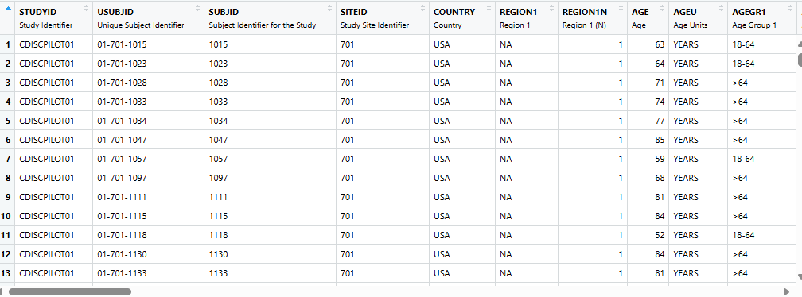
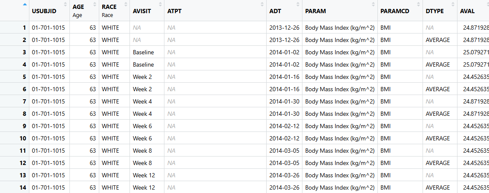

```{r}
#| include: false
library(glue)
library(countdown)
library(tibble)
library(admiral)
library(lubridate)
library(reactable)
library(fontawesome)

# fill for font awesome icons
fa_fill <- "#606060"

# Package badge colors for the function cheat sheets
pkg_colors <- c(
  admiral   = "#7570B3",
  metacore  = "#1B9E77",
  metatools = "#D95F02",
  xportr    = "#E7298A"
)

pkg_badge <- function(pkg) {
  glue(
    "<span style='background-color:{pkg_colors[pkg]}; color:white; ",
    "padding:2px 8px; border-radius:10px; font-size:0.85em;'>{pkg}</span>"
  )
}

fn_link <- function(pkg, fn, base_url) {
  glue(
    "<a href='{base_url}{fn}.html' target='_blank'>",
    "<code>{fn}()</code></a>"
  )
}

cheat_sheet_theme <- reactableTheme(
  headerStyle = list(fontWeight = 700),
  stripedColor = "#f7f7f7",
  highlightColor = "#eef3fb",
  cellPadding = "8px 10px"
)

# Package hexes
metacore_img <- "https://raw.githubusercontent.com/atorus-research/metacore/master/man/figures/metacore.PNG"
metatools_img <- "https://raw.githubusercontent.com/pharmaverse/metatools/master/man/figures/metatools.png"
xportr_img <- "https://raw.githubusercontent.com/atorus-research/xportr/master/man/figures/logo.png"
admiral_img <- "https://raw.githubusercontent.com/pharmaverse/admiral/master/man/figures/logo.png"
pharmaverse_img <- "https://raw.githubusercontent.com/pharmaverse/pharmaverse-pkg/master/man/figures/banner.png"
dplyr_img <- "https://raw.githubusercontent.com/tidyverse/dplyr/master/man/figures/logo.png"
str_img <- "https://raw.githubusercontent.com/tidyverse/stringr/master/man/figures/logo.png"
haven_img <- "https://raw.githubusercontent.com/tidyverse/haven/master/man/figures/logo.png"
lub_img <- "https://raw.githubusercontent.com/tidyverse/lubridate/master/man/figures/logo.png"

# Set image sizes
img_bullet_size <- 80
img_right_size <- 150
img_center_size <- 300
```

## Why I Lean on AI to Learn Code {.smaller}

<div style="text-align: center;">
`r fontawesome::fa("python", fill = "#3776AB", height = "120px")`
</div>

::: incremental
-   Starting a new job recently, I inherited a Python codebase - and I'm a Python newbie.
-   I could have handed an agent a `/plan` and let it do everything. Instead, I fed a chat AI individual functions, code, and docs and asked it to walk me through what things did and why.
-   That back-and-forth - not just running code, but *understanding* it - was one of the best learning experiences I've had picking up an unfamiliar codebase.
-   Some of how we're learning `admiral` together today - explain, adapt, troubleshoot, with an AI pair-programmer - is inspired by that.
:::

## Objectives

By the end of this ADaM section you will have:

::::: {.pv-cards}
:::: {.pv-card}
[🎯]{.pv-ico}
[Gained]{.pv-title}
Fluency with `admiral`, `metatools`/`metacore`, and `xportr` - with an AI assistant as your pair-programmer
::::
:::: {.pv-card}
[👀]{.pv-ico}
[Seen]{.pv-title}
Code creating variables and records common to `ADSL` and `ADVS`
::::
:::: {.pv-card .pv-accent}
[🛠️]{.pv-ico}
[Practiced]{.pv-title}
Prompting an AI assistant to explain, adapt, and troubleshoot `admiral` functions instead of hand-writing every line
::::
:::: {.pv-card}
[✅]{.pv-ico}
[Completed]{.pv-title}
Hands-on exercises using `admiral`, leaning on your AI assistant when you get stuck
::::
:::::

## Agenda {.smaller}

::: {.pv-agenda}
::: {.pv-agenda-item}
[🎬]{.pv-agenda-ico}
[Set the Stage]{.pv-agenda-title}
[11:00 - 11:15]{.pv-agenda-time}
:::
::: {.pv-agenda-item}
[🧬]{.pv-agenda-ico}
[`ADSL`]{.pv-agenda-title}
[11:15 - 11:45]{.pv-agenda-time}
:::
::: {.pv-agenda-item}
[✏️]{.pv-agenda-ico}
[Datetime Exercise]{.pv-agenda-title}
[11:45 - 11:50]{.pv-agenda-time}
:::
::: {.pv-agenda-item}
[📊]{.pv-agenda-ico}
[`ADVS`]{.pv-agenda-title}
[11:50 - 12:21]{.pv-agenda-time}
:::
::: {.pv-agenda-item}
[✏️]{.pv-agenda-ico}
[New Records Exercise]{.pv-agenda-title}
[12:21 - 12:26]{.pv-agenda-time}
:::
::: {.pv-agenda-item}
[🍽️]{.pv-agenda-ico}
[Lunch!]{.pv-agenda-title}
[12:26]{.pv-agenda-time}
:::
:::

## Where We're Headed Today

::: {.pv-flow}
[[📥]{.pv-ico} Raw]{.pv-step}
[[📋]{.pv-ico} SDTM]{.pv-step}
[[🎯]{.pv-ico} ADaM]{.pv-step .pv-step-current}
[[📊]{.pv-ico} ARD]{.pv-step}
[[📈]{.pv-ico} TFL]{.pv-step}
:::

::: incremental
-   **Raw:** Where every study starts.
-   **SDTM:** Standardized into a common shape across studies.
-   **ADaM:** Our focus today - analysis-ready variables and records.
-   **ARD:** Summarized into Analysis Results Datasets.
-   **TFL:** Formatted into Tables, Figures, and Listings for submission.
:::


# Set the Stage

🕥11:00 - 11:15

<div style="text-align: center;">  </div>

## One Setup Tip: Switch to Auto Mode

::: incremental
-   Flip Posit Assistant to **Auto** mode before we start the "Try It" prompts.
-   Auto mode lets it read files, run R, and iterate on its own without stopping to ask permission on every single step.
-   That matters today - our exercise windows are short, and stopping to click "approve" after every tool call eats the clock.
-   You're still the reviewer: skim what it did and the diff afterward, and stop it any time something looks off.
:::

## `ADSL` & `ADVS` - Our Two Datasets {.smaller}

:::: {.columns}

::: {.column width="50%"}
<div style="text-align: center;">  </div>

* `ADSL` - one record per subject (306 obs, 48 vars). Focus: **adding variables**.
* Built from `{pharmaversesdtm}`, `ADSL` section of our spec. Final version in [pharmaverseadam](https://pharmaverse.github.io/pharmaverseadam/).
:::

::: {.column width="50%"}
<div style="text-align: center;">  </div>

* `ADVS` - a Basic Data Structure (BDS), **multiple records** per subject (~62K records, 68 vars).
* Built from `{pharmaversesdtm}` `vs` + `ADSL`, `ADVS` section of spec. Many functions repeat from `ADSL`.
:::

::::

* No digging through folders - open both scripts straight from the R console (paths are relative to the project root):

```{r, eval=FALSE}
file.edit("slides/03-ADaM/scripts/adsl.R")
```

```{r, eval=FALSE}
file.edit("slides/03-ADaM/scripts/advs.R")
```

## Spec-details

- Gives specifics on how we derive variables in the ADaMs (extreme traceability)
- P21-like spec - a data validation format widely used for creating/validating SDTMs and ADaMs
- Not fit for purpose here - just a helpful guide
- Contains: dataset labels/keys, variable labels/lengths/types linked to method, codelists/control terms
- Let's take a quick [live peek](https://github.com/posit-conf-2026/pharmaverse/tree/main/slides/03-ADaM/metadata) 👀

## How We'll Dig Into the Scripts ^[Lines: 20-25]

::: incremental
-   Every slide from here on references specific line numbers in `adsl.R`/`advs.R`, footnoted right in the heading like this one - see the <span class="pv-line-pill">Lines: 20-25</span> pill up top, and the matching note down at the bottom of this slide - follow along in your open script.
-   We'll walk through the key functions together first...
-   ...then use AI prompts to dig in deeper on the arguments and edge cases, rather than reciting the docs line by line.
:::

## Key Functions Cheat Sheet: `{admiral}` `r glue("")`

```{r}
#| echo: false
admiral_base_url <- "https://pharmaverse.github.io/admiral/cran-release/reference/"

admiral_fns <- tibble::tribble(
  ~fn, ~Purpose,
  "derive_vars_merged",    "`left_join` on steroids",
  "derive_param_computed", "Core function for wrappers used in ADVS",
  "derive_vars_dtm",       "Take a `--DTC` variable and turn it into a `--DTM` variable",
  "derive_vars_duration",  "Duration between timepoints",
  "restrict_derivation",   "HOF: Execute a derivation on a subset of the input dataset"
)
admiral_fns$Function <- fn_link("admiral", admiral_fns$fn, admiral_base_url)
admiral_fns$Package  <- pkg_badge("admiral")

n_admiral_exported  <- length(getNamespaceExports("admiral"))
n_admiral_fns       <- sum(vapply(
  getNamespaceExports("admiral"),
  \(x) tryCatch(is.function(get(x, envir = asNamespace("admiral"))), error = \(e) FALSE),
  logical(1)
))

reactable(
  admiral_fns[, c("Package", "Function", "Purpose")],
  columns = list(
    Package  = colDef(html = TRUE, minWidth = 130),
    Function = colDef(html = TRUE, minWidth = 300),
    Purpose  = colDef(minWidth = 360)
  ),
  striped = TRUE,
  highlight = TRUE,
  bordered = TRUE,
  compact = TRUE,
  theme = cheat_sheet_theme,
  width = "100%",
  style = list(fontSize = "1.05em")
)
```

::: {.aside}
That's `r nrow(admiral_fns)` of `{admiral}`'s `r n_admiral_fns` exported functions - we picked our favorites; the other `r n_admiral_fns - nrow(admiral_fns)` are still waiting for you (and your AI assistant) to meet them.
:::

## Key Functions Cheat Sheet: `{metacore}`, `{metatools}`, `{xportr}` `r glue("")`

```{r}
#| echo: false
metacore_base_url  <- "https://atorus-research.github.io/metacore/reference/"
metatools_base_url <- "https://pharmaverse.github.io/metatools/reference/"
xportr_base_url    <- "https://atorus-research.github.io/xportr/reference/"

metadata_fns <- tibble::tribble(
  ~pkg,        ~fn,                      ~base_url,           ~Purpose,
  "metacore",  "spec_to_metacore",       metacore_base_url,   "Creates a \"special\" object from your specs",
  "metatools", "combine_supp",           metatools_base_url,  "Join Parent and Supplementary Datasets",
  "metatools", "create_var_from_codelist", metatools_base_url, "Numeric vars from Specs!",
  "xportr",    "xportr_label",           xportr_base_url,     "Apply labels from Spec",
  "xportr",    "xportr_write",           xportr_base_url,     "Write out an xpt file"
)
metadata_fns$Package  <- pkg_badge(metadata_fns$pkg)
metadata_fns$Function <- purrr::pmap_chr(
  metadata_fns[, c("pkg", "fn", "base_url")],
  \(pkg, fn, base_url) fn_link(pkg, fn, base_url)
)

count_pkg_fns <- function(pkg) {
  sum(vapply(
    getNamespaceExports(pkg),
    \(x) tryCatch(is.function(get(x, envir = asNamespace(pkg))), error = \(e) FALSE),
    logical(1)
  ))
}
n_metacore_fns  <- count_pkg_fns("metacore")
n_metatools_fns <- count_pkg_fns("metatools")
n_xportr_fns    <- count_pkg_fns("xportr")
n_metadata_total <- n_metacore_fns + n_metatools_fns + n_xportr_fns

reactable(
  metadata_fns[, c("Package", "Function", "Purpose")],
  columns = list(
    Package  = colDef(html = TRUE, minWidth = 130),
    Function = colDef(html = TRUE, minWidth = 300),
    Purpose  = colDef(minWidth = 320)
  ),
  striped = TRUE,
  highlight = TRUE,
  bordered = TRUE,
  compact = TRUE,
  theme = cheat_sheet_theme,
  width = "100%",
  style = list(fontSize = "1.05em")
)
```

::: {.aside}
That's `r nrow(metadata_fns)` of the `r n_metadata_total` functions across `{metacore}` (`r n_metacore_fns`), `{metatools}` (`r n_metatools_fns`), and `{xportr}` (`r n_xportr_fns`) - small packages, big reference pages.
:::

# `ADSL`

🕥 11:15 - 11:45

::: {.callout-note title="Follow Along"}
Lines in each script are referenced with a footnote like `^[Lines: 20-25]` - flip to that spot in `adsl.R` as we go.
:::

## Reading in our spec for `ADSL` ^[Lines: 20-25] ^[Got extra time or curiosity? There's a [Try It](#try-it-ask-your-ai-for-assistance-on-reading-a-spec) for this one waiting in the appendix - go make friends with `spec_to_metacore()`.] {.smaller}

```{.r code-line-numbers="1|2|3|4|5|6"}
adsl_spec <- spec_to_metacore(
  path = "slides/03-ADaM/metadata/posit_specs.xlsx",
  where_sep_sheet = FALSE,
  verbose = "silent"
) %>%
  select_dataset("ADSL")
```

* Functions from `{metacore}`; takes a P21-like spec and makes it into an object we can easily access.
* `where_sep_sheet` - is the info in a separate sheet (older P21 specs) or one sheet (newer specs)?
* `verbose = "silent"` while iterating on your spec (replaces the deprecated `quiet` argument).
* Same call in `ADVS` script.

## Combine Parent and Supplementary Data ^[Lines: 53] ^[Got extra time or curiosity? There's a [Try It](#try-it-ask-your-ai-for-assistance-on-supplemental-qualifiers) for this one waiting in the appendix - `combine_supp()` would love the company.]

```{.r}
dm_suppdm <- combine_supp(dm, suppdm)
```

* One line of code to join two datasets: parent and supplementary!
* Supps usually are a collection non-standard data and linking to parent
* Function is from `{metatools}`

## Let's turn a `--DTC` to a `*DTM` or `*DT` variable ^[Lines: 57-69, 132-136]

```{.r code-line-numbers="1|2|3|4|5|6"}
ex_ext <- ex %>%
  derive_vars_dtm(
    dtc = EXSTDTC,
    new_vars_prefix = "EXST",
    time_imputation = "last",
    flag_imputation = "time"
)
```

```{.r code-line-numbers="1|2|3|4|5"}
ds_ext <- derive_vars_dt(
  ds,
  dtc = DSSTDTC,
  new_vars_prefix = "DSST"
)
```

## Try It: Ask Your AI for Assistance on Dates {.smaller}

* A great first prompt for getting comfortable with Posit Assistant and admiral - try it live in your own console!

::: {.codewindow style="font-size: 1.05em;"}
```
I want to see how admiral handles messy dates. Create a small dummy
dataset with a --DTC style character date variable, and give it a
realistic mix of partial values: one full date and time, one with
the time missing, one missing just the day, one with only the year,
and one that's completely blank.

Then use admiral to derive a proper datetime variable from it. I'm
fine with imputing all the way up through the month if it's missing,
but not the year itself - if the year isn't there, just leave it
missing. When a month or day is missing, impute to the end of that
period rather than the beginning, and do the same for a missing time
- push it to the end of the day. We do occasionally capture seconds
in our real data, so don't suppress that from the imputation flag.

Show me the resulting dataset, including the imputation flags, and
briefly explain what happened to each row.
```
:::

::: {.callout-tip title="Goal"}
Practice describing what you want in plain language and let the AI assistant map that to the right `admiral` function and arguments - then compare its choices to what you'd have written by hand.
:::

```{r}
#| echo: false
countdown::countdown(minutes = 7)
```

## A Simple merge ^[Lines: 187-194]

```{.r code-line-numbers="1|2|3|4|5|6"}
adsl10 <- adsl09 %>%
  derive_vars_merged(
    dataset_add = ds_ext,
    by_vars = exprs(STUDYID, USUBJID),
    new_vars = exprs(RANDDT = DSSTDT),
    filter_add = DSDECOD == "RANDOMIZED",
  )
```

* Filter, arrange, join and rename is a common pattern in ADaMs.
* `by_vars` are going to be the shared variables to connect the two datasets
* In admiral, all arguments which can be set to multiple variables, a calculation, or an assignment must be started with `rlang::exprs()`.
* Check out [Programming Concepts and Conventions](https://pharmaverse.github.io/admiral/cran-release/articles/concepts_conventions.html#exprs)


## Let's get a more complicated merge: `order` & `mode` ^[Lines: 72-84] {.smaller}

```{.r code-line-numbers="1|2|3|4|5|6|7|8|9|10"}
derive_vars_merged(
  dataset_add = ex_ext,
  by_vars = exprs(STUDYID, USUBJID),
  order = exprs(EXSTDTM, EXSEQ),
  new_vars = exprs(TRTSDTM = EXSTDTM, TRTSTMF = EXSTTMF),
  filter_add = (EXDOSE > 0 |
    (EXDOSE == 0 &
      str_detect(EXTRT, "PLACEBO"))) &
    !is.na(EXSTDTM),
  mode = "first",
)
```

* `order` - for each by group, the first or last observation from the additional dataset is selected with respect to the specified order
* `mode` - determines whether the first or last observation (per `order`) is selected
* Together, `order = exprs(EXSTDTM, EXSEQ)` and `mode = "first"` say: "for each subject, sort their exposure records by start datetime (then sequence number to break ties), and keep the earliest one"

## Let's get a more complicated merge: `filter_add` ^[Lines: 72-84, and more!!] {.smaller}

```{.r code-line-numbers="6|6-9"}
derive_vars_merged(
  dataset_add = ex_ext,
  by_vars = exprs(STUDYID, USUBJID),
  order = exprs(EXSTDTM, EXSEQ),
  new_vars = exprs(TRTSDTM = EXSTDTM, TRTSTMF = EXSTTMF),
  filter_add = (EXDOSE > 0 |
    (EXDOSE == 0 &
      str_detect(EXTRT, "PLACEBO"))) &
    !is.na(EXSTDTM),
  mode = "first",
)
```

* `filter_add` restricts *which* records from `dataset_add` are eligible, before `order`/`mode` ever run:
  - `EXDOSE > 0` - a real (non-zero) dose
  - `EXDOSE == 0 & str_detect(EXTRT, "PLACEBO")` - **or** a zero-dose placebo record (so placebo subjects still get a valid start, but withheld doses don't)
  - `!is.na(EXSTDTM)` - **and** a start datetime to order/select on
* This narrows the candidate pool *before* `mode = "first"` picks the earliest qualifying record per subject

## Try It: Ask Your AI for Assistance on Merging {.smaller}

::: {.codewindow style="font-size: 1.05em;"}
```
Create two small example datasets - a subject-level dataset, and an
exposure dataset with several dosing records per subject (some with
a dose of zero for placebo). Then write an admiral call that pulls
each subject's first qualifying dose date into the subject-level
dataset as a new TRTSDTM variable.

I know I need to join on subject, but I'm not sure what to set so
that it picks the *first* qualifying record instead of just any one
of them, or how to exclude the placebo records from consideration.
Fill those parts in and explain the choices you made.
```
:::

::: {.callout-tip title="Goal"}
Practice handing the AI a join scenario in plain language and seeing which arguments it reaches for to control ordering and filtering.
:::

```{r}
#| echo: false
countdown::countdown(minutes = 7)
```

## Let's derive a Duration Variable ^[Lines: 122-126] ^[Got extra time or curiosity? There's a [Try It](#try-it-ask-your-ai-for-assistance-on-durations) for this one waiting in the appendix - go settle the age-rounding debate yourself.] {.smaller}

```{.r code-line-numbers="1|2|3|4"}
derive_vars_duration(
    new_var = DTHADY,
    start_date = TRTSDT,
    end_date = DTHDT
  )
```

* `derive_vars_duration()` computes a span between two dates/datetimes (e.g. days on treatment, age at an event) - control the units with `out_unit`, and whether a partial period rounds up with `add_one`/`trunc_out`.
* It's powered by `{lubridate}` under the hood, which measures spans two ways - **duration** (an exact number of seconds) and **interval** (a specific point-to-point span). These usually agree, but can differ slightly for month/year units, since months and years aren't a fixed number of days.

## Let's apply Control Terms / Code Lists ^[Lines: 276-282] ^[Got extra time or curiosity? There's a [Try It](#try-it-ask-your-ai-for-assistance-on-codelists) for this one waiting in the appendix - go find out which direction `decode_to_code` really goes.]

```{.r}
adsl16 %>%
  create_var_from_codelist(adsl_spec, input_var = AGEGR1, out_var = AGEGR1N) %>%
  create_var_from_codelist(adsl_spec, input_var = RACE, out_var = RACEN) %>%
  create_var_from_codelist(adsl_spec, input_var = RACEGR1, out_var = RACEGR1N) %>%
  create_var_from_codelist(adsl_spec, input_var = REGION1, out_var = REGION1N) %>%
  create_var_from_codelist(adsl_spec, input_var = TRT01P, out_var = TRT01PN) %>%
  create_var_from_codelist(adsl_spec, input_var = TRT01A, out_var = TRT01AN)
```

* `create_var_from_codelist()` is a function from `{metatools}`
* Numeric variables are handy for sorting in a table or listing for display.

# Datetime Exercise

🕚11:45 - 11:50

## Datetime Exercise {.smaller}

```{r}
library(tibble)
library(lubridate)
library(admiral)

posit_mh <- tribble(
  ~USUBJID,       ~MHSTDTC,
  "01-701-1011",  "2019-07-18T15:25:40",
  "01-701-1011",  "2019-07-18T15:25",
  "01-701-1011",  "2019-07-18",
  "01-701-1015",  "2024-02",
  "01-701-1015",  "2019",
  "01-701-1015",  "2019---07",
  "01-701-1019",  ""
)
```

::: {.callout-important title="Your Task"}
Using `derive_vars_dtm()`, impute a missing **date** to the **last** month/day, and a missing **time** to **23:59:59**.
:::

* Figure out which arguments make that happen - check the [documentation](https://pharmaverse.github.io/admiral/cran-release/reference/derive_vars_dtm.html) or ask your AI assistant if you get stuck.

```{r}
#| echo: false
countdown::countdown(minutes = 5)
```

## Datetime Exercise Solution {.smaller}

```{r}
posit_mh <- tribble(
  ~USUBJID,       ~MHSTDTC,
  "01-701-1011",  "2019-07-18T15:25:40",
  "01-701-1011",  "2019-07-18T15:25",
  "01-701-1011",  "2019-07-18",
  "01-701-1015",  "2024-02",
  "01-701-1015",  "2019",
  "01-701-1015",  "2019---07",
  "01-701-1019",  ""
)

derive_vars_dtm(
  dataset = posit_mh,
  new_vars_prefix = "AST",
  dtc = MHSTDTC,
  highest_imputation = "M",
  date_imputation = "last",
  time_imputation = "last",
  ignore_seconds_flag = FALSE
)

```


# `ADVS`

🕦11:50 - 12:21

::: {.callout-note title="Follow Along"}
Lines in each script are referenced with a footnote like `^[Lines: 72-80]` - flip to that spot in `advs.R` as we go.
:::

## Let's talk about lookup tables ^[Lines: 72-80] ^[Got extra time or curiosity? There's a [Try It](#try-it-ask-your-ai-for-assistance-on-lookup-tables) for this one waiting in the appendix - go catch an unmapped code red-handed.]

```{.r code-line-numbers="1|2|3|4|5|6"}
  derive_vars_merged_lookup(
    dataset_add = param_lookup,
    new_vars = exprs(PARAMCD),
    by_vars = exprs(VSTESTCD),
    print_not_mapped = TRUE 
  ) 
```

* Moving from `**TEST/**TESTCD` to `PARAM/PARAMCD`.
* More information in the `PARAM/PARAMCD` - useful for displays.
* Can be used for other lookup tables, e.g. Grading/Toxicity.

## Let's add more records for each subject ^[Lines: 100-111]

```{.r code-line-numbers="1|2|3|4|5|6|7|8|9|10"}
advs <- advs %>%
  derive_param_computed(
    by_vars = exprs(STUDYID, USUBJID, VISIT, VISITNUM, ADT, ADY, VSTPT, VSTPTNUM),
    parameters = "WEIGHT",
    set_values_to = exprs(
      AVAL = AVAL.WEIGHT / (AVAL.HEIGHT / 100)^2,
      PARAMCD = "BMI",
      PARAM = "Body Mass Index (kg/m^2)",
      AVALU = "kg/m^2"
    ),
    constant_parameters = c("HEIGHT"),
    constant_by_vars = exprs(USUBJID)
)
```

## Try It: Ask Your AI for Assistance on Computed Parameters {.smaller}

::: {.codewindow style="font-size: 1.05em;"}
```
Create a small example vital signs dataset with WEIGHT records at
several visits per subject, but HEIGHT collected only once per
subject. Then write an admiral call that derives a new BMI parameter
from those records, using weight in kg divided by height in meters
squared.

Since HEIGHT is only collected once, I don't want to require it to
be present at every visit for BMI to be calculated - I want that one
HEIGHT value reused across all of a subject's visits. Figure out how
to tell the function that, and explain what would happen if you left
that part out.
```
:::

::: {.callout-tip title="Goal"}
Practice a "one value applies to many records" scenario, which comes up any time a computed parameter mixes visit-level and subject-level inputs.
:::

```{r}
#| echo: false
countdown::countdown(minutes = 7)
```

## Let's derive DTYPE summary records ^[Lines: 144-153] ^[Got extra time or curiosity? There's a [Try It](#try-it-ask-your-ai-for-assistance-on-summary-records) for this one waiting in the appendix - go average some replicate readings of your own.]

```{.r code-line-numbers="1|2|3|4|5|6|7|8|9"}
derive_summary_records(
    dataset_add = advs_2, 
    by_vars = exprs(STUDYID, USUBJID, !!!adsl_vars, PARAMCD, AVISITN, AVISIT, ADT, ADY, AVALU),
    filter_add = !is.na(AVAL),
    set_values_to = exprs(
      AVAL = mean(AVAL),
      DTYPE = "AVERAGE"
  )
)
```

* A DTYPE variable indicates a record within a parameter has been imputed or modified, 
DTYPE will indicate the method used to populate the analysis value, e.g AVERAGE,
MAXIMUM, MINIMUM, LOCF, PHANTOM.

## Let's restrict! ^[Lines: 196-210]

```{.r code-line-numbers="1|2|3|4|5|6|7|8|9|10|11|12"}
restrict_derivation(
  derivation = derive_var_extreme_flag,
  args = params(
    by_vars = exprs(STUDYID, USUBJID, BASETYPE, PARAMCD),
    order = exprs(ADT, VISITNUM, VSSEQ),
    new_var = ABLFL,
    mode = "last",
    true_value = "Y"
  ),
  filter = (!is.na(AVAL) &
    ADT <= TRTSDT & !is.na(BASETYPE) & is.na(DTYPE))
)
```

* Check out [Higher Order Functions](https://pharmaverse.github.io/admiral/cran-release/articles/higher_order.html)
for more information. 
* `call_derivation()` is super handy if you are doing similar calls with same function,
but just changing one or two arguments.

## Try It: Ask Your AI for Assistance on Restricting a Derivation {.smaller}

::: {.codewindow style="font-size: 1.05em;"}
```
Create a small example vital signs dataset with multiple visits per
subject and a treatment start date. Then use admiral's higher order
function to flag the last on-treatment record per subject as the
baseline flag - but only consider records collected on or before
treatment start when deciding which one is "last."

I'm not sure how to tell the function to only look at that subset of
records without permanently filtering the rest of the dataset out of
the result - figure out how to do that and explain how it's different
from just filtering the dataset first.
```
:::

::: {.callout-tip title="Goal"}
See how a higher order function like `restrict_derivation()` lets you scope a derivation to a subset of records without losing the rest of the dataset.
:::

```{r}
#| echo: false
countdown::countdown(minutes = 7)
```

## Let's add a BASE variable ^[Lines: 210-217]

```{.r code-line-numbers="1|2|3|4|5|6|7|"}
advs <- derive_var_base(
  advs,
  by_vars = exprs(STUDYID, USUBJID, PARAMCD, BASETYPE),
  source_var = AVAL,
  new_var = BASE,
  # Below arguments are default values and not necessary to add in our case
  filter = ABLFL == "Y"
)
```

* Used to calculate CHG and PCHG variables

## Let's add an Analysis Sequence Variable ^[Lines: 262-268] ^[Got extra time or curiosity? There's a [Try It](#try-it-ask-your-ai-for-assistance-on-sequence-numbers) for this one waiting in the appendix - go make `check_type` earn its keep.] {.smaller}

```{.r code-line-numbers="1|2|3|4|5|6|7|"}
advs <- derive_var_obs_number(
  advs,
  new_var = ASEQ,
  by_vars = exprs(STUDYID, USUBJID),
  order = exprs(PARAMCD, ADT, AVISITN, VISITNUM, ATPTN, DTYPE),
  check_type = "error"
)
```

* ASEQ uniquely indexes records within a subject within an ADaM dataset.
* ASEQ is useful for traceability when the dataset is used as input to another ADaM dataset
* `check_type` - If "message", "warning" or "error" is specified, the specified message 
is issued if the observations of the input dataset are not unique with respect to the by variables and the order.

## Let's get that ADaM ready for regulatory agencies ^[Lines: 304-308]

```{.r code-line-numbers="1|2|3|4|5"}
advs_prefinal <- advs %>%
  drop_unspec_vars(advs_spec) %>% 
  check_variables(advs_spec) %>% 
  order_cols(advs_spec) %>% 
  sort_by_key(advs_spec) 
```

* Functions from `{metatools}`
* `dataset_name` is no longer needed here - since our `advs_spec` metacore object is already scoped to a single dataset via `select_dataset()`, `check_variables()` picks that up automatically (the argument is deprecated as of `metatools` 0.2.0).
* Note similar code in `ADSL` script!

## Let's get that data read for regulatory agencies ^[Lines: 311-316] ^[Got extra time or curiosity? There's a [Try It](#try-it-ask-your-ai-for-assistance-on-preparing-an-xpt-file) for this one waiting in the appendix - go give `xportr` a proper test drive.]

```{.r code-line-numbers="1|2|3|4|5|6"}
advs_final <- advs_prefinal %>%
  xportr_length(advs_spec) %>%
  xportr_label(advs_spec) %>%
  xportr_format(advs_spec, domain = "ADVS") %>%
  xportr_df_label(advs_spec, domain = "ADVS") %>%
  xportr_write(file.path(dir, "advs.xpt"), metadata = advs_spec, domain = "ADVS")
```

* Functions from `{xportr}`
* Note similar code in `ADSL` script!
* `domain` is needed depending on how `metacore` object is created.

# New Records Exercise

🕦 12:21 - 12:26

## New Records Exercise {.smaller}

```{r}
ADVS <- tribble(
  ~USUBJID,      ~PARAMCD, ~PARAM,                            ~AVALU,  ~AVAL, ~VISIT,
  "01-701-1015", "DIABP",  "Diastolic Blood Pressure (mmHg)", "mmHg",    51, "BASELINE",
  "01-701-1015", "SYSBP",  "Systolic Blood Pressure (mmHg)",  "mmHg",   121, "BASELINE",
  "01-701-1028", "DIABP",  "Diastolic Blood Pressure (mmHg)", "mmHg",    79, "BASELINE",
  "01-701-1028", "SYSBP",  "Systolic Blood Pressure (mmHg)",  "mmHg",   130, "BASELINE",
)
```

::: {.callout-important title="Your Task"}
Write a `derive_param_computed()` call that derives `MAP` from the `SYSBP`/`DIABP` records above:

$$ MAP = \frac{2 \times DIABP + SYSBP}{3} $$
:::

* Figure out which arguments make that happen - ask your AI assistant if you get stuck.

```{r}
#| echo: false
countdown::countdown(minutes = 5)
```

## New Records Exercise Solution {.smaller}

```{r}
ADVS <- tribble(
  ~USUBJID,      ~PARAMCD, ~PARAM,                            ~AVALU,  ~AVAL, ~VISIT,
  "01-701-1015", "DIABP",  "Diastolic Blood Pressure (mmHg)", "mmHg",    51, "BASELINE",
  "01-701-1015", "SYSBP",  "Systolic Blood Pressure (mmHg)",  "mmHg",   121, "BASELINE",
  "01-701-1028", "DIABP",  "Diastolic Blood Pressure (mmHg)", "mmHg",    79, "BASELINE",
  "01-701-1028", "SYSBP",  "Systolic Blood Pressure (mmHg)",  "mmHg",   130, "BASELINE",
) 

derive_param_computed(
  ADVS,
  by_vars = exprs(USUBJID, VISIT),
  parameters = c("SYSBP", "DIABP"),
  set_values_to = exprs(
    AVAL = (AVAL.SYSBP + 2 * AVAL.DIABP) / 3,
    PARAMCD = "MAP",
    PARAM = "Mean Arterial Pressure (mmHg)",
    AVALU = "mmHg",
  )
)
```

## Questions and Resources

::: columns
::: {.column width="50%"}
`r fontawesome::fa("book", fill = fa_fill)` Docs & pkgdown sites:

[admiral](https://pharmaverse.github.io/admiral/), [metatools](https://pharmaverse.github.io/metatools/), [metacore](https://atorus-research.github.io/metacore/), [xportr](https://atorus-research.github.io/xportr/)

<br>

`r fontawesome::fa("compass", fill = fa_fill)` [admiraldiscovery](https://pharmaverse.github.io/admiraldiscovery/) - templates & presentation archive
:::

::: {.column width="50%"}
`r fontawesome::fa("code-branch", fill = fa_fill)` [pharmaverse examples](https://github.com/pharmaverse/examples)

<br>

`r fontawesome::fa("puzzle-piece", fill = fa_fill)` Extension packages: [admiralophtha](https://pharmaverse.github.io/admiralophtha/), [admiralonco](https://pharmaverse.github.io/admiralonco/), [admiralpeds](https://github.com/pharmaverse/admiralpeds)

<br>

`r fontawesome::fa("robot", fill = fa_fill)` Stuck? Ask an AI assistant.
:::
:::

::: {.callout-note title="Want More?"}
A bunch more Ben-style "Ask Your AI" prompts are coming up right after this section - if you want to mess around with more `admiral`/`metatools`/`xportr` functions on your own time.
:::

## Closing Thoughts

> -   Only able to show a small number of `pharmaverse` packages
>     and functions today, but please delve deeper to explore the full
>     breadth
> -   If you'd like to contribute to `pharmaverse`, check out options at
>     [pharmaverse.org](https://pharmaverse.org/contribute/)
> -   Finally, be sure to join our community on
>     [Slack!](https://join.slack.com/t/pharmaverse/shared_invite/zt-yv5atkr4-Np2ytJ6W_QKz_4Olo7Jo9A)

# Explore on Your Own

Ran out of time today? Try these extra "Ask Your AI" prompts on your own -
same style as what we practiced live, just a few more functions worth
getting comfortable with.

## Try It: Ask Your AI for Assistance on Dates, Round 2 {.smaller}

* Picks up right where [Try It: Ask Your AI for Assistance on Dates](#try-it-ask-your-ai-for-assistance-on-dates) left off - same messy `--DTC` dataset and `derive_vars_dtm()` call, but now with reference dates in play.
* Now let's push it further and put `min_dates`, `max_dates`, and `preserve` to work.

::: {.codewindow style="font-size: 1.05em;"}
```
Let's extend that last exercise. Add a treatment start datetime and
a data cutoff datetime for each subject to the dataset. Also add one
more --DTC record where the month is unknown but the day is - like
"2019---07" for the 7th of some unspecified month.

When you impute, don't throw away a date part just because a part
above it was missing - if we already know the day, keep it even
though we had to guess the month. Also make sure none of the imputed
datetimes end up earlier than that subject's treatment start, or
later than the data cutoff - adjust the imputed value to respect
those boundaries instead of ignoring them.

Show me the resulting dataset and explain how the reference dates
changed the outcome compared to imputing without them.
```
:::

::: {.callout-tip title="Goal"}
See how `admiral` can keep an imputed value from "wandering off" past dates you already know are true - useful when a partial date still needs to make logical sense next to other dates in the study.
:::

## Try It: Ask Your AI for Assistance on Reading a Spec {.smaller}

::: {.codewindow style="font-size: 1.05em;"}
```
Pretend I have a P21-style Excel spec file at "metadata/my_spec.xlsx".
Write the metacore call to read it in and scope it down to just the
ADSL dataset.

I'm developing this spec right now, so I don't want it printing extra
messages or warnings while I iterate on it - figure out which argument
controls that and set it appropriately. I also don't know whether my
spec keeps its "where" conditions on a separate sheet or all in one
sheet like newer specs do - make a reasonable assumption, tell me
which one you picked, and explain what would change if it were the
other way.
```
:::

::: {.callout-tip title="Goal"}
Practice letting the AI reason about a setting you're genuinely unsure of, rather than only using it for settings you already know the answer to.
:::

## Try It: Ask Your AI for Assistance on Supplemental Qualifiers {.smaller}

::: {.codewindow style="font-size: 1.05em;"}
```
Create a small example parent SDTM dataset (like DM) and a matching
supplemental qualifier dataset (SUPPDM) with a couple of extra
non-standard variables attached to a few of the same subjects.

Then write the metatools call that joins the parent and supplemental
data into one dataset. Show me the result, and explain what happens
to a subject who appears in the supplemental dataset but not the
parent dataset, or vice versa.
```
:::

::: {.callout-tip title="Goal"}
Build intuition for a one-line helper function by seeing it work (and fail gracefully) on data you understand.
:::

## Try It: Ask Your AI for Assistance on Durations {.smaller}

::: {.codewindow style="font-size: 1.05em;"}
```
Create a small example dataset with a birth date and a randomization
date for a handful of subjects, including at least one subject
missing one of those dates.

Then write an admiral call to calculate each subject's age in years
at randomization. I want a whole number of years - if someone hasn't
had their most recent birthday yet relative to randomization, don't
round their age up to the next year. Figure out which arguments
control that rounding behavior and set them, then explain your
choices and what happens for the subject with a missing date.
```
:::

::: {.callout-tip title="Goal"}
Practice describing a rounding/truncation preference in plain terms and letting the AI translate it into the right combination of arguments.
:::

## Try It: Ask Your AI for Assistance on Codelists {.smaller}

::: {.codewindow style="font-size: 1.05em;"}
```
Using the ADSL spec object we already read in with spec_to_metacore()
earlier, create a small example dataset with a character RACE
variable using a couple of the full-text values from that spec's RACE
codelist (e.g. "WHITE"). Then write a metatools call to add a new
numeric RACEN variable derived from that codelist.

I'm not sure whether my RACE values match the "code" side or the
"decode" side of the codelist - pick the argument that controls that
direction, tell me which way you assumed it goes, and explain what
the output would look like if that assumption were backwards.
```
:::

::: {.callout-tip title="Goal"}
Practice a case where getting a single argument's direction wrong would silently produce the wrong numbers - a good habit to build before you're doing this on real data.
:::

## Try It: Ask Your AI for Assistance on Lookup Tables {.smaller}

::: {.codewindow style="font-size: 1.05em;"}
```
Create a small example vital signs dataset with a test code variable
(like VSTESTCD), and a separate lookup table mapping those test codes
to standardized PARAMCD/PARAM values. Include one test code in the
vital signs data that doesn't have a matching row in the lookup
table.

Then write an admiral call that merges the lookup table into the
vital signs dataset to add PARAMCD/PARAM. I want to know right away
if any of my test codes don't have a match, instead of silently
ending up with missing values - figure out which argument surfaces
that and turn it on, then explain what happens for the unmatched
code.
```
:::

::: {.callout-tip title="Goal"}
Practice catching a silent data-quality problem (an unmapped code) instead of discovering it downstream.
:::

## Try It: Ask Your AI for Assistance on Summary Records {.smaller}

::: {.codewindow style="font-size: 1.05em;"}
```
Create a small example vital signs dataset with three replicate blood
pressure readings per subject at one visit, and make one of those
three readings missing for one subject.

Then write an admiral call that adds one new summary record per
subject that averages the replicate readings, marking it as derived
with DTYPE = "AVERAGE". I don't want the missing reading to turn the
whole average into a missing value - figure out how to exclude it
before averaging instead, and explain the difference between doing
that versus averaging with `na.rm = TRUE`.
```
:::

::: {.callout-tip title="Goal"}
Notice that `filter_add` scopes which rows are averaged *before* the calculation runs, rather than needing to handle missing values inside the formula itself.
:::

## Try It: Ask Your AI for Assistance on Sequence Numbers {.smaller}

::: {.codewindow style="font-size: 1.05em;"}
```
Create a small example dataset with a couple of records per subject
that would tie under a simple ordering - like two records with the
same parameter and date but nothing to distinguish which came first.

Then write an admiral call that adds an analysis sequence number per
subject, ordered by the fields I do have. I want it to stop with a
hard error if that ordering doesn't actually produce a unique number
for every record, rather than silently assigning duplicate sequence
numbers - figure out how to require that, and explain what the error
tells you versus what would happen at the default setting.
```
:::

::: {.callout-tip title="Goal"}
See how a strict `check_type` turns a silent data problem (duplicate ASEQ values) into something you're forced to notice and fix.
:::

## Try It: Ask Your AI for Assistance on Preparing an XPT File {.smaller}

::: {.codewindow style="font-size: 1.05em;"}
```
Create a small example ADaM-like dataset with a couple of variables
that don't have labels yet, plus a tiny metadata object describing
what those labels should be. Then write the xportr calls to apply
those labels to the dataset and export it as an xpt file named
"adsl.xpt".

I don't remember everything xportr needs beyond the dataset and the
file path to make sure the labels and dataset-level metadata carry
through correctly into the xpt file - figure out what else to pass
and explain what each additional piece is doing.
```
:::

::: {.callout-tip title="Goal"}
Practice the "last mile" of an ADaM - going from a labeled R data frame to a submission-ready xpt file - without having to memorize every xportr argument up front.
:::

## Packages and Session Information

```{r}
#| class-output: hscroll

sessionInfo()
```

```{css, echo=FALSE}
.hscroll {
  overflow-x: auto;
  white-space: nowrap;
}
```

