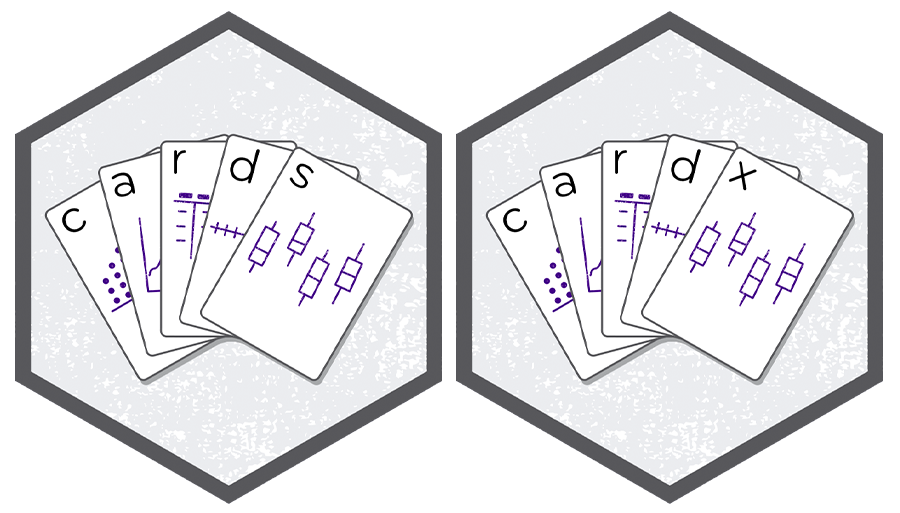

# ARDs using {cards} 
 
<a href="https://pharmaverse.github.io/cards/"></a>

## {cards}: Introduction

-   Part of the Pharmaverse

-   Collaboration between Roche, GSK, Novartis, Eli Lilly, Pfizer

-   Contains a variety of utilities for making ARDs

-   Can be used within the ARS workflow and separately

-   `r scales::number_format(scale = 1e-3, suffix = "K", accuracy = 1)(cranlogs::cran_downloads(packages = "gtsummary", when = "last-month")$count |> sum())` downloads per month 🤯

## Data used in examples

ADSL from `pharmaverseadam`
```{r }
#| label: data-adsl
#| code-fold: true

adsl <- pharmaverseadam::adsl |>
  dplyr::filter(SAFFL=="Y") |> 
  dplyr::mutate(ARM2 = ifelse(startsWith(ARM, "Xanomeline"), "Xanomeline", ARM))
```

ADAE from `pharmaverseadam`
```{r }
#| label: data-adae
#| code-fold: true

adae <- pharmaverseadam::adae |>
  dplyr::filter(SAFFL=="Y") |> 
  dplyr::mutate(ARM2 = ifelse(startsWith(ARM, "Xanomeline"), "Xanomeline", ARM)) |> 
  dplyr::filter(AESOC %in% unique(AESOC)[1:3]) |> 
  dplyr::group_by(AESOC) |> 
  dplyr::filter(AEDECOD %in% unique(AEDECOD)[1:3]) |> 
  dplyr::ungroup()
```

## {cards}: `ard_tabulate()`

::: {.small}
- includes `n`, `%`, `N` by default
- _Any unobserved levels of the variables will be present in the resulting ARD._
:::

```{r}
#| label: tabulate-agegr1
#| message: true
library(cards)

adsl |> 
  ard_tabulate(
    variables = AGEGR1
  ) 
```

## {cards}: `ard_tabulate()`

::: {.small}
- includes `n`, `%`, `N` by default
- _Any unobserved levels of the variables will be present in the resulting ARD._
:::

```{r}
#| label: tabulate-agegr1-by
#| message: true
#| R.options:
#|   pillar.print_max: 8
#|   pillar.print_min: 8
adsl |>
  ard_tabulate(
    by = ARM2,
    variables = AGEGR1
  )
```


## {cards}: `ard_summary()`

```{r}
#| label: summary-age
#| message: true
# create ARD with default summary statistics
adsl |>
  ard_summary(
    variables = AGE
  )
```


## {cards}: `ard_summary()` by variable

::: {.small}
`by`: summary statistics are calculated by all combinations of the by variables, including unobserved factor levels
:::

```{r}
#| label: summary-age-by
#| message: true
#| R.options:
#|   pillar.print_max: 8
#|   pillar.print_min: 8
adsl |>
  ard_summary(
    variables = AGE,
    by = ARM2         # stats by treatment arm
  )
```

## {cards}: `ard_summary()` statistics

::: {.small}
`statistic`: specify univariate summary statistics. Accepts _any_ function, base R, from a package, or user-defined.
:::


```{r}
#| label: summary-age-cv
#| message: true
cv <- function(x)  sd(x, na.rm = TRUE)/mean(x, na.rm = TRUE)

adsl |> 
  ard_summary(  
    variables = AGE,
    by = ARM2,
    statistic = ~ list(cv = cv) # customize statistics
  )

```

## {cards}: `ard_summary()` statistics

::: {.small}
Customize the statistics returned for each variable
:::

```{r}
#| label: summary-age-custom
#| message: true
adsl |>
  dplyr::mutate(AGE2 = AGE) |>
  ard_summary(
    variables = c(AGE, AGE2),
    by = ARM2,
    statistic = list(AGE = list(cv = cv),
                     AGE2 = continuous_summary_fns(c("mean","median")))
  )
```

## {cards}: `ard_summary()` fmt_fun

::: {.small}
- Override the default formatting functions
- Can also update later via `update_ard_fmt_fun()`
:::
 
```{r}
#| label: summary-age-fmt
#| message: true
#| R.options:
#|   pillar.print_max: 7
#|   pillar.print_min: 7
adsl |>
  ard_summary(
    variables = AGE,
    by = ARM2,
    fmt_fun = ~list(mean = 0)
  ) |>
  apply_fmt_fun() # add a character column of rounded results
```

## {cards}: Other Summary Functions 

- `ard_tabulate_value()`: similar to `ard_tabulate()`, but for dichotomous tabulations

- `ard_hierarchical()`: similar to `ard_tabulate()`, but built for nested tabulations, e.g. AE terms within SOC

- `ard_mvsummary()`: similar to `ard_summary()`, for multivariate summaries. The function accepts other arguments like the full and subsetted (within the by groups) data sets.

- `ard_missing()`: tabulates rates of missingness

The results from all these functions are entirely compatible with one another, and can be stacked into a single data frame. 🥞

## {cards}: Other Functions

In addition to exporting functions to prepare summaries, {cards} exports many utilities for wrangling ARDs and creating new ARDs. 

Constructing: `bind_ard()`, `tidy_as_ard()`, `nest_for_ard()`, `check_ard_structure()`, and many more

Wrangling: `get_ard_statistics()`, `replace_null_statistic()`, etc.


## {cards}: Stacking utilities

::: {.small}
- `data` and `.by` are shared by all `ard_*` calls

- Additional Options `.overall`, `.missing`, `.attributes`, and `.total_n` provide even more results

- By default, summaries of the `.by` variable are included
:::

```{r}
#| label: stack-intro
#| message: true
#| R.options:
#|   pillar.print_max: 6
#|   pillar.print_min: 6
adsl |>
  ard_stack(
    .by = ARM2,
    ard_summary(variables = AGE, statistic = ~ continuous_summary_fns(c("mean","sd"))), 
    ard_tabulate(variables = AGEGR1, statistic = ~ "p")
  )  
```

## Quick recap!

::: {.small}
- Let's compute summaries for a demography table that includes age (AGE), age group (AGEGR1), and sex (SEX) by treatment (ARM2)
- First, we compute the continuous summaries for AGE by ARM2
:::


```{r}
#| label: recap-summary-skeleton
#| eval: false
ard_summary(
  data = adsl,
  by = ,
  variables =
)
```


## Quick recap!

::: {.small}
- Let's compute summaries for a demography table that includes age (AGE), age group (AGEGR1), and sex (SEX) by treatment (ARM2)
- First, we compute the continuous summaries for AGE by ARM2
:::

```{r}
#| label: recap-summary
#| message: true
#| code-line-numbers: "3,4"
#| R.options:
#|   pillar.print_max: 7
#|   pillar.print_min: 7
ard_summary(
  data = adsl,
  by = ARM2,
  variables = AGE
)
```
 
## Quick recap!

::: {.small}
- Let's compute summaries for a demography table that includes age (AGE), age group (AGEGR1), and sex (SEX) by treatment (ARM2)
- Next, we compute the categorical summaries for AGEGR1 and SEX by ARM2
::: 

```{r}
#| label: recap-tabulate-skeleton
#| eval: false
ard_tabulate(
  data = adsl,
  by = ,
  variables =
)
```


## Quick recap!

::: {.small}
- Let's compute summaries for a demography table that includes age (AGE), age group (AGEGR1), and sex (SEX) by treatment (ARM2)
- Next, we compute the categorical summaries for AGEGR1 and SEX by ARM2
::: 
```{r}
#| label: recap-tabulate
#| message: true
#| code-line-numbers: "3,4"
#| R.options:
#|   pillar.print_max: 7
#|   pillar.print_min: 7
ard_tabulate(
  data = adsl,
  by = ARM2,
  variables = c(AGEGR1, SEX)
)
```


## Quick recap!

::: {.small}
Let's compute summaries for a demography table that includes age (AGE), age group (AGEGR1), and sex (SEX) by treatment (ARM2) in a *single `ard_stack()` call*, including:

  - summaries by ARM2 as performed above
  
  - continuous summaries from part A for AGE
  
  - categorical summaries from part B for AGEGR1 and SEX
:::

```{r}
#| label: recap-stack-skeleton
#| eval: false
ard_stack(
  data = adsl,
  .by = ARM2,

  # add ard_* calls here

)
```


## Quick recap!

::: {.small}
Let's compute summaries for a demography table that includes age (AGE), age group (AGEGR1), and sex (SEX) by treatment (ARM2) in a *single `ard_stack()` call*, including:

  - summaries by ARM2 as performed above
  
  - continuous summaries from part A for AGE
  
  - categorical summaries from part B for AGEGR1 and SEX
:::

```{r}
#| label: recap-stack
#| message: true
#| code-line-numbers: "4,5"
#| R.options:
#|   pillar.print_max: 5
#|   pillar.print_min: 5
ard_stack(
  data = adsl,
  .by = ARM2,
  ard_summary(variables = AGE),
  ard_tabulate(variables = c(AGEGR1, SEX))
)
```

## Quick recap!

::: {.small}
We can also add:

- Overall summaries for all variables
- Total N
:::

```{r}
#| label: recap-stack-overall
#| message: true
#| code-line-numbers: "6,7"
#| R.options:
#|   pillar.print_max: 5
#|   pillar.print_min: 5
ard_stack(
  data = adsl,
  .by = ARM2,
  ard_summary(variables = AGE),
  ard_tabulate(variables = c(AGEGR1, SEX)),
  .overall = TRUE,
  .total_n = TRUE
)
```


## {cards}: Hierarchical Summary Functions

Following hierarchical summary functions aid in nested tabulations (e.g. AE terms within SOC):

-   `ard_stack_hierarchical()`: calculating nested subject-level rates

-   `ard_stack_hierarchical_count()`: calculating nested event-level counts


## {cards}: `ard_stack_hierarchical`

::: {.small}

- Our go-to function for nested **subject**-level rates — one call handles the whole hierarchy

- A single call returns rows for **both** the System Organ Class (`group2_level`) and the nested AE term (`variable_level`)

- `id` checks for duplicate rows and subsets the data along the way; `denominator` dictates the denominator for the rates

:::

```{r}
#| label: stack-hierarchical-code
#| eval: FALSE
adae |>
  ard_stack_hierarchical(
    variables = c(AESOC, AEDECOD),
    by = TRT01A,
    id = USUBJID,
    denominator = pharmaverseadam::adsl
  )
```

```{r}
#| label: stack-hierarchical-output
#| echo: FALSE
#| R.options:
#|   pillar.print_max: 4
#|   pillar.print_min: 4
ard_hier <- ard_stack_hierarchical(
  data = adae,
  variables = c(AESOC, AEDECOD),
  by = TRT01A,
  id = USUBJID,
  denominator = pharmaverseadam::adsl
)

ard_hier |>
  dplyr::filter(
    dplyr::if_any(c(group2_level, variable_level), ~ .x %in% "GASTROINTESTINAL DISORDERS"),
    group1_level %in% "Placebo"
    )

```

## Why the stacking functions?


- Displays for hierarchical data report on **each level** of the hierarchy (by System Organ Class, by Preferred Term)

- Producing that by hand means several calls to the simpler `ard_hierarchical()` / `ard_hierarchical_count()` functions, each on a **different subset** of the data 

- `ard_stack_hierarchical*()` runs those calls in the background and **stacks** the results into one ARD


## {cards}: `ard_stack_hierarchical_count`

::: {.small}

- Below is the stacking function for event-level summaries, aligned with `ard_hierarchical_count()`

:::

```{r}
#| label: stack-hierarchical-count-code
#| eval: FALSE
adae |>
  ard_stack_hierarchical_count(
    variables = c(AESOC, AEDECOD),
    by = TRT01A, 
    denominator = pharmaverseadam::adsl
  )
```

```{r}
#| label: stack-hierarchical-count-output
#| echo: FALSE
ard_hier_c <- ard_stack_hierarchical_count(
  data = adae,
  variables = c(AESOC, AEDECOD),
  by = TRT01A, 
  denominator = pharmaverseadam::adsl
)

ard_hier_c |> 
  dplyr::filter(
    dplyr::if_any(c(group2_level, variable_level), ~ .x %in% "GASTROINTESTINAL DISORDERS"), 
    group1_level %in% "Placebo"
    )
```


## Exercise 🏃‍➡️

1. Navigate to Posit Cloud script `exercises/04-ARD.R` 

2. Compute the nested AE tabulations as described.

3. Add the "completed" sticky note to your laptop when complete.


```{r}
#| label: countdown
#| echo: false
#| cache: false
library(countdown)
countdown(minutes = 10, play_sound = TRUE)
```


## {cardx}

-   Extension of the {cards} package, providing additional functions to create Analysis Results Datasets (ARDs)

-   The {cardx} package exports many `ard_*()` function for statistical methods.

{fig-alt="cards and cardx package logos" fig-align="center"}

## {cardx}

-   Exports ARD frameworks for statistical analyses from many packages 

::: {.larger}

      - {stats}
      - {car}
      - {effectsize}
      - {emmeans}
      - {geepack}
      - {lme4}
      - {parameters}
      - {smd}
      - {survey}
      - {survival}

:::

-   This list is growing (rather quickly) 🌱

## {cardx} t-test Example

::: {.small}

- We see the results like the mean difference, the confidence interval, and p-value as expected.

- And we also see the function's inputs, which is incredibly useful for re-use, e.g. we know that we did not use equal variances.

:::

```{r}
#| label: cardx-ttest
#| message: true
adsl |>
  cardx::ard_stats_t_test(by = ARM2, variables = AGE)
```

## {cardx} t-test Example

::: {.small}

- _What to do if a method you need is not implemented?_

- It's simple to wrap existing frameworks to customize.

- One-sample t-test example utilizing `cards::ard_summary()`.

:::

```{r}
#| label: cardx-ttest-one-sample
#| message: true
adsl |>
  cards::ard_summary(
    variables = AGE,
    statistic = everything() ~ list(t_test = \(x) t.test(x) |> broom::tidy())
  ) |>
  dplyr::mutate(context = "t_test_one_sample")
```

## {cardx} t-test Example

::: {.small}

- How to modify if we need a two-sample test, or more generally accessing other columns in the data frame.

:::

```{r}
#| label: cardx-ttest-two-sample
#| message: true
#| R.options:
#|   pillar.print_max: 8
#|   pillar.print_min: 8
adsl |>
  cards::ard_mvsummary(
    variables = AGE,
    statistic = ~ list(t_test = \(x, data, ...) t.test(x ~ data$ARM2) |> broom::tidy())
  ) |> 
  dplyr::mutate(group1 = "ARM2", context = "t_test_two_sample") |> 
  cards::tidy_ard_column_order()
```

## {cardx} Regression

-   Includes functionality to summarize nearly every type of regression model in the R ecosystem: 

::: {.small}

`r broom.helpers::supported_models$model` (and more)

:::

## {cardx} Regression Example


```{r}
#| label: cardx-regression-model
#| message: true
#| warning: false
library(survival)

# build model
mod <- pharmaverseadam::adtte_onco |> 
  dplyr::filter(PARAM %in% "Progression Free Survival") |>
  coxph(ggsurvfit::Surv_CNSR() ~ ARM, data = _)

# put model in a summary table
tbl <- gtsummary::tbl_regression(mod, exponentiate = TRUE) |> 
  gtsummary::add_n(location = c('label', 'level')) |> 
  gtsummary::add_nevent(location = c('label', 'level'))
```

<br>

```{r}
#| label: cardx-regression-tbl
#| echo: false
tbl |>
  gtsummary::as_gt() |>
  gt::cols_width(c(stat_n, stat_nevent, estimate, p.value) ~ gt::px(25))
```

## {cardx} Regression Example

The `cardx::ard_regression()` does **a lot** for us in the background.

- Identifies the variable from the regression terms (i.e. groups levels of the same variable)
- Identifies reference groups from categorical covariates
- Finds variable labels from the source data frames
- Knows the total N of the model, the number of events, and can do the same for each level of categorical variables
- Contextually aware of slopes, odds ratios, hazard ratios, and incidence rate ratios
- And much _**much**_ more.
  

## When things go wrong 😱

::: {.small}

What happens when statistics are un-calculable? 

:::
```{r}
#| label: ard-gone-wrong
#| message: true
ard_gone_wrong <-
  adsl |> 
  ard_summary(
    by = ARM2,
    variable = AGEGR1,
    statistic = ~list(kurtosis = \(x) e1071::kurtosis(x))
  ) |> 
  cards::replace_null_statistic()
ard_gone_wrong
```

::: {.fragment}

```r
cards::print_ard_conditions(ard_gone_wrong)
```


:::

::: {.notes}

- Where is the statistic? `AGEGR1` is _character_

- Even when there are errors or warnings, we still get the ARD with the expected structure returned.

  - THIS IS BIG! There are MANY circumstances, when you are designing TLGs early in a study when you do not have all the data required to calculate every statistic.
  
  - This allows you to design everything up-front.
  
- We can also report these warnings and errors back to users. <!CLICK!>

:::

## An ARD Skill {.smaller}

A Skill is a folder with a `SKILL.md`. The YAML `description` is the [trigger]{.emphasis} — write it as *when to use it* — and the body holds the procedure, loaded [on demand]{.emphasis}.

::: {.small}
Lives at `.agents/skills/ard-creation/SKILL.md`. Bundle reference files (worked examples, a {cardx} catalog) beside it. Skills are portable across agents that read the `.agents/` convention.
:::

```{r}
#| label: ard-skill-file
#| echo: false
#| output: asis
cat(
  "``` md",
  readLines("../../.agents/skills/ard-creation/SKILL.md"),
  "```",
  sep = "\n"
)
```

## Recap: what we covered

::: {.small}

Starting from raw data, we built ARDs and never touched a layout:

- **Univariate summaries** with `ard_summary()` (continuous) and `ard_tabulate()` (categorical) — custom statistics, `by` groups, and formatting

- **Hierarchical summaries** with `ard_stack_hierarchical()` / `ard_stack_hierarchical_count()` for nested AE tabulations (built on the lower-level `ard_hierarchical*()` functions)

- **Stacking** everything into a single ARD with `ard_stack()` — overall rows, total N, and all

- **Statistical results** with `{cardx}`: t-tests, regression models, and wrapping your own methods

- A structure that holds together **even when a statistic can't be computed**

:::

## Why ARDs? 🤝

::: {.incremental}

- **Compute once, reuse everywhere** — one ARD feeds any number of tables and figures

- **QC the values** — numeric or rounded/formatted...or both!

- **Composable by design** — every `ard_*()` result stacks into one tidy data frame 🥞

- **The engine for the ARS** — {cards} powers a metadata-driven, reproducible analysis workflow

:::

::: {.fragment}
::: {.goal}
ARDs are the *foundation*. Next, we turn these results into tables. ➡️
:::
:::

## Learn more

::: {.columns .v-center-container}

::: {.column width="55%"}

{fig-alt="cards and cardx package logos" width="90%"}

:::

::: {.column width="45%"}

::: {.small}

📦 [{cards}](https://pharmaverse.github.io/cards/) — build ARDs

📦 [{cardx}](https://pharmaverse.github.io/cardx/) — statistical ARDs

🌐 [pharmaverse.org](https://pharmaverse.org/)

📖 [CDISC Analysis Results Standard](https://www.cdisc.org/standards/foundational/analysis-results-standard)

:::

Thank you! Questions? 🙋

:::

:::
