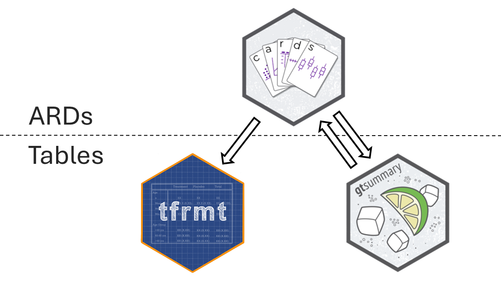
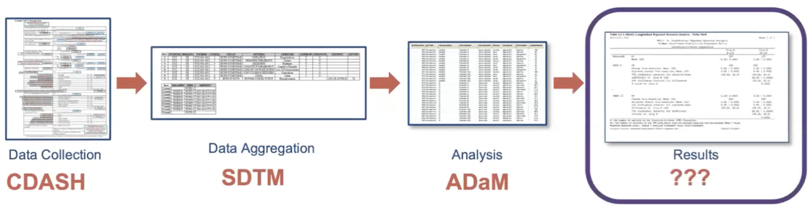
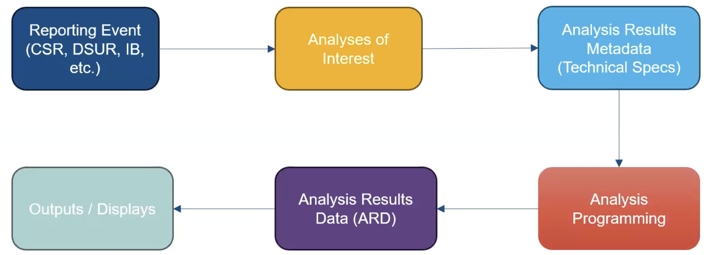

## ARDS 🤝 Tables: A Dynamic Duo 

{fig-align="center"}

## Objectives

<!-- ::: incremental -->
-   By the end of this ARD section you will have:
    - Developed an understanding of ARDs
    - Seen examples of univariate and hierarachical calculations
    - Gained an awareness of other possibilities in `cards` and statistical capabilities in `cardx`
<!-- ::: -->

## Play by Play to achieve our Objectives

<!-- ::: incremental -->
-   🕙 5 mins: Intro to ARDs and the ARS

-   🕥 20 mins: Basic summaries using {cards}

-   🕚 10 mins: Exercise

-   🕦 10 mins: Intro to stats with {cardx}

<!-- ::: -->

## What are ARDs?

<!-- ::: incremental -->

-   Dataset that stores key metadata and *raw results* from analysis
  
  - Long dataset that is 1 record per result value

  - May contained formatted values as well

-   The ARD can be used to to subsequently create tables and figures.

-   The ARD does *not* describe the layout of the results

<!-- ::: -->

## Analysis Results Data (ARD)

* After the initial creation of an ARD, the results can later be re-used again and again for subsequent reporting needs.

{fig-align="center"}

## A few notes about ARDs

<!-- :::{.incremental} -->

-   ARDs give us the opportunity to *rethink* QC

    -   QC can be focused on the raw value, as well as the formatted display
  
        -   You don’t have to waste time trying to match formatting to match QC
    
-   ARDs can be flexibly saved to different file types

    -   For example: a dataset (rds, xpt, etc) or json file
  
<!-- ::: -->

## Zooming Out: The Analysis Results Standard (ARS) 

{fig-align="center"}

:::{.small}
Objectives include:

-   To leverage analysis results metadata to drive the automation of results
-   To support storage, access, processing, traceability and reproducibility of results
-   Learn more at [https://www.cdisc.org/events/webinar/analysis-results-standard-public-review](https://www.cdisc.org/events/webinar/analysis-results-standard-public-review) 
:::

## Proposed Metadata Framework in the ARS

{fig-align="center"}

- The ARS provides a metadata-driven infrastructure for analysis

## Proposed Metadata Framework in the ARS

{fig-align="center"}

- The ARS provides a metadata-driven infrastructure for analysis

- {cards} serves as the engine for the analysis 
 