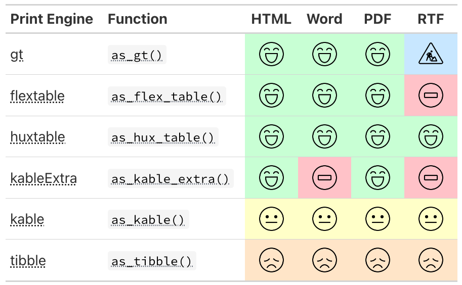

# {gtsummary} print engines

## Print engines



## One-step Word export

```r
# one-step export to a Word document
tbl |> save_flex_docx(path = "table1.docx")
```

`save_flex_docx()` writes any {gtsummary} (or {flextable}) table to a **submission-ready Word document** in a single step.

::: small
-   [Report headers & footers]{.emphasis} — we can now place customized output into the header and footer areas of the word document, and place field codes (e.g. `Page X of Y`)

-   [Source notes & footnotes]{.emphasis} — by default, footnotes, source notes, and abbreviations are placed in the Word document's footer area

-   [Templates & page setup]{.emphasis} — supply a Word `template=` or `pr_section=` to control page size, margins, and landscape orientation

:::

The AE table on the next slide is built with a custom `header_ft`, three source notes (the last carries the git SHA), and saved to the repo — then converted to PDF.

```{r}
#| label: save-flex-docx-build
#| echo: false
#| eval: false
#| message: false
# Build a submission-ready AE table and write it to a Word document in the repo.
# The rendered .docx is later converted to PDF and embedded on the next slide.

# short git SHA of the current commit, for traceability in the source notes
git_sha <- tryCatch(
  trimws(system2("git", c("rev-parse", "--short", "HEAD"), stdout = TRUE)),
  error = function(e) "unknown"
)

# output directory inside the repo
sfd_dir <- "save_flex_docx"
dir.create(sfd_dir, showWarnings = FALSE, recursive = TRUE)

# static report header with a live "Page X of Y" field
header_ft <-
  data.frame(
    col1 = c("Protocol: ABC123", NA),
    col2 = c("Table 14.3.6 Adverse Event Rates by SOC and PT", "Safety Population"),
    col3 = c(NA_character_, NA_character_),
    stringsAsFactors = FALSE
  ) |>
  flextable::flextable() |>
  flextable::delete_part(part = "header") |>
  flextable::align(j = 1, align = "left", part = "body") |>
  flextable::align(j = 2, align = "center", part = "body") |>
  flextable::align(j = 3, align = "right", part = "body") |>
  flextable::compose(
    i = 1, j = 3,
    value = flextable::as_paragraph(
      "Page ", flextable::as_word_field("PAGE"),
      " of ", flextable::as_word_field("NUMPAGES")
    ),
    part = "body"
  ) |>
  flextable::border_remove() |>
  flextable::fontsize(size = 8, part = "all") |>
  flextable::padding(padding.top = 0, padding.bottom = 0, part = "all") |>
  flextable::set_table_properties(layout = "autofit", width = 1)

cards::ADAE[1:150, ] |>
  tbl_hierarchical(
    by = TRTA,
    variables = c(AESOC, AEDECOD),
    id = USUBJID,
    denominator = cards::ADSL
  ) |>
  # remove the default column footnotes
  remove_footnote_header(columns = everything()) |>
  # source notes appropriate for an AE / pharma submission table
  modify_source_note("Treatment-emergent adverse events coded using MedDRA.") |>
  modify_source_note("Safety population; participants may report more than one event.") |>
  # last source note indicates the git SHA
  modify_source_note(paste0("Source: pharmaverse repo, commit ", git_sha, ".")) |>
  save_flex_docx(
    path = file.path(sfd_dir, "ae_table.docx"),
    header = header_ft,
    footer = NULL
  )
```

## `save_flex_docx()` output

```{=html}
<iframe
  src="save_flex_docx/ae_table.pdf"
  width="100%"
  height="540"
  style="border: 1px solid #ccc; background: #fff;">
</iframe>
```
