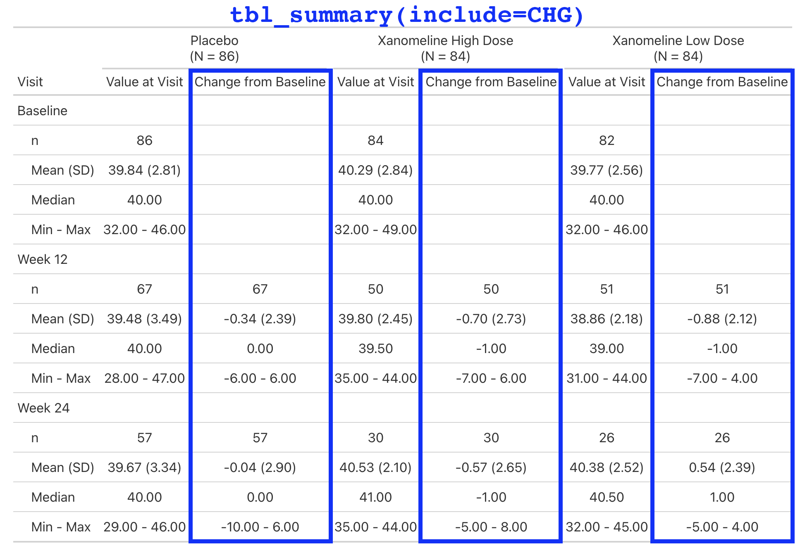
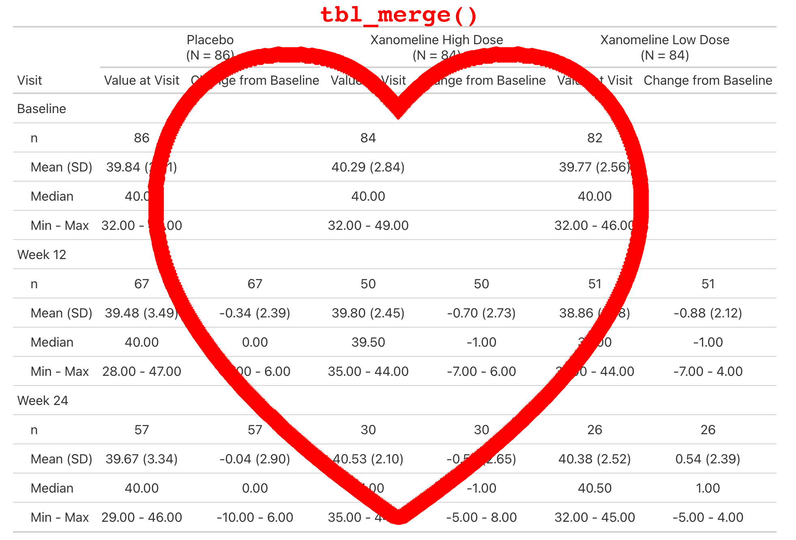

# Adopt {gtsummary}

## How to Adopt {gtsummary}

#### Write functions

-  Use {gtsummary} functions to build new functions will be key for adoption.

#### Create a theme

-   A [theme]{.emphasis} is a set of customization preferences that can be easily set and reused.

-   Themes control [default settings for existing functions]{.emphasis}

-   Themes control more [fine-grained customization]{.emphasis} not available via arguments or helper functions

## Extension Package:{crane} 

The first function we added to {crane} was `tbl_roche_summary()`: a _thin_ wrapper for `gtsummary::tbl_summary()`.

::: {.small}

- Continuous variables default to `continuous2`.

- `tbl_summary(missing*)` arguments have been changed to `tbl_roche_summary(nonmissing*)`.

    - We highlight non-missing counts over missing counts, which are the default in {gtsummary}

- Counts represented by `0 (0%)` print as `0`.

:::

```{r}
#| label: tbl-roche-summary
#| output-location: slide
library(crane)

adsl |>
  dplyr::mutate(ETHNIC = forcats::fct_expand(ETHNIC, "REFUSED")) |>
  tbl_roche_summary(
    by = ARM2,
    include = c(AGE, ETHNIC),
    nonmissing = "always"
  )
```

## What else is in {crane}? 

::: small
Lab values are summarized by visit and include the change from baseline.

This is a simple table that is just a `tbl_merge()` of the `AVAL` summary and the `CHG` summary.

But the general structure appears enough times in our catalog, we make it simple for our programmers to create.
:::

```{r}
#| label: tbl_baseline_chg
#| eval: false
adlb |>
  dplyr::filter(PARAM == "Albumin (g/L)") |>
  tbl_baseline_chg(
    by = "ARM",
    baseline_level = "Baseline",
    denominator = adsl
  )
```

## What else is in {crane}? 

{fig-align="center" width="80%"}

## What else is in {crane}? 

{fig-align="center" width="80%"}

## What else is in {crane}? 

{fig-align="center" width="80%"}

## What else is in {crane}? 

{fig-align="center" width="80%"}

## A pharma theme with {crane}

Our theme is implemented in `crane::theme_gtsummary_roche()`. Primary changes include a custom function for [rounding percentages]{.emphasis}, [p-values]{.emphasis} rounded to four decimal places, [headers]{.emphasis} that default to bold and include N in parentheses (e.g. `'Placebo  \n (N = 184)'`), and printing all tables with [{flextable}]{.emphasis} using Roche-specific styling — font, font size, borders, cell padding, etc.

```{r}
#| label: tbl-roche-summary-example
#| output-location: column
theme_gtsummary_roche()

adsl |>
  dplyr::mutate(ETHNIC = forcats::fct_expand(ETHNIC, "REFUSED")) |>
  tbl_roche_summary(
    by = ARM2,
    include = c(AGE, ETHNIC),
    nonmissing = "always"
  )
```

## cardinal collaboration 

The cardinal initiative is an industry collaborative effort under the pharmaverse.

The site includes examples for building ARDs and tables from the FDA Standard Safety Tables and Figures Integrated Guide using {cards} and {gtsummary}.

<a href="https://pharmaverse.github.io/cardinal/#contributors" target="_blank"> Let's Go!</a>
