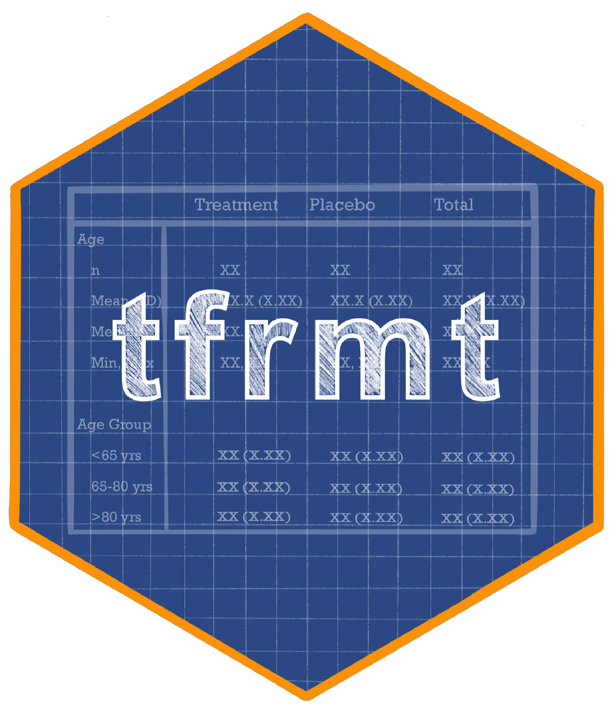
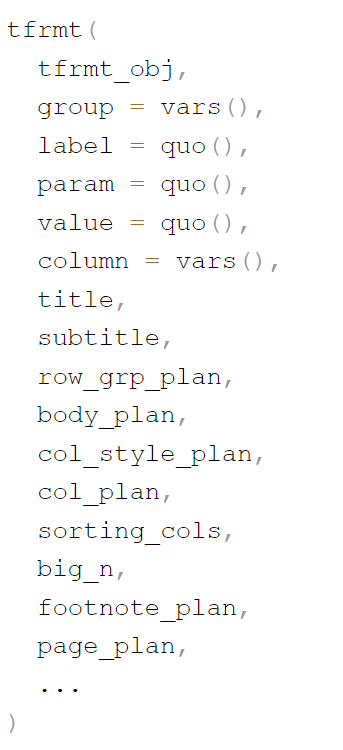
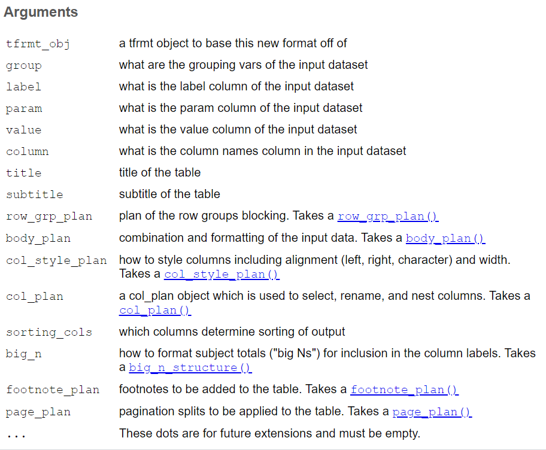

## ARDS 🤝 Tables: A Dynamic Duo 

{fig-align="center"}

## Objectives

By the end of this tables section you will have:

::::: {.pv-cards}
:::: {.pv-card}
[🧩]{.pv-ico}
[Developed]{.pv-title}
An understanding of how `tfrmt` supports table creation in multiple phases of the reporting process
::::
:::: {.pv-card}
[📄]{.pv-ico}
[Developed]{.pv-title}
An understanding of how `docorator` generates different types of output documents
::::
:::: {.pv-card .pv-accent}
[👀]{.pv-ico}
[Seen]{.pv-title}
Examples of demographic and AE summary table formatting
::::
:::: {.pv-card}
[🎯]{.pv-ico}
[Gained]{.pv-title}
An awareness of utilities for the transition from `cards` to `tfrmt` input data
::::
:::::

## Play by Play to achieve our Objectives

::::: {.pv-steps}
- [1]{.pv-num} [🕙]{.pv-ico} **10 mins:** The possibilities of `tfrmt`
- [2]{.pv-num} [🕥]{.pv-ico} **15 mins:** Step-by-step formatting a display
- [3]{.pv-num} [🕚]{.pv-ico} **5 mins:** `cards`-to-`tfrmt` helpers
- [4]{.pv-num} [🕦]{.pv-ico} **5 mins:** Outputs using `docorator`
- [5]{.pv-num} [🕦]{.pv-ico} **10 mins:** Exercise
:::::

## ARD-first Tables with {tfrmt} {.black-header}

```{css, echo=FALSE}
.black-header h2 {
 color: black;
}
```

:::: {.columns}

::: {.column width="50%"}

{align="center" height="500"}
:::

::: {.column}

::: {.incremental}
-   Metadata-driven table formatting

-   Easily create new and modify existing tables

-   Input: ARD with raw, numeric values ({cards}!)

-   Render: Formatted table via {gt}
:::

:::

:::


## There's also an app!  {.black-header} 

:::: {.columns}

::: {.column width="50%"}

{align="center" height="500"}
:::

::: {.column}
- Point-and-click interface for {tfrmt}

- Ability to create new or modify existing display

- Eases learning curve for new users

- Empowers non-programmers

- More here: [https://gsk-biostatistics.github.io/tfrmtbuilder/](https://gsk-biostatistics.github.io/tfrmtbuilder/)
:::

:::


## The {tfrmt} object

- Pre-define the non-data components of your table
- Pre-define how the data will be handled once added

:::: {.columns}

::: {.column width="40%"}
{align="center" height="500"}
:::

::: {.column width="60%"}
{fig-align="center"}
:::

::::


```{r} 
#| echo: false 
library(tfrmt) 

ard_demog <- data_demog |> 
  dplyr::filter(!column=="p-value",
                !rowlbl2=="n",
                !column=="Total", !rowlbl1=="Race (Origin)") |> 
  dplyr::mutate(column = gsub("Xanomeline ","", column)) |>  
  dplyr::bind_rows(
    dplyr::tibble(param = "bigN", 
           column = c("High Dose","Low Dose","Placebo"),
           value = c(84,84,86))
  ) |> 
  dplyr::ungroup() |>  
  dplyr::filter(is.na(rowlbl1) | rowlbl1 %in% c("Age (y)","Baseline BMI","Race (Origin)","Sex","Duration of disease"))

ard_demog_mock <- ard_demog


gt_style_slides <- function(x){
  x |>   
    gt::tab_style(
      style = gt::cell_text(font = c(gt::google_font("Google Sans Mono"),
                                     c("Courier", gt::default_fonts()))),
      locations = list(gt::cells_body(), 
                       gt::cells_row_groups(), 
                       gt::cells_stub(),
                       gt::cells_column_labels(),
                       gt::cells_column_spanners(),
                       gt::cells_title(), 
                       gt::cells_footnotes()
      )
    )
}

tfrmt_demog <- tfrmt(
  group = c(rowlbl1,grp),
  label = rowlbl2,
  column = column,
  param = param,
  value = value,
  sorting_cols = c(ord1, ord2),
  title = "Demographics Table",
  body_plan = body_plan(
    frmt_structure(group_val = ".default", label_val = ".default", 
                   frmt_combine("{n} {pct}",
                                n = frmt("xxx"),
                                pct = frmt_when("==100" ~ "",
                                                "==0" ~ "",
                                                TRUE ~ frmt("(xx.x %)")))),
    frmt_structure(group_val = ".default", label_val = "n", frmt("xxx")),
    frmt_structure(group_val = ".default", label_val = c("Mean", "Median", "Min","Max"), frmt("xxx.x")),
    frmt_structure(group_val = ".default", label_val = "SD", frmt("xxx.xx"))
  ),
  
  col_plan = col_plan(-grp,
                      -starts_with("ord")
  )
  ,
  col_style_plan = col_style_plan(
    col_style_structure(align = c(".",","," "), col = c("Placebo", "Low Dose",
                                                        "High Dose")),
    col_style_structure(align = "left", col = c("rowlbl1","rowlbl2"))
  ),
  big_n = big_n_structure(param_val  = "bigN", n_frmt = frmt("<br>N = xx"))
)  
```

# A quick tour of the many uses of {tfrmt}

```{r }
#| echo: FALSE

fontawesome::fa("recycle", height="5em", fill="#606060")
```


## Use #1: Study planning (mocks)  

```{r}
#| output-location: "column-fragment"

library(tfrmt)

print_mock_gt(
  tfrmt = tfrmt_demog, # tfrmt
  .data = ard_demog_mock # sample ARD
)|> 
   gt_style_slides()
``` 

* If no data is supplied, {tfrmt} will generate some under the hood

## Use #2: Final analysis {auto-animate="true"}

```{r}
#| output-location: "column-fragment"

library(tfrmt)

print_to_gt(
  tfrmt = tfrmt_demog,
  .data = ard_demog # true ARD
)|> 
   gt_style_slides()
```

* Full reuse of the original {tfrmt} object = reduced rework!

## Use #3: Repurposed final table  {auto-animate="true"}

```{r}
#| echo: FALSE

tfrmt_demog_custom <- tfrmt(
      title = "Demographics Table",
      subtitle = "Safety Population",
      footnote_plan = footnote_plan(
        footnote_structure("Data collected at Screening Visit")
      ),
      big_n = big_n_structure(param_val = "bigN", n_frmt = frmt("<br>(N = xx)")),
      row_grp_plan = row_grp_plan(
        row_grp_structure(group_val = ".default", element_block(post_space = " ")),
        label_loc = element_row_grp_loc(location = "indented")
      ),
      col_plan = col_plan(
        `High Dose`, `Low Dose`, `Placebo`,
        -grp,
        -starts_with("ord")
      ),
      page_plan = page_plan(max_rows = 20)  
    )
```

```{r}
#| output-location: "column-fragment"
#| code-line-numbers: "4-6"
 
library(tfrmt)

tfrmt_demog |> 
  layer_tfrmt(
    tfrmt_demog_custom  
  )|> 
  print_to_gt( 
    .data = ard_demog
  ) |> 
  gt::grp_pull(1)|> 
   gt_style_slides()
```

* *Layering* allows for custom tweaks while preserving the original metadata


## Templates: the possibilities {auto-animate="true"}
 
- Organization standards can be captured as *templates*

- With layering, teams can customize *only* the bits that need changing

```{r}
#| eval: FALSE

# create a template as a function
tfrmt_demog_ta <- function(tfrmt_obj){
  
  tfrmt_demog_ta <- tfrmt( 
    # define the formatting specific to the therapeutic area
  )
  
  layer_tfrmt(x = tfrmt_obj, y = tfrmt_demog_ta)
}

# Layer org -> TA -> study templates, each customizing only what changes
tfrmt_demog_org() |> 
  tfrmt_demog_ta() |>  
  tfrmt_demog_study() |> 
  print_to_gt(
    .data = ard_demog
  )

```


## Save metadata for reuse

```{r}
#| output-location: "column-fragment"
#| 
library(tfrmt)

tfrmt_demog |> 
  tfrmt_to_json()
```

* Create a language-agnostic JSON file

* Load JSON back into R and recreate the table with `json_to_tfrmt()`


# Now, let's format a display, 1 piece at a time

## Creating a {tfrmt} table step-by-step

```{r}
#| echo: false

adsl <- pharmaverseadam::adsl |> 
  dplyr::filter(SAFFL=="Y") |> 
  dplyr::mutate(ARM2 = ifelse(startsWith(ARM, "Xanomeline"), "Xanomeline", ARM))

ard_demog <- cards::ard_stack(
  data = adsl,
  .by = ARM2,
  cards::ard_summary( variables = AGE,
                         statistic = ~ cards::continuous_summary_fns(c("median", "p25", "p75"))),
  cards::ard_categorical(variables = c(AGEGR1, SEX), statistic = ~ c("n","p"))
) 

ard_demog <- ard_demog |> 
  tfrmt::shuffle_card(by = "ARM2", fill_overall = "Overall") |> 
  tfrmt::prep_combine_vars(c("AGE","AGEGR1","SEX")) |> 
  tfrmt::prep_label() |> 
  tfrmt::prep_big_n(vars  = "ARM2")|>
  dplyr::mutate(label = dplyr::case_when(
                  stat_name %in% c("p25","p75") ~ "[Q1, Q3]", 
                  TRUE ~ label
                ),
                stat_variable = dplyr::recode_values(
                  stat_variable,
                  "AGE" ~ "Age (years)",
                  "AGEGR1" ~ "Age Group",
                  "SEX" ~ "Sex"
                ) ) |> 
  dplyr::select(-c(context, stat_label, variable_level)) |> 
  dplyr::mutate(ord1 = as.numeric(factor(stat_variable, levels = c("Age (years)", "Age Group", "Sex"))),
                ord2 = as.numeric(factor(label, levels = c("18-64",">64"))))

gt_style_slides <- function(x){
  x |> 
    gt::tab_options(
      table.font.size = 20
    ) |>   
    gt::tab_style(
      style = gt::cell_text(font = c(gt::google_font("Google Sans Mono"),
                                     c("Courier", gt::default_fonts()))),
      locations = list(gt::cells_body(), 
                       gt::cells_row_groups(), 
                       gt::cells_stub(),
                       gt::cells_column_labels(),
                       gt::cells_column_spanners(),
                       gt::cells_title(), 
                       gt::cells_footnotes()
      )
    )
}
```

```{r}
#| echo: false
mock_tbl <- tfrmt(
  group = stat_variable, 
  label = label, 
  column = ARM2,
  param = stat_name,
  value = stat, 
  sorting_cols = c(ord1, ord2),
  big_n = big_n_structure(
    param_val = "bigN",
    n_frmt = frmt("<br>N = xx")
  )
  ,
  col_plan = col_plan(
    Placebo,
    Xanomeline,
    - starts_with("ord")
  ),
  body_plan = body_plan(
    frmt_structure(
      group_val = ".default", 
      label_val = ".default", 
      frmt("x.xx")),
    frmt_structure(
      group_val = ".default", 
      label_val = ".default",
      frmt_combine("{n} ({p}%)",
                   n = frmt("xx"),
                   p = frmt("xx.x", transform = ~ . *100)
                   
      )
    ),
    frmt_structure(
      group_val = ".default", 
      label_val = "Median",
      frmt("xx.x")
    ),
    
    frmt_structure(
      group_val = ".default",
      label_val = ".default",
      frmt_combine(
        expression = "[{p25}, {p75}]",                
        p25 = frmt("xx.x"),                     
        p75 = frmt("xx.x")                      
      )
    )
  ),
  col_style_plan = col_style_plan(
    col_style_structure(
      col = c("Placebo", 
              "Xanomeline"),
      align = " "
    )
  ),
  footnote_plan = footnote_plan(
    footnote_structure(
      "Pooled High and Low Dose",
      column_val = "Xanomeline"
    )
  ),
  title = "Demographic Table",
  subtitle = "Safety Population"
) |> 
  print_mock_gt(ard_demog)|> 
   gt_style_slides()

mock_tbl
```

## Ensure placement of all values (Main)

::: {.columns}
::: {.column width="47%"}
```{r}  
print(ard_demog)
```
:::

::: {.column width="6%"}
:::

::: {.column width="47%"}

```{r}  
#| echo: false

mock_tbl
```
:::

:::

## Ensure placement of all values (Main)
 
```{r}   
#| output-location: "column"
#| code-line-numbers: "2-7"

tfrmt_demog <- tfrmt(
  group = stat_variable, 
  label = label, 
  column = ARM2,
  param = stat_name,
  value = stat, 
  sorting_cols = c(ord1, ord2) 
)

print_to_gt(
  tfrmt = tfrmt_demog,
  .data = ard_demog
) |> 
   gt_style_slides()
```

## Ensure placement of all values (Big N)

```{r}
#| output-location: "column"
#| code-line-numbers: "3-6"

tfrmt_demog <- tfrmt_demog |>
  tfrmt(
    big_n = big_n_structure(
      param_val = "bigN",
      n_frmt = frmt("<br>N = xx")
      )
  )

print_to_gt(
  tfrmt = tfrmt_demog, 
  .data = ard_demog
  )|> 
   gt_style_slides()
```


## Select and reorder columns
```{r}
#| output-location: "column"
#| code-line-numbers: "3-7"

tfrmt_demog <- tfrmt_demog |>
  tfrmt(
    col_plan = col_plan(
      Placebo,
      Xanomeline,
      - starts_with("ord")
    )
  )

print_to_gt(
  tfrmt = tfrmt_demog, 
  .data = ard_demog
)|> 
   gt_style_slides()
```


## Format the data values - Basic

```{r}   
#| output-location: "column"
#| code-line-numbers: "3-8"

tfrmt_demog <- tfrmt_demog |>
  tfrmt(
    body_plan = body_plan(
      frmt_structure(
        group_val = ".default", 
        label_val = ".default", 
        frmt("x.xx"))
    )
  )

print_to_gt(
  tfrmt = tfrmt_demog, 
  .data = ard_demog
) |> 
   gt_style_slides()
```


## Format the data values - Advanced

```{r}   
#| output-location: "column"
#| code-line-numbers: "4-11"

tfrmt_demog <- tfrmt_demog |>
  tfrmt(
    body_plan = body_plan(
      frmt_structure(
        group_val = ".default", 
        label_val = ".default",
        frmt_combine("{n} ({p}%)",
                     n = frmt("xx"),
                     p = frmt("xx.x", transform = ~ . *100)
                     
        )
      )
    )
  )

print_to_gt(
  tfrmt = tfrmt_demog, 
  .data = ard_demog
  ) |> 
   gt_style_slides()
```

## Format the data values - Advanced
```{r}
#| output-location: "column"
#| code-line-numbers: "5-19"

tfrmt_demog <- tfrmt_demog |>
  tfrmt(
    body_plan = body_plan(
      
      frmt_structure(
        group_val = ".default", 
        label_val = "Median",
        frmt("xx.x")
      ),
      
      frmt_structure(
        group_val = ".default",
        label_val = ".default",
        frmt_combine(
          expression = "[{p25}, {p75}]",                
          p25 = frmt("xx.x"),                     
          p75 = frmt("xx.x")                      
        )
      )
      
    )
  )
  
print_to_gt(
  tfrmt = tfrmt_demog, 
  .data = ard_demog
  ) |> 
   gt_style_slides()
```


## Align columns, add footnotes & titles

```{r}
#| output-location: "column"
#| code-line-numbers: "3-9,10-16,17-18"

tfrmt_demog <- tfrmt_demog |>
  tfrmt(
    col_style_plan = col_style_plan(
      col_style_structure(
        col = c("Placebo", 
                "Xanomeline"),
        align = " "
      )
    ),
    footnote_plan = footnote_plan(
      footnote_structure(
        "Pooled High and Low Dose",
        column_val = "Xanomeline"
      )
    ),
    title = "Demographic Table",
    subtitle = "Safety Population"
  )
  
print_to_gt(
  tfrmt = tfrmt_demog, 
  .data = ard_demog
  ) |> 
   gt_style_slides()

```
 

## Other features include:

* Transform values in the formatting

* Row group formatting 

* Pagination

* Multi-positional column alignment

* Templating 

# cards to tfrmt - How did we get here?


# cards to tfrmt helpers

::: {.small}

- {tfrmt} includes several helper functions to transform native {cards} output to display-ready data. 
- We need to get from the `cards` output on the left to the data frame on the right

:::

::: {.columns}
::: {.column  width="47%"}

Current data (`cards` output)

```{r}
#| echo: false
#| message: true
ard_demog_00 <- cards::ard_stack(
  data = adsl,
  .by = ARM2,
  cards::ard_summary( variables = AGE,
                         statistic = ~ cards::continuous_summary_fns(c("median", "p25", "p75"))),
  cards::ard_categorical(variables = c(AGEGR1, SEX), statistic = ~ c("n","p"))
) 

ard_demog_00
```
:::

::: {.column width="6%"}
:::

::: {.column width="47%"}

Goal data (`tfrmt` input)
```{r}
#| echo: false
ard_demog
```

:::
:::
## cards to tfrmt

::: {.small}
First, let's "shuffle" the results into a tidy data frame:
:::


:::{.columns}

::: {.column width="55%"}

```{r}
ard_demog_00 |> 
  tfrmt::shuffle_card(by = "ARM2", fill_overall = "Overall") 

```

:::

::: {.column width="5%"}
:::

::: {.column width="40%"}

```{r}
#| echo: false
mock_tbl |> 
  gt::tab_options(table.font.size = 16)
```

:::

:::

::: {.small}
- Notice that our variables have been spread wide and are no longer named `group1`, `group1_level`, etc. 
- But we want to get all of our row variables (AGE, AGEGR1, SEX) into a single, stacked column
:::

## cards to tfrmt

::: {.small}
- We want to get all of our row variables (AGE, AGEGR1, SEX) into a single, stacked column
- We can collapse them into a single column named `variable_level`
:::

::: {.columns}

::: {.column width="55%"}

```{r}
#| code-line-numbers: "3"
#| 
ard_demog_00 |> 
  tfrmt::shuffle_card(by = "ARM2", fill_overall = "Overall") |> 
  tfrmt::prep_combine_vars(c("AGE","AGEGR1","SEX"))

```

:::

::: {.column width="5%"}
:::

::: {.column width="40%"}

```{r}
#| echo: false
mock_tbl |> 
  gt::tab_options(table.font.size = 16)
```

:::
:::

::: {.small}
- Notice the row labels in the mock. It's a combination of `variable_level` and `stat_label` for categorical and continuous variables, respectively
:::

## cards to tfrmt

::: {.small}
Next, we create a row label ("label" column) for the table that is either the category (i.e. `variable_level`) for categorical variables, or the stat name for continuous variables.
:::


::: {.columns}

::: {.column width="55%"}
```{r}
#| code-line-numbers: "4"
ard_demog_00 |> 
  tfrmt::shuffle_card(by = "ARM2", fill_overall = "Overall") |> 
  tfrmt::prep_combine_vars(c("AGE","AGEGR1","SEX")) |> 
  tfrmt::prep_label()
```
:::

::: {.column width="5%"}
:::

::: {.column width="40%"}

```{r}
#| echo: false
mock_tbl |> 
  gt::tab_options(table.font.size = 16)
```

:::
:::

## cards to tfrmt

::: {.small}
Take a look at our "big N" (i.e. population counts) rows:
:::

```{r}
#| echo: false
ard_demog_00 |> 
  tfrmt::shuffle_card(by = "ARM2", fill_overall = "Overall") |> 
  tfrmt::prep_combine_vars(c("AGE","AGEGR1","SEX")) |> 
  tfrmt::prep_label() |> 
  dplyr::filter(stat_variable %in% c("ARM2", "..ard_total_n.."))
```

::: {.small}
- First, we only need the counts themselves ('n'), not denominators or percentages ('N', '%') to display in the column headers. 
- Second, we need to give these a unique stat name to distinguish them for the `big_n_structure` in {tfrmt}. 
::: 

## cards to tfrmt

::: {.small}
- First, we only need the counts themselves ('n'), not denominators or percentages ('N', '%'). 
- Second, we need to give these a unique stat name to distinguish them for the `big_n_structure` in {tfrmt}. 
::: 

::: {.columns}

::: {.column width="55%"}
```{r}
#| code-line-numbers: "5"

ard_demog_display <- ard_demog_00 |> 
  tfrmt::shuffle_card(by = "ARM2", fill_overall = "Overall") |> 
  tfrmt::prep_combine_vars(c("AGE","AGEGR1","SEX")) |> 
  tfrmt::prep_label() |> 
  tfrmt::prep_big_n(vars = "ARM2")

ard_demog_display |> 
  dplyr::filter(stat_variable %in% c("ARM2", "..ard_total_n.."))
```
:::

::: {.column width="5%"}
:::

::: {.column width="40%"}

```{r}
#| echo: false
mock_tbl |> 
  gt::tab_options(table.font.size = 16)
```

:::
:::
## cards to tfrmt

::: {.small} 

Finally, we can do any other necessary manipulations like relabeling or adding order variables before passing to `tfrmt()`.

:::

```{r}
#| output-location: "column"
ard_demog_display <- ard_demog_display |> 
  
   # give Q1/Q3 the same row label so they appear on the same row
  dplyr::mutate(label = dplyr::case_when(
    stat_name %in% c("p25","p75") ~ "[Q1, Q3]",
    TRUE ~ label
  ),
  
  # make variable names look nice
  stat_variable = dplyr::recode_values(
    stat_variable,
    "AGE" ~ "Age (years)",
    "AGEGR1" ~ "Age Group",
    "SEX" ~ "Sex"
  ) ) |> 
  
  # remove unnecessary variables
  dplyr::select(-c(context, stat_label, variable_level)) |>
  
  # create order variables
  dplyr::mutate(ord1 = as.numeric(
    factor(stat_variable, 
           levels = c("Age (years)", "Age Group", "Sex"))),
    ord2 = as.numeric(
      factor(label, levels = c("18-64",">64"))))

print_to_gt(tfrmt_demog, ard_demog_display)|> 
  gt_style_slides()|> 
  gt::tab_options(
    table.font.size = 15
  )
```

# Outputs using docorator

So we have a table, now what? 

## From `tfrmt` display to production output {.black-header}

:::: {.columns}

::: {.column width="50%"}

{align="center" height="500"}
:::

::: {.column}

::: incremental
-   {docorator} = **Decorate** + **Output**

-   Takes a `gt` table (like our `tfrmt` output!), a `gt_group`, a `ggplot2` figure, or a PNG path (or a list of any of these)

-   *Decorate*: wraps the display with document-level headers, footers, and page numbers

-   *Output*: renders the decorated display to PDF (LaTeX or HTML-new!), HTML (new!), DOCX, or RTF

-   More here: [https://gsk-biostatistics.github.io/docorator/](https://gsk-biostatistics.github.io/docorator/)
:::

:::

::::

## Passing a `tfrmt` display to `docorator`

::: {.small}

Our `gt` table produced by `print_to_gt()` can be passed straight into `as_docorator()`, then rendered as a PDF ()

:::

```{r}
#| eval: false
library(docorator)

print_to_gt(tfrmt_demog, ard_demog_display) |> 
  as_docorator(
    display_name = "demog_table",
    header = fancyhead(
      fancyrow(left = "Study 1234", center = NA, right = doc_pagenum()),
      fancyrow(left = NA, center = "Demographics Table", right = NA)
    ),
    footer = fancyfoot(
      fancyrow(left = "program.R", center = NA, right = "Data as of 2026-08-14")
    )
  ) |> 
  render_pdf() |> 
  render_docx()
```

## Exercise 🏃‍➡️ (Together!)

1. Navigate to Posit Cloud script `exercises/06-tables-tfrmt.R`

2. Create, modify, and output the AE table as described.

3. Add the "completed" sticky note to your laptop when complete.

```{r}
#| echo: false
#| cache: false
library(countdown)
countdown(minutes = 10, play_sound = TRUE)
```