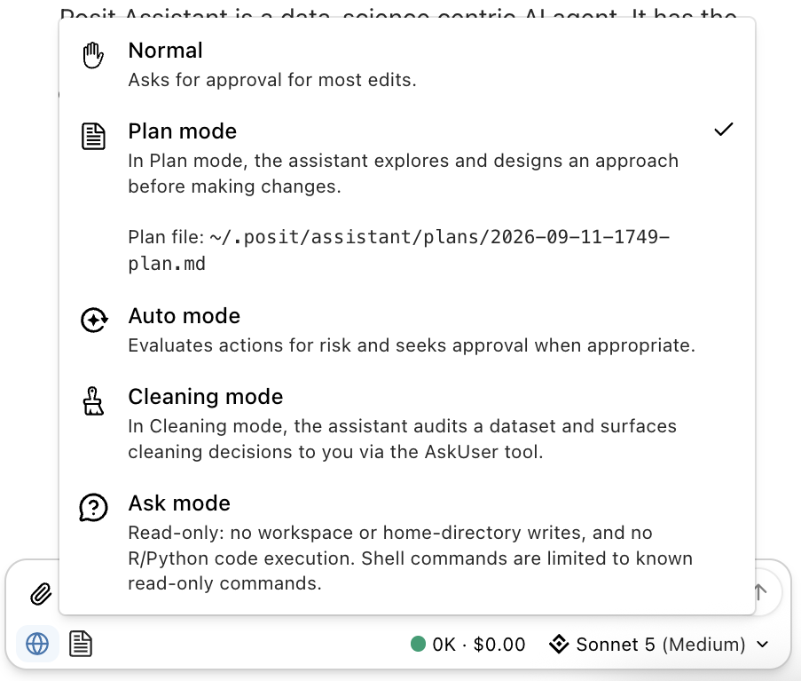

## Posit Assistant — Plan Mode {.smaller}

Posit Assistant offers a few modes depending on how much you want it to do:

 

:::: {.pv-cards}
::: {.pv-card}
[💬]{.pv-ico}
[Ask]{.pv-title}
Answer questions and explain code — **no changes made**
:::
::: {.pv-card .pv-accent}
[🤖]{.pv-ico}
[Agent]{.pv-title}
Plan and carry out **multi-step edits** across your project
:::
::::

## Our task

Everything we covered today, asked for in **one request**:

::: {.pv-flow .pv-flow-accent .pv-flow-tight}
[[📋]{.pv-ico}pharmaverseraw]{.pv-step}
[[📦]{.pv-ico}SDTM `DM`]{.pv-step}
[[🧬]{.pv-ico}ADaM `ADSL`]{.pv-step}
[[📊]{.pv-ico}ARD]{.pv-step}
[[📑]{.pv-ico}Two tables]{.pv-step}
:::

:::: {.pv-cards}
::: {.pv-card}
[🎯]{.pv-ico}
[The ask]{.pv-title}
A **demographics summary table** — `AGE`, `SEX`, `ETHNIC`
:::
::: {.pv-card}
[📁]{.pv-ico}
[The output]{.pv-title}
Three scripts in a new `plan-example/` folder
:::
::: {.pv-card .pv-accent}
[🧠]{.pv-ico}
[What it touches]{.pv-title}
**Five packages, five skills** — one per session of today
:::
::::

## Why plan first?

That request is **five packages and five skills** deep. The agent makes a dozen
choices along the way — plan mode shows them to you *before* it writes anything.

::::: {.pv-compare}
:::: {.pv-panel}
[[🤖]{.pv-ico} Agent mode — straight to code]{.pv-panel-head}

::: {.pv-panel-body}
Writes all three scripts, then runs them.

On script 3 you notice an issue — and as a result scripts 1 and 2 need reworking too.

[You review after the cost is sunk]{.pv-note}
:::
::::

:::: {.pv-panel .pv-panel-b}
[[🧭]{.pv-ico} Plan mode — propose first]{.pv-panel-head}

::: {.pv-panel-body}
Reads the skills and the data, then proposes the **file layout, data sources,
and function choices** — no files written.

You fix any issues before any code has been written, then hit approve.

[You review while it's still cheap]{.pv-note}
:::
::::
:::::

::: {.pv-flow .pv-flow-accent .pv-flow-tight}
[[📖]{.pv-ico}Read skills & data]{.pv-step}
[[🧭]{.pv-ico}Draft a plan]{.pv-step}
[[✋]{.pv-ico}You edit & approve]{.pv-step}
[[⌨️]{.pv-ico}Write the scripts]{.pv-step}
[[👀]{.pv-ico}You review]{.pv-step}
:::

## One prompt, in Plan mode

::::: {.pv-skill}

[[💬]{.pv-ico} Your prompt]{.pv-skill-head}

:::: {.pv-skill-body}
> I need a **demographics summary table** that includes **AGE**, **SEX**, and
> **ETHNIC**.
>
> Create a new folder `plan-example/` with three scripts: one that performs the
> **SDTM mapping** for these variables using `pharmaverseraw`; a second that
> uses that SDTM dataset to create an **ADaM** dataset with these variables;
> and a third that builds the **ARD** for these summary statistics, then builds
> the summary table using both `{gtsummary}` and `{tfrmt}`.
::::

:::::

Nobody named a skill — the agent matched them from `.agents/skills/`:

::: {.pv-flow .pv-flow-tight}
[[📦]{.pv-ico}sdtm-oak-mapping]{.pv-step}
[[🧬]{.pv-ico}admiral-adam]{.pv-step}
[[📊]{.pv-ico}ard-creation]{.pv-step}
[[📑]{.pv-ico}gtsummary-tables]{.pv-step}
[[📐]{.pv-ico}tfrmt]{.pv-step}
:::

::: {.pv-ai}
[🧠]{.pv-ico} Five skills, one sentence each in their front matter — that is the
whole routing mechanism.
:::

## What comes back — a plan, not code {.smaller}

::::::: columns

:::::: {.column width="34%"}
::::: {.pv-tree}
[📁 plan-example/]{.pv-dir} 
├─ [📄 01-sdtm-dm.R]{.pv-main} 
│&nbsp;&nbsp;&nbsp;[dm_raw → DM]{.pv-cmt} 
├─ [📄 02-adam-adsl.R]{.pv-main} 
│&nbsp;&nbsp;&nbsp;[DM → ADSL]{.pv-cmt} 
└─ [📄 03-ard-tables.R]{.pv-main} 
&nbsp;&nbsp;&nbsp;&nbsp;[ARD → 2 tables]{.pv-cmt}
:::::

::: {.pv-ai}
[🔍]{.pv-ico} Every choice is **named and checkable** — and **nothing is on disk yet**.
:::
::::::

:::::: {.column width="66%"}
::::: {.pv-flow-vert}
:::: {.pv-vstep}
::: {.pv-vico}
📦
:::
::: {.pv-vbody}
[assign_no_ct + assign_ct]{.pv-vname}
[`AGE` from `IT.AGE`; `SEX` via codelist **C66731**, `ETHNIC` via **C66790**.]{.pv-vdesc}
:::
::::
:::: {.pv-vstep}
::: {.pv-vico}
🧬
:::
::: {.pv-vbody}
[admiral::derive_vars_merged]{.pv-vname}
[ADSL carries `AGE`/`SEX`/`ETHNIC` through; treatment merged on `USUBJID`.]{.pv-vdesc}
:::
::::
:::: {.pv-vstep}
::: {.pv-vico}
📊
:::
::: {.pv-vbody}
[cards::ard_stack]{.pv-vname}
[The three variables by treatment, then `cards::check_ard_structure()`.]{.pv-vdesc}
:::
::::
:::: {.pv-vstep}
::: {.pv-vico}
📑
:::
::: {.pv-vbody}
[gtsummary::tbl_ard_summary]{.pv-vname}
[The quick look — one call straight off the ARD.]{.pv-vdesc}
:::
::::
:::: {.pv-vstep}
::: {.pv-vico}
📐
:::
::: {.pv-vbody}
[tfrmt]{.pv-vname}
[The submission-shaped display, via the `cards-to-tfrmt` skill.]{.pv-vdesc}
:::
::::
:::::
::::::

:::::::

## You edit the plan, then approve {.smaller}

Reading that plan takes twenty seconds. Two things are worth pushing back on:

::::: {.pv-skill}

[[✋]{.pv-ico} Your reply]{.pv-skill-head}

:::: {.pv-skill-body}
> Two changes before you start:
>
> - Step 3 — don't use `pharmaverseadam::adsl`, derive ADSL from scratch. 
> - Step 4 — summarise by `TRT01P`, not `ARM`, and keep the
>    `check_ard_structure()` call.
>
> Otherwise this looks right — go ahead.
::::

:::::

::: {.pv-flow .pv-flow-accent}
[[🧭]{.pv-ico}Plan]{.pv-step}
[[✋]{.pv-ico}Edit]{.pv-step}
[[✅]{.pv-ico}Approve]{.pv-step}
[[⌨️]{.pv-ico}Agent writes all three scripts]{.pv-step}
:::

::: {.pv-ai}
[💡]{.pv-ico} Plan mode moves the expensive review to when it is cheap — **before
the code exists**. Same agent, same skills; you just get a say at the fork.
:::

## Advanced AI discussion

{fig-align="center" width="78%" fig-alt="Two robots reviewing a project plan displayed on a screen between them"}
