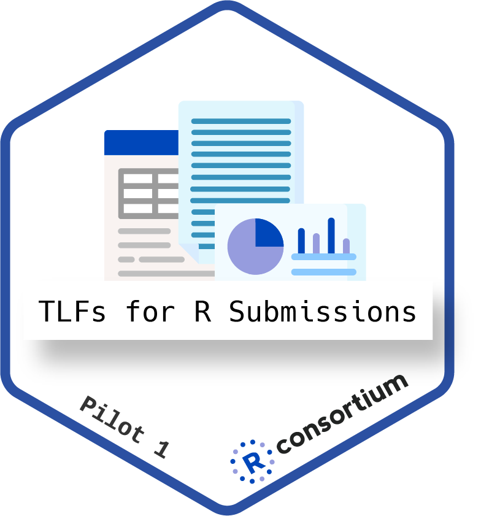
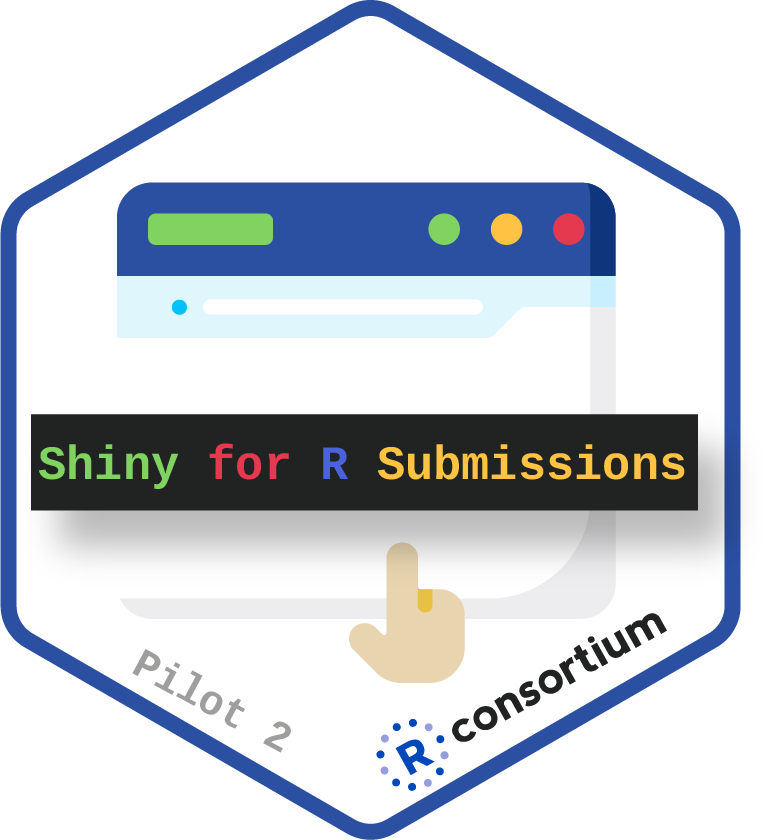
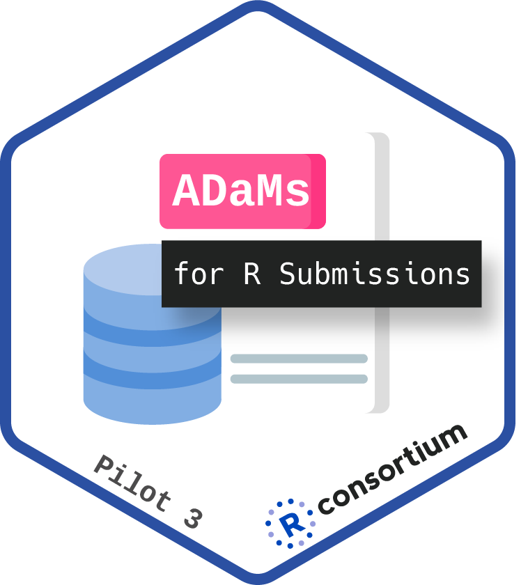
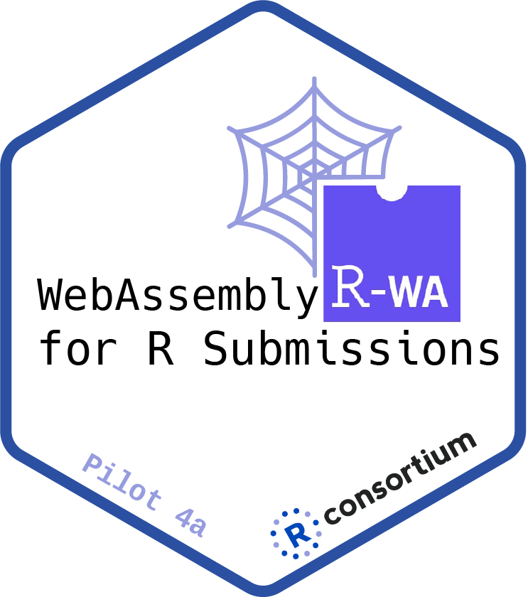
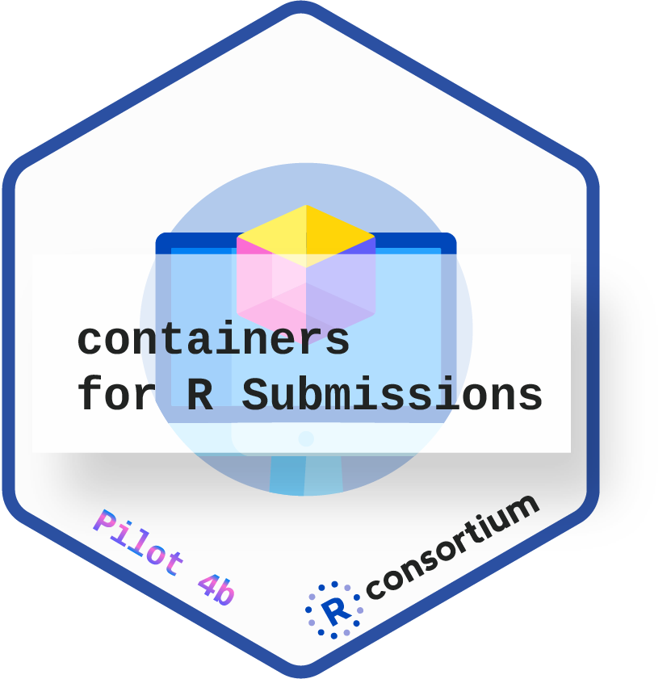
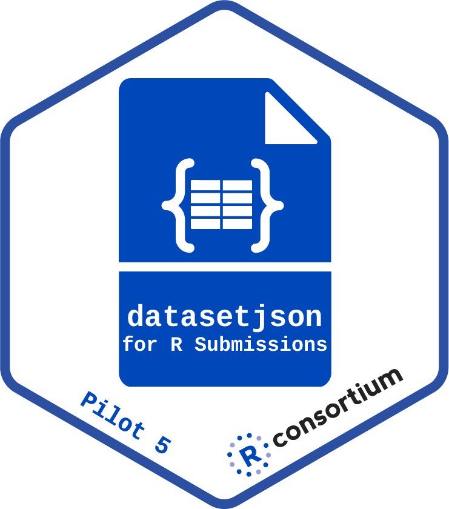

## Mission

* Easier R-based clinical trial regulatory submissions today
    * by showing open examples of using current submission portals
* Easier R-based clinical trial regulatory submissions tomorrow
    * by collecting feedback and influencing future industry and agency decisions on system/process setup

* Website: [https://rconsortium.github.io/submissions-wg/](https://rconsortium.github.io/submissions-wg/)
* Slack: [Invite to Slack](https://join.slack.com/t/rconsortium/shared_invite/zt-3d9lsem69-M0JPhUsMsmkSCXHVQy9Lqw)

## Pilots

 
 
 
 
 

